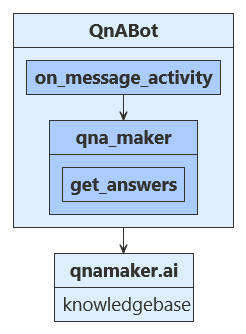

# Use QnA Maker to answer questions

[!INCLUDE[applies-to](../includes/applies-to.md)]

QnA Maker provides a conversational question and answer layer over your data. This allows your bot to send a question to the QnA Maker and receive an answer without needing to parse and interpret the question intent.

One of the basic requirements in creating your own QnA Maker service is to populate it with questions and answers. In many cases, the questions and answers already exist in content like FAQs or other documentation; other times, you may want to customize your answers to questions in a more natural, conversational way.

## Prerequisites

- The code in this article is based on the QnA Maker sample. You'll need a copy of it either in **[C#](https://aka.ms/cs-qna)** or **[JavaScript](https://aka.ms/js-qna-sample)** or **[Python](https://aka.ms/bot-qna-python-sample-code)**. 
- [QnA Maker](https://www.qnamaker.ai/) account
- Knowledge of [bot basics](bot-builder-basics.md), [QnA Maker](https://docs.microsoft.com/azure/cognitive-services/qnamaker/overview/overview), and [managing bot resources](bot-file-basics.md).

## About this sample

To use QnA Maker in your bot, you need to create a knowledge base in the [QnA Maker](https://www.qnamaker.ai/) portal, as shown in the next section. Your bot then can send  the user's questions to the maker which provides the best answers.

## [C#](#tab/cs)


`OnMessageActivityAsync` is called for each user input received. When called, it accesses `_configuration` information stored within the sample code's `appsetting.json` file to find the value to connect to your pre-configured QnA Maker knowledge base.

## [JavaScript](#tab/js)


`OnMessage` is called for each user input received. When called, it accesses your `qnamaker` connector that was pre-configured using values provided from your sample code's `.env` file.  The qnamaker method `getAnswers` connects your bot to your external QnA Maker knowledge base.

## [Python](#tab/python)



`on_message_activity` is called for each user input received. When called, it accesses your `qna_maker` connector that was pre-configured using values provided from your sample code's `config.py` file.  The method `qna_maker.getAnswers` connects your bot to your external QnA Maker knowledge base.

---

The user's input is sent to your knowledge base and the best returned answer is displayed back to your user.

## Create a QnA Maker service and publish a knowledge base

The first step is to create a QnA Maker service. Follow the steps listed in the QnA Maker [documentation](https://docs.microsoft.com/azure/cognitive-services/qnamaker/how-to/set-up-qnamaker-service-azure) to create the service in Azure.

Next, you'll create a knowledge base using the `smartLightFAQ.tsv` file located in the CognitiveModels folder of the sample project. The steps to create, train, and publish your QnA Maker [knowledge base](https://docs.microsoft.com/azure/cognitive-services/qnamaker/quickstarts/create-publish-knowledge-base) are listed in the QnA Maker documentation. As you follow these steps, name your KB `qna`,  and use the `smartLightFAQ.tsv` file to populate your KB.

> Note. This article may also be used to access your own user developed QnA Maker knowledge base.

## Obtain values to connect your bot to the knowledge base

1. In the [QnA Maker](https://www.qnamaker.ai/) site, select your knowledge base.
1. With your knowledge base open, select the **Settings**. Record the value shown for _service name_. This value is useful for finding your knowledge base of interest when using the QnA Maker portal interface. It is not used to connect your bot app to this knowledge base.
1. Scroll down to find **Deployment details** record the following values from the Postman sample HTTP request:
   - POST /knowledgebases/\<knowledge-base-id>/generateAnswer
   - Host: \<your-hostname> // Full URL ending with /qnamaker
   - Authorization: EndpointKey \<your-endpoint-key>

The full URL string for your Hostname will look like "https://< >.azure.net/qnamaker". These three values will provide the information necessary for your app to connect to your QnA Maker knowledge base via your Azure QnA service.  

## Update the settings file

First, add the information required to access your knowledge base including hostname, endpoint key and knowledge base Id (kbId) into the settings file. These are the values you saved from the **Settings** tab of your knowledge base in QnA Maker.

If you aren't deploying this for production, the app ID and password fields can be left blank.

> [!NOTE]
> If you are adding access to a QnA Maker knowledge base into an existing bot application, be sure to add informative titles for your QnA entries. The "name" value within this section provides the key required to access this information from within your app.

## [C#](#tab/cs)

### Update your appsettings.json file

[!code-csharp[appsettings](~/../botbuilder-samples/samples/csharp_dotnetcore/11.qnamaker/appsettings.json)]

## [JavaScript](#tab/js)

### Update your .env file

[!code-javascript[.env file](~/../botbuilder-samples/samples/javascript_nodejs/11.qnamaker/.env)]

## [Python](#tab/python)

### Update your config.py file

[!code-python[config.py](~/../botbuilder-python/samples/python/11.qnamaker/config.py?range=10-18)]

---

## Set up the QnA Maker instance

First, we create an object for accessing our QnA Maker knowledge base.

## [C#](#tab/cs)

Be sure that the **Microsoft.Bot.Builder.AI.QnA** NuGet package is installed for your project.

In **QnABot.cs**, in the `OnMessageActivityAsync` method, we create a QnAMaker instance. The `QnABot` class is also where the names of the connection information, saved in `appsettings.json` above, are pulled in. If you have chosen different names for your knowledge base connection information in your settings file, be sure to update the names here to reflect your chosen name.

**Bots/QnABot.cs**

[!code-csharp[qna connection](~/../botbuilder-samples/samples/csharp_dotnetcore/11.qnamaker/Bots/QnABot.cs?range=32-39)]

## [JavaScript](#tab/js)

Be sure that npm package **botbuilder-ai** is installed for your project.

In our sample the code for the bot logic is in the **QnABot.js** file.

In the **QnABot.js** file, we use the connection information provided by your .env file to establish a connection to the QnA Maker service: _this.qnaMaker_.

**bots/QnABot.js**

[!code-javascript[QnAMaker](~/../botbuilder-samples/samples/javascript_nodejs/11.qnamaker/bots/QnABot.js?range=12-16)]

## [Python](#tab/python)

In the **qna_bot.py** file, we use the connection information provided by the `config.py` file to establish a connection to the QnA Maker service: `self.qna_maker`.

**bots/qna_bot.py**
[!code-python[QnAMaker](~/../botbuilder-python/samples/python/11.qnamaker/bots/qna_bot.py?range=13-19)]

---

## Calling QnA Maker from your bot

## [C#](#tab/cs)

When your bot needs an answer from QnAMaker, call `GetAnswersAsync()` from your bot code to get the appropriate answer based on the current context. If you are accessing your own knowledge base, change the _no answers found_ message below to provide useful instructions for your users.

**Bots/QnABot.cs**

[!code-csharp[qna get answers](~/../botbuilder-samples/samples/csharp_dotnetcore/11.qnamaker/Bots/QnABot.cs?range=43-52)]

## [JavaScript](#tab/js)

In the **QnABot.js** file, we pass the user's input to the QnA Maker service's `getAnswers` method to get answers from the knowledge base. If QnA Maker returns a response, this is shown to the user. Otherwise, the user receives the message 'No QnA Maker answers were found.'

**bots/QnABot.js**

[!code-javascript[OnMessage](~/../botbuilder-samples/samples/javascript_nodejs/11.qnamaker/bots/QnABot.js?range=46-55)]

## [Python](#tab/python)

In the **qna_bot.py** file, we pass the user's input to the QnA Maker service's `get_answers` method to get answers from the knowledge base. If QnA Maker returns a response, this is shown to the user. Otherwise, the user receives the message *No QnA Maker answers were found.*

**bots/qna_bot.py**
[!code-python[get_answers](~/../botbuilder-python/samples/python/11.qnamaker/bots/qna_bot.py?range=33-37)]

---

## Test the bot

Run the sample locally on your machine. If you have not done so already, install the [Bot Framework Emulator](https://github.com/Microsoft/BotFramework-Emulator/blob/master/README.md#download). For further instructions, refer to the readme file for [C# sample](https://aka.ms/cs-qna) or [Javascript sample](https://aka.ms/js-qna-sample).
or [Python sample](https://aka.ms/bot-qna-python-sample-code). 

Start the emulator, connect to your bot, and send a message as shown below.


## Additional information

### Multi-turn prompts

QnA Maker supports follow-up prompts, also known as multi-turn prompts.
If the QnA Maker knowledge base requires an additional response from the user, QnA Maker sends context information that you can use to prompt the user. This information is also used to make any follow-up calls to the QnA Maker service.
In version 4.6, the Bot Framework SDK added support for this feature.

To construct such a knowledge base, see the QnA Maker documentation on how to [Use follow-up prompts to create multiple turns of a conversation](https://aka.ms/qnamaker-multiturn-conversation). <!--To learn how to incorporate multi-turn support in your bot, take a look at the QnA Maker Multi-turn [[**C#**](https://aka.ms/cs-qna-multiturn) | [**JS**](https://aka.ms/js-qna-multiturn)] sample.-->

<!--TODO: Update code based on final sample 
The following code snippets come from the proof-of-concept **multi-turn QnA Maker prompts** sample for
[**C#**](https://github.com/microsoft/BotBuilder-Samples/tree/master/experimental/qnamaker-prompting/csharp_dotnetcore) and
[**JavaScript**](https://github.com/microsoft/BotBuilder-Samples/tree/master/experimental/qnamaker-prompting/javascript_nodejs).
-->
<!--
#### Sample code

This sample uses a custom QnA dialog to track state for QnA Maker and handle the user's input and QnA Maker's response. When the user sends a message to the bot, the bot treats the input as either an initial query or a response to a follow-up question. The bot starts or continues its QnA dialog, which tracks the QnA Maker context information.

1. When the dialog **starts**, it makes an initial call to the QnA Maker service. QnA Maker context information **is not** included in the call.
1. When the dialog **continues**, it makes a follow-up call to the QnA Maker service. QnA Maker context information included **is** included in the call.
1. In either case, the dialog evaluates the query results.
   - Each QnA Maker result includes either an answer or a follow-up question to the user's initial query. (This sample uses only the first result.)
   - If the result includes follow-up prompts, the dialog prompts the user, saves the context information, and stays on the dialog stack, waiting for additional information from the user.
   - Otherwise, the result represents an answer, the dialog sends the answer and ends.

This sample implements this across two dialog classes:

- The base _functional dialog_ defines the begin, continue, and state logic for the dialog, notably, the _run state machine_ method.
- The derived _QnA dialog_ defines the logic to call QnA Maker, evaluate its response, and send an answer or follow-up question to the user.

#### QnA Maker context

You need to track context information for the QnA Maker service.
The dialog funnels incoming activities through its _run state machine_ method, which:

1. Gets previous QnA Maker context, if any, from state.
1. Calls its _process_ method to call QnA Maker and generates a response for the user.
1. If the result was a follow-up question, sends the question, saves new QnA Maker context to state, and waits for more input on the next turn.
1. If the result was an answer, sends the answer and ends the dialog.

##### [C#](#tab/csharp)

**Dialogs\FunctionDialogBase.cs** defines the **RunStateMachineAsync** method.

```csharp
private async Task<DialogTurnResult> RunStateMachineAsync(DialogContext dialogContext, CancellationToken cancellationToken)
{
     // Get the Process function's current state from the dialog state
     var oldState = GetPersistedState(dialogContext.ActiveDialog);

     // Run the Process function.
     var (newState, output, result) = await ProcessAsync(oldState, dialogContext.Context.Activity).ConfigureAwait(false);

     // If we have output to send then send it.
     foreach (var activity in output)
     {
          await dialogContext.Context.SendActivityAsync(activity).ConfigureAwait(false);
     }

     // If we have new state then we must still be running.
     if (newState != null)
     {
          // Add the state returned from the Process function to the dialog state.
          dialogContext.ActiveDialog.State[FunctionStateName] = newState;

          // Return Waiting indicating this dialog is still in progress.
          return new DialogTurnResult(DialogTurnStatus.Waiting);
     }
     else
     {
          // The Process function indicates it's completed by returning null for the state.
          return await dialogContext.EndDialogAsync(result).ConfigureAwait(false);
     }
}
```

##### [JavaScript](#tab/javascript)

**dialogs/functionDialogBase.js** defines the **runStateMachine** method.

```javascript
async runStateMachine(dc) {

     var oldState = this.getPersistedState(dc.activeDialog);

     var processResult = await this.processAsync(oldState, dc.context.activity);

     var newState = processResult[0];
     var output = processResult[1];
     var result = processResult[2];

     await dc.context.sendActivity(output);

     if(newState != null){
          dc.activeDialog.state[functionStateName] = newState;
          return { status: DialogTurnStatus.waiting };
     }
     else{
          return await dc.endDialog();
     }
}
```

---

#### QnA Maker input and response

You need to provide any previous context information when you call the QnA Maker service.
The dialog handles the call to QnA Maker in its _process_ method, which:

1. Makes the call to QnA Maker, passing in the previous context, if any.
   - This sample uses a _query QnA service_ helper method to format the parameters and make the call.
   - Importantly, if this is a follow-up call to QnA Maker, the _QnA Maker options_ should include values for the _QnA request context_ and the _QnA question ID_.
1. Gets QnA Maker's response and any follow-up prompts from the top result.
1. If the result was a follow-up question:
   - Generates a hero card that contains the question and options for the user's response.
   - Includes the hero card in a message activity.
   - Returns the message activity and the new QnA Maker context.
1. If the result was an answer, returns a message activity that contains the answer.

You can format a follow-up activity in many ways. This sample uses a hero card. However, using suggested actions would be another option.

##### [C#](#tab/csharp)

**Dialogs\QnADialog.cs** defines the **RunStateMachineAsync** method.

```csharp
protected override async Task<(object newState, IEnumerable<Activity> output, object result)> ProcessAsync(object oldState, Activity inputActivity)
{
     Activity outputActivity = null;
     QnABotState newState = null;

     var query = inputActivity.Text;
     var qnaResult = await _qnaService.QueryQnAServiceAsync(query, (QnABotState)oldState);
     var qnaAnswer = qnaResult[0].Answer;
     var prompts = qnaResult[0].Context?.Prompts;

     if (prompts == null || prompts.Length < 1)
     {
          outputActivity = MessageFactory.Text(qnaAnswer);
     }
     else
     {
          // Set bot state only if prompts are found in QnA result
          newState = new QnABotState
          {
          PreviousQnaId = qnaResult[0].Id,
          PreviousUserQuery = query
          };

          outputActivity = CardHelper.GetHeroCard(qnaAnswer, prompts);
     }

     return (newState, new Activity[] { outputActivity }, null);
}
```

##### [JavaScript](#tab/javascript)

**dialogs/qnaDialog.js** defines the **runStateMachine** method.

```javascript
async processAsync(oldState, activity){

     var newState = null;
     var query = activity.text;
     var qnaResult = await QnAServiceHelper.queryQnAService(query, oldState);
     var qnaAnswer = qnaResult[0].answer;

     var prompts = null;
     if(qnaResult[0].context != null){
          prompts = qnaResult[0].context.prompts;
     }

     var outputActivity = null;
     if(prompts == null || prompts.length < 1){
          outputActivity = MessageFactory.text(qnaAnswer);
     }
     else{
          var newState = {
               PreviousQnaId: qnaResult[0].id,
               PreviousUserQuery: query
          }

          outputActivity = CardHelper.GetHeroCard(qnaAnswer, prompts);
     }

     return [newState, outputActivity , null];
}  
```

---
-->
## Next steps

QnA Maker can be combined with other Cognitive Services, to make your bot even more powerful. The Dispatch tool provides a way to combine QnA with Language Understanding (LUIS) in your bot.

> [!div class="nextstepaction"]
> [Combine LUIS and QnA services using the Dispatch tool](./bot-builder-tutorial-dispatch.md)
