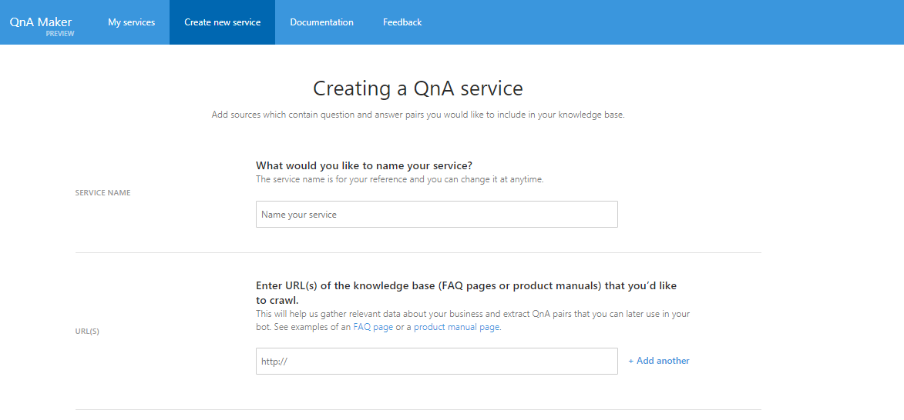
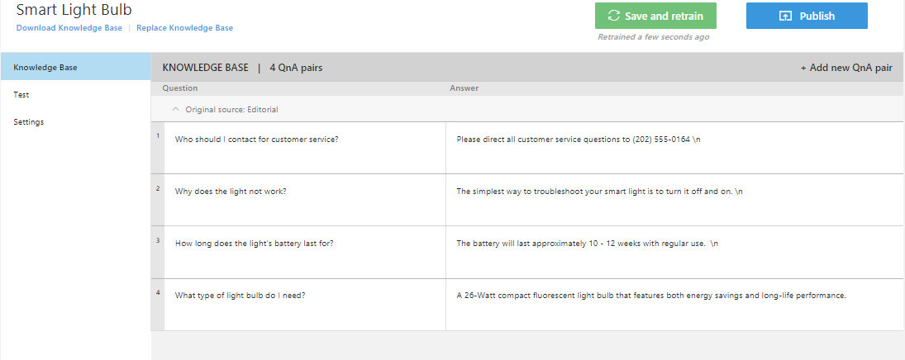
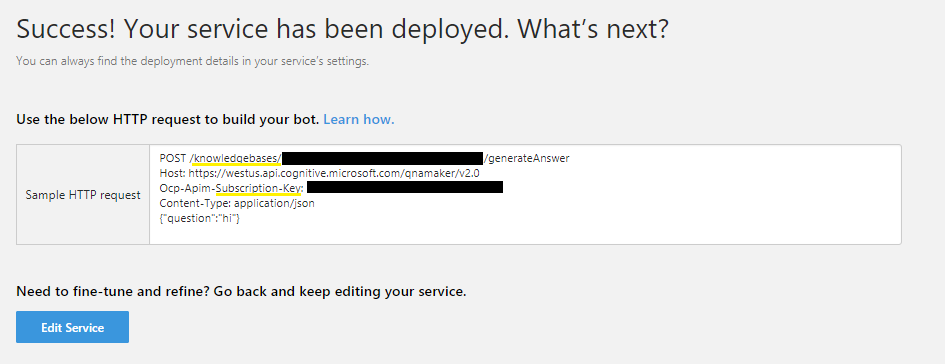
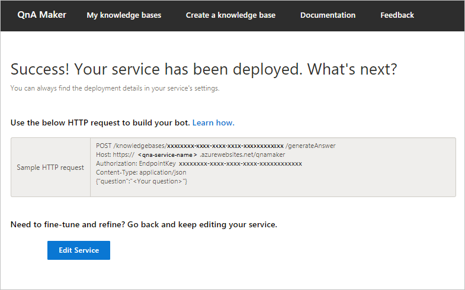
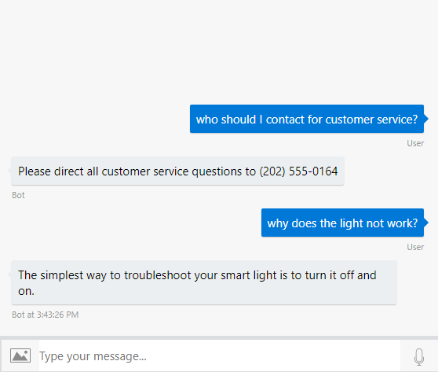

# How to use QnA Maker

To add simple question and answer support to your bot, you can use the [QnA Maker](https://qnamaker.ai/) service.

One of the basic requirements in writing your own QnA Maker service is to seed it with questions and answers. In many cases, the questions and answers already exist in content like FAQs or other documentation. Other times you would like to customize your answers to questions in a more natural, conversational way. 

## Create a QnA Maker service
First create an account and sign in at [QnA Maker](https://qnamaker.ai/). Then navigate to **Create a knowledge base**. Click **Create a QnA service** and follow the instructions for creating an Azure QnA service.



You will be redirected to [Create QnA Maker](https://ms.portal.azure.com/#create/Microsoft.CognitiveServicesQnAMaker). Complete the form and click **Create**.


 
After you create your QnA service in the Azure Portal you will be given keys under the Resource Management heading that you may disregard. Proceed to step 2 to connect your Azure QnA service. Refresh the page to select the Azure service you just created and enter the name of your knowledge base.



Click **Create your KB**. Enter your own question and answers or copy the following examples. 


Alternatively, you can choose **Populate your KB** and provide a file or URL. A sample source file for generating a simple QnA Maker service is [here](https://aka.ms/qna-tsv).

After adding new QnA pairs or populating your KB, click **Save and train**. Once you are completed, in the **PUBLISH** tab, click **Publish**.

To connect your QnA service to your bot, you will need the HTTP request string containing the knowledge base ID and QnA Maker subscription key. Copy the example HTTP request from the publishing result. 



## Installing Packages

Before we get coding, make sure you have the packages necessary for QnA Maker.

# [C#](#tab/cs)

[Add a reference](https://docs.microsoft.com/en-us/nuget/tools/package-manager-ui) to v4 prerelease version of the following NuGet packages:

* `Microsoft.Bot.Builder.Ai.QnA`

# [JavaScript](#tab/js)

Either of these services can be added to your bot using the botbuilder-ai package. You can add this package to your project via npm:

* `npm install --save botbuilder@preview`
* `npm install --save botbuilder-ai@preview`

---


## Using QnA Maker

QnA Maker is first added as middleware. Then we can use the results within our bot logic.

# [C#](#tab/cs)

Update the `ConfigureServices` method in your `Startup.cs` file to add a `QnAMakerMiddleware` object. You can configure your bot to check your knowledge base for every message received from a user, by simply adding it to your bot's middleware stack.


```csharp
using Microsoft.AspNetCore.Builder;
using Microsoft.AspNetCore.Hosting;
using Microsoft.Bot.Builder.Ai.Qna;
using Microsoft.Bot.Builder.BotFramework;
using Microsoft.Bot.Builder.Core.Extensions;
using Microsoft.Bot.Builder.Integration.AspNet.Core;
using Microsoft.Extensions.Configuration;
using Microsoft.Extensions.DependencyInjection;
using Microsoft.Extensions.Logging;
using System;

public void ConfigureServices(IServiceCollection services)
{
    services.AddSingleton(_ => Configuration);
    services.AddBot<AiBot>(options =>
    {
        options.CredentialProvider = new ConfigurationCredentialProvider(Configuration);

        var endpoint = new QnAMakerEndpoint
            {
                knowledgebaseId = "YOUR-KB-ID",
                // Get the Host from the HTTP request example at https://www.qnamaker.ai
                // For GA services: https://<Service-Name>.azurewebsites.net/qnamaker
                // For Preview services: https://westus.api.cognitive.microsoft.com/qnamaker/v2.0
                Host = "YOUR-HTTP-REQUEST-HOST",
                EndpointKey = "YOUR-QNA-MAKER-SUBSCRIPTION-KEY"
            };
        options.Middleware.Add(new QnAMakerMiddleware(new QnAMakerEndpoint(endpoint)));
    });
}
```


Edit code in the EchoBot.cs file, so that `OnTurn` sends a fallback message in the case that the QnA Maker middleware didn't send a response to the user's question:

```csharp
using System.Threading.Tasks;
using Microsoft.Bot;
using Microsoft.Bot.Builder;
using Microsoft.Bot.Schema;

namespace Bot_Builder_Echo_Bot_QnA
{
    public class EchoBot : IBot
    {    
        public async Task OnTurn(ITurnContext context)
        {
            // This bot is only handling Messages
            if (context.Activity.Type == ActivityTypes.Message)
            {             
                if (!context.Responded)
                {
                    // QnA didn't send the user an answer
                    await context.SendActivity("Sorry, I couldn't find a good match in the KB.");

                }
            }
        }
    }
}
```


See the [QnA Maker sample](https://aka.ms/qna-cs-bot-sample) for a sample bot.

# [JavaScript](#tab/js)

First require/import in the [QnAMaker](https://github.com/Microsoft/botbuilder-js/tree/master/doc/botbuilder-ai/classes/botbuilder_ai.qnamaker.md) class:

```js
const { QnAMaker } = require('botbuilder-ai');
```

Create a `QnAMaker` by initializing it with a string based on the HTTP request for your QnA service. You can copy an example request for your service from the [QnA Maker portal](https://qnamaker.ai) under Settings > Deployment details.


The format of the string varies depending on whether your QnA Maker service is using the GA or the Preview version of QnA Maker. 
Copy the example HTTP request, and get the knowledge base ID, subscription key, and host to use when you initialize the `QnAMaker`.

<!--
**Preview**
```js
const qnaEndpointString = 
    // Replace xxxxxxxx-xxxx-xxxx-xxxx-xxxxxxxxxxxx with your knowledge base ID
    "POST /knowledgebases/xxxxxxxx-xxxx-xxxx-xxxx-xxxxxxxxxxxx/generateAnswer\r\n" + 
    "Host: https://westus.api.cognitive.microsoft.com/qnamaker/v2.0\r\n" +
    // Replace xxxxxxxxxxxxxxxxxxxxxxxxxxxxxxxx with your QnAMaker subscription key
    "Ocp-Apim-Subscription-Key: xxxxxxxxxxxxxxxxxxxxxxxxxxxxxxxx\r\n"
const qna = new QnAMaker(qnaEndpointString);
```

**GA**
```js
const qnaEndpointString = 
    // Replace xxxxxxxx-xxxx-xxxx-xxxx-xxxxxxxxxxxx with your knowledge base ID
    "POST /knowledgebases/xxxxxxxx-xxxx-xxxx-xxxx-xxxxxxxxxxxx/generateAnswer\r\n" + 
    // Replace <Service-Name> to match the Azure URL where your service is hosted
    "Host: https://<Service-Name>.azurewebsites.net/qnamaker\r\n" +
    // Replace xxxxxxxxxxxxxxxxxxxxxxxxxxxxxxxx with your QnAMaker subscription key
    "Authorization: EndpointKey xxxxxxxxxxxxxxxxxxxxxxxxxxxxxxxx\r\n"
const qna = new QnAMaker(qnaEndpointString);
```
-->
**Preview**
```js
const qna = new QnAMaker(
    {
        knowledgeBaseId: '<KNOWLEDGE-BASE-ID>',
        endpointKey: '<QNA-SUBSCRIPTION-KEY>',
        host: 'https://westus.api.cognitive.microsoft.com/qnamaker/v2.0'
    },
    {
        // set this to true to send answers from QnA Maker
        answerBeforeNext: true
    }
);
```
**GA**
```js
const qna = new QnAMaker(
    {
        knowledgeBaseId: '<KNOWLEDGE-BASE-ID>',
        endpointKey: '<QNA-SUBSCRIPTION-KEY>',
        host: 'https://<Service-Name>.azurewebsites.net/qnamaker'
    },
    {
        answerBeforeNext: true
    }
);
```
You can configure your bot to automatically call QNA maker by simply adding it to your bot's middleware stack:

```js
// Add QnA Maker as middleware
adapter.use(qna);

// Listen for incoming requests 
server.post('/api/messages', (req, res) => {
    // Route received request to adapter for processing
    adapter.processActivity(req, res, async (context) => {
        // If `!context.responded`, that means an answer wasn't found for the user's utterance.
        // In this case, we send the user a fallback message.
        if (context.activity.type === 'message' && !context.responded) {
            await context.sendActivity('No QnA Maker answers were found.');
        } else if (context.activity.type !== 'message') {
            await context.sendActivity(`[${context.activity.type} event detected]`);
        }
    });
});
```

Initializing  `answerBeforeNext` to `true` when initializing `QnAMaker` means that the QnA Maker middleware automatically responds if it finds an answer, 
before getting to your bot's main logic in `processActivity`. If instead, you set `answerBeforeNext` to `false`, the bot will only call QnA Maker after all of your bot's main logic in `processActivity` runs, and only if your bot hasn't replied to the user. 

## Calling QnA Maker without using middleware

In the previous example, the `adapter.use(qna);` statement means that QnA is running as middleware, and therefore 
responds to every message the bot receives. 
For more control over how and when QnA Maker is called, you can call `qna.answer()` directly from within your bot's logic instead of installing it as a piece of middleware.

Remove the `adapter.use(qna);` statement and use the following code to call QnA Maker directly.

```js
// Listen for incoming activity 
server.post('/api/messages', (req, res) => {
    // Route received activity to adapter for processing
    adapter.processActivity(req, res, async (context) => {
        if (context.activity.type === 'message') {
            var handled = await qna.answer(context)
                if (!handled) {
                    await context.sendActivity(`I'm sorry. I didn't understand.`);
                }
        }
    });
});
```

Another way to customize the QnA Maker is with `qna.generateAnswer()`. This method allows you to get more detail on the answers from QnA Maker.


```js
// Listen for incoming activity 
server.post('/api/messages', (req, res) => {
    // Route received activity to adapter for processing
    adapter.processActivity(req, res, async (context) => {
        if (context.activity.type === 'message') {
            // Get all the answers QnA Maker finds
            var results = await qna.generateAnswer(context.activity.text);
                if (results && results.length > 0) {
                    await context.sendActivity(results[0].answer);
                } else {
                    await context.sendActivity(`I don't know.`);
                }
    
        }
    });
});
```
---

Ask your bot questions to see the replies from your QnA Maker service.




## Next steps

QnA Maker can be combined with other Cognitive Services, to make your bot even more powerful. The Dispatch tool provides a way to combine QnA with Language Understanding (LUIS) in your bot.

> [!div class="nextstepaction"]
> [Combine LUIS apps and QnA services using the Dispatch tool](./bot-builder-tutorial-dispatch.md)
