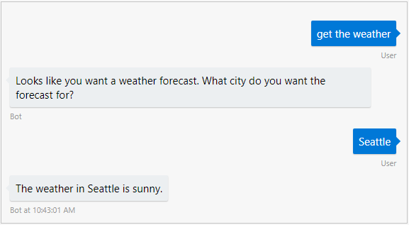
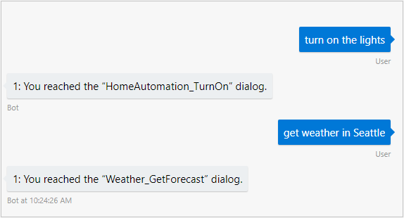

# Using LUIS for Language Understanding

The ability to understand what your user means conversationally and contextually can be a difficult task, but can give your bot a more natural conversation feel. Language Understanding, called LUIS, enables you to do just that so that your bot can recognize the intent of user messages, allow for more natural language from your user, and better direct the conversation flow. If you need more background on how LUIS integrates with a bot, see [language understanding for bots](./bot-builder-concept-LUIS.md). 

This topic walks you through setting up simple bots that uses LUIS to recognize a few different intents and respond appropriately.

## Installing Packages

First, make sure you have the packages necessary for LUIS.

# [C#](#tab/csref)

[Add a reference](https://docs.microsoft.com/en-us/nuget/tools/package-manager-ui) to v4 prerelease version of the following NuGet packages:


* `Microsoft.Bot.Builder.Ai.LUIS`

# [JavaScript](#tab/jsref)

You can add reference to botbuilder and botbuilder-ai package in your project via npm:

* `npm install --save botbuilder@preview`
* `npm install --save botbuilder-ai@preview`

---


## Set up middleware to use your LUIS app

First, set up a _LUIS app_, which is a service you create at [www.luis.ai](https://www.luis.ai). That LUIS app can be trained for certain intents it should be able to recognize. Details on how to create your LUIS app can be found on the [LUIS site](https://www.luis.ai).

For this example, you'll just use a demo LUIS app that can recognize Help, Cancel, and Weather intents; the app ID is already in the sample code. You will need to have a Cognitive Services key that you can get by logging in to [www.luis.ai](https://www.luis.ai) and copying the key from **User settings** > **Authoring Key**.

> [!NOTE] 
> To create your own copy of the public LUIS app used in this example, go to [steps for creating a simple app](https://aka.ms/luis-bot-simple-example). 

Configure your bot to call your LUIS app for every message received from a user by simply adding it to your bot's middleware stack. The middleware stores the recognition results on the context object, and can then be accessed by your bot logic.

# [C#](#tab/csharp)
Start with the Echo bot template, and open **Startup.cs**. 

Add a `using` statement for `Microsoft.Bot.Builder.Ai.LUIS`

```csharp
using Microsoft.AspNetCore.Builder;
using Microsoft.AspNetCore.Hosting;
using Microsoft.Bot.Builder.BotFramework;
using Microsoft.Bot.Builder.Integration.AspNet.Core;
// add this
using Microsoft.Bot.Builder.Ai.LUIS;
using Microsoft.Extensions.Configuration;
using Microsoft.Extensions.DependencyInjection;
using Microsoft.Extensions.Logging;
using System;
```

Update the `ConfigureServices` method in your `Startup.cs` file to add a `LuisRecognizerMiddleware` object that connects to your LUIS app. 

```csharp
// This method gets called by the runtime. Use this method to add services to the container.
public void ConfigureServices(IServiceCollection services)
{
    services.AddBot<EchoBot>(options =>
    {
        options.CredentialProvider = new ConfigurationCredentialProvider(Configuration);
. 
        options.Middleware.Add(new CatchExceptionMiddleware<Exception>(async (context, exception) =>
        {
            await context.TraceActivity("EchoBot Exception", exception);
            await context.SendActivity("Sorry, it looks like something went wrong!");
        }));

        // The Memory Storage used here is for local bot debugging only. When the bot
        // is restarted, anything stored in memory will be gone. 
        IStorage dataStore = new MemoryStorage();

        options.Middleware.Add(new ConversationState<EchoState>(dataStore));

        // Add LUIS recognizer as middleware
        options.Middleware.Add(
            new LuisRecognizerMiddleware(
                new LuisModel(
                    // This appID is for a public app that's made available for demo purposes
                    "eb0bf5e0-b468-421b-9375-fdfb644c512e",
                    // You can use it by replacing <subscriptionKey> with your Authoring Key
                    // which you can find at https://www.luis.ai under User settings > Authoring Key
                    "<subscriptionKey>",
                    // The location-based URL begins with "https://<region>.api.cognitive.microsoft.com", where region is the region associated with the key you are using. Some examples of regions are `westus`, `westcentralus`, `eastus2`, and `southeastasia`.
                    new Uri("https://westus.api.cognitive.microsoft.com/luis/v2.0/apps/"))));
    });
}
```

<!--TODO: DOES PUBLIC APP WORK WITH KEYS IN DIFFERENT REGIIONS? -->
Paste in your subscription key from [https://www.luis.ai](https://www.luis.ai) in place of `<subscriptionKey>`.

> [!NOTE] 
> If you're using your own LUIS app instead of the public one, you can get the ID, subscription key, and URL for your LUIS app from [https://www.luis.ai](https://www.luis.ai). 
>
>You can find the base URL to use in your `LuisModel` by logging into the [LUIS site](https://www.luis.ai), going to the **Publish** tab, and looking at the **Endpoint** column under **Resources and Keys**. The base URL is the portion of the **Endpoint URL** before the subscription ID and other parameters.

# [JavaScript](#tab/jsmiddleware)

First require/import in the [LuisRecognizer](https://github.com/Microsoft/botbuilder-js/tree/master/doc/botbuilder-ai/classes/botbuilder_ai.luisrecognizer.md) class and create an instance for your LUIS model:

```javascript
const { LuisRecognizer } = require('botbuilder-ai');

const model = new LuisRecognizer({
    // This appID is for a public app that's made available for demo purposes
    // You can use it by providing your LUIS subscription key
     appId: 'eb0bf5e0-b468-421b-9375-fdfb644c512e',
    // replace subscriptionKey with your Authoring Key
    // your key is at https://www.luis.ai under User settings > Authoring Key 
    subscriptionKey: '<your subscription key>',
    // The serviceEndpoint URL begins with "https://<region>.api.cognitive.microsoft.com", where region is the region associated with the key you are using. Some examples of regions are `westus`, `westcentralus`, `eastus2`, and `southeastasia`.
    serviceEndpoint: 'https://westus.api.cognitive.microsoft.com'
});
```

Add the model to the middleware stack:

```javascript
adapter.use(model);
```


> [!NOTE] 
> If you're using your own LUIS app instead of the public one, you can get the ID, subscription ID, and URL for your LUIS app from [https://www.luis.ai](https://www.luis.ai). 

---


LUIS language understanding is now plugged into your bot. Next, let's look at how to get the intent from the LUIS model stored on the context object.


## Get the intent from the turn context

The results from LUIS are then accessible from your bot using the context on every conversational turn.

# [C#](#tab/csluisbot)

To have your bot simply send a reply based on the intent that the LUIS app detected, replace the code in `OnTurn` with the following:

```cs
using System.Threading.Tasks;
using Microsoft.Bot;
using Microsoft.Bot.Builder;
using Microsoft.Bot.Builder.Ai.LUIS;
using Microsoft.Bot.Builder.Core.Extensions;
using Microsoft.Bot.Schema;

namespace Bot_Builder_Echo_Bot1
{
    public class EchoBot : IBot
    {
        /// <summary>
        /// Every Conversation turn for our EchoBot will call this method. In here
        /// the bot checks the Activty type to verify it's a message, checks the /// intent from the LUIS recognizer, and sends a reply based on the recognized intent
        /// </summary>
        /// <param name="context">Turn-scoped context containing all the data needed
        /// for processing this conversation turn. </param>        
        public async Task OnTurn(ITurnContext context)
        {
            // This bot is only handling Messages
            if (context.Activity.Type == ActivityTypes.Message)
            {

                var result = context.Services.Get<RecognizerResult>
                    (LuisRecognizerMiddleware.LuisRecognizerResultKey);
                var topIntent = result?.GetTopScoringIntent();
                switch ((topIntent != null) ? topIntent.Value.intent : null)
                {
                    case null:
                        await context.SendActivity("Failed to get results from LUIS.");
                        break;
                    case "None":
                        await context.SendActivity("Sorry, I don't understand.");
                        break;
                    case "Help":
                        await context.SendActivity("<here's some help>");
                        break;
                    case "Cancel":
                        // Cancel the process.
                        await context.SendActivity("<cancelling the process>");
                        break;
                    case "Weather":
                        // Cancel the process.
                        await context.SendActivity("The weather today is sunny.");
                        break;
                    default:
                        // Received an intent we didn't expect, so send its name and score.
                        await context.SendActivity($"Intent: {topIntent.Value.intent} ({topIntent.Value.score}).");
                        break;
                }
            }
        }
    }    
}

```

# [JavaScript](#tab/jsluis)

```javascript
// Listen for incoming activity 
server.post('/api/messages', (req, res) => {
    // Route received activity to adapter for processing
    adapter.processActivity(req, res, async (context) => {
        if (context.activity.type === 'message') {
            const results = model.get(context);
            const topIntent = LuisRecognizer.topIntent(results);
            switch (topIntent) {

                case 'Cancel':
                    await context.sendActivity("<cancelling the process>")
                    break;
                case 'Help':
                    await context.sendActivity("<here's some help>");
                    break;
                case 'Weather':
                    await context.sendActivity("The weather today is sunny.");
                    break;
                case 'None':                    
                    await context.sendActivity("Sorry, I don't understand.")
                    break;
                case 'null':                    
                    await context.sendActivity("Failed to get results from LUIS.")
                    break;
                default:
                    // Received an intent we didn't expect, so send its name and score.
                    await context.sendActivity(`The top intent was ${topIntent}`);
            }
        }
    });
});
```

Any intents recognized in the utterance will be returned as a map of intent names to scores and can be accessed from `results.intents`. A static `LuisRecognizer.topIntent()` method is provided to help simplify finding the top scoring intent for a result set.
Any entities recognized will be returned as a map of entity names to values and accessed via `results.entities`. Additional entity metadata can be returned by passing a `verbose=true` setting when creating the LuisRecognizer. The added metadata can then be accessed via `results.entities.$instance`.

---

<!-- TODO: SHOW RUNNING THE FIRST BOT -->
Try running the bot in the Bot Framework Emulator, and say things like "weather", "help", and "cancel" to it.


## Using a LUIS recognizer with conversation state
<!-- TBD, complete example -->
If your reply to the user has more than a single turn, you might decide to track where you are in the conversation by saving conversation state. You can use the intent from LUIS to help you set conversation state data, such as whether a conversation topic has been started or completed.

The LUIS recognizer middleware runs for every turn of your bot, so that you can get an intent for each message received by your user. If you want to start a multi-turn conversation flow based on an intent, one way to do it is to skip the logic for changing topics until you're done with the current topic.

# [C#](#tab/csFlag)

In EchoState.cs, change EchoState to the following:

```csharp
public class ConversationStateInfo 
{
    public bool WeatherTopicStarted  { get; set; }
    public bool HelpTopicStarted  { get; set; }
    public bool CancelTopicStarted  { get; set; }
}
```

In Startup.cs, change the initialization of ConversationState to use `ConversationStateInfo`.
```cs
    options.Middleware.Add(new ConversationState<ConversationStateInfo>(dataStore));
```

In EchoBot.cs, edit `OnTurn`:
```cs
public async Task OnTurn(ITurnContext context)
{
    // This bot is only handling Messages
    if (context.Activity.Type == ActivityTypes.Message)
    {
        var text = context.Activity.Text;
        var conversationState = context.GetConversationState<ConversationStateInfo>() ?? new ConversationStateInfo();

        // Here, you can add some other logic based on the topic flags in conversation state
        // For example, if you know that a particular topic was started in a previous turn,
        // you can send the reply for that topic and bypass getting the intent from LUIS 
        if (conversationState.WeatherTopicStarted)
        {
            // Set this flag to false since this reply concludes the topic.
            conversationState.WeatherTopicStarted = false;
            // Assume that they responded to the prompt with a location.
            await context.SendActivity($"The weather in {text} is sunny.");
        }
        else
        {
            var result = context.Services.Get<RecognizerResult>
            (LuisRecognizerMiddleware.LuisRecognizerResultKey);
            var topIntent = result?.GetTopScoringIntent();
            switch ((topIntent != null) ? topIntent.Value.intent : null)
            {
                case null:
                    await context.SendActivity("Failed to get results from LUIS.");
                    break;
                case "None":
                    await context.SendActivity("Sorry, I don't understand.");
                    break;
                case "Weather":
                    conversationState.WeatherTopicStarted = true;
                    await context.SendActivity($"Looks like you want a weather forecast. What city do you want the forecast for?");

                    break;
                case "Help":
                    conversationState.HelpTopicStarted = true;
                    await context.SendActivity("<here's some help>");
                    break;
                case "Cancel":
                    // Cancel the process.
                    conversationState.CancelTopicStarted = true;
                    await context.SendActivity("<cancelling the process>");
                    break;
                default:
                    // Received an intent we didn't expect, so send its name and score.
                    await context.SendActivity($"Intent: {topIntent.Value.intent} ({topIntent.Value.score}).");
                    break;
            }
        }
    }
}
```

# [JavaScript](#tab/jsFlag)

Add conversation state middleware after you add the `LuisRecognizer`.

```javascript
const model = new LuisRecognizer({
    // This appID is for a public app that's made available for demo purposes
    // You can use it by providing your LUIS subscription key
     appId: 'eb0bf5e0-b468-421b-9375-fdfb644c512e',
    // replace subscriptionKey with your Authoring Key
    // your key is at https://www.luis.ai under User settings > Authoring Key 
    subscriptionKey: '<your subscription>',
    // The serviceEndpoint URL begins with "https://<region>.api.cognitive.microsoft.com", where region is the region associated with the key you are using. Some examples of regions are `westus`, `westcentralus`, `eastus2`, and `southeastasia`.
    serviceEndpoint: 'https://westus.api.cognitive.microsoft.com'
});
adapter.use(model)

// Add conversation state middleware
const conversationState = new ConversationState(new MemoryStorage());
adapter.use(conversationState);
```

Then you can save state indicating which topic has been started.

```javascript
// Listen for incoming activities 
server.post('/api/messages', (req, res) => {
    // Route received activity to adapter for processing
    adapter.processActivity(req, res, async(context) => {
        if (context.activity.type === 'message') {
            var utterance = context.activity.text;
            
            // Check topic flags in conversation state 
            if (conversationState.weatherTopicStarted) 
            {
                // Assume the user's message is a reply to the bot's prompt for a location
                await context.sendActivity(`The weather in ${utterance} is sunny.`);
                // This conversation flow is now finished. Set flag to false,
                // so that on the next turn the user can ask for another weather forecast.
                conversationState.WeatherTopicStarted = false;
            }
            // To add more steps to the other topics
            // you could check the topic flags here
            else 
            {
                const results = model.get(context);
                const topIntent = LuisRecognizer.topIntent(results);
                switch (topIntent) {
                    case 'None':
                        //Add app logic when there is no result
                        await context.sendActivity("<null case>")
                        break;
                    case 'Cancel':
                        conversationState.cancelTopicStarted = true;
                        await context.sendActivity("<cancelling the process>")
                        break;
                    case 'Help':
                        conversationState.helpTopicStarted = true;
                        await context.sendActivity("<here's some help>");
                        break;
                    case 'Weather':
                        conversationState.weatherTopicStarted = true;
                        await context.sendActivity("Looks like you want a weather forecast. What city do you want the forecast for?");
                        break;
                    default:
                        // Add app logic for the recognition results.
                        await context.sendActivity(`Received this intent: ${topIntent}`);
                }
            }
        }
    });
});
```

---

Try running the bot in the Bot Framework Emulator, and notice that "get weather" is now a two-turn conversation flow.




## Using LUIS with dialogs

If you're using the intent from LUIS to trigger a multi-turn conversation flow, it can be helpful to use dialogs to encapsulate this flow. This example bot works with a LUIS app that detects intents used to trigger either a home automation dialog or a weather dialog.

> [!NOTE] 
> To create your own copy of the public LUIS app used in this example, go to [these steps](https://aka.ms/luis-bot-examples). 

# [C#](#tab/csludialog)

First, modify `ConfigureServices` in Startup.cs to add middleware for your LUIS app. Rename `EchoBot` to `LuisDialogBot`.
In this example, the LUIS app added as `LuisRecognizerMiddleware` detects the `homeautomation` or `weather` intents, to trigger dialogs with those names. 

```csharp
public void ConfigureServices(IServiceCollection services)
{  
    // Rename EchoBot to LuisDialogBot
    services.AddBot<LuisDialogBot>(options =>
    {
        options.CredentialProvider = new ConfigurationCredentialProvider(Configuration); 
        options.Middleware.Add(new CatchExceptionMiddleware<Exception>(async (context, exception) =>
        {
            await context.TraceActivity("EchoBot Exception", exception);
            await context.SendActivity("Sorry, it looks like something went wrong!");
        }));

        // The Memory Storage used here is for local bot debugging only. When the bot
        // is restarted, anything stored in memory will be gone. 
        IStorage dataStore = new MemoryStorage();

        // Use Dictionary<string, object> for the conversation state type
        options.Middleware.Add(new ConversationState<Dictionary<string, object>>(dataStore));

        // Add LUIS recognizer as middleware
        options.Middleware.Add(
            new LuisRecognizerMiddleware(
                new LuisModel(
                    // This appID is for a public app that's made available for demo purposes
                    "428affb6-7650-46ac-9184-68c00a4f1729",
                    // You can use it by replacing <subscriptionKey> with your Authoring Key
                    // which you can find at https://www.luis.ai under User settings > Authoring Key
                    "<subscriptionKey>",
                    // The location-based URL begins with "https://<region>.api.cognitive.microsoft.com", where region is the region associated with the key you are using. Some examples of regions are `westus`, `westcentralus`, `eastus2`, and `southeastasia`.
                    new Uri("https://westus.api.cognitive.microsoft.com/luis/v2.0/apps/"))));
    });
}
```

Rename **EchoBot.cs** to **LuisDialogBot.cs**, and rename the `EchoBot` class to `LuisDialogBot`. Then, in **LuisDialogBot.cs** add the following `using` statements.

```csharp
using System;
using System.Collections.Generic;
using System.Threading.Tasks;
using Microsoft.Bot.Builder;
using Microsoft.Bot.Builder.Ai.LUIS;
using Microsoft.Bot.Builder.Core.Extensions;
using Microsoft.Bot.Builder.Dialogs;
using Microsoft.Bot.Builder.Prompts;
using Microsoft.Bot.Schema;
```

In **LuisDialogBot.cs**, add the following code to the `LuisDialogBot` class.

```csharp
    public class LuisDialogBot : IBot
    {
        private DialogSet _dialogs;

        public LuisDialogBot()
        {
            _dialogs = new DialogSet();

            _dialogs.Add("homeautomation", CreateHomeAutomationWaterfall());
            _dialogs.Add("weather", CreateWeatherWaterfall());
            _dialogs.Add("weather_city", new Builder.Dialogs.TextPrompt());
        }

        // App ID for a separate LUIS app used to tell if the user wants to turn the lights on or off
        // The `homeautomation` dialogs uses results from this app to determine the "on/off" argument. 
        private static LuisModel luisHomeAutomation =
            new LuisModel("76feb726-515b-44c4-acc9-adb216965a58", "SUBSCRIPTION-KEY", new System.Uri("https://westus.api.cognitive.microsoft.com/luis/v2.0/apps/"));

        public async Task OnTurn(ITurnContext context)
        {
            // This bot is only handling Messages
            if (context.Activity.Type == ActivityTypes.Message)
            {

                // Create a dialog context
                var state = ConversationState<Dictionary<string, object>>.Get(context);
                var dc = _dialogs.CreateContext(context, state);

                // Run the next dialog step
                await dc.Continue();
                
                // Check if any dialog has responded on this turn
                if (!context.Responded)
                {

                    var luisResult = context.Services.Get<RecognizerResult>(LuisRecognizerMiddleware.LuisRecognizerResultKey);
                    var topIntent = luisResult?.GetTopScoringIntent();
                    var utterance = context.Activity.Text;
                    var dialogArgs = new Dictionary<string, object>();

                    switch ((topIntent != null) ? topIntent.Value.intent.ToLowerInvariant() : null)
                    {
                        case "homeautomation":
                            // The Homeautomation_TurnOn and Homeautomation_TurnOff dialogs 
                            // use results from a separate LUIS app.
                            // The results determine the "on/off" argument to pass to the dialog. 
                            var recognizerHomeAutomation = new LuisRecognizer(luisHomeAutomation);
                            RecognizerResult recognizerResult = await recognizerHomeAutomation.Recognize(utterance, System.Threading.CancellationToken.None);
                            var topHomeAutoIntent = recognizerResult.GetTopScoringIntent().intent;


                            dialogArgs.Add("IntentFromHomeAuto", "");
                            switch ((topHomeAutoIntent != null) ? topHomeAutoIntent.ToLowerInvariant() : null)
                            {
                                case "homeautomation_turnon":
                                    dialogArgs["Intent_HomeAutomation"] = "on";
                                    await dc.Begin("homeautomation", dialogArgs);
                                    break;
                                case "homeautomation_turnoff":
                                    dialogArgs["Intent_HomeAutomation"] = "off";
                                    await dc.Begin("homeautomation", dialogArgs);
                                    break;
                                case null:
                                    await dc.Begin("homeautomation", null);
                                    break;
                                default:
                                    dialogArgs["Intent_HomeAutomation"] = topHomeAutoIntent;
                                    await dc.Begin("homeautomation", dialogArgs);
                                    break;
                            }
                            break;
                        case "weather":
                            dialogArgs.Add("LuisResult", luisResult);
                            await dc.Begin("weather", dialogArgs);
                            break;
                        case null:
                            await context.SendActivity($"Couldn't get a result from LUIS. You said: {utterance}");
                            break;
                        default:
                            // The intent didn't match any case, so just display the recognition results.
                            await context.SendActivity($"you said: {utterance}");
                            await context.SendActivity($"Recognized intent: {topIntent.Value.intent}.");

                            break;

                    }

                }
            }
        }

    }


```

After `OnTurn`, add code within the `LuisDialogBot` class for implementing the dialogs.

```csharp
        // The home automation waterfall has one step
        private WaterfallStep[] CreateHomeAutomationWaterfall()
        {
            return new WaterfallStep[] {
                TurnLightsOnOrOff
            };
        }

        // The weather waterfall has two steps
        private WaterfallStep[] CreateWeatherWaterfall()
        {
            return new WaterfallStep[] {
                AskWeatherLocation,
                SendWeatherReport
            };
        }

        /// <summary>
        /// This is the first step and only of the home automation dialog.
        /// </summary>
        /// <param name="dc"></param>
        /// <param name="args">Can be "on", "off", another string for an intent name, or null.
        /// null indicates that no result was received from which to get an intent name.</param>
        /// <param name="next"></param>
        /// <returns></returns>
        private async Task TurnLightsOnOrOff(DialogContext dc, IDictionary<string, object> args, SkipStepFunction next)
        {
            var intentFromHomeAutomation = args["Intent_HomeAutomation"];
            if (args != null)
            {
                switch (intentFromHomeAutomation)
                {
                    case "on":
                    case "off":
                        await dc.Context.SendActivity($"Turning {intentFromHomeAutomation} your lights!");
                        break;
                    default:
                        await dc.Context.SendActivity($"Intent detected by homeautomation was: {intentFromHomeAutomation}, but the home automation system doesn't support that yet.");
                        break;
                }

            }
            else
            {
                await dc.Context.SendActivity($"You said {dc.Context.Activity.AsMessageActivity().Text}. Unable to get a result from which to determine on/off/other operation");
            }

            await dc.End();

        }

        // This is the first step of the weather dialog
        private async Task AskWeatherLocation(DialogContext dc, IDictionary<string, object> args, SkipStepFunction next)
        {
            var dialogState = dc.ActiveDialog.State as IDictionary<string, object>;
            
            if (args["LuisResult"] is RecognizerResult luisResult)
            {
                var location = GetEntity<string>(luisResult, "Weather_Location");
                if (!string.IsNullOrEmpty(location))
                {
                    dialogState.Add("Location", location);
                }
            }

            // Save info back to the dialog instance
            dc.ActiveDialog.State = dialogState;

            if (!dialogState.ContainsKey("Location"))
            {
                await dc.Prompt("weather_city", "What city do you want the weather for?");
            }
            else
            {
                // We've set the location parameter for the weather report,
                // so go to the next step in the waterfall
                await dc.Continue();
            }
        }

        // This the second step of the weather dialog
        private async Task SendWeatherReport(DialogContext dc, IDictionary<string, object> args, SkipStepFunction next)
        {
            var dialogState = dc.ActiveDialog.State as IDictionary<string, object>;
            if (args != null)
            {
                if (!dialogState.ContainsKey("Location"))
                {   // Interpret args as a reply to prompt only if they didn't give location
                    TextResult locationResult = (TextResult)args;
                    dialogState.Add("Location", locationResult.Text);
                }

            }

            // You can add some logic that uses the location 
            // to get the weather from a weather service instead of hard-coding it
            await dc.Context.SendActivity($"The weather forecast for '{dialogState["Location"]}' is sunny and 70 degrees F.");

            dc.ActiveDialog.State = new Dictionary<string, object>(); // clear the dialog state 
            await dc.End();
        }
```

Add this helper function.

```cs
private T GetEntity<T>(RecognizerResult luisResult, string entityKey)
{
    var data = luisResult.Entities as IDictionary<string, JToken>;
    if (data.TryGetValue(entityKey, out JToken value))
    {
        return value.First.Value<T>();
    }
    return default(T);
}
```

# [JavaScript](#tab/jsludialog)


First, create a LUIS app and add it to your bot using `adapter.use`:

```javascript
const { BotFrameworkAdapter, ConversationState, MemoryStorage, TurnContext } = require('botbuilder');
const { LuisRecognizer, QnAMaker } = require('botbuilder-ai');
const { DialogSet } = require('botbuilder-dialogs');
const restify = require('restify');

// Create server
let server = restify.createServer();
server.listen(process.env.port || process.env.PORT || 3978, function () {
    console.log(`${server.name} listening to ${server.url}`);
});

// Create adapter
const adapter = new BotFrameworkAdapter({
    appId: process.env.MICROSOFT_APP_ID,
    appPassword: process.env.MICROSOFT_APP_PASSWORD
});

// Create LuisRecognizer 
// The LUIS application is public, meaning you can use your own subscription key to test the applications.
const luisRecognizer = new LuisRecognizer({
    appId: '1fefd4a7-ae5b-4e63-99f7-0cf499a1423b',
    subscriptionKey: process.env.LUIS_SUBSCRIPTION_KEY,
    serviceEndpoint: 'https://westus.api.cognitive.microsoft.com/',
    verbose: true
});

// Add the recognizer to your bot
adapter.use(luisRecognizer);

// create conversation state
const conversationState = new ConversationState(new MemoryStorage());
adapter.use(conversationState);

// register some dialogs for usage with the intents detected by the LUIS app
const dialogs = new DialogSet();
```

Next, add dialogs:

```javascript

dialogs.add('HomeAutomation_TurnOn', [
    async (dialogContext) => {
        const state = conversationState.get(dialogContext.context);
        // state.homeAutomationTurnOn counts how many times this dialog was called 
        state.homeAutomationTurnOn = state.homeAutomationTurnOn ? state.homeAutomationTurnOn + 1 : 1;
        await dialogContext.context.sendActivity(`${state.homeAutomationTurnOn}: You reached the "HomeAutomation_TurnOn" dialog.`);

        await dialogContext.end();
    }
]);

dialogs.add('Weather_GetForecast', [
    async (dialogContext) => {
        const state = conversationState.get(dialogContext.context);
        // state.weatherGetForecast counts how many times this dialog was called  
        state.weatherGetForecast = state.weatherGetForecast ? state.weatherGetForecast + 1 : 1;
        await dialogContext.context.sendActivity(`${state.weatherGetForecast}: You reached the "Weather_GetForecast" dialog.`);

        await dialogContext.end();
    }
]);

dialogs.add('None', [
    async (dialogContext) => {
        const state = conversationState.get(dialogContext.context);
        // state.None counts how many times this dialog was called        
        state.None = state.None ? state.None + 1 : 1;
        await dialogContext.context.sendActivity(`${state.None}: You reached the "None" dialog.`);

        await dialogContext.end();
    }
]);
```

In your bot, invoke each dialog based on the recognized intent:
```javascript
server.post('/api/messages', (req, res) => {
    adapter.processActivity(req, res, async (context) => {
        if (context.activity.type === 'message') {
            const state = conversationState.get(context);
            const dc = dialogs.createContext(context, state);

            // Retrieve the LUIS results from our LUIS application
            const luisResults = luisRecognizer.get(context);

            // Extract the top intent from LUIS and use it to select which dialog to start
            // "NotFound" is the intent name for when no top intent can be found.
            const topIntent = LuisRecognizer.topIntent(luisResults, "NotFound");

            const isMessage = context.activity.type === 'message';
            if (isMessage) {
                switch (topIntent) {
                    case 'homeautomation':                    
                        await dc.begin("HomeAutomation_TurnOn", luisResults);
                        break;
                    case 'weather':                    
                        await dc.begin("Weather_GetForecast", luisResults);
                        break;
                    case 'None':
                        await dc.begin("None");
                        break;
                    case 'NotFound':
                        await context.sendActivity(`Sorry, I didn't get any results from LUIS.`);
                        break;
                    default:
                        // handle intents for which we have no dialog
                        await context.sendActivity(`You reached the ${topIntent} intent.`);
                        break;
                }
            }
            
            if (!context.responded) {
                await dc.continue();
                if (!context.responded && isMessage) {
                    await dc.context.sendActivity(`Hi! I'm the LUIS dialog bot. Say something and LUIS will decide how the message should be routed.`);
                }
            }
        }
    });
});
```

Try running the bot in the Bot Framework Emulator, and say things like "turn on the lights", and "get weather in Seattle" to it.



---

## Extract entities

Besides recognizing intent, a LUIS app can also extract entities, which are important words for fulfilling a user's request. For example, in the example of the weather dialog, the LUIS app might be able to extract the location for the weather report from the user's message. 

A common way to use dialogs is to identify any entities in the user's message, and prompt for any of the required entities that are not found, handling the response to the prompt in subsequent waterfall steps.

# [C#](#tab/csentitydialog)
The following helper function that you added to your `LuisDialogBot` class got entities out of the `RecognizerResult` from LUIS.

```cs
// Get entities from LUIS result
private T GetEntity<T>(RecognizerResult luisResult, string entityKey)
{
    var data = luisResult.Entities as IDictionary<string, JToken>;
    if (data.TryGetValue(entityKey, out JToken value))
    {
        return value.First.Value<T>();
    }
    return default(T);
}
```

When gathering information like entities from multiple steps in a dialog, it can be helpful to save the information you need in dialog-specific state. For example, in the `AskWeatherLocation` dialog, the entities are extracted from LUIS results passed to the dialog. If a `Weather_Location` entity is found, it's added to the dialog state.

```cs

        // This is the first step of the weather dialog
        private async Task AskWeatherLocation(DialogContext dc, IDictionary<string, object> args, SkipStepFunction next)
        {
            var dialogState = dc.ActiveDialog.State as IDictionary<string, object>;
            
            if (args["LuisResult"] is RecognizerResult luisResult)
            {
                var location = GetEntity<string>(luisResult, "Weather_Location");
                if (!string.IsNullOrEmpty(location))
                {
                    dialogState.Add("Location", location);
                }
            }

            // Save info back to the dialog instance
            dc.ActiveDialog.State = dialogState;

            if (!dialogState.ContainsKey("Location"))
            {
                await dc.Prompt("weather_city", "What city do you want the weather for?");
            }
            else
            {
                // We've set the location parameter for the weather report,
                // so go to the next step in the waterfall
                await dc.Continue();
            }
        }
```

In the second step of the dialog, you can get the information saved in the previous step from the dialog instance's state, as well as the user's reply to the prompt for location, and uses it to send a weather report to the user.

```cs

// This the second step of the weather dialog
private async Task SendWeatherReport(DialogContext dc, IDictionary<string, object> args, SkipStepFunction next)
{
    var dialogState = dc.ActiveDialog.State as IDictionary<string, object>;
    if (args != null)
    {
        if (!dialogState.ContainsKey("Location"))
        {   // Interpret args as a reply to prompt only if they didn't give location
            TextResult locationResult = (TextResult)args;
            dialogState.Add("Location", locationResult.Text);
        }

    }

    // You can add some logic that uses the location and date
    // to get the weather from a weather service instead of hard-coding it
    await dc.Context.SendActivity($"The weather forecast for '{dialogState["Location"]}' is sunny and 70 degrees F.");
    
    // clear the dialog state 
    dc.ActiveDialog.State = new Dictionary<string, object>(); 
    await dc.End();
}
```

# [JavaScript](#tab/jsentitydialog)

The `findEntities` method looks for any `Weather_Location` entities recognized by the LUIS app.

<!-- TODO: Turn into a waterfall -->

```javascript
// Helper function for finding a specified entity
// entityResults are the results from LuisRecognizer.get(context)
function findEntities(entityName, entityResults) {
    let entities = []
    if (entityName in entityResults) {
        entityResults[entityName].forEach(entity => {
            entities.push(entity);
        });
    }
    return entities.length > 0 ? entities : undefined;
}
```

Call `findEntities` from the `Weather_GetForecast` dialog.

```javascript
// Pass the LUIS recognizer result to the args parameter
dialogs.add('Weather_GetForecast', [
    async (dialogContext, args) => {
        const locations = findEntities('Weather_Location', args.entities);

        const state = conversationState.get(dialogContext.context);
        state.weatherGetForecast = state.weatherGetForecast ? state.weatherGetForecast + 1 : 1;
        await dialogContext.context.sendActivity(`${state.weatherGetForecast}: You reached the "Weather.GetForecast" dialog.`);
        if (locations) {
            await dialogContext.context.sendActivity(`Found these "Weather_Location" entities:\n${locations.join(', ')}`);
        }
        await dialogContext.end();
    }
]);
```

The entities are extracted from the LUIS results passed to `dc.begin`.

```javascript
await dc.begin("Weather_GetForecast", luisResults);
```
---

## Additional resources

For more background on LUIS, see [Language Understanding](./bot-builder-concept-luis.md)

For info on how to build the LUIS apps used in these examples, see [LUIS apps for Bot Builder](https://aka.ms/luis-bot-examples).

## Next steps

LUIS can be combined with other Cognitive Services, to make your bot even more powerful. The Dispatch tool provides a way to combine QnA with Language Understanding (LUIS) in your bot.

> [!div class="nextstepaction"]
> [Combine LUIS apps and QnA services using the Dispatch tool](./bot-builder-tutorial-dispatch.md)


