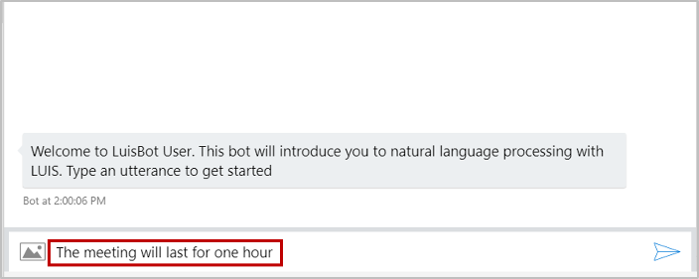
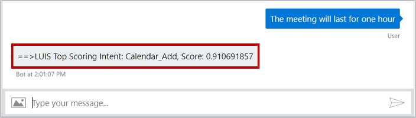
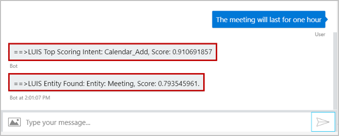

# Add natural language understanding to your bot

[!INCLUDE [pre-release-label](../includes/pre-release-label.md)]

The ability to understand what your user means conversationally and contextually can be a difficult task, but can provide your bot a more natural conversation feel. Language Understanding, called LUIS, enables you to do just that so that your bot can recognize the intent of user messages, allow for more natural language from your user, and better direct the conversation flow. This topic walks you through setting up a simple bot that uses LUIS to recognize a few different intents. 
## Prerequisites
- [luis.ai](https://www.luis.ai) account
- [Bot Framework Emulator](https://github.com/Microsoft/BotFramework-Emulator/blob/master/README.md#download)
- The code in this article is based on the **NLP with LUIS** sample. You'll need a copy of the sample in either [C# Sample](https://aka.ms/cs-luis-sample) or [JS Sample](https://aka.ms/js-luis-sample). 
- Knowledge of [bot basics](bot-builder-basics.md), [natural language processing](https://docs.microsoft.com/en-us/azure/cognitive-services/luis/what-is-luis), and [.bot](bot-file-basics.md) file.

## Create a LUIS app in the LUIS portal
Sign in to the LUIS portal to create your own version of the sample LUIS app. You can create and manage your applications on **My Apps**. 

1. Select **Import new app**. 
1. Click **Choose App file (JSON format)...** 
1. Select `reminders.json` file located in the `CognitiveModels` folder of the sample. In the **Optional Name**, enter **LuisBot**. This file contains three intents: Calendar_Add, Calendar_Find, and None. We'll use these intents to understand what the user meant when they send a message to the bot. If you want to include entities, see the [optional section](#optional---extract-entities) at the end of this article.
1. [Train](https://docs.microsoft.com/en-us/azure/cognitive-services/LUIS/luis-how-to-train) the app.
1. [Publish](https://docs.microsoft.com/en-us/azure/cognitive-services/LUIS/publishapp) the app to *production* environment.

### Obtain values to connect to your LUIS app

Once your LUIS app is published, you can access it from your bot. You will need to record several values to access your LUIS app from within your bot. You can retrieve that information using the LUIS portal.

#### Retrieve application information from the LUIS.ai portal
The .bot file act as the place to bring all service references together in one place. The information you retrieve will be added to the .bot file in the next section. 
1. Select your published LUIS app from [luis.ai](https://www.luis.ai).
1. With your published LUIS app open, select the **MANAGE** tab.
1. Select the **Application Information** tab on the left side, record the value shown for _Application ID_ as <YOUR_APP_ID>.
1. Select the **Keys and Endpoints** tab on the left side, record the value shown for _Authoring Key_ as <YOUR_AUTHORING_KEY>. Note that *your subscription key* is the same as *your authoring key*. 
1. Scroll down to the end of the page, record the value shown for _Region_ as <YOUR_REGION>.
1. Record the value shown for _Endpoint_ as <YOUR_ENDPOINT>.

#### Update the bot file
Add the information required to access your LUIS app including application id, authoring key, subscription key, endpoint and region into the `nlp-with-luis.bot` file. These are the values you saved previously from your published LUIS app.

```json
{
    "name": "LuisBot",
    "description": "",
    "services": [
        {
            "type": "endpoint",
            "name": "development",
            "endpoint": "http://localhost:3978/api/messages",
            "appId": "",
            "appPassword": "",
            "id": "166"
        },
        {
            "type": "luis",
            "name": "LuisBot",
            "appId": "<luis appid>",
            "version": "0.1",
            "authoringKey": "<luis authoring key>",
            "subscriptionKey": "<luis subscription key>",
            "region": "<luis region>",
            "id": "158"
        }
    ],
    "padlock": "",
    "version": "2.0"
}
```
# [C#](#tab/cs)

### Configure your bot to use your LUIS app
Be sure that the nuget package **Microsoft.Bot.Builder.AI.Luis** is installed for your project.

Next, we initialize a new instance of the BotService class in `BotServices.cs`, which grabs the above information from your `.bot` file. The external service is configured using the `BotConfiguration` class.

```csharp
using Microsoft.Bot.Builder.AI.Luis;
using Microsoft.Bot.Configuration;

public class BotServices
{
    // Initializes a new instance of the BotServices class
    public BotServices(BotConfiguration botConfiguration)
    {
        foreach (var service in botConfiguration.Services)
        {
            switch (service.Type)
            {
                case ServiceTypes.Luis:
                {
                    var luis = (LuisService)service;
                    if (luis == null)
                    {
                        throw new InvalidOperationException("The LUIS service is not configured correctly in your '.bot' file.");
                    }

                    var app = new LuisApplication(luis.AppId, luis.AuthoringKey, luis.GetEndpoint());
                    var recognizer = new LuisRecognizer(app);
                    this.LuisServices.Add(luis.Name, recognizer);
                    break;
                    }
                }
            }
        }

    // Gets the set of LUIS Services used. LuisServices is represented as a dictionary.  
    public Dictionary<string, LuisRecognizer> LuisServices { get; } = new Dictionary<string, LuisRecognizer>();
}
```

Then register the LUIS app as a singleton in the `Startup.cs` file using the following code within `ConfigureServices` method.

```csharp
public void ConfigureServices(IServiceCollection services)
{
    var secretKey = Configuration.GetSection("botFileSecret")?.Value;
    var botFilePath = Configuration.GetSection("botFilePath")?.Value;

    // Loads .bot configuration file and adds a singleton that your Bot can access through dependency injection.
    var botConfig = BotConfiguration.Load(botFilePath ?? @".\nlp-with-luis.bot", secretKey);
    services.AddSingleton(sp => botConfig ?? throw new InvalidOperationException($"The .bot config file could not be loaded. ({botConfig})"));

    // Initialize Bot Connected Services client.
    var connectedServices = new BotServices(botConfig);
    services.AddSingleton(sp => connectedServices);

    services.AddBot<LuisBot>(options =>
    {
        // Retrieve current endpoint.
        var environment = _isProduction ? "production" : "development";
        var service = botConfig.Services.Where(s => s.Type == "endpoint" && s.Name == environment).FirstOrDefault();
        if (!(service is EndpointService endpointService))
        {
            throw new InvalidOperationException($"The .bot file does not contain an endpoint with name '{environment}'.");
        }

        options.CredentialProvider = new SimpleCredentialProvider(endpointService.AppId, endpointService.AppPassword);

        // ...
    });
}
```

Next, in the `LuisBot.cs` file, the bot gets this LUIS instance.

```csharp
public class LuisBot : IBot
{
    public static readonly string LuisKey = "LuisBot";
    private const string WelcomeText = "This bot will introduce you to natural language processing with LUIS. Type an utterance to get started";

    // Services configured from the ".bot" file.
    private readonly BotServices _services;

    // Initializes a new instance of the LuisBot class.
    public LuisBot(BotServices services)
    {
        _services = services ?? throw new System.ArgumentNullException(nameof(services));
        if (!_services.LuisServices.ContainsKey(LuisKey))
        {
            throw new System.ArgumentException($"Invalid configuration....");
        }
    }
    // ...
}
```

# [JavaScript](#tab/js)

In our sample, the startup code is in an **index.js** file, the code for the bot logic is in a **bot.js** file, and additional configuration information is in the **nlp-with-luis.bot** file.

In the **bot.js** file, we read in the configuration information to generate the LUIS service and initialize the bot.
Update the value of `LUIS_CONFIGURATION` to the name of your LUIS app, as it appears in your configuration file.

```javascript
// Language Understanding (LUIS) service name as defined in the .bot file.YOUR_LUIS_APP_NAME is "LuisBot" in the JavaScript code.
const LUIS_CONFIGURATION = '<YOUR_LUIS_APP_NAME>';

// Get endpoint and LUIS configurations by service name.
const endpointConfig = botConfig.findServiceByNameOrId(BOT_CONFIGURATION);
const luisConfig = botConfig.findServiceByNameOrId(LUIS_CONFIGURATION);

// Map the contents to the required format for `LuisRecognizer`.
const luisApplication = {
    applicationId: luisConfig.appId,
    endpointKey: luisConfig.subscriptionKey || luisConfig.authoringKey,
    azureRegion: luisConfig.region
};

// Create configuration for LuisRecognizer's runtime behavior.
const luisPredictionOptions = {
    includeAllIntents: true,
    log: true,
    staging: false
};

// Create adapter...

// Create the LuisBot.
let bot;
try {
    bot = new LuisBot(luisApplication, luisPredictionOptions);
} catch (err) {
    console.error(`[botInitializationError]: ${ err }`);
    process.exit();
}
```

We then create the HTTP server and listen for incoming requests, which will generate calls to our bot logic.

```javascript
// Create HTTP server.
let server = restify.createServer();
server.listen(process.env.port || process.env.PORT || 3978, function() {
    console.log(`\n${ server.name } listening to ${ server.url }.`);
    console.log(`\nGet Bot Framework Emulator: https://aka.ms/botframework-emulator.`);
    console.log(`\nTo talk to your bot, open nlp-with-luis.bot file in the emulator.`);
});

// Listen for incoming requests.
server.post('/api/messages', (req, res) => {
    adapter.processActivity(req, res, async(turnContext) => {
        await bot.onTurn(turnContext);
    });
});
```

---

LUIS is now configured for your bot. Next, let's look at how to get the intent from LUIS.

### Get the intent by calling LUIS

Your bot gets results from LUIS by calling the LUIS recognizer.

# [C#](#tab/cs)

To have your bot simply send a reply based on the intent that the LUIS app detected, call the `LuisRecognizer`, to get a `RecognizerResult`. This can be done within your code whenever you need to get the LUIS intent.

```cs
public async Task OnTurnAsync(ITurnContext turnContext, CancellationToken cancellationToken = default(CancellationToken))

{
    if (turnContext.Activity.Type == ActivityTypes.Message)
    {
        // Check LUIS model
        var recognizerResult = await _services.LuisServices[LuisKey].RecognizeAsync(turnContext, cancellationToken);
        var topIntent = recognizerResult?.GetTopScoringIntent();
        if (topIntent != null && topIntent.HasValue && topIntent.Value.intent != "None")
        {
            await turnContext.SendActivityAsync($"==>LUIS Top Scoring Intent: {topIntent.Value.intent}, Score: {topIntent.Value.score}\n");
        }
        else
        {
            var msg = @"No LUIS intents were found.
                        This sample is about identifying two user intents:
                        'Calendar.Add'
                        'Calendar.Find'
                        Try typing 'Add Event' or 'Show me tomorrow'.";
            await turnContext.SendActivityAsync(msg);
        }
        }
        else if (turnContext.Activity.Type == ActivityTypes.ConversationUpdate)
        {
            // Send a welcome message to the user and tell them what actions they may perform to use this bot
            await SendWelcomeMessageAsync(turnContext, cancellationToken);
        }
        else
        {
            await turnContext.SendActivityAsync($"{turnContext.Activity.Type} event detected", cancellationToken: cancellationToken);
        }
}
```

Any intents recognized in the utterance will be returned as a map of intent names to scores and can be accessed from `recognizerResult.Intents`. A static `recognizerResult?.GetTopScoringIntent()` method is provided to help simplify finding the top scoring intent for a result set.

Any entities recognized will be returned as a map of entity names to values and accessed using `recognizerResults.entities`. Additional entity metadata can be returned by passing a `verbose=true` setting when creating the LuisRecognizer. The added metadata can then be accessed using `recognizerResults.entities.$instance`.

# [JavaScript](#tab/js)

In the **bot.js** file, we pass the user's input to the LUIS recognizer's `recognize` method to get answers from the LUIS app.

```javascript
const { ActivityTypes } = require('botbuilder');
const { LuisRecognizer } = require('botbuilder-ai');

/**
 * A simple bot that responds to utterances with answers from the Language Understanding (LUIS) service.
 * If an answer is not found for an utterance, the bot responds with help.
 */
class LuisBot {
    /**
     * The LuisBot constructor requires one argument (`application`) which is used to create an instance of `LuisRecognizer`.
     * @param {LuisApplication} luisApplication The basic configuration needed to call LUIS. In this sample the configuration is retrieved from the .bot file.
     * @param {LuisPredictionOptions} luisPredictionOptions (Optional) Contains additional settings for configuring calls to LUIS.
     */
    constructor(application, luisPredictionOptions, includeApiResults) {
        this.luisRecognizer = new LuisRecognizer(application, luisPredictionOptions, true);
    }

    /**
     * Every conversation turn calls this method.
     * @param {TurnContext} turnContext Contains all the data needed for processing the conversation turn.
     */
    async onTurn(turnContext) {
        // By checking the incoming Activity type, the bot only calls LUIS in appropriate cases.
        if (turnContext.activity.type === ActivityTypes.Message) {
            // Perform a call to LUIS to retrieve results for the user's message.
            const results = await this.luisRecognizer.recognize(turnContext);

            // Since the LuisRecognizer was configured to include the raw results, get the `topScoringIntent` as specified by LUIS.
            const topIntent = results.luisResult.topScoringIntent;

            if (topIntent.intent !== 'None') {
                await turnContext.sendActivity(`LUIS Top Scoring Intent: ${ topIntent.intent }, Score: ${ topIntent.score }`);
            } else {
                // If the top scoring intent was "None" tell the user no valid intents were found and provide help.
                await turnContext.sendActivity(`No LUIS intents were found.
                                                \nThis sample is about identifying two user intents:
                                                \n - 'Calendar.Add'
                                                \n - 'Calendar.Find'
                                                \nTry typing 'Add Event' or 'Show me tomorrow'.`);
            }
        } else if (turnContext.activity.type === ActivityTypes.ConversationUpdate &&
            turnContext.activity.recipient.id !== turnContext.activity.membersAdded[0].id) {
            // If the Activity is a ConversationUpdate, send a greeting message to the user.
            await turnContext.sendActivity('Welcome to the NLP with LUIS sample! Send me a message and I will try to predict your intent.');
        } else if (turnContext.activity.type !== ActivityTypes.ConversationUpdate) {
            // Respond to all other Activity types.
            await turnContext.sendActivity(`[${ turnContext.activity.type }]-type activity detected.`);
        }
    }
}

module.exports.LuisBot = LuisBot;
```

The LUIS recognizer returns information about how well the utterance matched available intents. The result object's `luisResult.intents` property contains an array of the scored intents. The result object's `luisResult.topScoringIntent` property contains the top scoring intent and its score.

---

### Test the bot

1. Run the sample locally on your machine. If you need instructions, refer to the readme file for [C#](https://github.com/Microsoft/BotBuilder-Samples/blob/master/samples/csharp_dotnetcore/12.nlp-with-luis/README.md) or [JS](https://github.com/Microsoft/BotBuilder-Samples/blob/master/samples/javascript_nodejs/12.nlp-with-luis/README.md) sample.

1. In the emulator, type a message as shown below. 



The bot will respond back with the top scoring intent, which in this case is the 'Calendar_Add' intent. Recall that the `reminders.json` file you imported in the luis.ai portal defined the intents 'Calendar_Add', 'Calendar_Find', and 'None'. 

 

A prediction score indicates the degree of confidence LUIS has for prediction results. 
A prediction score is between zero (0) and one (1). An example of a highly confident LUIS score is 0.99. An example of a score of low confidence is 0.01. 

## Optional - Extract entities

Besides recognizing user intent, a LUIS app can also return entities. Entities are important words related to the intent and can sometimes be essential to fulfilling a user's request or allow your bot to behave more intelligently. 

### Why use entities

LUIS entities allow your bot to intelligently understand certain things or events that are different than the standard intents. This enables you to gather extra information from the user, which lets your bot respond more intelligently or possibly skip certain questions where it asks the user for that information. For example, in a weather bot, the LUIS app might use an entity _Location_ to extract the location of the requested weather report from within the user's message. This would allow your bot to skip the question of where the user is located and provide the user with a smarter and more concise conversation.

### Prerequisites

To use entities with this sample, you will need to create a LUIS app that includes entities. Follow the steps in the above section for [creating your LUIS app](#create-a-luis-app-in-the-luis-portal), but instead of using the file `reminders.json`, use the [reminders-with-entities.json](https://github.com/Microsoft/BotFramework-Samples/tree/master/SDKV4-Samples/dotnet_core/nlp-with-luis) file to build your LUIS app. This file provides the same intents plus an additional three entities: Appointment, Meeting, and Schedule. These entities assist LUIS in determining the intent of your user's message. 

### Extract and display entities
The following optional code can be added to this sample app to extract and display the entity information when an entity is used by LUIS to help identify the user's intent. 

# [C#](#tab/cs)

The following helper function can be added to your bot to get entities out of the `RecognizerResult` from LUIS. It will require the use of the `Newtonsoft.Json.Linq` library, which you'll have to add to your **using** statements. If entity information is found when parsing the JSON returned from LUIS, the Newtonsoft _DeserializeObject_ function will convert this JSON into a dynamic object, providing  access to the entity information.

```cs
using Newtonsoft.Json.Linq;

private string ParseLuisForEntities(RecognizerResult recognizerResult)
{
   var result = string.Empty;

   // recognizerResult.Entities returns type JObject.
   foreach (var entity in recognizerResult.Entities)
   {
       // Parse JObject for a known entity types: Appointment, Meeting, and Schedule.
       var appointFound = JObject.Parse(entity.Value.ToString())["Appointment"];
       var meetingFound = JObject.Parse(entity.Value.ToString())["Meeting"];
       var schedFound = JObject.Parse(entity.Value.ToString())["Schedule"];

       // We will return info on the first entity found.
       if (appointFound != null)
       {
           // use JsonConvert to convert entity.Value to a dynamic object.
           dynamic o = JsonConvert.DeserializeObject<dynamic>(entity.Value.ToString());
           if (o.Appointment[0] != null)
           {
              // Find and return the entity type and score.
              var entType = o.Appointment[0].type;
              var entScore = o.Appointment[0].score;
              result = "Entity: " + entType + ", Score: " + entScore + ".";
              
              return result;
            }
        }

        if (meetingFound != null)
        {
            // use JsonConvert to convert entity.Value to a dynamic object.
            dynamic o = JsonConvert.DeserializeObject<dynamic>(entity.Value.ToString());
            if (o.Meeting[0] != null)
            {
                // Find and return the entity type and score.
                var entType = o.Meeting[0].type;
                var entScore = o.Meeting[0].score;
                result = "Entity: " + entType + ", Score: " + entScore + ".";
                
                return result;
            }
        }

        if (schedFound != null)
        {
            // use JsonConvert to convert entity.Value to a dynamic object.
            dynamic o = JsonConvert.DeserializeObject<dynamic>(entity.Value.ToString());
            if (o.Schedule[0] != null)
            {
                // Find and return the entity type and score.
                var entType = o.Schedule[0].type;
                var entScore = o.Schedule[0].score;
                result = "Entity: " + entType + ", Score: " + entScore + ".";
                
                return result;
            }
        }
    }

    // No entities were found, empty string returned.
    return result;
}
```

This detected entity information can then be displayed along with the identified user intent. To display this information, add the following few lines of code into the sample code's _OnTurnAsync_ task, just after intent information has been displayed.

```cs
// See if LUIS found and used an entity to determine user intent.
var entityFound = ParseLuisForEntities(recognizerResult);

// Inform the user if LUIS used an entity.
if (entityFound.ToString() != string.Empty)
{
   await turnContext.SendActivityAsync($"==>LUIS Entity Found: {entityFound}\n");
}
else
{
   await turnContext.SendActivityAsync($"==>No LUIS Entities Found.\n");
}
```
# [JavaScript](#tab/js)

The following code can be added to your bot to extract entity information out of the `luisRecognizer` result returned from LUIS. Within the `onTurn` processing of the code sample file bot.js add the following line just after the declaration of constant _topIntent_. This will capture any returned entity information: 

```javascript
// Since the LuisRecognizer was configured to include the raw results, get returned entity data.
var entityData = results.luisResult.entities;

```

To show the user any returned entity information, add the following lines of code just after the _sendActivity_ call that is used within the sample code to inform the user when a topIntent has been found.

```javascript
// See if LUIS found and used an entity to determine user intent.
if (entityData.length > 0)
{
   if ((entityData[0].type == "Appointment") || (entityData[0].type == "Meeting") || (entityData[0].type == "Schedule") )
   {
      // inform user if LUIS used an entity.
      await turnContext.sendActivity(`LUIS Entity Found: Entity: ${entityData[0].entity}, Score: ${entityData[0].score}.`);
   }
}
else{
       await turnContext.sendActivity(`No LUIS Entities Found.`);
}
```

This code first checks to see if LUIS returned any entity information within the returned result, and if it did, it displays information concerning the first entity detected.

---

### Test bot with entities

1. To test your bot that includes entities, run the sample locally as explained [above](#test-the-bot).

1. In the emulator, enter the message shown below. 


The bot now responds back with both the top scoring intent 'Calendar_Add' plus the 'Meetings' entity that was used by LUIS to determine user intent.

 

Detecting entities can help improve the overall performance of your bot. For example, detecting the "Meeting" entity (shown above) could allow your application to now call a specialized function designed to create a new meeting on the user's calendar.

## Next steps

> [!div class="nextstepaction"]
> [Use QnA Maker to answer questions](./bot-builder-howto-qna.md)
