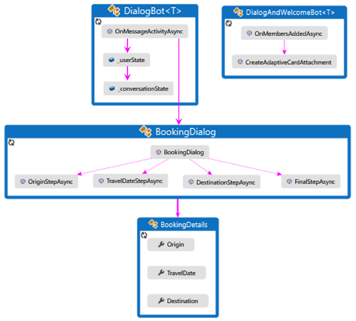
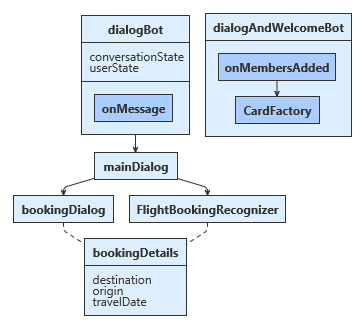
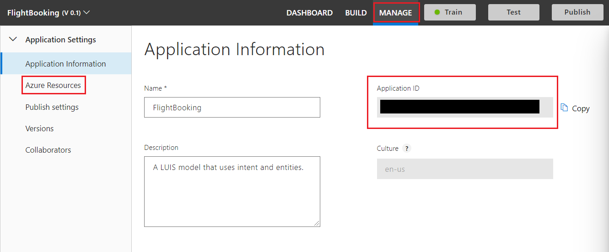
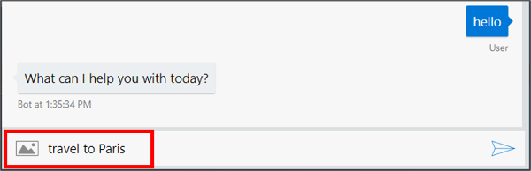
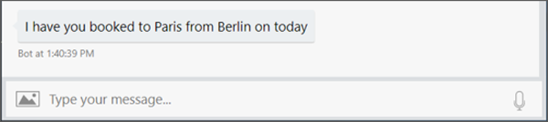

# Add natural language understanding to your bot

[!INCLUDE[applies-to](../includes/applies-to.md)]

The ability to understand what your user means conversationally and contextually can be a difficult task, but can provide your bot a more natural conversation feel. Language Understanding, called LUIS, enables you to do just that so that your bot can recognize the intent of user messages, allow for more natural language from your user, and better direct the conversation flow. This topic walks you through adding LUIS to a flight booking application to recognize different intents and entities contained within user input. 

## Prerequisites
- [LUIS](https://www.luis.ai) account
- The code in this article is based on the **Core Bot** sample. You'll need a copy of the sample in either **[CSharp](https://aka.ms/cs-core-sample) or [JavaScript](https://aka.ms/js-core-sample)**. 
- Knowledge of [bot basics](bot-builder-basics.md), [natural language processing](https://docs.microsoft.com/en-us/azure/cognitive-services/luis/what-is-luis), and [managing bot resources](bot-file-basics.md).

## About this sample

This core bot coding sample shows an example of an airport flight booking application. It uses a LUIS service to recognize the user input and return the the top recognized LUIS intent. 

# [C#](#tab/csharp)
After each processing of user input, `DialogBot` saves the current state of both `UserState` and `ConversationState`. Once all the required information has been gathered the coding sample creates a demo flight booking reservation. In this article we'll be covering the LUIS aspects of this sample. However, the general flow of the sample is shown below:

- `OnMembersAddedAsync` is called when a new user is connected and displays a welcome card. 
- `OnMessageActivityAsync` is called for each user input received. 

The `OnMessageActivityAsync` module runs the appropriate dialog through the `Run` dialog extension method. That main dialog calls the LUIS helper to find the the top scoring user intent. If the top intent for the user input returns "Book_Flight", the helper fills out information from the user that LUIS returned, and starts the `BookingDialog`, which acquires additional information as needed from the user such as

- `Origin` the originating city.
- `TravelDate` the date to book the flight. 
- `Destination` the destination city.

# [JavaScript](#tab/javascript)
After each processing of user input, `dialogBot` saves the current state of both `userState` and `conversationState`. Once all the required information has been gathered the coding sample creates a demo flight booking reservation. In this article we'll be covering the LUIS aspects of this sample. However, the general flow of the sample is shown below:

- `onMembersAdded` is called when a new user is connected and displays a welcome card. 
- `OnMessage` is called for each user input received. 

The `onMessage` module runs the `mainDialog` which sends the user input to LUIS. Upon receiving a response back from LUIS, `mainDialog` preserves information for the user returned by LUIS and starts `bookingDialog`. `bookingDialog` acquires additional information as needed from the user such as

- `destination` the destination city.
- `origin` the originating city.
- `travelDate` the date to book the flight. 

---

For details on the other aspects of the sample like dialogs or state, see [Gather user input using a dialog prompt](bot-builder-prompts.md) or [Save user and conversation data](bot-builder-howto-v4-state.md). 

## Create a LUIS app in the LUIS portal
Sign in to the LUIS portal to create your own version of the sample LUIS app. You can create and manage your applications on **My Apps**. 

1. Select **Import new app**. 
1. Click **Choose App file (JSON format)...** 
1. Select `FlightBooking.json` file located in the `CognitiveModels` folder of the sample. In the **Optional Name**, enter **FlightBooking**. This file contains three intents: 'Book Flight', 'Cancel', and 'None'. We'll use these intents to understand what the user meant when they send a message to the bot.
1. [Train](https://docs.microsoft.com/en-us/azure/cognitive-services/LUIS/luis-how-to-train) the app.
1. [Publish](https://docs.microsoft.com/en-us/azure/cognitive-services/LUIS/publishapp) the app to *production* environment.

### Why use entities
LUIS entities allow your bot to intelligently understand certain things or events that are different than the standard intents. This enables you to gather extra information from the user, which lets your bot respond more intelligently or possibly skip certain questions where it asks the user for that information. Along with definitions for the three LUIS intents 'Book Flight', 'Cancel', and 'None' the FlightBooking.json file also contains a set of entities such as 'From.Airport' and 'To.Airport'. These entities allow LUIS to detect and return additional information contained within the user's original input when they request a new travel booking.

For information on how entity information appears in a LUIS result, see [Extract data from utterance text with intents and entities](https://docs.microsoft.com/azure/cognitive-services/luis/luis-concept-data-extraction).

## Obtain values to connect to your LUIS app
Once your LUIS app is published, you can access it from your bot. You will need to record several values to access your LUIS app from within your bot. You can retrieve that information using the LUIS portal.

### Retrieve application information from the LUIS.ai portal
The settings file (`appsettings.json` or `.env`) acts as the place to bring all service references together in one place. The information you retrieve will be added to this file in the next section. 
1. Select your published LUIS app from [luis.ai](https://www.luis.ai).
1. With your published LUIS app open, select the **MANAGE** tab.

1. Select the **Application Information** tab on the left side, record the value shown for _Application ID_ as <YOUR_APP_ID>.
1. Select the **Keys and Endpoints** tab on the left side, record the value shown for _Authoring Key_ as <YOUR_AUTHORING_KEY>.
1. Scroll down to the end of the page, record the value shown for _Region_ as <YOUR_REGION>.

### Update the settings file

# [C#](#tab/csharp)

Add the information required to access your LUIS app including application id, authoring key, and region into the `appsettings.json` file. These are the values you saved previously from your published LUIS app. Note that the API host name should be in the format `<your region>.api.cognitive.microsoft.com`.

**appsetting.json**  
[!code-json[appsettings](~/../botbuilder-samples/samples/csharp_dotnetcore/13.core-bot/appsettings.json?range=1-7)]

# [JavaScript](#tab/javascript)

Add the information required to access your LUIS app including application id, authoring key, and region into the `.env` file. These are the values you saved previously from your published LUIS app. Note that the API host name should be in the format `<your region>.api.cognitive.microsoft.com`.

**.env**  
[!code[env](~/../botbuilder-samples/samples/javascript_nodejs/13.core-bot/.env?range=1-5)]

---

## Configure your bot to use your LUIS app

# [C#](#tab/csharp)

Be sure that the **Microsoft.Bot.Builder.AI.Luis** NuGet package is installed for your project.

To connect to the LUIS service, the bot pulls the information you added above from the appsetting.json file. The `LuisHelper` class contains code that imports your settings from the appsetting.json file and queries the LUIS service by calling `RecognizeAsync` method. If the top intent returned is 'Book_Flight' it then checks for entities containing the booking To, From, and TravelDate information.

**LuisHelper.cs**  
[!code-csharp[luis helper](~/../botbuilder-samples/samples/csharp_dotnetcore/13.core-bot/LuisHelper.cs?range=15-54)]

# [JavaScript](#tab/javascript)

To use LUIS, your project needs to install the **botbuilder-ai** npm package.

To connect to the LUIS service, the bot pulls the information you added above from the `.env` file. The `LuisHelper` class contains code that imports your settings from the `.env` file and queries the LUIS service by calling `recognize()` method. If the top intent returned is 'Book_Flight' it then checks for entities containing the booking To, From, and TravelDate information.

[!code-javascript[luis helper](~/../botbuilder-samples/samples/javascript_nodejs/13.core-bot/dialogs/luisHelper.js?range=6-65)]

---

LUIS is now configured and connected for your bot. 

## Test the bot

Download and install the latest [Bot Framework Emulator](https://aka.ms/bot-framework-emulator-readme)

1. Run the sample locally on your machine. If you need instructions, refer to the readme file for either the [C# Sample](https://aka.ms/cs-core-sample) or [JS Sample](https://aka.ms/js-core-sample).

1. In the emulator, type a message such as "travel to paris" or "going from paris to berlin". Use any utterance found in the file FlightBooking.json for training the intent "Book flight".

If the top intent returned from LUIS resolves to "Book flight" your bot will ask additional questions until it has enough information stored to create a travel booking. At that point it will return this booking information back to your user. 

At this point the code bot logic will reset and you can continue to create additional bookings. 

## Next steps

> [!div class="nextstepaction"]
> [Use QnA Maker to answer questions](./bot-builder-howto-qna.md)
