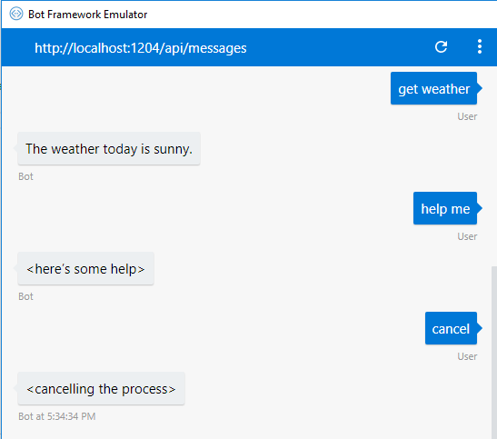

# Using LUIS for Language Understanding

[!INCLUDE [pre-release-label](../includes/pre-release-label.md)]

The ability to understand what your user means conversationally and contextually can be a difficult task, but can give your bot a more natural conversation feel. Language Understanding, called LUIS, enables you to do just that so that your bot can recognize the intent of user messages, allow for more natural language from your user, and better direct the conversation flow. If you need more background on how LUIS integrates with a bot, see [language understanding for bots](./bot-builder-concept-LUIS.md). 

This topic walks you through setting up simple bots that use LUIS to recognize a few different intents.

## Installing Packages

First, make sure you have the packages necessary for LUIS.

# [C#](#tab/cs)

[Add a reference](https://docs.microsoft.com/en-us/nuget/tools/package-manager-ui) to v4 version of the following NuGet packages:


* `Microsoft.Bot.Builder.AI.LUIS`

# [JavaScript](#tab/js)

Install the botbuilder and botbuilder-ai packages in your project using npm:

* `npm install --save botbuilder`
* `npm install --save botbuilder-ai`

---

## Set up your LUIS app

First, set up a _LUIS app_, which is a service you create at [luis.ai](https://www.luis.ai). That LUIS app can be trained for certain intents it should be able to recognize. Details on how to create your LUIS app can be found on the LUIS site.

For this example, you'll just use a demo LUIS app that can recognize Help, Cancel, and Weather intents; the app ID is already in the sample code. You will need to have a Cognitive Services key that you can get by logging in to [luis.ai](https://www.luis.ai) and copying the key from **User settings** > **Authoring Key**.

> [!NOTE] 
> To create your own copy of the public LUIS app used in this example, copy the [JSON](https://github.com/Microsoft/LUIS-Samples/blob/master/examples/simple-bot-example/FirstSimpleBotExample.json) LUIS file. Then [import](https://docs.microsoft.com/en-us/azure/cognitive-services/luis/create-new-app#import-new-app) the LUIS app, [train](https://docs.microsoft.com/en-us/azure/cognitive-services/LUIS/luis-how-to-train), and [publish](https://docs.microsoft.com/en-us/azure/cognitive-services/LUIS/publishapp) it. Replace the public app ID in the sample code with the app ID of your new LUIS app.


### Configure your bot to call your LUIS app.

# [C#](#tab/cs)

While it's possible to both create and call your LUIS app on every turn, it's better coding practice to register your LUIS service as a singleton and then pass them as parameters to your bot's constructor. We'll show that method here as it's slightly more complicated.

Start with the Echo bot template, and open **Startup.cs**. 

Add a `using` statement for `Microsoft.Bot.Builder.AI.LUIS`

```csharp
// add this
using Microsoft.Bot.Builder.AI.LUIS;
```

Add the following code at the end of `ConfigureServices`, after the state initialization. This grabs the information from the `appsettings.json` file, but those strings can be grabbed from your `.bot` file, like the sample linked at the end of this article, or hard coded for testing.

The singleton returns a new `LuisRecognizer` to the constructor.

```csharp
    // Create and register a LUIS recognizer.
    services.AddSingleton(sp =>
    {
        // Get LUIS information from appsettings.json.
        var section = this.Configuration.GetSection("Luis");
        var luisApp = new LuisApplication(
            applicationId: section["AppId"],
            endpointKey: section["SubscriptionKey"],
            azureRegion: section["Region"]);

        // Specify LUIS options. These may vary for your bot.
        var luisPredictionOptions = new LuisPredictionOptions
        {
            IncludeAllIntents = true,
        };

        return new LuisRecognizer(
            application: luisApp,
            predictionOptions: luisPredictionOptions,
            includeApiResults: true);
    });
```

Paste in your subscription key from [luis.ai](https://www.luis.ai) in place of `<subscriptionKey>`. This is most readily found if you click on your account name on the top right, and go to **Settings**, where it is called your **Authoring Key**.

> [!NOTE] 
> If you're using your own LUIS app instead of the public one, you can get the ID, subscription key, and URL for your LUIS app from [luis.ai](https://www.luis.ai). These can be found under **Publish** and **Settings** tabs on your app's page.
>
>You can find the base URL to use in your `LuisModel` by logging into the [luis.ai](https://www.luis.ai), going to the **Publish** tab, and looking at the **Endpoint** column under **Resources and Keys**. The base URL is the portion of the **Endpoint URL** before the subscription ID and other parameters.

Next, we need to give your bot this LUIS instance. Open up **EchoBot.cs**, and at the top of the file add the following code. For your reference the class heading and state items are also included, but we won't explain them here.

```csharp
public class EchoBot : IBot
{
    /// <summary>
    /// Gets the Echo Bot state.
    /// </summary>
    private IStatePropertyAccessor<EchoState> EchoStateAccessor { get; }

    /// <summary>
    /// Gets the LUIS recognizer.
    /// </summary>
    private LuisRecognizer Recognizer { get; } = null;

    public EchoBot(ConversationState state, LuisRecognizer luis)
    {
        EchoStateAccessor = state.CreateProperty<EchoState>("EchoBot.EchoState");

        // The incoming luis variable is the LUIS Recognizer we added above.
        this.Recognizer = luis ?? throw new ArgumentNullException(nameof(luis));
    }

    /// ...
```

# [JavaScript](#tab/js)

First follow the steps in JavaScript [quickstart](../javascript/bot-builder-javascript-quickstart.md) to create a bot. Here we are hardcoding our LUIS information into our bot, but it can be pulled from the `.bot` file as is done in the sample linked at the end of this article.

In the new bot, edit **app.js** to require the [LuisRecognizer](https://github.com/Microsoft/botbuilder-js/tree/master/doc/botbuilder-ai/classes/botbuilder_ai.luisrecognizer.md) class and create an instance for your LUIS model:

```javascript
const { ActivityTypes } = require('botbuilder');
const { LuisRecognizer } = require('botbuilder-ai');

const luisApplication = {
    // This appID is for a public app that's made available for demo purposes
    // You can use it or use your own LUIS "Application ID" at https://www.luis.ai under "App Settings".
     applicationId: 'eb0bf5e0-b468-421b-9375-fdfb644c512e',
    // Replace endpointKey with your "Subscription Key"
    // your key is at https://www.luis.ai under Publish > Resources and Keys, look in the Endpoint column
    // The "subscription-key" is embeded in the Endpoint link. 
    endpointKey: '<your subscription key>',
    // You can find your app's region info embeded in the Endpoint link as well.
    // Some examples of regions are `westus`, `westcentralus`, `eastus2`, and `southeastasia`.
    azureRegion: 'westus'
}

// Create configuration for LuisRecognizer's runtime behavior.
const luisPredictionOptions = {
    includeAllIntents: true,
    log: true,
    staging: false
}

// Create the bot that handles incoming Activities.
const luisBot = new LuisBot(luisApplication, luisPredictionOptions);
```

Then, in the constructor of your bot `LuisBot`, get the application to create the LuisRecognizer instance.

```javascript
    /**
     * The LuisBot constructor requires one argument (`application`) which is used to create an instance of `LuisRecognizer`.
     * @param {object} luisApplication The basic configuration needed to call LUIS. In this sample the configuration is retrieved from the .bot file.
     * @param {object} luisPredictionOptions (Optional) Contains additional settings for configuring calls to LUIS.
     */
    constructor(application, luisPredictionOptions) {
        this.luisRecognizer = new LuisRecognizer(application, luisPredictionOptions, true);
    }
```

> [!NOTE] 
> If you're using your own LUIS app instead of the public one, you can get the application ID, subscription key, and region for your LUIS app from [https://www.luis.ai](https://www.luis.ai). These can be found under Publish and Settings tabs on your app's page.

---

LUIS language understanding is now configured for your bot. Next, let's look at how to get the intent from LUIS.

## Get the intent by calling LUIS

Your bot gets results from LUIS by calling the LUIS recognizer.

# [C#](#tab/cs)

To have your bot simply send a reply based on the intent that the LUIS app detected, call the the [LuisRecognizer](https://docs.microsoft.com/en-us/dotnet/api/microsoft.bot.builder.ai.luis.luisrecognizer), to get a [RecognizerResult](https://docs.microsoft.com/en-us/dotnet/api/microsoft.bot.builder.core.extensions.recognizerresult). This can be done within your code whenever you need to get the LUIS intent.

```cs
using System.Threading.Tasks;
using Microsoft.Bot;
using Microsoft.Bot.Builder;
using Microsoft.Bot.Builder.Core.Extensions;
using Microsoft.Bot.Schema;
// add this reference
using Microsoft.Bot.Builder.AI.LUIS;

namespace EchoBot
{
    public class EchoBot : IBot
    {
        /// <summary>
        /// Echo bot turn handler 
        /// </summary>
        /// <param name="context">Turn scoped context containing all the data needed
        /// for processing this conversation turn. </param>        
        public async Task OnTurnAsync(ITurnContext context, System.Threading.CancellationToken token)
        {            
            // This bot is only handling Messages
            if (context.Activity.Type == ActivityTypes.Message)
            {
                // Call LUIS recognizer
                var result = this.Recognizer.RecognizeAsync(context, System.Threading.CancellationToken.None);
                
                var topIntent = result?.GetTopScoringIntent();

                switch ((topIntent != null) ? topIntent.Value.intent : null)
                {
                    case null:
                        await context.SendActivity("Failed to get results from LUIS.");
                        break;
                    case "None":
                        await context.SendActivity("Sorry, I don't understand.");
                        break;
                    case "Help":
                        await context.SendActivity("<here's some help>");
                        break;
                    case "Cancel":
                        // Cancel the process.
                        await context.SendActivity("<cancelling the process>");
                        break;
                    case "Weather":
                        // Report the weather.
                        await context.SendActivity("The weather today is sunny.");
                        break;
                    default:
                        // Received an intent we didn't expect, so send its name and score.
                        await context.SendActivity($"Intent: {topIntent.Value.intent} ({topIntent.Value.score}).");
                        break;
                }
            }
        }
    }    
}

```

Any intents recognized in the utterance will be returned as a map of intent names to scores and can be accessed from `result.Intents`. A static `LuisRecognizer.topIntent()` method is provided to help simplify finding the top scoring intent for a result set.

Any entities recognized will be returned as a map of entity names to values and accessed using `results.entities`. Additional entity metadata can be returned by passing a `verbose=true` setting when creating the LuisRecognizer. The added metadata can then be accessed using `results.entities.$instance`.

# [JavaScript](#tab/js)

Edit the code for listening to incoming activity, so that it calls [LuisRecognizer](https://docs.microsoft.com/en-us/javascript/api/botbuilder-ai/luisrecognizer) to get a [RecognizerResult](https://docs.microsoft.com/en-us/javascript/api/botbuilder-core-extensions/recognizerresult).

```javascript
const { ActivityTypes } = require('botbuilder');
const { LuisRecognizer } = require('botbuilder-ai');

// Listen for incoming requests 
server.post('/api/messages', (req, res) => {
    // Route received request to adapter for processing
    adapter.processActivity(req, res, async (context) => {
        if (context.activity.type === 'message') {
            // Perform a call to LUIS to retrieve results for the user's message.
            const results = await this.luisRecognizer.recognize(turnContext);

            // Since the LuisRecognizer was configured to include the raw results, get the `topScoringIntent` as specified by LUIS.
            const topIntent = results.luisResult.topScoringIntent;
            
            switch (topIntent) {
                case 'None':
                    await context.sendActivity("Sorry, I don't understand.")
                    break;
                case 'Cancel':
                    await context.sendActivity("<cancelling the process>")
                    break;
                case 'Help':
                    await context.sendActivity("<here's some help>");
                    break;
                case 'Weather':
                    await context.sendActivity("The weather today is sunny.");
                    break;                        
                case 'null':
                    await context.sendActivity("Failed to get results from LUIS.")
                    break;
                default:
                    // Received an intent we didn't expect, so send its name and score.
                    await context.sendActivity(`The top intent was ${topIntent}`);
            }
        }
    });
});
```

Any intents recognized in the utterance will be returned as a map of intent names to scores and can be accessed from `results.intents`. A static `LuisRecognizer.topIntent()` method is provided to help simplify finding the top scoring intent for a result set.


---

Try running the bot in the Bot Framework Emulator, and say things like "weather", "help", and "cancel" to it.



## Extract entities

Besides recognizing intent, a LUIS app can also extract entities, which are important words for fulfilling a user's request. For example, for a weather bot, the LUIS app might be able to extract the location for the weather report from the user's message. 

A common way to structure your conversation is to identify any entities in the user's message, and prompt for any of the required entities that are not found. Then, the subsequent steps handle the response to the prompt.

# [C#](#tab/cs)

Let's say the message from the user was "What's the weather in Seattle"? The [LuisRecognizer](https://docs.microsoft.com/en-us/dotnet/api/microsoft.bot.builder.ai.luis.luisrecognizer) gives you a [RecognizerResult](https://docs.microsoft.com/en-us/dotnet/api/microsoft.bot.builder.core.extensions.recognizerresult) with an [`Entities` property](https://docs.microsoft.com/en-us/dotnet/api/microsoft.bot.builder.core.extensions.recognizerresult#properties-) that has this structure:

```json
{
"$instance": {
    "Weather_Location": [
        {
            "startIndex": 22,
            "endIndex": 29,
            "text": "seattle",
            "score": 0.8073087
        }
    ]
},
"Weather_Location": [
        "seattle"
    ]
}
```

The following helper function can be added to your bot to get entities out of the `RecognizerResult` from LUIS. It will require the use of the `Newtonsoft.Json.Linq` library, which you'll have to add to your **using** statements.

```cs
// Get entities from LUIS result
private T GetEntity<T>(RecognizerResult luisResult, string entityKey)
{
    var data = luisResult.Entities as IDictionary<string, JToken>;
    if (data.TryGetValue(entityKey, out JToken value))
    {
        return value.First.Value<T>();
    }
    return default(T);
}
```

When gathering information like entities from multiple steps in a conversation, it can be helpful to save the information you need in your state. If an entity is found, it can be added to the appropriate state field. In your conversation if the current step already has the associated field completed, the step to prompt for that information can be skipped.

# [JavaScript](#tab/js)

Let's say the message from the user was "What's the weather in Seattle"? The [LuisRecognizer](https://docs.microsoft.com/en-us/javascript/api/botbuilder-ai/luisrecognizer) gives you a [RecognizerResult](https://docs.microsoft.com/en-us/javascript/api/botbuilder-core-extensions/recognizerresult) with an `entities` property that has this structure:

```json
{
"$instance": {
    "Weather_Location": [
        {
            "startIndex": 22,
            "endIndex": 29,
            "text": "seattle",
            "score": 0.8073087
        }
    ]
},
"Weather_Location": [
        "seattle"
    ]
}
```

This `findEntities` function looks for any entities recognized by the LUIS app that match the incoming `entityName`.


```javascript
// Helper function for finding a specified entity
// entityResults are the results from LuisRecognizer.get(context)
function findEntities(entityName, entityResults) {
    let entities = []
    if (entityName in entityResults) {
        entityResults[entityName].forEach(entity => {
            entities.push(entity);
        });
    }
    return entities.length > 0 ? entities : undefined;
}
```

When gathering information like entities from multiple steps in a conversation, it can be helpful to save the information you need in your state. If an entity is found, it can be added to the appropriate state field. In your conversation if the current step already has the associated field completed, the step to prompt for that information can be skipped.

## Additional resources
For a sample using LUIS, check out the projects for [[C#](https://aka.ms/cs-luis-sample)] or [[JavaScript](https://aka.ms/js-luis-sample)].

## Next steps

> [!div class="nextstepaction"]
> [Combine LUIS and QnA services using the Dispatch tool](./bot-builder-tutorial-dispatch.md)
