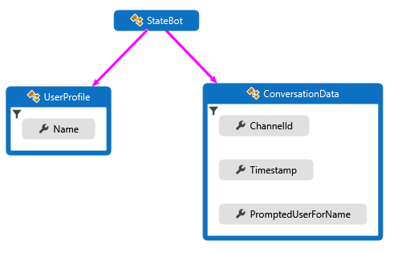
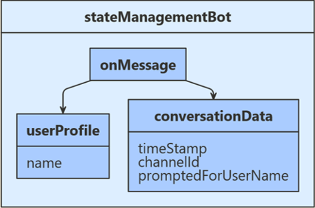
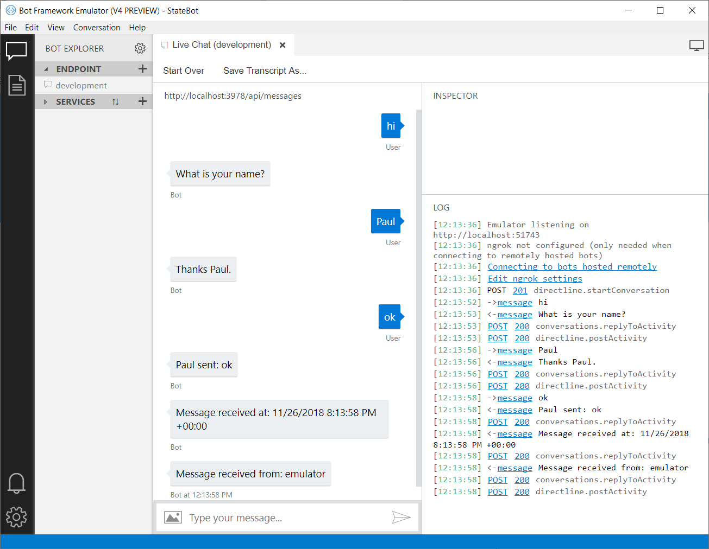

# Save user and conversation data

[!INCLUDE[applies-to](../includes/applies-to.md)]

A bot is inherently stateless. Once your bot is deployed, it may not run in the same process or on the same machine from one turn to the next. However, your bot may need to track the context of a conversation so that it can manage its behavior and remember answers to previous questions. The state and storage features of the Bot Framework SDK allow you to add state to your bot. Bots use state management and storage objects to manage and persist state. The state manager provides an abstraction layer that lets you access state properties using property accessors, independent of the type of underlying storage.

## Prerequisites
- Knowledge of [bot basics](bot-builder-basics.md) and how bots [manage state](bot-builder-concept-state.md) is required.
- The code in this article is based on the **State Management Bot sample**. You'll need a copy of the sample in either [CSharp](https://aka.ms/statebot-sample-cs) or [JavaScript](https://aka.ms/statebot-sample-js).

## About this sample
Upon receiving user input, this sample checks the stored conversation state to see if this user has previously been prompted to provide their name. If not, the user's name is requested and that input is stored within user state. If so, the name stored within user state is used to converse with the user and their input data, along with the time received and input channel Id, is returned back to the user. The time and channel Id values are retrieved from the user conversation data and then saved to conversation state. The following diagram shows the relationship between the bot, user profile, and conversation data classes.

## [C#](#tab/csharp)

## [JavaScript](#tab/javascript)

---

## Define classes

## [C#](#tab/csharp)

The first step in setting up state management is to define the classes that will contain all the information that we want to manage in user and conversation state. For this sample, we've defined the following:

- In **UserProfile.cs**, we define a `UserProfile` class for the user information that the bot will collect. 
- In **ConversationData.cs**, we define a `ConversationData` class to control our conversation state while gathering user information.

The following code example shows creation of the definition for the UserProfile class.

**UserProfile.cs**  
[!code-csharp[UserProfile](~/../BotBuilder-Samples/samples/csharp_dotnetcore/45.state-management/UserProfile.cs?range=7-11)]

## [JavaScript](#tab/javascript)

The first step is requiring the botbuilder service that includes definitions for `UserState` and `ConversationState`.

**index.js**  
[!code-javascript[BotService](~/../BotBuilder-Samples/samples/javascript_nodejs/45.state-management/index.js?range=7-9)]

---

## Create conversation and user state objects

## [C#](#tab/csharp)

Next, we register `MemoryStorage` that is used to create `UserState` and `ConversationState` objects. The user and conversation state objects are created at `Startup` and dependency injected into the bot constructor. Other services for a bot that are registered are: a credential provider, an adapter, and the bot implementation.

**Startup.cs**  
[!code-csharp[ConfigureServices](~/../BotBuilder-Samples/samples/csharp_dotnetcore/45.state-management/Startup.cs?range=16-38)]

**StateManagementBot.cs**  
[!code-csharp[StateManagement](~/../BotBuilder-Samples/samples/csharp_dotnetcore/45.state-management/bots/StateManagementBot.cs?range=15-22)]

## [JavaScript](#tab/javascript)

Next, we register `MemoryStorage` that is then used to create `UserState` and `ConversationState` objects.

**index.js**  
[!code-javascript[DefineMemoryStore](~/../BotBuilder-Samples/samples/javascript_nodejs/45.state-management/index.js?range=32-38)]

---

## Add state property accessors

## [C#](#tab/csharp)

Now we create property accessors using the `CreateProperty` method that provides a handle to the `BotState` object. Each state property accessor allows you to get or set the value of the associated state property. Before we use our state properties, we use each accessor to load the property from storage and get it from the state cache. To get the properly scoped key associated with the state property, we call the `GetAsync` method.

**StateManagementBot.cs**  
[!code-csharp[StateAccessors](~/../BotBuilder-Samples/samples/csharp_dotnetcore/45.state-management/bots/StateManagementBot.cs?range=38-46)]

## [JavaScript](#tab/javascript)

Now we create property accessors for `UserState` and `ConversationState`. Each state property accessor allows you to get or set the value of the associated state property. We use each accessor to load the associated property from storage and retrieve its' current state from cache.

**StateManagementBot.js**.  
[!code-javascript[BotService](~/../BotBuilder-Samples/samples/javascript_nodejs/45.state-management/bots/stateManagementBot.js?range=6-19)]

---

## Access state from your bot
The preceding section covers the initialization-time steps to add state property accessors to our bot. Now, we can use those accessors at run-time to read and write state information. The sample code below uses the following logic flow:
- If userProfile.Name is empty and conversationData.PromptedUserForName is _true_, we retrieve the user name provided and store this within user state.
- If userProfile.Name is empty and conversationData.PromptedUserForName is _false_, we ask for the user's name.
- If userProfile.Name was previously stored, we retrieve message time and channel Id from the user input, echo all data back to the user, and store the retrieved data within conversation state .

## [C#](#tab/csharp)

**StateManagementBot.cs**  
[!code-csharp[OnMessageActivityAsync](~/../BotBuilder-Samples/samples/csharp_dotnetcore/45.state-management/bots/StateManagementBot.cs?range=38-85)]

Before we exit the turn handler, we use the state management objects' _SaveChangesAsync()_ method to write all state changes back to storage.

**StateManagementBot.cs**  
[!code-csharp[OnTurnAsync](~/../BotBuilder-Samples/samples/csharp_dotnetcore/45.state-management/bots/StateManagementBot.cs?range=24-31)]

## [JavaScript](#tab/javascript)

**StateManagementBot.js**  
[!code-javascript[OnMessage](~/../BotBuilder-Samples/samples/javascript_nodejs/45.state-management/bots/stateManagementBot.js?range=21-54)]

Before we exit each dialog turn, we use the state management objects' _saveChanges()_ method to persist all changes by writing state back out to storage.

**StateManagementBot.js**  
[!code-javascript[OnDialog](~/../BotBuilder-Samples/samples/javascript_nodejs/45.state-management/bots/stateManagementBot.js?range=60-67)]

---

## Test the bot

Download and install the latest [Bot Framework Emulator](https://aka.ms/bot-framework-emulator-readme)

1. Run the sample locally on your machine. If you need instructions, refer to the README file for [C# Sample](https://aka.ms/statebot-sample-cs) or [JS Sample](https://aka.ms/statebot-sample-js).
1. Use the emulator to test the bot as shown below.

## Additional resources

**Privacy:** If you intend to store user's personal data, you should ensure compliance with [General Data Protection Regulation](https://blog.botframework.com/2018/04/23/general-data-protection-regulation-gdpr).

**State management:** All of the state management calls are asynchronous, and last-writer-wins by default. In practice, you should get, set, and save state as close together in your bot as possible.

**Critical business data:** Use bot state to store preferences, user name, or the last thing they ordered, but do not use it to store critical business data. For critical data, [create your own storage components](bot-builder-custom-storage.md) or write directly to [storage](bot-builder-howto-v4-storage.md).

**Recognizer-Text:** The sample uses the Microsoft/Recognizers-Text libraries to parse and validate user input. For more information, see the [overview](https://github.com/Microsoft/Recognizers-Text#microsoft-recognizers-text-overview) page.

## Next steps

Now that you know how to configure state to help you read and write bot data to storage, let's learn how ask the user a series of questions, validate their answers, and save their input.

> [!div class="nextstepaction"]
> [Create your own prompts to gather user input](bot-builder-primitive-prompts.md).
