# Write directly to storage

[!INCLUDE[applies-to](../includes/applies-to.md)]

You can read and write directly to your storage object without using middleware or context object. This can be appropriate for data  your bot uses to preserve a conversation, or data that comes from a source outside your bot's conversation flow. In this data storage model, data is read it directly from storage instead of using a state manager. The code examples in this article show you how to read and write data to storage using **Memory Storage**, **Cosmos DB**, **Blob Storage**, and **Azure Blob Transcript Store**. 

## Prerequisites
- If you don't have an Azure subscription, create a [free](https://azure.microsoft.com/free/) account before you begin.
- Familiarity with article: Create a bot locally for [dotnet](https://aka.ms/bot-framework-www-c-sharp-quickstart) or [nodeJS](https://aka.ms/bot-framework-www-node-js-quickstart).
- Bot Framework SDK v4 template for [C# template](https://aka.ms/bot-vsix) or [nodeJS](https://nodejs.org) and [yeoman](http://yeoman.io).

## About this sample
The sample code in this article begins with the structure of a basic echo bot, then extends that bot's functionality by adding additional code (provided below). This extended code creates a list to preserve user inputs as they are received. Each turn, the full list of user inputs is echoed back to the user. The data structure containing this list of inputs is then saved to storage at the end of that turn. Various types of storage are explored as additional funtionality is added to this sample code.

## Memory storage

The Bot Framework SDK allows you to store user inputs using in-memory storage. Memory storage is used for testing purposes only and is not intended for production use. Persistent storage types, such as database storage, are best for production bots. Be sure to set storage to Cosmos DB or Blob Storage before publishing your bot.

#### Build a basic bot

The rest of this topic builds off of an Echo bot. The Echo bot sample code can be locally built by following the Quickstart instructions for building either a [C# EchoBot](https://aka.ms/bot-framework-www-c-sharp-quickstart) or a [JS EchoBot](https://aka.ms/bot-framework-www-node-js-quickstart).

### [C#](#tab/csharp)

**EchoBot.cs**
```csharp
using System;
using System.Threading.Tasks;
using Microsoft.Bot.Builder;
using Microsoft.Bot.Schema;
using System.Collections.Generic;
using System.Linq;
using System.Threading;

// Represents a bot saves and echoes back user input.
public class EchoBot : ActivityHandler
{
   // Create local Memory Storage.
   private static readonly MemoryStorage _myStorage = new MemoryStorage();

   // Create cancellation token (used by Async Write operation).
   public CancellationToken cancellationToken { get; private set; }

   // Class for storing a log of utterances (text of messages) as a list.
   public class UtteranceLog : IStoreItem
   {
      // A list of things that users have said to the bot
      public List<string> UtteranceList { get; } = new List<string>();

      // The number of conversational turns that have occurred        
      public int TurnNumber { get; set; } = 0;

      // Create concurrency control where this is used.
      public string ETag { get; set; } = "*";
   }
     
   // Echo back user input.
   protected override async Task OnMessageActivityAsync(ITurnContext<IMessageActivity> turnContext, CancellationToken cancellationToken)
   {
      // preserve user input.
      var utterance = turnContext.Activity.Text;  
      // make empty local logitems list.
      UtteranceLog logItems = null;
          
      // see if there are previous messages saved in storage.
      try
      {
         string[] utteranceList = { "UtteranceLog" };
         logItems = _myStorage.ReadAsync<UtteranceLog>(utteranceList).Result?.FirstOrDefault().Value;
      }
      catch
      {
         // Inform the user an error occured.
         await turnContext.SendActivityAsync("Sorry, something went wrong reading your stored messages!");
      }
         
      // If no stored messages were found, create and store a new entry.
      if (logItems is null)
      {
         // add the current utterance to a new object.
         logItems = new UtteranceLog();
         logItems.UtteranceList.Add(utterance);
         // set initial turn counter to 1.
         logItems.TurnNumber++;

         // Show user new user message.
         await turnContext.SendActivityAsync($"{logItems.TurnNumber}: The list is now: {string.Join(", ", logItems.UtteranceList)}");

         // Create Dictionary object to hold received user messages.
         var changes = new Dictionary<string, object>();
         {
            changes.Add("UtteranceLog", logItems);
         }
         try
         {
            // Save the user message to your Storage.
            await _myStorage.WriteAsync(changes, cancellationToken);
         }
         catch
         {
            // Inform the user an error occured.
            await turnContext.SendActivityAsync("Sorry, something went wrong storing your message!");
         }
      }
      // Else, our Storage already contained saved user messages, add new one to the list.
      else
      {
         // add new message to list of messages to display.
         logItems.UtteranceList.Add(utterance);
         // increment turn counter.
         logItems.TurnNumber++;
         
         // show user new list of saved messages.
         await turnContext.SendActivityAsync($"{logItems.TurnNumber}: The list is now: {string.Join(", ", logItems.UtteranceList)}");
         
         // Create Dictionary object to hold new list of messages.
         var changes = new Dictionary<string, object>();
         {
            changes.Add("UtteranceLog", logItems);
         };
         
         try
         {
            // Save new list to your Storage.
            await _myStorage.WriteAsync(changes,cancellationToken);
         }
         catch
         {
            // Inform the user an error occured.
            await turnContext.SendActivityAsync("Sorry, something went wrong storing your message!");
         }
      }
      ...  // OnMessageActivityAsync( )
   }
}

```

### [JavaScript](#tab/javascript)

To use the .env configuration file, your bot needs an extra package included. If not already installed, get the dotnet package from npm:

```powershell
npm install --save dotenv
```

**bot.js**
```javascript
const { ActivityHandler, MemoryStorage } = require('botbuilder');
const restify = require('restify');

// Add memory storage.
var storage = new MemoryStorage();

// Process incoming requests - adds storage for messages.
class MyBot extends ActivityHandler {
    constructor() {
        super();
        // See https://aka.ms/about-bot-activity-message to learn more about the message and other activity types.
        this.onMessage(async turnContext => { console.log('this gets called (message)'); 
        await turnContext.sendActivity(`You said '${ turnContext.activity.text }'`); 
        // Save updated utterance inputs.
        await logMessageText(storage, turnContext);
    });
        this.onConversationUpdate(async turnContext => { console.log('this gets called (conversation update)'); 
        await turnContext.sendActivity('[conversationUpdate event detected]'); });
    }
}

// This function stores new user messages. Creates new utterance log if none exists.
async function logMessageText(storage, turnContext) {
    let utterance = turnContext.activity.text;
    // debugger;
    try {
        // Read from the storage.
        let storeItems = await storage.read(["UtteranceLogJS"])
        // Check the result.
        var UtteranceLogJS = storeItems["UtteranceLogJS"];
        if (typeof (UtteranceLogJS) != 'undefined') {
            // The log exists so we can write to it.
            storeItems["UtteranceLogJS"].turnNumber++;
            storeItems["UtteranceLogJS"].UtteranceList.push(utterance);
            // Gather info for user message.
            var storedString = storeItems.UtteranceLogJS.UtteranceList.toString();
            var numStored = storeItems.UtteranceLogJS.turnNumber;

            try {
                await storage.write(storeItems)
                turnContext.sendActivity(`${numStored}: The list is now: ${storedString}`);
            } catch (err) {
                turnContext.sendActivity(`Write failed of UtteranceLogJS: ${err}`);
            }
        }
        else{
            turnContext.sendActivity(`Creating and saving new utterance log`);
            var turnNumber = 1;
            storeItems["UtteranceLogJS"] = { UtteranceList: [`${utterance}`], "eTag": "*", turnNumber }
            // Gather info for user message.
            var storedString = storeItems.UtteranceLogJS.UtteranceList.toString();
            var numStored = storeItems.UtteranceLogJS.turnNumber;

            try {
                await storage.write(storeItems)
                turnContext.sendActivity(`${numStored}: The list is now: ${storedString}`);
            } catch (err) {
                turnContext.sendActivity(`Write failed: ${err}`);
            }
        }
    }
    catch (err){
        turnContext.sendActivity(`Read rejected. ${err}`);
    }
}

module.exports.MyBot = MyBot;

```
---

### Start your bot
Run your bot locally.

### Start the emulator and connect your bot
- Install the Bot Framework [Emulator](https://aka.ms/bot-framework-emulator-readme)
Next, start the emulator and then connect to your bot in the emulator:

1. Click the **Create new bot configuration** link in the emulator "Welcome" tab. 
2. Fill in fields to connect to your bot, given the information on the webpage displayed when you started your bot.

### Interact with your bot
Send a message to your bot. The bot will list the messages it has received.

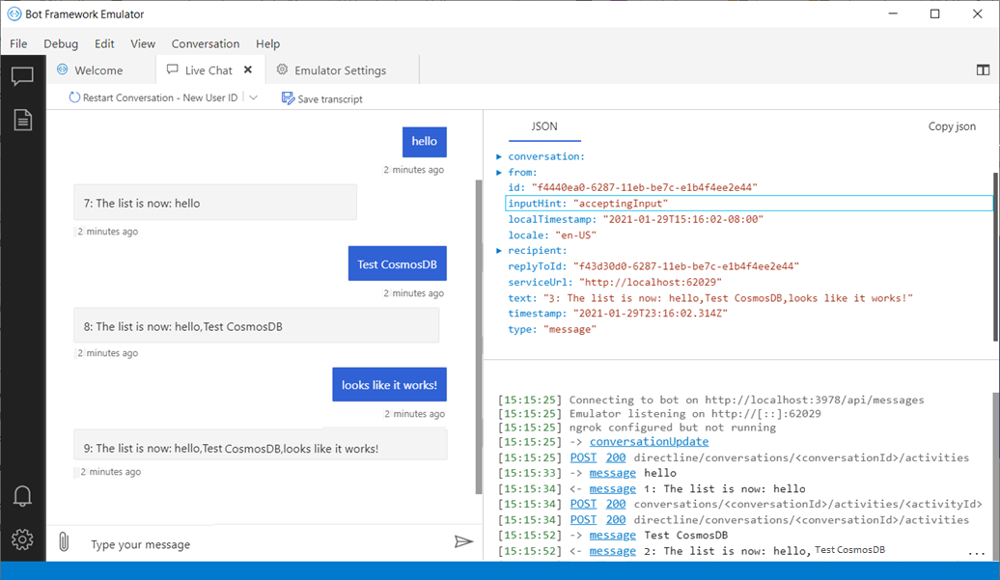

## Using Cosmos DB
Now that you've used memory storage, we'll update the code to use Azure Cosmos DB. Cosmos DB is Microsoft's globally distributed, multi-model database. Azure Cosmos DB enables you to elastically and independently scale throughput and storage across any number of Azure's geographic regions. It offers throughput, latency, availability, and consistency guarantees with comprehensive service level agreements (SLAs). 

### Set up
To use Cosmos DB in your bot, you'll need to get a few things set up before getting into the code. For an in-depth description of Cosmos DB database and app creation access the documentation here for [Cosmos DB dotnet](https://aka.ms/Bot-framework-create-dotnet-cosmosdb) or [Cosmos DB nodejs](https://aka.ms/Bot-framework-create-nodejs-cosmosdb).

### Create your database account

1. In a new browser window, sign in to the [Azure portal](http://portal.azure.com).

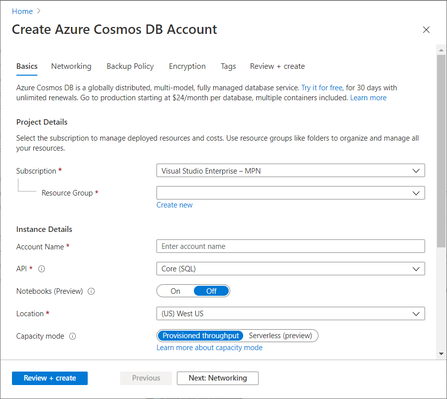

2. Click **Create a resource > Databases > Azure Cosmos DB**

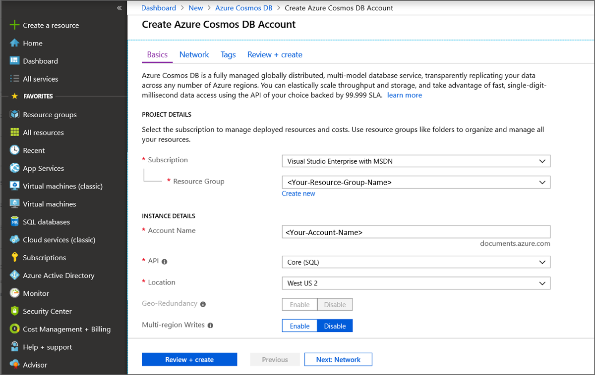

3. On the **New account page**, provide **Subscription**, **Resource group** information. Create a unique name for your **Account Name** field - this eventually becomes part of your data access URL name. For **API**, select **Core(SQL)**, and provide a nearby **Location** to improve data access times.
4. Then click **Review + Create**.
5. Once validation has been successful, click **Create**.

The account creation takes a few minutes. Wait for the portal to display the Congratulations! Your Azure Cosmos DB account was created page.

### Add a collection

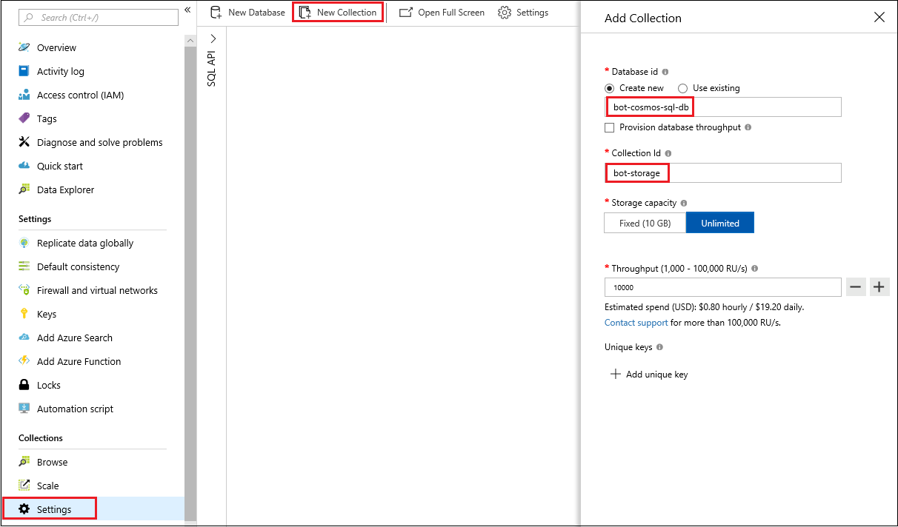

1. Click **Settings > New Collection**. The **Add Collection** area is displayed on the far right, you may need to scroll right to see it. Due to recent updates to Cosmos DB, be sure to add a single Partition key: _/id_. This key will avoid cross partition query errors.

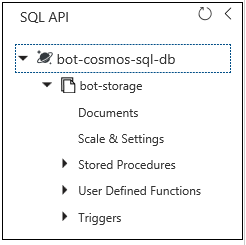

2. Your new database collection, "bot-cosmos-sql-db" with a collection id of "bot-storage." We will use these values in our coding example that follows below.


3. The endpoint URI and key are available within the **Keys** tab of your database settings. These values will be needed to configure your code further down in this article. 

### Add configuration information
Our configuration data to add Cosmos DB storage is short and simple, you can add additional configuration settings using these same methods as your bot gets more complex. This example uses the Cosmos DB database and collection names from the example above.

### [C#](#tab/csharp)

**EchoBot.cs**
```csharp
public class EchoBot : ActivityHandler
{
   private const string CosmosServiceEndpoint = "<your-cosmos-db-URI>";
   private const string CosmosDBKey = "<your-cosmos-db-account-key>";
   private const string CosmosDBDatabaseName = "bot-cosmos-sql-db";
   private const string CosmosDBCollectionName = "bot-storage";
   ...
   
}
```

### [JavaScript](#tab/javascript)

Add the following information to your `.env` file.

**.env**
```javascript
DB_SERVICE_ENDPOINT="<your-Cosmos-db-URI>"
AUTH_KEY="<your-cosmos-db-account-key>"
DATABASE="<bot-cosmos-sql-db>"
COLLECTION="<bot-storage>"
```
---

#### Installing packages
Make sure you have the packages necessary for Cosmos DB

### [C#](#tab/csharp)

```powershell
Install-Package Microsoft.Bot.Builder.Azure
```

### [JavaScript](#tab/javascript)

you can add a references to botbuilder-azure in your project via npm.
>**Note** - this npm package relies on an installation of Python existing on your development machine. If you have not previously installed Python you can find installation resources for your machine here: [Python.org](https://www.python.org/downloads/)

```powershell
npm install --save botbuilder-azure 
```

If not already installed, get the dotnet package from npm in order to access your `.env` file settings.

```powershell
npm install --save dotenv
```
---

### Implementation 

### [C#](#tab/csharp)

The following sample code runs using the same bot code as the [memory storage](#memory-storage) sample provided above.
The code snippet below shows an implementation of Cosmos DB storage for '_myStorage_' that replaces local Memory storage. Memory Storage is commented out and replaced with a reference to Cosmos DB.

**EchoBot.cs**
```csharp

using System;
...
using Microsoft.Bot.Builder.Azure;
...
public class EchoBot : ActivityHandler
{
   // Create local Memory Storage - commented out.
   // private static readonly MemoryStorage _myStorage = new MemoryStorage();

   // Replaces Memory Storage with reference to Cosmos DB.
   private static readonly CosmosDbStorage _myStorage = new CosmosDbStorage(new CosmosDbStorageOptions
   {
      AuthKey = CosmosDBKey,
      CollectionId = CosmosDBCollectionName,
      CosmosDBEndpoint = new Uri(CosmosServiceEndpoint),
      DatabaseId = CosmosDBDatabaseName,
   });
   
   ...
}

```

### [JavaScript](#tab/javascript)

The following sample code is similar to [memory storage](#memory-storage) but with some slight changes.

Require `CosmosDbStorage` from `botbuilder-azure` and configure dotenv to read the `.env` file.

**bot.js**

```javascript
const { CosmosDbStorage } = require("botbuilder-azure");
```
Comment out Memory Storage, replace with reference to Cosmos DB.

**bot.js**
```javascript
// initialized to access values in .env file.
var dotenv = require('dotenv');
dotenv.load();

// Create local Memory Storage - commented out.
// var storage = new MemoryStorage();

// Create access to CosmosDb Storage - this replaces local Memory Storage.
var storage = new CosmosDbStorage({
    serviceEndpoint: process.env.DB_SERVICE_ENDPOINT, 
    authKey: process.env.AUTH_KEY, 
    databaseId: process.env.DATABASE,
    collectionId: process.env.COLLECTION
})

```
---

## Start your bot
Run your bot locally.

## Test your bot with bot framework emulator
Now start your bot framework emulator and connect to your bot:

1. Click the **Create new bot configuration** link in the emulator "Welcome" tab. 
2. Fill in fields to connect to your bot, given the information on the webpage displayed when you started your bot.

## Interact with your bot
Send a message to your bot, and the bot will list the messages it received.


### View your data
After you have run your bot and saved your information, we can view the data stored in the Azure portal under the **Data Explorer** tab. 

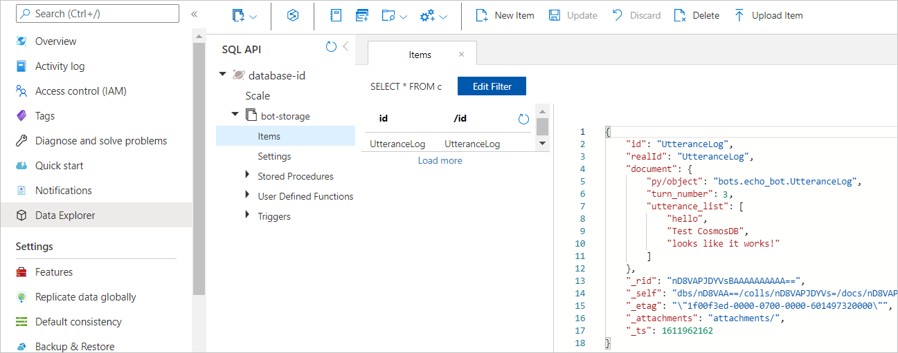


## Using Blob storage 
Azure Blob storage is Microsoft's object storage solution for the cloud. Blob storage is optimized for storing massive amounts of unstructured data, such as text or binary data.

### Create your Blob storage account
To use Blob storage in your bot, you'll need to get a few things set up before getting into the code.
1. In a new browser window, sign in to the [Azure portal](http://portal.azure.com).

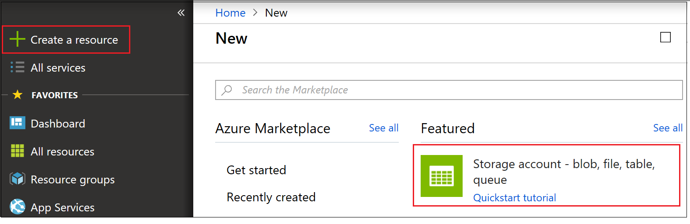

2. Click **Create a resource > Storage > Storage account - blob, file, table, queue**

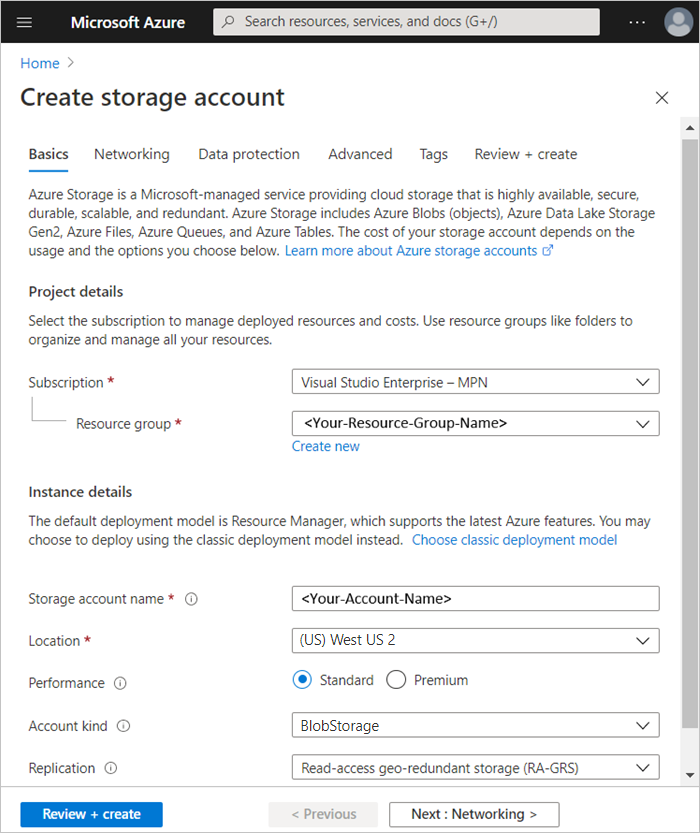

3. In the **New account page**, enter **Name** for the storage account, select **Blob storage** for **Account kind**, provide **Location**, **Resource group** and **Subscription** infomration.  
4. Then click **Review + Create**.
5. Once validation has been successful, click **Create**.

### Create Blob storage container
Once your Blob storage account is created, open this account by 
1. Selecting the resource.
2. Now "Open" using Storage Explorer (preview)

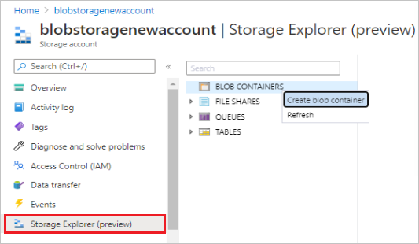

3. Right click BLOB CONTAINERS, select _Create blob container_.
4. Add a name. You will use this name for the value "your-blob-storage-container-name" to provide access to your Blob Storage account.

#### Add configuration information
Find the Blob Storage keys you need to configure Blob Storage for your bot as shown above:
1. In the Azure portal, open your Blob Storage account and select **Settings > Access keys**.

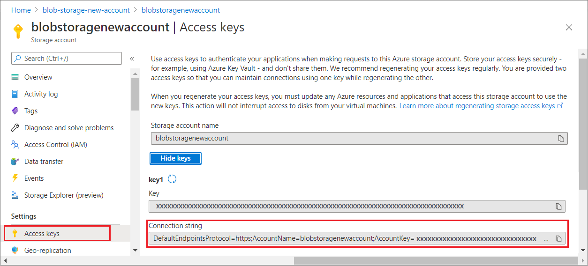

We will use key1 _Connection string_ as the value "your-blob-storage-account-string" to provide access to your Blob Storage account.

#### Installing packages
If not previously installed to use Cosmos DB, install the following packages.

### [C#](#tab/csharp)

```powershell
Install-Package Microsoft.Bot.Builder.Azure
```

### [JavaScript](#tab/javascript)

Add references to botbuilder-azure in your project via npm.
>**Note** - this npm package relies on an installation of Python existing on your development machine. If you have not previously installed Python you can find installation resources for your machine here: [Python.org](https://www.python.org/downloads/)

```powershell
npm install --save botbuilder-azure 
```

If not already installed, get the dotnet package from npm in order to access your `.env` file settings.

```powershell
npm install --save dotenv
```
---

### Implementation 

### [C#](#tab/csharp)

**EchoBot.cs**
```csharp
using Microsoft.Bot.Builder.Azure;
```
Update the line of code that points "_myStorage_" to your existing Blob Storage account.

**EchoBot.cs**
```csharp
private static readonly AzureBlobStorage _myStorage = new AzureBlobStorage("<your-blob-storage-account-string>", "<your-blob-storage-container-name>");
```

### [JavaScript](#tab/javascript)

Add the following information to your `.env` file.

**.env**
```javascript
BLOB_NAME="<your-blob-storage-container-name>"
BLOB_STRING="<your-blob-storage-account-string>"
```

Update your `bot.js` file as follows. Require `BlobStorage` from `botbuilder-azure`

**bot.js**
```javascript
const { BlobStorage } = require("botbuilder-azure");
```

If you did not add code to load your `.env` file to implement Cosmos DB storage, add this here.

```javascript
// initialized to access values in .env file.
var dotenv = require('dotenv');
dotenv.load();
```
Now update your code to point "_storage_" to your existing Blob Storage account, by commenting out previous storage definitions and adding the following.

**bot.js**
```javascript
var storage = new BlobStorage({
    containerName: process.env.BLOB_NAME,
    storageAccountOrConnectionString: process.env.BLOB_STRING
});
```
---

Once your storage is set to point to your Blob Storage account, your bot code will now store and retrieve data from Blob Storage.

## Start your bot
Run your bot locally.

## Start the emulator and connect your bot
Next, start the emulator and then connect to your bot in the emulator:

1. Click the **Create new bot configuration** link in the emulator "Welcome" tab. 
2. Fill in fields to connect to your bot, given the information on the webpage displayed when you started your bot.

## Interact with your bot
Send a message to your bot, and the bot will list the messages it receives.


### View your data
After you have run your bot and saved your information, we can view it in under the **Storage Explorer** tab in the Azure portal.

## Blob transcript storage
Azure blob transcript storage provides a specialized storage option that allows you to easily save and retrieve user conversations in the form of a recorded transcript. Azure blob transcript storage is particularly useful for automatically capturing user inputs to examine while debugging your bot's performance.

### Set up
Azure blob transcript storage can use the same blob storage account created following the steps detailed in sections "_Create your blob storage account_" and "_Add configuration information_" above. We now add a container to hold our transcripts

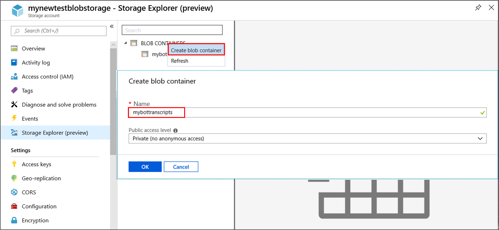

1. Open your Azure blob storage account.
1. Click on _Storage Explorer_.
1. Right click on _BLOB CONTAINERS_ and select _create blob container_.
1. enter a name for your transcript container and then select _OK_. (We entered mybottranscripts)

### Implementation 
The following code connects transcript storage pointer `_myTranscripts` to your new Azure blob transcript storage account. To create this link with a new container name, <your-blob-transcript-container-name>, creates a new container within Blob storage to hold your transcript files.

**echoBot.cs**
```csharp
using Microsoft.Bot.Builder.Azure;

public class EchoBot : ActivityHandler
{
   ...
   
   private readonly AzureBlobTranscriptStore _myTranscripts = new AzureBlobTranscriptStore("<your-blob-transcript-storage-account-string>", "<your-blob-transcript-container-name>");
   
   ...
}

```

### Store user conversations in azure blob transcripts
After a blob container is available to store transcripts you can begin to preserve your users' conversations with your bot. These conversations can later be used as a debugging tool to see how users interact with your bot. Each emulator _Restart conversation_ initiates the creation of a new transcript conversation list. The following code preserves user conversation inputs within a stored transcript file.
- The current transcript is saved using `LogActivityAsync`.
- Saved transcripts are retrieved using `ListTranscriptsAsync`.
In this sample code the Id of each stored transcript is saved into a list named "storedTranscripts". This list is later used to manage the number of stored blob transcripts we retain.

**echoBot.cs**
```csharp

protected override async Task OnMessageActivityAsync(ITurnContext<IMessageActivity> turnContext, CancellationToken cancellationToken)
{
    await _myTranscripts.LogActivityAsync(turnContext.Activity);

    List<string> storedTranscripts = new List<string>();
    PagedResult<Microsoft.Bot.Builder.TranscriptInfo> pagedResult = null;
    var pageSize = 0;
    do
    {
       pagedResult = await _myTranscripts.ListTranscriptsAsync("emulator", pagedResult?.ContinuationToken);
       pageSize = pagedResult.Items.Count();

       // transcript item contains ChannelId, Created, Id.
       // save the channelIds found by "ListTranscriptsAsync" to a local list.
       foreach (var item in pagedResult.Items)
       {
          storedTranscripts.Add(item.Id);
       }
    } while (pagedResult.ContinuationToken != null);
    
    ...
}

```

### Manage stored blob transcripts
While stored transcripts can be used as a debugging tool, over time  the number of stored transcripts can grow larger than you care to preserve. The additional code included below uses `DeleteTranscriptAsync` to remove all but the last three retrieved transcript items from your blob transcript store.

**echoBot.cs**
```csharp

protected override async Task OnMessageActivityAsync(ITurnContext<IMessageActivity> turnContext, CancellationToken cancellationToken)
{
    await _myTranscripts.LogActivityAsync(turnContext.Activity);

    List<string> storedTranscripts = new List<string>();
    PagedResult<Microsoft.Bot.Builder.TranscriptInfo> pagedResult = null;
    var pageSize = 0;
    do
    {
       pagedResult = await _myTranscripts.ListTranscriptsAsync("emulator", pagedResult?.ContinuationToken);
       pageSize = pagedResult.Items.Count();

       // transcript item contains ChannelId, Created, Id.
       // save the channelIds found by "ListTranscriptsAsync" to a local list.
       foreach (var item in pagedResult.Items)
       {
          storedTranscripts.Add(item.Id);
       }
    } while (pagedResult.ContinuationToken != null);
    
    // Manage the size of your transcript storage.
    for (int i = 0; i < pageSize; i++)
    {
       // Remove older stored transcripts, save just the last three.
       if (i < pageSize - 3)
       {
          string thisTranscriptId = storedTranscripts[i];
          try
          {
             await _myTranscripts.DeleteTranscriptAsync("emulator", thisTranscriptId);
           }
           catch (System.Exception ex)
           {
              await turnContext.SendActivityAsync("Debug Out: DeleteTranscriptAsync had a problem!");
              await turnContext.SendActivityAsync("exception: " + ex.Message);
           }
       }
    }
    ...
}

```

The following link provides more information concerning [Azure Blob Transcript Storage](https://docs.microsoft.com/en-us/dotnet/api/microsoft.bot.builder.azure.azureblobtranscriptstore) 

## Additional Information

### Manage concurrency using eTags
In our bot code example we set the `eTag` property of each `IStoreItem` to `*`. The `eTag` (entity tag) member of your store object is used within Cosmos DB to manage concurrency. The `eTag` tells your database what to do if another instance of the bot has changed the object in the same storage that your bot is writing to. 

<!-- define optimistic concurrency -->

#### Last write wins - allow overwrites
An `eTag` property value of asterisk (`*`) indicates that the last writer wins. When creating a new data store, you can set `eTag` of a property to `*` to indicate that you have not previously saved the data that you are writing, or that you want the last writer to overwrite any previously saved property. If concurrency is not an issue for your bot, setting the `eTag` property to `*` for any data that you are writing enables overwrites.

#### Maintain concurrency and prevent overwrites
When storing your data into Cosmos DB, use a value other than `*` for the `eTag` if you want to prevent concurrent access to a property and avoid overwriting changes from another instance of the bot. The bot receives an error response with the message `etag conflict key=` when it attempts to save state data and the `eTag` is not the same value as the `eTag` in storage. <!-- To control concurrency of data that is stored using `IStorage`, the BotBuilder SDK checks the entity tag (ETag) for `Storage.Write()` requests. -->

By default, the Cosmos DB store checks the `eTag` property of a storage object for equality every time a bot writes to that item, and then updates it to a new unique value after each write. If the `eTag` property on write doesn't match the `eTag` in storage, it means another bot or thread changed the data. 

For example, let's say you want your bot to edit a saved note, but you don't want your bot to overwrite changes that another instance of the bot has done. If another instance of the bot has made edits, you want the user to edit the version with the latest updates.

### [C#](#tab/csharp)

First, create a class that implements `IStoreItem`.

**EchoBot.cs**
```csharp
public class Note : IStoreItem
{
    public string Name { get; set; }
    public string Contents { get; set; }
    public string ETag { get; set; }
}
```

Next, create an initial note by creating a storage object, and add the object to your store.

**EchoBot.cs**
```csharp
// create a note for the first time, with a non-null, non-* ETag.
var note = new Note { Name = "Shopping List", Contents = "eggs", ETag = "x" };

var changes = Dictionary<string, object>();
{
    changes.Add("Note", note);
};
await NoteStore.WriteAsync(changes, cancellationToken);
```

Then, access and update the note later, keeping its `eTag` that you read from the store.

**EchoBot.cs**
```csharp
var note = NoteStore.ReadAsync<Note>("Note").Result?.FirstOrDefault().Value;

if (note != null)
{
    note.Contents += ", bread";
    var changes = new Dictionary<string, object>();
    {
         changes.Add("Note1", note);
    };
    await NoteStore.WriteAsync(changes, cancellationToken);
}
```

If the note was updated in the store before you write your changes, the call to `Write` will throw an exception.


### [JavaScript](#tab/javascript)

Add a helper function to the end of your bot that will write a sample note to a data store.
First create `myNoteData` object.

**bot.js**
```javascript
// Helper function for writing a sample note to a data store
async function createSampleNote(storage, context) {
    var myNoteData = {
        name: "Shopping List",
        contents: "eggs",
        // If any Note file is already stored, the eTag field
        // must be set to "*" in order to allow writing without first reading the stored eTag
        // otherwise you'll likely get an exception indicating an eTag conflict. 
        eTag: "*"
    }
}
```

Within the `createSampleNote` helper function initialize a `changes` object and add your *notes* to it, then write it to storage.

**bot.js**
```javascript
// Write the note data to the "Note" key
var changes = {};
changes["Note"] = myNoteData;
// Creates a file named Note, if it doesn't already exist.
// specifying eTag= "*" will overwrite any existing contents.
// The act of writing to the file automatically updates the eTag property
// The first time you write to Note, the eTag is changed from *, and file contents will become:
//    {"name":"Shopping List","contents":"eggs","eTag":"1"}
try {
     await storage.write(changes);
     var list = changes["Note"].contents;
     await context.sendActivity(`Successful created a note: ${list}`);
} catch (err) {
     await context.sendActivity(`Could not create note: ${err}`);
}
```

The helper function is accessed from within your bot's logic by adding the following call:

**bot.js**
```javascript
// Save a note with etag.
await createSampleNote(storage, turnContext);
```

Once created, to later retrieve and update the note we create another helper function that can be accessed when the user types in "update note".

**bot.js**
```javascript
async function updateSampleNote(storage, context) {
    try {
        // Read in a note
        var note = await storage.read(["Note"]);
        console.log(`note.eTag=${note["Note"].eTag}\n note=${JSON.stringify(note)}`);
        // update the note that we just read
        note["Note"].contents += ", bread";
        console.log(`Updated note=${JSON.stringify(note)}`);

        try {
             await storage.write(note); // Write the changes back to storage
             var list = note["Note"].contents;
             await context.sendActivity(`Successfully updated note: ${list}`);
        } catch (err) {            
             console.log(`Write failed: ${err}`);
        }
    }
    catch (err) {
        await context.sendActivity(`Unable to read the Note: ${err}`);
    }
}
```

This helper function is accessed from within your bot's logic by adding the following call:

**bot.js**
```javascript
// Update a note with etag.
await updateSampleNote(storage, turnContext);
```

If the note was updated in the store by another user before you attempted to write back your changes, the `eTag` value will no longer match and the call to `write` will throw an exception.

---

To maintain concurrency, always read a property from storage, then modify the property you read, so that the `eTag` is maintained. If you read user data from the store, the response will contain the eTag property. If you change the data and write updated data to the store, your request should include the eTag property that specifies the same value as you read earlier. However, writing an object with its `eTag` set to `*` will allow the write to overwrite any other changes.

## Next steps
Now that you know how to read read and write directly from storage, lets take a look at how you can use the state manager to do that for you.

> [!div class="nextstepaction"]
> [Save state using conversation and user properties](bot-builder-howto-v4-state.md)

