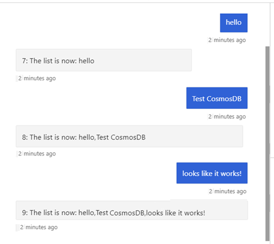

# Write directly to storage

[!INCLUDE [applies-to-v4](../includes/applies-to-v4-current.md)]

You can read and write directly to your storage object without using middleware or context object. This can be appropriate for data your bot uses to preserve a conversation, or data that comes from a source outside your bot's conversation flow. In this data storage model, data is read in directly from storage instead of using a state manager. The code examples in this article show you how to read and write data to storage using **memory**, **Cosmos DB**, **Azure Blob**, and **Azure Blob transcript** storage.

## Prerequisites

- If you don't have an Azure subscription, create a [free](https://azure.microsoft.com/free/) account before you begin.
- Familiarity with [Creating a bot](../bot-service-quickstart-create-bot.md) locally.
- Bot Framework SDK v4 templates for [Visual Studio (C#)](https://marketplace.visualstudio.com/items?itemName=BotBuilder.botbuilderv4), [Node.js](https://nodejs.org), or [Yeoman](http://yeoman.io).

[!INCLUDE [VSIX templates](~/includes/vsix-templates-versions.md)]

## About this sample

<!-- Sent email to John Taylor on 1/20/21 about the need to create a sample bot to base
     this article on. As it is currently, this article starts with the EchoBot, then replaces everything in EchoBot.cs. The code demonstrates creating a list by saving the values the user enters into memory, then makes the required code changes to save it into a Cosmos DB database (then a Blob storage database). It is similar to echo bot in that it repeats what you enter, except that it echoes back a list of all previous entries as well. This type of article is difficult to maintain, if the underlying sample it is based off of (EchoBot) changes, it could cause things not to work and there is no great way to tie an article to a sample that is used in this way.  -->

The sample code in this article begins with the structure of a basic echo bot, then extends that bot's functionality by adding additional code (provided below). This extended code creates a list to preserve user inputs as they're received. Each turn, the full list of user inputs, saved to memory, is echoed back to the user. The data structure containing this list of inputs is then modified to save to storage. Various types of storage are explored as additional functionality is added to this sample code.

## Memory storage

The Bot Framework SDK allows you to store user inputs using in-memory storage. Since in-memory storage is cleared each time the bot is restarted, it's best suited for testing purposes and is not intended for production use. Persistent storage types, such as database storage, are best for production bots. <!--Be sure to set storage to **Cosmos DB**, **Blob storage**, or **Azure Table storage** before publishing your bot.-->

## Build a basic bot

The rest of this topic builds off of an Echo bot. The Echo bot sample code can be locally built by following the quickstart instructions to [Create a bot](../bot-service-quickstart-create-bot.md).

### [C#](#tab/csharp)

Replace the code in **EchoBot.cs** with the following code:

```csharp
using System;
using System.Threading.Tasks;
using Microsoft.Bot.Builder;
using Microsoft.Bot.Schema;
using System.Collections.Generic;
using System.Linq;
using System.Threading;

// Represents a bot saves and echoes back user input.
public class EchoBot : ActivityHandler
{
   // Create local Memory Storage.
   private static readonly MemoryStorage _myStorage = new MemoryStorage();

   // Create cancellation token (used by Async Write operation).
   public CancellationToken cancellationToken { get; private set; }

   // Class for storing a log of utterances (text of messages) as a list.
   public class UtteranceLog : IStoreItem
   {
      // A list of things that users have said to the bot
      public List<string> UtteranceList { get; } = new List<string>();

      // The number of conversational turns that have occurred
      public int TurnNumber { get; set; } = 0;

      // Create concurrency control where this is used.
      public string ETag { get; set; } = "*";
   }

   // Echo back user input.
   protected override async Task OnMessageActivityAsync(ITurnContext<IMessageActivity> turnContext, CancellationToken cancellationToken)
   {
      // preserve user input.
      var utterance = turnContext.Activity.Text;

      // Make empty local log-items list.
      UtteranceLog logItems = null;

      // See if there are previous messages saved in storage.
      try
      {
         string[] utteranceList = { "UtteranceLog" };
         logItems = _myStorage.ReadAsync<UtteranceLog>(utteranceList).Result?.FirstOrDefault().Value;
      }
      catch
      {
         // Inform the user an error occurred.
         await turnContext.SendActivityAsync("Sorry, something went wrong reading your stored messages!");
      }

      // If no stored messages were found, create and store a new entry.
      if (logItems is null)
      {
         // Add the current utterance to a new object.
         logItems = new UtteranceLog();
         logItems.UtteranceList.Add(utterance);

         // Set initial turn counter to 1.
         logItems.TurnNumber++;

         // Show user new user message.
         await turnContext.SendActivityAsync($"{logItems.TurnNumber}: The list is now: {string.Join(", ", logItems.UtteranceList)}");

         // Create dictionary object to hold received user messages.
         var changes = new Dictionary<string, object>();
         {
            changes.Add("UtteranceLog", logItems);
         }
         try
         {
            // Save the user message to your Storage.
            await _myStorage.WriteAsync(changes, cancellationToken);
         }
         catch
         {
            // Inform the user an error occurred.
            await turnContext.SendActivityAsync("Sorry, something went wrong storing your message!");
         }
      }
      // Else, our storage already contained saved user messages, add new one to the list.
      else
      {
         // add new message to list of messages to display.
         logItems.UtteranceList.Add(utterance);
         // increment turn counter.
         logItems.TurnNumber++;

         // show user new list of saved messages.
         await turnContext.SendActivityAsync($"{logItems.TurnNumber}: The list is now: {string.Join(", ", logItems.UtteranceList)}");

         // Create Dictionary object to hold new list of messages.
         var changes = new Dictionary<string, object>();
         {
            changes.Add("UtteranceLog", logItems);
         };

         try
         {
            // Save new list to your Storage.
            await _myStorage.WriteAsync(changes,cancellationToken);
         }
         catch
         {
            // Inform the user an error occurred.
            await turnContext.SendActivityAsync("Sorry, something went wrong storing your message!");
         }
      }
   }
}

```

### [JavaScript](#tab/javascript)

To use the **.env** configuration file, your bot needs an extra package included. If not already installed, get the .NET package from npm:

```console
npm install --save dotenv
```

Modify the code in **index.js** that creates the main dialog. The existing line of code to create the main dialog is `const myBot = new EchoBot();`, it needs updated to enable passing a storage object to the `EchoBot` constructor so you can store the user's input to the bot's internal memory:

First you will need to add a reference to `MemoryStorage` in `botbuilder`:

```javascript
const { MemoryStorage } = require('botbuilder');
```

Then create the memory storage object, and pass it  to the `EchoBot` constructor:

```javascript
const myStorage = new MemoryStorage();
const myBot = new EchoBot(myStorage);
```

This passes in a `MemoryStorage` object to the `EchoBot` constructor. You will change that later to pass a _Cosmos DB_ or _Blob Storage_ object.

Next, replace the code in **bot.js** with the following code:

```javascript
const { ActivityHandler, MemoryStorage } = require('botbuilder');
const restify = require('restify');

// Process incoming requests - adds storage for messages.
class EchoBot extends ActivityHandler {
    constructor(myStorage) {
        super();
        this.storage = myStorage;
        // See https://docs.microsoft.com/azure/bot-service/bot-builder-basics to learn more about the message and other activity types.
        this.onMessage(async turnContext => { console.log('this gets called (message)');
        await turnContext.sendActivity(`You said '${ turnContext.activity.text }'`);
        // Save updated utterance inputs.
        await logMessageText(this.storage, turnContext);
    });
        this.onConversationUpdate(async turnContext => { console.log('this gets called (conversation update)');
        await turnContext.sendActivity('Welcome, enter an item to save to your list.'); });
    }
}

// This function stores new user messages. Creates new utterance log if none exists.
async function logMessageText(storage, turnContext) {
    let utterance = turnContext.activity.text;
    // debugger;
    try {
        // Read from the storage.
        let storeItems = await storage.read(["UtteranceLogJS"])
        // Check the result.
        var UtteranceLogJS = storeItems["UtteranceLogJS"];
        if (typeof (UtteranceLogJS) != 'undefined') {
            // The log exists so we can write to it.
            storeItems["UtteranceLogJS"].turnNumber++;
            storeItems["UtteranceLogJS"].UtteranceList.push(utterance);
            // Gather info for user message.
            var storedString = storeItems.UtteranceLogJS.UtteranceList.toString();
            var numStored = storeItems.UtteranceLogJS.turnNumber;

            try {
                await storage.write(storeItems)
                await turnContext.sendActivity(`${numStored}: The list is now: ${storedString}`);
            } catch (err) {
                await turnContext.sendActivity(`Write failed of UtteranceLogJS: ${err}`);
            }
        }
        else{
            await turnContext.sendActivity(`Creating and saving new utterance log`);
            var turnNumber = 1;
            storeItems["UtteranceLogJS"] = { UtteranceList: [`${utterance}`], "eTag": "*", turnNumber }
            // Gather info for user message.
            var storedString = storeItems.UtteranceLogJS.UtteranceList.toString();
            var numStored = storeItems.UtteranceLogJS.turnNumber;

            try {
                await storage.write(storeItems)
                await turnContext.sendActivity(`${numStored}: The list is now: ${storedString}`);
            } catch (err) {
                await turnContext.sendActivity(`Write failed: ${err}`);
            }
        }
    }
    catch (err){
        await turnContext.sendActivity(`Read rejected. ${err}`);
    }
}

module.exports.EchoBot = EchoBot;

```

### [Python](#tab/python)

Replace the code in **echo_bot.py** with the following code:

```python
from botbuilder.core import ActivityHandler, TurnContext, StoreItem, MemoryStorage


class UtteranceLog(StoreItem):
    """
    Class for storing a log of utterances (text of messages) as a list.
    """

    def __init__(self):
        super(UtteranceLog, self).__init__()
        self.utterance_list = []
        self.turn_number = 0
        self.e_tag = "*"


class EchoBot(ActivityHandler):
    """
    Represents a bot saves and echoes back user input.
    """

    def __init__(self):
        self.storage = MemoryStorage()

    async def on_message_activity(self, turn_context: TurnContext):
        utterance = turn_context.activity.text

        # read the state object
        store_items = await self.storage.read(["UtteranceLog"])

        if "UtteranceLog" not in store_items:
            # add the utterance to a new state object.
            utterance_log = UtteranceLog()
            utterance_log.utterance_list.append(utterance)
            utterance_log.turn_number = 1
        else:
            # add new message to list of messages existing state object.
            utterance_log: UtteranceLog = store_items["UtteranceLog"]
            utterance_log.utterance_list.append(utterance)
            utterance_log.turn_number = utterance_log.turn_number + 1

        # Show user list of utterances.
        await turn_context.send_activity(f"{utterance_log.turn_number}: "
                                         f"The list is now: {','.join(utterance_log.utterance_list)}")

        try:
            # Save the user message to your Storage.
            changes = {"UtteranceLog": utterance_log}
            await self.storage.write(changes)
        except Exception as exception:
            # Inform the user an error occurred.
            await turn_context.send_activity("Sorry, something went wrong storing your message!")
```

---

### Start your bot

Run your bot locally.

### Start the Emulator and connect your bot

Install the Bot Framework [Emulator](https://github.com/microsoft/BotFramework-Emulator/blob/master/README.md)
Next, start the Emulator and then connect to your bot in the Emulator:

1. Select the **Create new bot configuration** link in the Emulator **Welcome** tab.
2. Fill in fields to connect to your bot, given the information on the webpage displayed when you started your bot.

### Interact with your bot

Send a message to your bot. The bot will list the messages it has received.



The remainder of this article will demonstrate how to save to persistent storage instead of the bot's internal memory.

## Using Cosmos DB

>[!IMPORTANT]
> The _Cosmos DB storage_ class has been deprecated. Containers originally created with CosmosDbStorage had no partition key set, and were given the default partition key of _\/_partitionKey_.
>
> Containers created with _Cosmos DB storage_ can be used with _Cosmos DB partitioned storage_. Read [Partitioning in Azure Cosmos DB](/azure/cosmos-db/partitioning-overview) for more information.
>
> Also note that, unlike the legacy Cosmos DB storage, the Cosmos DB partitioned storage does not automatically create a database within your Cosmos DB account. You need to [create a new database manually](/azure/cosmos-db/create-cosmosdb-resources-portal), but skip manually creating a container since _CosmosDbPartitionedStorage_ will create the container for you.

Now that you've used memory storage, we'll update the code to use Azure Cosmos DB. Cosmos DB is Microsoft's globally distributed, multi-model database. Azure Cosmos DB enables you to elastically and independently scale throughput and storage across any number of Azure's geographic regions. It offers throughput, latency, availability, and consistency guarantees with comprehensive service level agreements (SLAs).

### Set up a Cosmos DB resource

To use Cosmos DB in your bot, you'll need to create a database resource before getting into the code. For an in-depth description of Cosmos DB database and app creation, see the quickstart for [.NET](/azure/cosmos-db/create-sql-api-dotnet-v4), [Node.js](/azure/cosmos-db/create-sql-api-nodejs), or [Python](/azure/cosmos-db/create-sql-api-python).

### Create your database account

1. Go to the [Azure portal](https://portal.azure.com) to create an Azure Cosmos DB account. Search for and select **Azure Cosmos DB**.
1. In the **Azure Cosmos DB** page, select **New** to bring up the **Create Azure Cosmos DB Account** page.

    

1. Provide values for the following fields:
    1. **Subscription**. Select the Azure subscription that you want to use for this Azure Cosmos account.
    1. **Resource group**. Select an existing resource group or select **Create new**, and enter a name for a new resource group.
    1. **Account name**. Enter a name to identify your Azure Cosmos account. Because _documents.azure.com_ is appended to the name that you provide to create your URI, use a unique name. Note the following guidelines:
        - The name must be unique across Azure.
        - The name must be between 3 and 31 characters long.
        - The name can include only lowercase letters, numbers, and the hyphen (-) character.
    1. **API**. Select **Core(SQL)**
    1. **Location**. select a location that is closest to your users to give them the fastest access to the data.
1. Select **Review + Create**.
1. Once validated, select **Create**.

The account creation takes a few minutes. Wait for the portal to display the _Congratulations! Your Azure Cosmos DB account was created_ page.

### Add a database

<!---
>[!IMPORTANT]
> Unlike the legacy _Cosmos DB storage_, which has now been deprecated, the _Cosmos DB partitioned storage_ does not automatically create a database within your Cosmos DB account.
-->

> [!NOTE]
> You should not create the container yourself. Your bot will create it for you when creating its internal Cosmos DB client, ensuring it is configured correctly for storing bot state.

1. Navigate to the **Data Explorer** page within your newly created Cosmos DB account, then choose **New Database** from the **New Container** drop-down. A panel will then open on the right-hand side of the window, where you can enter the details for the new database.

    

1. Enter an ID for your new database and, optionally, set the throughput (you can change this later) and finally select **OK** to create your database. Make a note of this database ID for use later on when configuring your bot.
1. Now that you have created a Cosmos DB account and a database, you need to copy over some of the values for integrating your new database into your bot.  To retrieve these, navigate to the **Keys** tab within the database settings section of your Cosmos DB account.  From this page, you will need your **URI** (_Cosmos DB endpoint_) and your **PRIMARY KEY** (_authorization key_).

    

You should now have a Cosmos DB account with a database and the following values ready to use in your bot settings.

- URI
- Primary Key
- Database ID

### Add Cosmos DB configuration information

Use the details you made a note of in the previous part of this article to set your endpoint, authorization key, and database ID. Finally, you should choose an appropriate name for the container that will be created within your database to store your bot state. In the example below the Cosmos DB container that is created will be named "bot-storage".

### [C#](#tab/csharp)

Add the following information to your configuration file.

**appsettings.json**

```json
"CosmosDbEndpoint": "<your-CosmosDb-URI>",
"CosmosDbAuthKey": "<your-primary-key>",
"CosmosDbDatabaseId": "<your-database-id>",
"CosmosDbContainerId": "bot-storage"
```

### [JavaScript](#tab/javascript)

Add the following information to your **.env** file.

**.env**

```javascript
CosmosDbEndpoint="<your-CosmosDb-URI>"
CosmosDbAuthKey="<your-primary-key>"
CosmosDbDatabaseId="<your-database-id>"
CosmosDbContainerId="bot-storage"
```

### [Python](#tab/python)

Add the following information to your configuration file.

**config.py**

```python
COSMOS_DB_URI="<your-CosmosDb-URI>"
COSMOS_DB_PRIMARY_KEY="your-primary-key"
COSMOS_DB_DATABASE_ID="<your-database-id>"
COSMOS_DB_CONTAINER_ID="bot-storage"
```

---

#### Installing Cosmos DB packages

Make sure you have the packages necessary for Cosmos DB.

### [C#](#tab/csharp)

Install the **Microsoft.Bot.Builder.Azure** NuGet package. For more information on using NuGet, see [Install and manage packages in Visual Studio using the NuGet Package Manager
](/nuget/consume-packages/install-use-packages-visual-studio).

### [JavaScript](#tab/javascript)

Add a reference to **botbuilder-azure** using npm.
<!-- Email sent to Steven Gum and Josh Gummersall to validate the following note is correct. I was able to run through this scenario without Python installed, ao I am removing this.
> [!NOTE]
> This npm package relies on an installation of Python existing on your development machine. If you have not previously installed Python you can find installation resources for your machine at [python.org](https://www.python.org/downloads/).
 -->

```Console
npm install --save botbuilder-azure
```

If not already installed, get the .NET package from npm in order to access your **.env** file settings.

```Console
npm install --save dotenv
```

### [Python](#tab/python)

You can add a reference to botbuilder-azure in your project via pip.

```Console
pip install botbuilder-azure
```

---

### Cosmos DB implementation

> [!NOTE]
> Version 4.6 introduced a new Cosmos DB storage provider, the _Cosmos DB partitioned storage_ class, and the original _Cosmos DB storage_ class is deprecated. Containers created with _Cosmos DB storage_ can be used with _Cosmos DB partitioned storage_. Read [Partitioning in Azure Cosmos DB](/azure/cosmos-db/partitioning-overview) for more information.
>
> Unlike the legacy Cosmos DB storage, the Cosmos DB partitioned storage does not automatically create a database within your Cosmos DB account. You need to [create a new database manually](/azure/cosmos-db/create-cosmosdb-resources-portal), but skip manually creating a container since _CosmosDbPartitionedStorage_ will create the container for you.

### [C#](#tab/csharp)

The following sample code runs using the same bot code as the [memory storage](#memory-storage) sample provided above, with the exceptions listed here.
The code snippets below show an implementation of Cosmos DB storage for '_myStorage_' that replaces local Memory storage.

You first need to update **Startup.cs** to reference the _bot builder Azure_ library:

```csharp
using Microsoft.Bot.Builder.Azure;
```

Next, in the `ConfigureServices` method in **Startup.cs**, create the `CosmosDbPartitionedStorage` object. This will be passed into the `EchoBot` constructor through dependency injection.

```csharp
// Use partitioned CosmosDB for storage, instead of in-memory storage.
services.AddSingleton<IStorage>(
    new CosmosDbPartitionedStorage(
        new CosmosDbPartitionedStorageOptions
        {
            CosmosDbEndpoint = Configuration.GetValue<string>("CosmosDbEndpoint"),
            AuthKey = Configuration.GetValue<string>("CosmosDbAuthKey"),
            DatabaseId = Configuration.GetValue<string>("CosmosDbDatabaseId"),
            ContainerId = Configuration.GetValue<string>("CosmosDbContainerId"),
            CompatibilityMode = false,
        }));
```

In **EchoBot.cs** change the `_myStorage` variable declaration `private static readonly MemoryStorage _myStorage = new MemoryStorage();` to the following:

```csharp
// variable used to save user input to CosmosDb Storage.
private readonly IStorage _myStorage;
```

Then pass in the `IStorage` object to the `EchoBot` constructor:

```csharp
public EchoBot(IStorage storage)
{
    if (storage is null) throw new ArgumentNullException();
    _myStorage = storage;
}
```

### [JavaScript](#tab/javascript)

First, add code to your **index.js** file to enable you to access the values from your **.env** file that you entered previously:

```javascript
// initialized to access values in .env file.
const ENV_FILE = path.join(__dirname, '.env');
require('dotenv').config({ path: ENV_FILE });
```

Next, you will need to make changes to **index.js** to use Cosmos DB partitioned storage instead of the Bot Frameworks internal storage. All the code changes in this section are made in **index.js**.

First, add a reference to `botbuilder-azure` in **index.js**. This will give you access to the `BlobStorage` API:

```javascript
const { CosmosDbPartitionedStorage } = require('botbuilder-azure');
```

Next, create the new `CosmosDbPartitionedStorage` object:

```javascript
const myStorage = new CosmosDbPartitionedStorage({
    cosmosDbEndpoint: process.env.CosmosDbEndpoint,
    authKey: process.env.CosmosDbAuthKey,
    databaseId: process.env.CosmosDbDatabaseId,
    containerId: process.env.CosmosDbContainerId,
    compatibilityMode: false
});
```

You can now comment out or remove the `myStorage` const declaration that you previously added, since you no longer are saving user input to the Bot Frameworks internal storage, but instead to Cosmos DB:

```javascript
//const myStorage = new MemoryStorage();
const myBot = new EchoBot(myStorage);
```

### [Python](#tab/python)

The following sample code runs using the same bot code as the [memory storage](#memory-storage) sample provided above, with the exceptions listed here.

Both `CosmosDbPartitionedStorage` and `CosmosDbPartitionedConfig` from `botbuilder-azure` are required to create the CosmosDBStorage object.

**echo_bot.py**

```python
from botbuilder.azure import CosmosDbPartitionedStorage, CosmosDbPartitionedConfig
```

In order to access the settings in **config.py**, you will import `DefaultConfig` as shown below:

```python
from config import DefaultConfig
CONFIG = DefaultConfig()
```

Comment out Memory Storage in `__init__` and replace with reference to Cosmos DB.  Use the URI (endpoint), Primary key (authorization key), database ID, and container ID used above.

Next, remove or comment out the Memory Storage code in `__init__` and add a reference to your Cosmos DB information from **config.py**.

The code snippet below show an implementation of Cosmos DB for 'Storage' that replaces local Memory storage.

**echo_bot.py**

```python
def __init__(self):
    cosmos_config = CosmosDbPartitionedConfig(
        cosmos_db_endpoint=CONFIG.COSMOS_DB_URI,
        auth_key=CONFIG.COSMOS_DB_PRIMARY_KEY,
        database_id=CONFIG.COSMOS_DB_DATABASE_ID,
        container_id=CONFIG.COSMOS_DB_CONTAINER_ID,
        compatibility_mode = False
    )
    self.storage = CosmosDbPartitionedStorage(cosmos_config)
```

---

## Start your Cosmos DB bot

Run your bot locally.

## Test your Cosmos DB bot with Bot Framework Emulator

Now start the Bot Framework Emulator and connect to your bot:

1. Select the **create a new bot configuration** link in the Emulator **Welcome** tab.
2. Fill in fields to connect to your bot, given the information on the webpage displayed when you started your bot.

## Interact with your Cosmos DB bot

Send a message to your bot, and the bot will list the messages it received.


### View your Cosmos DB data

After you have run your bot and saved your information, we can view the data stored in the Azure portal under the **Data Explorer** tab.


## Using Blob storage

Azure Blob storage is Microsoft's object storage solution for the cloud. Blob storage is optimized for storing massive amounts of unstructured data, such as text or binary data. This section explains how to create an Azure blob storage account and container, then how to reference your blob storage container from your bot.

For more information on Blob Storage, see [What is Azure Blob storage?](/azure/storage/blobs/storage-blobs-overview)

### Create your Blob storage account

To use Blob storage in your bot, you'll need to get a few things set up before getting into the code.

1. In the [Azure portal](https://portal.azure.com), select **All services**.
1. In the **Featured** section of the **All services** page, select **Storage accounts**.
1. In the **Storage accounts** page, select **New**.

    

1. In the **Subscription** field, select the subscription in which to create the storage account.
1. In the **Resource group** field, select an existing resource group or select **Create new**, and enter a name for the new resource group.
1. In the **Storage account name** field, enter a name for the account. Note the following guidelines:
    - The name must be unique across Azure.
    - The name must be between 3 and 24 characters long.
    - The name can include only numbers and lowercase letters.
1. In the **Location** field, select a location for the storage account, or use the default location.
1. For the rest of the settings, configure the following:
    - **Performance**: Standard. [Learn more about performance](/azure/storage/common/storage-account-overview#performance-tiers).
    - **Account kind**: BlobStorage. [Learn more about storage accounts](/azure/storage/common/storage-account-create?tabs=azure-portal).
    - **Replication**: Leave the default setting. [Learn more about redundancy](/azure/storage/common/storage-redundancy).

1. In the **Project details** section of the **Create storage account** page, select the desired values for **subscription** and **Resource group**.
1. In the **Instance details** section of the **Create storage account** page, enter the **Storage account name** then select values for **Location**, **Account kind**, and **Replication**.
1. Select **Review + create** to review the storage account settings.
1. Once validated, select **Create**.

### Create Blob storage container

Once your Blob storage account is created, open it, then:

1. Select **Storage Explorer (Preview)**.
1. Then right-click on **BLOB CONTAINERS**
1. Select **Create blob container** from the drop-down list.

    

1. Enter a name in the **New container** form. You will use this name for the value of your "_blob-storage-container-name_" to provide access to your Blob storage account. Note the following guidelines:
    - This name may only contain lowercase letters, numbers, and hyphens.
    - This name must begin with a letter or a number.
    - Each hyphen must be preceded and followed by a valid non-hyphen character.
    - The name must be between three and 63 characters long.

#### Add Blob storage configuration information

Find the Blob storage keys you need to configure Blob storage for your bot as shown above:

1. In the Azure portal, open your Blob storage account and select **Access keys** in the **Settings** section.

    

Use **Connection string** as the value for your "_connection-string_" to provide access to your Blob storage account.

### [C#](#tab/csharp)

Add the following information to your configuration file.

**appsettings.json**

```json
"BlobConnectionString": "<your-blob-connection-string>",
"BlobContainerName": "<your-blob-container-name>",
```

### [JavaScript](#tab/javascript)

Add the following information to your **.env** file.

**.env**

```javascript
BlobConnectionString="<your-blob-connection-string>"
BlobContainerName="<your-blob-container-name>"
```

### [Python](#tab/python)

Add the following information to your configuration file. Use the same container name and connection string used when creating your [blob storage container](#create-blob-storage-container).

**config.py**

```python
BLOB_CONNECTION_STRING="<your-blob-connection-string>"
BLOB_CONTAINER_NAME="<your-blob-container-name>"
```

---

#### Installing Blob storage packages

If not previously installed, install the following packages.

### [C#](#tab/csharp)

Install the **Microsoft.Bot.Builder.Azure.Blobs** NuGet package. For more information on using NuGet, see [Install and manage packages in Visual Studio using the NuGet Package Manager](/nuget/consume-packages/install-use-packages-visual-studio).

### [JavaScript](#tab/javascript)

Add references to botbuilder-azure in your project via npm.

> [!NOTE]
> This npm package relies on an installation of Python existing on your development machine. If you have not previously installed Python you can find installation resources for your machine at [Python.org](https://www.python.org/downloads/)

```Console
npm install --save botbuilder-azure-blobs
```

If not already installed, get the .NET package from npm in order to access your **.env** file settings.

```Console
npm install --save dotenv
```

### [Python](#tab/python)

you can add a reference to botbuilder-azure in your project via pip.

```Console
pip install botbuilder-azure
```

---

### Blob storage implementation

_Blob storage_ is used to store bot state.

### [C#](#tab/csharp)

> [!NOTE]
> As of version 4.10, `Microsoft.Bot.Builder.Azure.AzureBlobStorage` is deprecated. Use the new `Microsoft.Bot.Builder.Azure.Blobs.BlobsStorage` in its place.

The following sample code runs using the same bot code as the [memory storage](#memory-storage) sample provided above, with the exceptions listed here.

The code snippets below show an implementation of Blob storage for '_myStorage_' that replaces local Memory storage.

You first need to update **Startup.cs** to reference the _bot builder Azure blobs_ library:

**Startup.cs**

```csharp
using Microsoft.Bot.Builder.Azure.Blobs;
```

Next, in the `ConfigureServices` method in **Startup.cs**, create the `BlobsStorage` object, passing in the values from `appsettings.json`. This will be passed into the `EchoBot` constructor through dependency injection.

```csharp
//Use Azure Blob storage, instead of in-memory storage.
services.AddSingleton<IStorage>(
    new BlobsStorage(
        Configuration.GetValue<string>("BlobConnectionString"),
        Configuration.GetValue<string>("BlobContainerName")
        ));
```

Now you first need to update **EchoBot.cs** to reference the _bot builder Azure blobs_ library:

**EchoBot.cs**

```csharp
using Microsoft.Bot.Builder.Azure.Blobs;
```

Next, remove or comment out the line of code that creates the MemoryStorage variable 'private static readonly MemoryStorage _myStorage = new MemoryStorage();', and create a new variable that will be used to save user input to the Blob Storage.

**EchoBot.cs**

```csharp
// variable used to save user input to CosmosDb Storage.
private readonly IStorage _myStorage;
```

Then pass in the `IStorage` object to the `EchoBot` constructor:

```csharp
public EchoBot(IStorage storage)
{
    if (storage is null) throw new ArgumentNullException();
    _myStorage = storage;
}
```

Once your storage is set to point to your Blob Storage account, your bot code will now store and retrieve data from Blob storage.

### [JavaScript](#tab/javascript)

All the code changes in this section are made in **index.js**.

First, add code to enable you to access the values from your **.env** file that you entered previously:

```javascript
// initialized to access values in .env file.
const ENV_FILE = path.join(__dirname, '.env');
require('dotenv').config({ path: ENV_FILE });
```

Next, you will need to make changes use Blob storage instead of the Bot Frameworks internal storage.

Next, add a reference to `botbuilder-azure`. This will give you access to the Blob Storage API:

```javascript
const { BlobStorage } = require("botbuilder-azure");
```

Now you can modify your code to use `BlobStorage` by modifying your `myStorage` declaration as follows:

```javascript
const myStorage = new BlobStorage({
    containerName: process.env.BlobContainerName,
    storageAccountOrConnectionString: process.env.BlobConnectionString
});
```

Once your storage is set to point to your Blob Storage account, your bot code will now store and retrieve data from Blob storage.

### [Python](#tab/python)

The following sample code runs using the same bot code as the [memory storage](#memory-storage) sample provided above, with the exceptions listed here.

This will require `BlobStorage` and `BlobStorageSettings` from `botbuilder-azure`.

**echo_bot.py**

```python
from botbuilder.azure import BlobStorage, BlobStorageSettings
```

In order to access the settings in **config.py**, you will import `DefaultConfig` as shown below:

```python
from config import DefaultConfig
CONFIG = DefaultConfig()
```

Next, remove or comment out the Memory Storage code in `__init__` and add a reference to your blob storage information from **config.py**.

The code snippet below shows an implementation of Blob Storage that replaces the local Memory storage.

**echo_bot.py**

```python
def __init__(self):
    blob_settings = BlobStorageSettings(
        connection_string=CONFIG.BLOB_CONNECTION_STRING,
        container_name=CONFIG.BLOB_CONTAINER_NAME
    )
    self.storage = BlobStorage(blob_settings)
```

---

Once your storage is set to point to your Blob Storage account, your bot code will now store and retrieve data from Blob storage.

## Start your Blob storage bot

Run your bot locally.

## Start the Emulator and connect your Blob storage bot

Next, start the Emulator and then connect to your bot in the Emulator:

1. Select the **Create new bot configuration** link in the Emulator "Welcome" tab.
2. Fill in fields to connect to your bot, given the information on the webpage displayed when you started your bot.

## Interact with your Blob storage bot

Send a message to your bot, and the bot will list the messages it receives.


### View your Blob storage data

After you have run your bot and saved your information, we can view it in under the **Storage Explorer** tab in the Azure portal.

## Blob transcript storage

Azure blob transcript storage provides a specialized storage option that allows you to easily save and retrieve user conversations in the form of a recorded transcript. Azure blob transcript storage is useful for automatically capturing user inputs to examine while debugging your bot's performance.

> [!NOTE]
> Python does not currently support _Azure Blob transcript storage_.
> While JavaScript supports Blob transcript storage, the following directions are for C# only.

### Set up a Blob transcript storage container

Azure blob transcript storage can use the same blob storage account created following the steps detailed in sections "_Create your blob storage account_" and "_Add configuration information_" above. We now add a container to hold our transcripts


1. Open your Azure blob storage account.
1. Select **Storage Explorer**.
1. Right click on _BLOB CONTAINERS_ and select **create blob container**.
1. Enter a name for your transcript container and then select **OK**. (We entered _mybottranscripts_)

### Blob transcript storage implementation

The following code connects transcript storage pointer `_myTranscripts` to your new Azure blob transcript storage account. To create this link with a new container name, \<your-blob-transcript-container-name>, it creates a new container within Blob storage to hold your transcript files.

_Blob transcript storage_ is designed to store bot transcripts.

> [!NOTE]
> As of version 4.10, `Microsoft.Bot.Builder.Azure.AzureBlobTranscriptStore` is deprecated. Use the new `Microsoft.Bot.Builder.Azure.Blobs.BlobsTranscriptStore` in its place.

**echoBot.cs**

```csharp
using Microsoft.Bot.Builder.Azure.Blobs;

public class EchoBot : ActivityHandler
{
   ...

   private readonly BlobsTranscriptStore _myTranscripts = new BlobsTranscriptStore("<your-azure-storage-connection-string>", "<your-blob-transcript-container-name>");

   ...
}

```

### Store user conversations in Azure blob transcripts

After a blob container is available to store transcripts you can begin to preserve your users' conversations with your bot. These conversations can later be used as a debugging tool to see how users interact with your bot. Each Emulator _Restart conversation_ initiates the creation of a new transcript conversation list. The following code preserves user conversation inputs within a stored transcript file.

- The current transcript is saved using `LogActivityAsync`.
- Saved transcripts are retrieved using `ListTranscriptsAsync`.
In this sample code the ID of each stored transcript is saved into a list named "storedTranscripts". This list is later used to manage the number of stored blob transcripts we retain.

**echoBot.cs**

```csharp

protected override async Task OnMessageActivityAsync(ITurnContext<IMessageActivity> turnContext, CancellationToken cancellationToken)
{
    await _myTranscripts.LogActivityAsync(turnContext.Activity);

    List<string> storedTranscripts = new List<string>();
    PagedResult<Microsoft.Bot.Builder.TranscriptInfo> pagedResult = null;
    var pageSize = 0;
    do
    {
       pagedResult = await _myTranscripts.ListTranscriptsAsync("emulator", pagedResult?.ContinuationToken);
       pageSize = pagedResult.Items.Count();

       // transcript item contains ChannelId, Created, Id.
       // save the channelIds found by "ListTranscriptsAsync" to a local list.
       foreach (var item in pagedResult.Items)
       {
          storedTranscripts.Add(item.Id);
       }
    } while (pagedResult.ContinuationToken != null);

    ...
}

```

### Manage stored blob transcripts

While stored transcripts can be used as a debugging tool, over time  the number of stored transcripts can grow larger than you care to preserve. The additional code included below uses `DeleteTranscriptAsync` to remove all but the last three retrieved transcript items from your blob transcript store.

**echoBot.cs**

```csharp

protected override async Task OnMessageActivityAsync(ITurnContext<IMessageActivity> turnContext, CancellationToken cancellationToken)
{
    await _myTranscripts.LogActivityAsync(turnContext.Activity);

    List<string> storedTranscripts = new List<string>();
    PagedResult<Microsoft.Bot.Builder.TranscriptInfo> pagedResult = null;
    var pageSize = 0;
    do
    {
       pagedResult = await _myTranscripts.ListTranscriptsAsync("emulator", pagedResult?.ContinuationToken);
       pageSize = pagedResult.Items.Count();

       // transcript item contains ChannelId, Created, Id.
       // save the channelIds found by "ListTranscriptsAsync" to a local list.
       foreach (var item in pagedResult.Items)
       {
          storedTranscripts.Add(item.Id);
       }
    } while (pagedResult.ContinuationToken != null);

    // Manage the size of your transcript storage.
    for (int i = 0; i < pageSize; i++)
    {
       // Remove older stored transcripts, save just the last three.
       if (i < pageSize - 3)
       {
          string thisTranscriptId = storedTranscripts[i];
          try
          {
             await _myTranscripts.DeleteTranscriptAsync("emulator", thisTranscriptId);
           }
           catch (System.Exception ex)
           {
              await turnContext.SendActivityAsync("Debug Out: DeleteTranscriptAsync had a problem!");
              await turnContext.SendActivityAsync("exception: " + ex.Message);
           }
       }
    }
    ...
}

```

See [Azure Blob Transcript Storage](/dotnet/api/microsoft.bot.builder.azure.blobs.blobstranscriptstore) for more information about the class.

## Additional Information

### Manage concurrency using eTags

In our bot code example we set the `eTag` property of each `IStoreItem` to `*`. The `eTag` (entity tag) member of your store object is used within Cosmos DB to manage concurrency. The `eTag` tells your database what to do if another instance of the bot has changed the object in the same storage that your bot is writing to.

<!-- define optimistic concurrency -->

#### Last write wins - allow overwrites

An `eTag` property value of asterisk (`*`) indicates that the last writer wins. When creating a new data store, you can set `eTag` of a property to `*` to indicate that you have not previously saved the data that you are writing, or that you want the last writer to overwrite any previously saved property. If concurrency is not an issue for your bot, setting the `eTag` property to `*` for any data that you are writing enables overwrites.

#### Maintain concurrency and prevent overwrites

When storing your data into Cosmos DB, use a value other than `*` for the `eTag` if you want to prevent concurrent access to a property and avoid overwriting changes from another instance of the bot. The bot receives an error response with the message `etag conflict key=` when it attempts to save state data and the `eTag` is not the same value as the `eTag` in storage. <!-- To control concurrency of data that is stored using `IStorage`, the BotBuilder SDK checks the entity tag (ETag) for `Storage.Write()` requests. -->

By default, the Cosmos DB store checks the `eTag` property of a storage object for equality every time a bot writes to that item, and then updates it to a new unique value after each write. If the `eTag` property on write doesn't match the `eTag` in storage, it means another bot or thread changed the data.

For example, let's say you want your bot to edit a saved note, but you don't want your bot to overwrite changes that another instance of the bot has done. If another instance of the bot has made edits, you want the user to edit the version with the latest updates.

### [C#](#tab/csharp)

First, create a class that implements `IStoreItem`.

**EchoBot.cs**

```csharp
public class Note : IStoreItem
{
    public string Name { get; set; }
    public string Contents { get; set; }
    public string ETag { get; set; }
}
```

Next, create an initial note by creating a storage object, and add the object to your store.

**EchoBot.cs**

```csharp
// create a note for the first time, with a non-null, non-* ETag.
var note = new Note { Name = "Shopping List", Contents = "eggs", ETag = "x" };

var changes = Dictionary<string, object>();
{
    changes.Add("Note", note);
};
await NoteStore.WriteAsync(changes, cancellationToken);
```

Then, access and update the note later, keeping its `eTag` that you read from the store.

**EchoBot.cs**

```csharp
var note = NoteStore.ReadAsync<Note>("Note").Result?.FirstOrDefault().Value;

if (note != null)
{
    note.Contents += ", bread";
    var changes = new Dictionary<string, object>();
    {
         changes.Add("Note1", note);
    };
    await NoteStore.WriteAsync(changes, cancellationToken);
}
```

If the note was updated in the store before you write your changes, the call to `Write` will throw an exception.

### [JavaScript](#tab/javascript)

Add a helper function to the end of your bot that will write a sample note to a data store.
First create `myNoteData` object.

**bot.js**

```javascript
// Helper function for writing a sample note to a data store
async function createSampleNote(storage, context) {
    var myNoteData = {
        name: "Shopping List",
        contents: "eggs",
        // If any Note file is already stored, the eTag field
        // must be set to "*" in order to allow writing without first reading the stored eTag
        // otherwise you'll likely get an exception indicating an eTag conflict.
        eTag: "*"
    }
}
```

Within the `createSampleNote` helper function, initialize a `changes` object and add your *notes* to it, then write it to storage.

**bot.js**

```javascript
// Write the note data to the "Note" key
var changes = {};
changes["Note"] = myNoteData;
// Creates a file named Note, if it doesn't already exist.
// specifying eTag= "*" will overwrite any existing contents.
// The act of writing to the file automatically updates the eTag property
// The first time you write to Note, the eTag is changed from *, and file contents will become:
//    {"name":"Shopping List","contents":"eggs","eTag":"1"}
try {
     await storage.write(changes);
     var list = changes["Note"].contents;
     await context.sendActivity(`Successful created a note: ${list}`);
} catch (err) {
     await context.sendActivity(`Could not create note: ${err}`);
}
```

The helper function is accessed from within your bot's logic by adding the following call:

**bot.js**

```javascript
// Save a note with etag.
await createSampleNote(storage, turnContext);
```

Once created, to later retrieve and update the note we create another helper function that can be accessed when the user types in "update note".

**bot.js**

```javascript
async function updateSampleNote(storage, context) {
    try {
        // Read in a note
        var note = await storage.read(["Note"]);
        console.log(`note.eTag=${note["Note"].eTag}\n note=${JSON.stringify(note)}`);
        // update the note that we just read
        note["Note"].contents += ", bread";
        console.log(`Updated note=${JSON.stringify(note)}`);

        try {
             await storage.write(note); // Write the changes back to storage
             var list = note["Note"].contents;
             await context.sendActivity(`Successfully updated note: ${list}`);
        } catch (err) {
             console.log(`Write failed: ${err}`);
        }
    }
    catch (err) {
        await context.sendActivity(`Unable to read the Note: ${err}`);
    }
}
```

This helper function is accessed from within your bot's logic by adding the following call:

**bot.js**

```javascript
// Update a note with etag.
await updateSampleNote(storage, turnContext);
```

If the note was updated in the store by another user before you attempted to write back your changes, the `eTag` value will no longer match and the call to `write` will throw an exception.

### [Python](#tab/python)

First, create a class that implements `StoreItem`.

**echo_bot.py**

```python
class Note(StoreItem):
    def __init__(self, name: str, contents: str, e_tag="*"):
        super(Note, self).__init__()
        self.name = name
        self.contents = contents
        self.e_tag = e_tag
```

Next, create an initial note by creating a storage object, and add the object to your store.

**echo_bot.py**

```python
# create a note for the first time, with a non-null, non-* ETag.
changes = {"Note": Note(name="Shopping List", contents="eggs", e_tag="x")}

await self.storage.write(changes)
```

Then, access and update the note later, keeping its `eTag` that you read from the store.

**echo_bot.py**

```python
store_items = await self.storage.read(["Note"])
    note = store_items["Note"]
    note.contents = note.contents + ", bread"

    changes = {"Note": note}
    await self.storage.write(changes)
```

If the note was updated in the store before you write your changes, the call to `write` will throw an exception.

---

To maintain concurrency, always read a property from storage, then modify the property you read, so that the `eTag` is maintained. If you read user data from the store, the response will contain the eTag property. If you change the data and write updated data to the store, your request should include the eTag property that specifies the same value as you read earlier. However, writing an object with its `eTag` set to `*` will allow the write to overwrite any other changes.

## Next steps

Now that you know how to read and write directly from storage, lets take a look at how you can use the state manager to do that for you.

> [!div class="nextstepaction"]
> [Save state using conversation and user properties](bot-builder-howto-v4-state.md)
