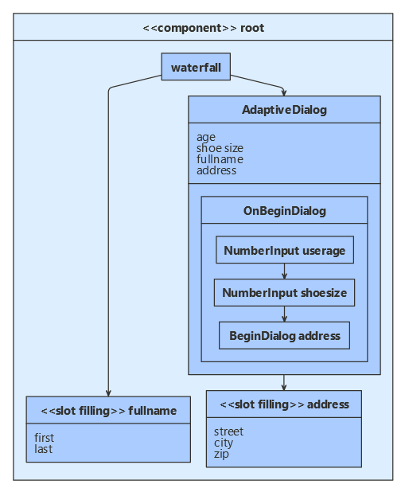

# Create a bot using adaptive, component, waterfall, and custom dialogs  

[!INCLUDE[applies-to](../includes/applies-to.md)]

All dialogs derive from a base _dialog_ class.
If you use the _dialog manager_ to run your root dialog, all of the dialog classes can work together.
This article shows how to use component, waterfall, custom, and adaptive dialogs together in one bot.

This article focuses on the code that allows these dialogs to work together. See the [additional information](#additional-information) for articles that cover each type of dialog in more detail.

## Prerequisites

- Knowledge of [bot basics][bot-basics], [managing state][concept-state], the [dialogs library][about-dialogs], and [adaptive dialogs][about-adaptive-dialogs].
- A copy of the **waterfall or custom dialog with adaptive** sample in either [**C#**][cs-sample], [**JavaScript** (preview)][js-sample]

### Preliminary steps to add an adaptive dialog to a bot

You must follow the steps described below to add an adaptive dialog to a bot.
These steps are covered in more detail in how to [create a bot using adaptive dialogs][basic-adaptive-how-to].

#### [C#](#tab/cs)

1. Update all Bot Builder NuGet packages to version 4.9.x.
1. Add the `Microsoft.Bot.Builder.Dialogs.Adaptive` package to your bot project.
1. Update the the bot adapter to add storage and the user and conversation state objects to every turn context.
1. Use a dialog manager in the bot code to start or continue the root dialog each turn.

#### [JavaScript](#tab/js)

1. Update all Bot Builder npm packages to version 4.9.x.
1. Add the `botbuilder-dialogs-adaptive` package to your bot project.
1. In the bot's on-turn handler:
   1. Create a dialog manager.
   1. Set the dialog manager's storage and user and conversation state properties.
   1. Use the dialog manager to start or continue the root dialog.

---

## About the sample

By way of illustration, this sample combines various dialog types together in one bot.
It does not demonstrate best practices for designing conversation flow.
The sample:

- Defines a custom _slot filling_ dialog class.
- Creates a root component dialog:
  - A waterfall dialog manages the top-level conversation flow.
  - Together, an adaptive dialog and 2 custom slot filling dialogs manage the rest of the conversation flow.

> [!div class="mx-imgBorder"]
> 

The custom slot-filling dialogs accept a list of properties (slots to fill). Each custom dialog will prompt for any missing values until all of the slots are filled.
The sample _binds_ a property to the adaptive dialog to allow the adaptive dialog to also fill slots.

This article focuses on how the various dialog types work together.
For information about configuring your bot to use adaptive dialogs, see how to [create a bot using adaptive dialogs][basic-adaptive-how-to].
For more on using adaptive dialogs to gather user input, see [about inputs in adaptive dialogs][about-input-dialogs].

## The custom slot-filling dialogs

A custom dialog is any dialog that derives from one of the dialogs classes in the SDK and overrides one or more of the basic dialog methods: _begin dialog_, _continue dialog_, _resume dialog_, or _end dialog_.

When you create the slot-filling dialog, you provide a list of definitions for the _slots_ the dialog will fill.
The dialog overrides the begin, continue, and resume dialog methods to iteratively prompt the user to fill each slot.
When all the slots are filled, the dialog ends and returns the collected information.

Each slot definition includes the name of the dialog prompt with which to collect the information.

The root dialog creates 2 slot-filling dialogs, one to collect the user's full name, and one to collect their address. It also creates the _text prompt_ that these two dialogs use to fill their slots.

### [C#](#tab/csharp)

**Dialogs\SlotDetails.cs**

The `SlotDetails` class describes the information to collect and the prompt with which to collect it.

[!code-csharp[slot details](~/../botbuilder-samples-adaptive/experimental/adaptive-dialog/csharp_dotnetcore/04.waterfall-or-custom-dialog-with-adaptive/Dialogs/SlotDetails.cs?range=9-39)]

**Dialogs\SlotFillingDialog.cs**

The `SlotFillingDialog` class derives from the base `Dialog` class.

It tracks the values it has collected, which slot it prompted for last, and details for the slots to fill.

[!code-csharp[slot-filling fields and constructor](~/../botbuilder-samples-adaptive/experimental/adaptive-dialog/csharp_dotnetcore/04.waterfall-or-custom-dialog-with-adaptive/Dialogs/SlotFillingDialog.cs?range=23-37)]

The core logic for collecting missing information is in the `RunPromptAsync` helper method. When all the information has been collected, it ends the dialog and returns the information.

[!code-csharp[slot-filling RunPromptAsync](~/../botbuilder-samples-adaptive/experimental/adaptive-dialog/csharp_dotnetcore/04.waterfall-or-custom-dialog-with-adaptive/Dialogs/SlotFillingDialog.cs?range=121-151&highlight=23-24,28-29)]

### [JavaScript](#tab/javascript)

**dialogs/slotDetails.js**

The `SlotDetails` class describes the information to collect and the prompt with which to collect it.

[!code-javascript[slot details](~/../botbuilder-samples-adaptive/experimental/adaptive-dialog/javascript_nodejs/04.waterfall-or-custom-dialog-with-adaptive/dialogs/slotDetails.js?range=4-26)]

**dialogs/slotFillingDialog.js**

The `SlotFillingDialog` class extends the base `Dialog` class.

[!code-javascript[slot-filling constants](~/../botbuilder-samples-adaptive/experimental/adaptive-dialog/javascript_nodejs/04.waterfall-or-custom-dialog-with-adaptive/dialogs/slotFillingDialog.js?range=7-12)]

[!code-javascript[slot-filling constructor](~/../botbuilder-samples-adaptive/experimental/adaptive-dialog/javascript_nodejs/04.waterfall-or-custom-dialog-with-adaptive/dialogs/slotFillingDialog.js?range=15-30)]

The core logic for collecting missing information is in the `RunPromptAsync` helper method.
It tracks the values it has collected, which slot it prompted for last, and details for the slots to fill.
When all the information has been collected, it ends the dialog and returns the information.

[!code-javascript[slot-filling runPrompt](~/../botbuilder-samples-adaptive/experimental/adaptive-dialog/javascript_nodejs/04.waterfall-or-custom-dialog-with-adaptive/dialogs/slotFillingDialog.js?range=84-109)]

---

For a more about implementing custom dialogs, see the discussion of the _cancel and help_ dialog in how to [handle user interruptions][interruptions-how-to].

## The root component dialog

The root dialog:

- Defines all the slots to fill, for itself, the 2 slot-filling dialogs, and the adaptive dialog.
- Creates a user state property accessor in which to save the collected information.
- Creates the adaptive dialog, the 2 slot-filling dialogs, a waterfall dialog, and the prompts to use with the waterfall and slot-filling dialogs.
- Sets the waterfall dialog as the initial dialog to run when the component first starts.

The waterfall will aggregate all the collected information and save it user state.

The waterfall and adaptive dialog are described in the following sections.

### [C#](#tab/csharp)

**Dialogs\RootDialog.cs**

The `RootDialog` class is a `ComponentDialog`. It defines the user state property in which to save the collected information.

[!code-csharp[class and constructor opening](~/../botbuilder-samples-adaptive/experimental/adaptive-dialog/csharp_dotnetcore/04.waterfall-or-custom-dialog-with-adaptive/Dialogs/RootDialog.cs?range=25-32)]

Its constructor creates an adaptive dialog `adaptiveSlotFillingDialog`. It then creates and adds the rest of the dialogs it uses and adds the adaptive dialog.

[!code-csharp[add dialogs plus closing](~/../botbuilder-samples-adaptive/experimental/adaptive-dialog/csharp_dotnetcore/04.waterfall-or-custom-dialog-with-adaptive/Dialogs/RootDialog.cs?range=121-139)]

### [JavaScript](#tab/javascript)

**dialogs/rootDialog.js**

The `RootDialog` class extends `ComponentDialog`. It defines the user state property in which to save the collected information.

[!code-javascript[class and constructor opening](~/../botbuilder-samples-adaptive/experimental/adaptive-dialog/javascript_nodejs/04.waterfall-or-custom-dialog-with-adaptive/dialogs/rootDialog.js?range=16-23)]

Its constructor creates an adaptive dialog `adaptiveSlotFillingDialog`. It then creates and adds the rest of the dialogs it uses and adds the adaptive dialog.

[!code-javascript[add dialogs plus closing](~/../botbuilder-samples-adaptive/experimental/adaptive-dialog/javascript_nodejs/04.waterfall-or-custom-dialog-with-adaptive/dialogs/rootDialog.js?range=89-111)]

---

## The waterfall dialog

The waterfall dialog contains 3 steps:

1. Start the "fullname" slot-filling dialog, which will gather and return the user's full name.
1. Record the user's name and start the adaptive dialog, which will gather the rest of the user's information.
1. Write the user's information to the user state property accessor and summarize to the user the collected information.

### [C#](#tab/csharp)

**Dialogs\RootDialog.cs**

[!code-csharp[Waterfall steps](~/../botbuilder-samples-adaptive/experimental/adaptive-dialog/csharp_dotnetcore/04.waterfall-or-custom-dialog-with-adaptive/Dialogs/RootDialog.cs?range=159-199)]

### [JavaScript](#tab/javascript)

---

## The adaptive dialog

The adaptive dialog defines one trigger that runs when the dialog starts. The trigger will run these actions:

1. Use an input dialog to ask for the user's age.
1. Use an input dialog to ask for the user's shoe size.
1. Start the "address" slot-filling dialog to collect the user's address.
1. Set trigger's result value and end.

Since no other actions will be queued, the adaptive dialog will also end and return this result value.

The adaptive dialog uses a language generator to format text and include values from bot and dialog state.

### [C#](#tab/csharp)

**Dialogs\RootDialog.cs**

[!code-csharp[adaptive dialog and triggers](~/../botbuilder-samples-adaptive/experimental/adaptive-dialog/csharp_dotnetcore/04.waterfall-or-custom-dialog-with-adaptive/Dialogs/RootDialog.cs?range=60-119&hihglight=3,7,10)]

### [JavaScript](#tab/javascript)

---

## To test the bot

1. If you have not done so already, install the [Bot Framework Emulator](https://aka.ms/bot-framework-emulator-readme).
1. Run the sample locally on your machine.
1. Start the emulator, connect to your bot, and respond to the prompts: first and last name, shoe size, street, city, and zip.
1. The bot will display the information it collected.
1. Send the bot any message to start the process over again.

## Additional information

For more information on how to use each dialog type, see:

| Dialog type | Article
|:-|:-
| Adaptive and input dialogs | [Create a bot using adaptive dialogs][basic-adaptive-how-to].
| Component dialogs | [Manage dialog complexity][component-how-to]
| Custom dialogs | [Handle user interruptions][interruptions-how-to]
| Waterfall and prompt dialogs | [Implement sequential conversation flow][basic-dialog-how-to]

<!--
## Next steps
> [!div class="nextstepaction"]
> [TBD](tbd.md)
-->

<!-- Footnote-style links -->

[bot-basics]: bot-builder-basics.md
[about-dialogs]: bot-builder-concept-dialog.md
[about-adaptive-dialogs]: tbd.md
[about-input-dialogs]: tbd.md

[basic-adaptive-how-to]: bot-builder-dialogs-adaptive.md
[basic-dialog-how-to]: bot-builder-dialog-manage-conversation-flow.md
[component-how-to]: bot-builder-compositcontrol.md
[interruptions-how-to]: bot-builder-howto-handle-user-interrupt.md

[cs-sample]: https://github.com/microsoft/BotBuilder-Samples/tree/vishwac/r9/js/experimental/adaptive-dialog/csharp_dotnetcore/04.waterfall-or-custom-dialog-with-adaptive
[js-sample]: https://github.com/microsoft/BotBuilder-Samples/tree/vishwac/r9/js/experimental/adaptive-dialog/javascript_nodejs/19.custom-dialogs
