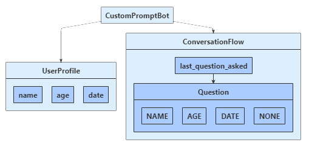

# Create your own prompts to gather user input

[!INCLUDE[applies-to](../includes/applies-to.md)]

A conversation between a bot and a user often involves asking (prompting) the user for information, parsing the user's response, and then acting on that information. Your bot should track the context of a conversation, so that it can manage its behavior and remember answers to previous questions. A bot's *state* is information it tracks to respond appropriately to incoming messages.

> [!TIP]
> The dialogs library provides built in prompts that provide more functionality that users can use. Examples of those prompts can be found in the [Implement sequential conversation flow](bot-builder-dialog-manage-conversation-flow.md) article.

## Prerequisites

- The code in this article is based on the Prompt Users for Input sample. You'll need a copy of either the **[C# sample](https://aka.ms/cs-primitive-prompt-sample), [JavaScript sample](https://aka.ms/js-primitive-prompt-sample), or [Python sample](https://aka.ms/python-primitive-prompt-sample)**.
- Knowledge of [managing state](bot-builder-concept-state.md) and how to [save user and conversation data](bot-builder-howto-v4-state.md).

## About the sample code

The sample bot asks the user a series of questions, validates some of their answers, and saves their input. The following diagram shows the relationship between the bot, user profile, and conversation flow classes.

## [C#](#tab/csharp)

- A `UserProfile` class for the user information that the bot will collect.
- A `ConversationFlow` class to control our conversation state while gathering user information.
- An inner `ConversationFlow.Question` enumeration for tracking where we are in the conversation.

## [JavaScript](#tab/javascript)

- A `userProfile` class for the user information that the bot will collect.
- A `conversationFlow` class to control our conversation state while gathering user information.
- An inner `conversationFlow.question` enumeration for tracking where we are in the conversation.

## [Python](#tab/python)

- A `UserProfile` class for the user information that the bot will collect.
- A `ConversationFlow` class to control our conversation state while gathering user information.
- An inner `ConversationFlow.Question` enumeration for tracking where we are in the conversation.

---

The user state will track the user's name, age, and chosen date, and conversation state will track what we've just asked the user.
Since we don't plan to deploy this bot, we'll configure both user and conversation state to use _memory storage_.

We use the bot's message turn handler plus user and conversation state properties to manage the flow of the conversation and the collection of input. In our bot, we'll record the state property information received during each iteration of the message turn handler.

## Create conversation and user objects

## [C#](#tab/csharp)

Create the user and conversation state objects at startup and consume them via dependency injection in the bot constructor.

**Startup.cs**  
[!code-csharp[Startup.cs](~/../botbuilder-samples/samples/csharp_dotnetcore/44.prompt-users-for-input/Startup.cs?range=28-35)]

**Bots/CustomPromptBot.cs**  
[!code-csharp[constructor](~/../botbuilder-samples/samples/csharp_dotnetcore/44.prompt-users-for-input/Bots/CustomPromptBot.cs?range=21-28)]

## [JavaScript](#tab/javascript)

Create the user and conversation state objects in **index.js** and consume them in the bot constructor.

**index.js**
[!code-javascript[index.js](~/../botbuilder-samples/samples/javascript_nodejs/44.prompt-for-user-input/index.js?range=33-39)]

**bots/customPromptBot.js**
[!code-javascript[constructor](~/../botbuilder-samples/samples/javascript_nodejs/44.prompt-for-user-input/index.js?range=20-22)]
[!code-javascript[constructor](~/../botbuilder-samples/samples/javascript_nodejs/44.prompt-for-user-input/index.js?range=27-29)]

## [Python](#tab/python)

Create the user and conversation state objects in **app.py** and consume them in the bot constructor.

**app.py**
[!code-python[app.py](~/../botbuilder-samples/samples/python/44.prompt-for-user-input/app.py?range=67-73)]

**bots/custom_prompt_bot.py**
[!code-python[constructor](~/../botbuilder-samples/samples/python/44.prompt-for-user-input/bots/custom_prompt_bot.py?range=29-41)]

---

## Create property accessors

## [C#](#tab/csharp)

Create property accessors for the user profile and conversation flow properties and then call `GetAsync` to retrieve the property value from state.

**Bots/CustomPromptBot.cs**
[!code-csharp[OnMessageActivityAsync](~/../botbuilder-samples/samples/csharp_dotnetcore/44.prompt-users-for-input/Bots/CustomPromptBot.cs?range=30-37)]

Before the turn ends, call `SaveChangesAsync` to write any state changes to storage.

[!code-csharp[OnMessageActivityAsync](~/../botbuilder-samples/samples/csharp_dotnetcore/44.prompt-users-for-input/Bots/CustomPromptBot.cs?range=41-44)]

## [JavaScript](#tab/javascript)

Create property accessors for the user profile and conversation flow properties and then call `get` to retrieve the property value from state.

**bots/customPromptBot.js**
[!code-javascript[onMessage](~/../botbuilder-samples/samples/javascript_nodejs/44.prompt-for-user-input/bots/customPromptBot.js?range=31-33)]

Before the turn ends, call `saveChanges` to write any state changes to storage.

[!code-javascript[custom prompt bot](~/../botbuilder-samples/samples/javascript_nodejs/44.prompt-for-user-input/bots/customPromptBot.js?range=42-51)]

## [Python](#tab/python)

In the constructor, we create the state property accessors and set up the state management objects (created above) for our conversation.

**bots/custom_prompt_bot.py**
[!code-python[on_message_activity](~/../botbuilder-samples/samples/python/44.prompt-for-user-input/bots/custom_prompt_bot.py?range=46-49)]

Before the turn ends, call `SaveChangesAsync` to write any state changes to storage.

[!code-python[on_message_activity](~/../botbuilder-samples/samples/python/44.prompt-for-user-input/bots/custom_prompt_bot.py?range=53-55)]

---

## The bot's message turn handler

When handling message activities, the message handler uses a helper method to manage the conversation and prompt the user. The helper method is described in the following section.

## [C#](#tab/csharp)

**Bots/CustomPromptBot.cs**  
[!code-csharp[message handler](~/../botbuilder-samples/samples/csharp_dotnetcore/44.prompt-users-for-input/Bots/CustomPromptBot.cs?range=30-44)]

## [JavaScript](#tab/javascript)

**bots/customPromptBot.js**  
[!code-javascript[message handler](~/../botbuilder-samples/samples/javascript_nodejs/44.prompt-for-user-input/bots/customPromptBot.js?range=31-39)]

## [Python](#tab/python)

**bots/custom_prompt_bot.py**
[!code-python[message handler](~/../botbuilder-samples/samples/python/44.prompt-for-user-input/bots/custom_prompt_bot.py?range=46-55)]

---

## Filling out the user profile

The bot prompts the user for information, based on which question, if any, that the bot asked on the previous turn. Input is parsed using a validation method.

Each validation method follows a similar design:

- The return value indicates whether the input is a valid answer for this question.
- If validation passes, it produces a parsed and normalized value to save.
- If validation fails, it produces a message with which the bot can ask for the information again.

The validation methods are described in the following section.

## [C#](#tab/csharp)

**Bots/CustomPromptBot.cs**  
[!code-csharp[FillOutUserProfileAsync](~/../botbuilder-samples/samples/csharp_dotnetcore/44.prompt-users-for-input/Bots/CustomPromptBot.cs?range=46-103)]

## [JavaScript](#tab/javascript)

**bots/customPromptBot.js**  
[!code-javascript[fillOutUserProfile](~/../botbuilder-samples/samples/javascript_nodejs/44.prompt-for-user-input/bots/customPromptBot.js?range=53-118)]

## [Python](#tab/python)

**bots/custom_prompt_bot.py**
[!code-python[_fill_out_user_profile](~/../botbuilder-samples/samples/python/44.prompt-for-user-input/bots/custom_prompt_bot.py?range=57-125)]

---

## Parse and validate input

The bot uses the following criteria to validate input.

- The **name** must be a non-empty string. It's normalized by trimming white-space.
- The **age** must be between 18 and 120. It's normalized by returning an integer.
- The **date** must be any date or time at least an hour in the future.
  It's normalized by returning just the date portion of the parsed input.

> [!NOTE]
> For the age and date input, we use the [Microsoft/Recognizers-Text](https://github.com/Microsoft/Recognizers-Text/) libraries to perform the initial parsing.
> While we provide sample code, we do not explain how the text recognizers libraries work, and this is just one way to parse the input.
> For more information about these libraries, see the repository's **README**.

## [C#](#tab/csharp)

**Bots/CustomPromptBot.cs**  
[!code-csharp[validation methods](~/../botbuilder-samples/samples/csharp_dotnetcore/44.prompt-users-for-input/Bots/CustomPromptBot.cs?range=105-203)]

## [JavaScript](#tab/javascript)

**bots/customPromptBot.cs**  
[!code-javascript[validation methods](~/../botbuilder-samples/samples/javascript_nodejs/44.prompt-for-user-input/bots/customPromptBot.js?range=120-190)]

## [Python](#tab/python)

**bots/custom_prompt_bot.py**
[!code-python[validation methods](~/../botbuilder-samples/samples/python/44.prompt-for-user-input/bots/custom_prompt_bot.py?range=127-189)]

---

## Test the bot locally

Download and install the [Bot Framework Emulator](https://aka.ms/bot-framework-emulator-readme) to test the bot locally.

1. Run the sample locally on your machine. If you need instructions, refer to the README file for [C# sample](https://aka.ms/cs-primitive-prompt-sample), [JS sample](https://aka.ms/js-primitive-prompt-sample), or the [Python sample](https://aka.ms/python-primitive-prompt-sample).
1. Test it using the emulator as shown below.

## Additional resources

The [Dialogs library](bot-builder-concept-dialog.md) provides classes that automate many aspects of managing conversations.

## Next step

> [!div class="nextstepaction"]
> [Implement sequential conversation flow](bot-builder-dialog-manage-conversation-flow.md)
