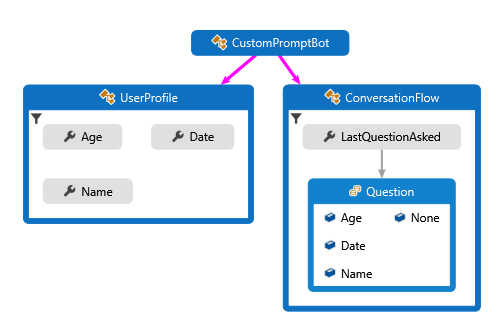
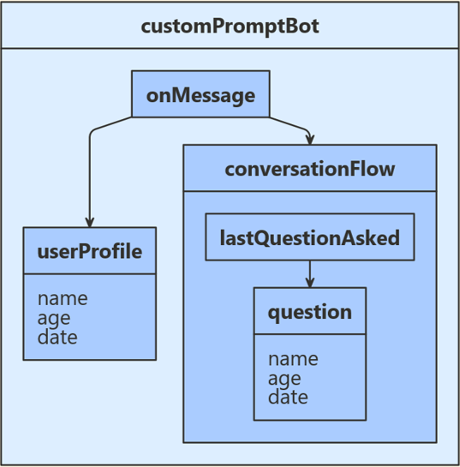
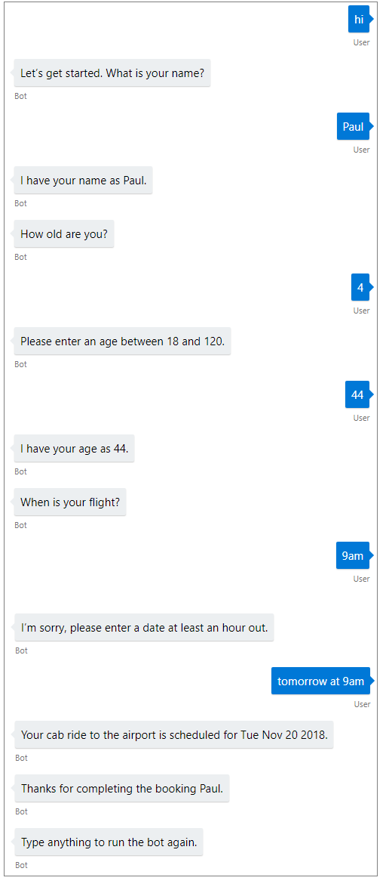

# Create your own prompts to gather user input

[!INCLUDE[applies-to](../includes/applies-to.md)]

A conversation between a bot and a user often involves asking (prompting) the user for information, parsing the user's response, and then acting on that information. Your bot should track the context of a conversation, so that it can manage its behavior and remember answers to previous questions. A bot's *state* is information it tracks to respond appropriately to incoming messages. 

> [!TIP]
> The dialogs library provides built in prompts that provide more functionality that users can use. Examples of those prompts can be found in the [Implement sequential conversation flow](bot-builder-dialog-manage-conversation-flow.md) article.

## Prerequisites

- The code in this article is based on the Prompt Users for Input sample. You'll need a copy of either the **[C# Sample](https://aka.ms/cs-primitive-prompt-sample) or [JavaScript Sample](https://aka.ms/js-primitive-prompt-sample)**.
- Knowledge of [managing state](bot-builder-concept-state.md) and how to [save user and conversation data](bot-builder-howto-v4-state.md).

## About the sample code

The sample bot asks the user a series of questions, validates some of their answers, and saves their input. The following diagram shows the relationship between the bot, user profile, and conversation flow classes. 

## [C#](#tab/csharp)

- A `UserProfile` class for the user information that the bot will collect.
- A `ConversationFlow` class to control our conversation state while gathering user information.
- An inner `ConversationFlow.Question` enumeration for tracking where we are in the conversation.

## [JavaScript](#tab/javascript)

- A `userProfile` class for the user information that the bot will collect.
- A `conversationFlow` class to control our conversation state while gathering user information.
- An inner `conversationFlow.question` enumeration for tracking where we are in the conversation.

---

The user state will track the user's name, age, and chosen date, and conversation state will track what we've just asked the user.
Since we don't plan to deploy this bot, we'll configure both user and conversation state to use _memory storage_. 

We use the bot's message turn handler plus user and conversation state properties to manage the flow of the conversation and the collection of input. In our bot, we'll record the state property information received during each iteration of the message turn handler.

## Create conversation and user objects

## [C#](#tab/csharp)

The user and conversation state objects are created at startup and dependency injected into the bot constructor. 

**Startup.cs**  
[!code-csharp[Startup](~/../botbuilder-samples/samples/csharp_dotnetcore/44.prompt-users-for-input/Startup.cs?range=27-34)]

**Bots/CustomPromptBot.cs**  
[!code-csharp[custom prompt bot](~/../botbuilder-samples/samples/csharp_dotnetcore/44.prompt-users-for-input/Bots/CustomPromptBot.cs?range=21-28)]

## [JavaScript](#tab/javascript)

In **index.js**, create the state properties and the bot, then call the `run` bot method from within `processActivity`.

[!code-javascript[custom prompt bot](~/../botbuilder-samples/samples/javascript_nodejs/44.prompt-for-user-input/index.js?range=32-35)]

[!code-javascript[custom prompt bot](~/../botbuilder-samples/samples/javascript_nodejs/44.prompt-for-user-input/index.js?range=55-58)]

---

## Create property accessors

## [C#](#tab/csharp)

We begin by creating property accessors that give us a handle to the `BotState` inside the `OnMessageActivityAsync` method. Then, we call the `GetAsync` method to get the properly scoped key:

**Bots/CustomPromptBot.cs**  
[!code-csharp[custom prompt bot](~/../botbuilder-samples/samples/csharp_dotnetcore/44.prompt-users-for-input/Bots/CustomPromptBot.cs?range=30-37)]

And finally, we save the data using the `SaveChangesAsync` method.

[!code-csharp[custom prompt bot](~/../botbuilder-samples/samples/csharp_dotnetcore/44.prompt-users-for-input/Bots/CustomPromptBot.cs?range=42-43)]

## [JavaScript](#tab/javascript)

In the constructor, we create the state property accessors and set up the state management objects (created above) for our conversation.

**bots/customPromptBot.js**  
[!code-javascript[custom prompt bot](~/../botbuilder-samples/samples/javascript_nodejs/44.prompt-for-user-input/bots/customPromptBot.js?range=23-29)]

Then, we define a second handler, `onDialog`, to run after the main message handler (explained in the next section). This second handler makes sure we save our state every turn.

[!code-javascript[custom prompt bot](~/../botbuilder-samples/samples/javascript_nodejs/44.prompt-for-user-input/bots/customPromptBot.js?range=41-48)]

---

## The bot's message turn handler

## [C#](#tab/csharp)

To handle message activities, we use the helper method _FillOutUserProfileAsync()_ before saving the state using _SaveChangesAsync()_. Here is the complete code.

**Bots/CustomPromptBot.cs**  
[!code-csharp[custom prompt bot](~/../botbuilder-samples/samples/csharp_dotnetcore/44.prompt-users-for-input/Bots/CustomPromptBot.cs?range=30-44)]

## [JavaScript](#tab/javascript)

To handle message activities, we set up our conversation and user data then use the helper method `fillOutUserProfile()`. Here's the complete code for the turn handler.

**bots/customPromptBot.js**  
[!code-javascript[custom prompt bot](~/../botbuilder-samples/samples/javascript_nodejs/44.prompt-for-user-input/bots/customPromptBot.js?range=31-39)]
---

## Filling out the user profile

We'll start by collecting information. Each one will provide a similar interface.

- The return value indicates whether the input is a valid answer for this question.
- If validation passes, it produces a parsed and normalized value to save.
- If validation fails, it produces a message with which the bot can ask for the information again.

 In the next section, we'll define the helper methods to parse and validate user input.

## [C#](#tab/csharp)

**Bots/CustomPromptBot.cs**  
[!code-csharp[custom prompt bot](~/../botbuilder-samples/samples/csharp_dotnetcore/44.prompt-users-for-input/Bots/CustomPromptBot.cs?range=46-103)]

## [JavaScript](#tab/javascript)

**bots/customPromptBot.js**  
[!code-javascript[custom prompt bot](~/../botbuilder-samples/samples/javascript_nodejs/44.prompt-for-user-input/bots/customPromptBot.js?range=52-116)]

---

## Parse and validate input

We'll use the following criteria to validate input.

- The **name** must be a non-empty string. We'll normalize by trimming white-space.
- The **age** must be between 18 and 120. We'll normalize by returning an integer.
- The **date** must be any date or time at least an hour in the future.
  We'll normalize by returning just the date portion of the parsed input.

> [!NOTE]
> For the age and date input, we use the [Microsoft/Recognizers-Text](https://github.com/Microsoft/Recognizers-Text/) libraries to perform the initial parsing.
> While we provide sample code, we do not explain how the text recognizers libraries work, and this is just one way to parse the input.
> For more information about these libraries, see the repository's **README**.

## [C#](#tab/csharp)

Add the following validation methods to your bot.

**Bots/CustomPromptBot.cs**  
[!code-csharp[custom prompt bot](~/../botbuilder-samples/samples/csharp_dotnetcore/44.prompt-users-for-input/Bots/CustomPromptBot.cs?range=105-203)]

## [JavaScript](#tab/javascript)

**bots/customPromptBot.cs**  
[!code-javascript[custom prompt bot](~/../botbuilder-samples/samples/javascript_nodejs/44.prompt-for-user-input/bots/customPromptBot.js?range=118-189)]

---

## Test the bot locally
Download and install the [Bot Framework Emulator](https://aka.ms/bot-framework-emulator-readme) to test the bot locally.

1. Run the sample locally on your machine. If you need instructions, refer to the README file for [C# sample](https://aka.ms/cs-primitive-prompt-sample) or [JS sample](https://aka.ms/js-primitive-prompt-sample) sample.
1. Test it using the emulator as shown below.

## Additional resources

The [Dialogs library](bot-builder-concept-dialog.md) provides classes that automate many aspects of managing conversations. 

## Next step

> [!div class="nextstepaction"]
> [Implement sequential conversation flow](bot-builder-dialog-manage-conversation-flow.md)
