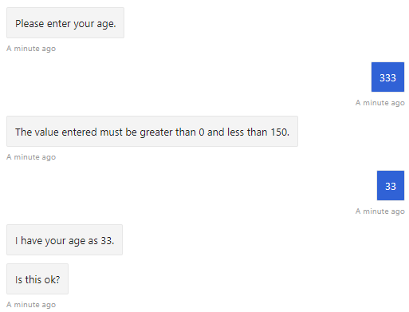

<!--

title: Gather user input using a dialog prompt| Microsoft Docs
description: Learn how to prompt users for input using the Dialogs library in the Bot Framework SDK.
keywords: prompts, prompt, user input, dialogs, AttachmentPrompt, ChoicePrompt, ConfirmPrompt, DatetimePrompt, NumberPrompt, TextPrompt, reprompt, validation
author: JonathanFingold
ms.author: v-jofing
manager: kamrani
ms.topic: article
ms.service: bot-service
ms.subservice: sdk
ms.date: 03/21/2019
monikerRange: 'azure-bot-service-4.0'

# Gather user input using a dialog prompt

[!INCLUDE[applies-to](../includes/applies-to.md)]

Gathering information by posing questions is one of the main ways a bot interacts with users. The *dialogs* library makes it easy to ask questions, as well as validate the response to make sure it matches a specific data type or meets custom validation rules. This topic details how to create prompts and call them from a waterfall dialog.

The code in this article uses a dialog to cycle through these steps:

- Ask the user for their mode of transportation, using a _choice prompt_.
- Ask the user for their name, using a _text prompt_.
- Ask the user if they want to provide their age, using a _confirm prompt_.
- If they answered yes, asks for their age, using a _number prompt_ with validation; otherwise, skip to the next step.
- Asks if the collected information is "ok", reusing the _confirm prompt_.
- If they answered yes, displays the collected information; otherwise, tell the user that their information will not be kept.

In addition, the age prompt includes validation to only accept ages greater than 0 and less than 150.

### About dialog prompts

Prompts, within the dialogs library, provide an easy way to ask the user for information and evaluate their response. For example for a number prompt, you specify the question or information you are asking for, and the prompt automatically checks to see if it received a valid number response. If it did, the conversation can continue; if it didn't, it will re-prompt the user for a valid answer.

Behind the scenes, prompts are a two-step dialog. First, the prompt asks for input; second, it returns the valid value, or starts over from the beginning with a reprompt.

A dialog can use a prompt only if both the dialog and prompt are in the same dialog set. You can use the same prompt in multiple steps within a dialog and in multiple dialogs in the same dialog set. However, you associate custom validation with a prompt at initialization time. To use different validation for the same type of prompt, you need multiple instances of the prompt type, each with its own validation code.

- For more about prompts, see [prompts](bot-builder-concept-dialog.md#prompts) and [waterfall dialogs](bot-builder-concept-dialog.md#waterfall-dialogs).
- For information about asking the user questions without using the dialogs library, see [Create your own prompts to gather user input](bot-builder-primitive-prompts.md).

## Prerequisites

- Knowledge of [bot basics][concept-basics], [managing state][concept-state], the [dialogs library][concept-dialogs], and how to [manage conversations][simple-flow].
- A copy of the **multi-turn prompt** sample in either [**CSharp**][cs-sample] or [**JavaScript**][js-sample].

## Ask questions with prompts

In the multi-turn prompt sample, we use a _waterfall dialog_, a few _prompts_, and a _component dialog_ to create a simple interaction that asks the user a series of questions.

# [C#](#tab/csharp)

In this sample, we have a bot that interacts with the user via a dialog. When we create the `DialogBot`, we will set the `UserProfileDialog` as its main dialog. The bot then uses a `Run` helper method to access the dialog.


**UserProfile.cs**

The dialog used in this article prompts the user for their mode of transport, name, and age. We save this information in a `UserProfile` class.

```csharp
public class UserProfile
{
    public string Transport { get; set; }
    public string Name { get; set; }
    public int Age { get; set; }
}
```

**Dialogs\\UserProfileDialog.cs**

> [!NOTE]
> To use dialogs, your project needs to install the **Microsoft.Bot.Builder.Dialogs** NuGet package.

We create the `UserProfileDialog` that derives from the `ComponentDialog` class, and has 6 steps.

In the `UserProfileDialog` constructor, create the waterfall steps, prompts and the waterfall dialog, and add them to the dialog set. Note that an instance of the prompt needs to be added to the dialog set in which you want to use it. You can associate a custom validator with the prompt at initialization time, which we have done for the _number prompt_.

```csharp
private IStatePropertyAccessor<UserProfile> _userProfileAccessor;

public UserProfileDialog(UserState userState)
    : base("root")
{
    _userProfileAccessor = userState.CreateProperty<UserProfile>("UserProfile");

    // This array defines how the Waterfall will execute.
    var waterfallSteps = new WaterfallStep[]
    {
        TransportStepAsync,
        NameStepAsync,
        NameConfirmStepAsync,
        AgeStepAsync,
        ConfirmStepAsync,
        SummaryStepAsync,
    };

    // Add named dialogs to the DialogSet. These names are saved in the dialog state.
    AddDialog(new WaterfallDialog(nameof(WaterfallDialog), waterfallSteps));
    AddDialog(new TextPrompt(nameof(TextPrompt)));
    AddDialog(new NumberPrompt<int>(nameof(NumberPrompt<int>), AgePromptValidatorAsync));
    AddDialog(new ChoicePrompt(nameof(ChoicePrompt)));
    AddDialog(new ConfirmPrompt(nameof(ConfirmPrompt)));

    // The initial child Dialog to run.
    InitialDialogId = nameof(WaterfallDialog);
}
```

Next, we implement the steps that the dialog uses. To use a prompt, call it from a step in your dialog and retrieve the prompt result in the following step. Here we show the age prompt validator, part of the step that asks for the user's age, and part of the following step that saves the user's response.

> [!IMPORTANT]
> You should always return a non-null `DialogTurnResult` from a waterfall step. If you do not, your dialog may not work as designed.

```csharp
private static Task<bool> AgePromptValidatorAsync(
    PromptValidatorContext<int> promptContext,
    CancellationToken cancellationToken)
{
    // This condition is our validation rule. You can also change the value at this point.
    return Task.FromResult(promptContext.Recognized.Value >= 0 && promptContext.Recognized.Value < 150);
}

private async Task<DialogTurnResult> AgeStepAsync(
    WaterfallStepContext stepContext,
    CancellationToken cancellationToken)
{
    // ...
    var promptOptions = new PromptOptions
    {
        Prompt = MessageFactory.Text("Please enter your age."),
        RetryPrompt = MessageFactory.Text("The value entered must be greater than 0 and less than 150."),
    };

    return await stepContext.PromptAsync(nameof(NumberPrompt<int>), promptOptions, cancellationToken);
    // ...
}

private async Task<DialogTurnResult> ConfirmStepAsync(
    WaterfallStepContext stepContext,
    CancellationToken cancellationToken)
{
    stepContext.Values["age"] = (int)stepContext.Result;
    // ...
}
```

In the last two steps of the dialog, we ask the user if the collected information is correct, and if it is, we update the user's profile in the bot's user state.

```csharp
private async Task<DialogTurnResult> ConfirmStepAsync(
    WaterfallStepContext stepContext,
    CancellationToken cancellationToken)
{
    stepContext.Values["age"] = (int)stepContext.Result;

    // We can send messages to the user at any point in the WaterfallStep.
    var msg = (int)stepContext.Values["age"] == -1
                ? "No age given."
                : $"I have your age as {stepContext.Values["age"]}.";

    // We can send messages to the user at any point in the WaterfallStep.
    await stepContext.Context.SendActivityAsync(MessageFactory.Text(msg), cancellationToken);

    // WaterfallStep always finishes with the end of the Waterfall or with another dialog.
    return await stepContext.PromptAsync(
        nameof(ConfirmPrompt),
        new PromptOptions { Prompt = MessageFactory.Text("Is this ok?") },
        cancellationToken);
}

private async Task<DialogTurnResult> SummaryStepAsync(
    WaterfallStepContext stepContext,
    CancellationToken cancellationToken)
{
    if ((bool)stepContext.Result)
    {
        // Get the current profile object from user state.
        var userProfile = await _userProfileAccessor.GetAsync(
            stepContext.Context,
            () => new UserProfile(),
            cancellationToken);

        userProfile.Transport = (string)stepContext.Values["transport"];
        userProfile.Name = (string)stepContext.Values["name"];
        userProfile.Age = (int)stepContext.Values["age"];

        var msg = $"I have your mode of transport as {userProfile.Transport} and your name as {userProfile.Name}.";
        if (userProfile.Age != -1)
        {
            msg += $" And age as {userProfile.Age}.";
        }

        await stepContext.Context.SendActivityAsync(MessageFactory.Text(msg), cancellationToken);
    }
    else
    {
        await stepContext.Context.SendActivityAsync(MessageFactory.Text("Thanks. Your profile will not be kept."), cancellationToken);
    }

    // WaterfallStep always finishes with the end of the Waterfall or with another dialog, here it is the end.
    return await stepContext.EndDialogAsync(cancellationToken: cancellationToken);
}
```

# [JavaScript](#tab/javascript)

```javascript
// some code
```

---

### Use the dialog in the bot

For a description of how to add a dialog to a bot, see how to [implement sequential conversation flow][simple-flow].

## To test the bot

1. If you have not done so already, install the [Bot Framework Emulator](https://aka.ms/bot-framework-emulator-readme).
1. Run the sample locally on your machine.
1. Start the emulator, connect to your bot, and send messages. Shown below is part of a conversation that demonstrates prompt validation at work.



## Additional information

### More about prompts

The second parameter of the step context's _prompt_ method takes a _prompt options_ object, which has the following properties.

| Property | Description |
| :--- | :--- |
| _prompt_ | The initial activity to send the user, to ask for their input. |
| _retry prompt_ | The activity to send the user if their first input did not validate. |
| _choices_ | A list of choices for the user to choose from, for use with a choice prompt. |
| _validations_ | Additional parameters to use with a custom validator. |

In general, the prompt and retry prompt properties are activities, though there is some variation on how this is handled in different programming languages.

You should always specify the initial prompt activity to send the user.

Specifying a retry prompt is useful for when the user's input fails to validate, either because it is in a format that the prompt can not parse, such as "tomorrow" for a number prompt, or the input fails a validation criteria. In this case, if no retry prompt was provided, the prompt will use the initial prompt activity to re-prompt the user for input.

For a choice prompt, you should always provide the list of available choices.

### Custom validation

You can validate a prompt response before returning the value to the next step of the **waterfall**. A validator function has a _prompt validator context_ parameter and returns a Boolean, indicating whether the input passes validation.

The prompt validator context includes the following properties:

| Property | Description |
| :--- | :--- |
| _Context_ | The current turn context for the bot. |
| _Recognized_ | A _prompt recognizer result_ that contains information about the user input, as processed by the recognizer. |
| _Options_ | Contains the _prompt options_ that were provided in the call to start the prompt. |

The prompt recognizer result has the following properties:

| Property | Description |
| :--- | :--- |
| _Succeeded_ | Indicates whether the recognizer was able to parse the input. |
| _Value_ | The return value from the recognizer. If necessary, the validation code can modify this value. |

### Implement validation code

You associate custom validation with a prompt at initialization time, when you add it to the dialog set.

For instance, if we had a component dialog for making reservations, we might add the following prompts.

```csharp
AddDialog(new NumberPrompt<int>("partySizePrompt", RangeValidatorAsync));
AddDialog(new DateTimePrompt("datePrompt", DateValidatorAsync));
```

#### Prompt validation with validation parameters

We can dynamically limit the size of parties that can make a reservation by providing a _validations_ parameter when we call the party size prompt.

```csharp
public class Range
{
    public int Min { get; set; }
    public int Max { get; set; }
}
```

```csharp
private static async Task<DialogTurnResult> PartySizeStepAsync(
    WaterfallStepContext stepContext,
    CancellationToken cancellationToken)
{
    var
    return await stepContext.PromptAsync(
        "partySizePrompt",
        new PromptOptions
        {
            Prompt = MessageFactory.Text("Please enter the size of your party."),
            Validations = new Range { Min = 3, Max = 8 },
        },
        cancellationToken);
}
```

Of note, all of the prompt options are available to the validator via the prompt validator context's `Options` property. Also, if the validator generates an activity, the prompt will use that, instead of its retry prompt.

```csharp
// Validates whether the party size is appropriate to make a reservation.
private async Task<bool> RangeValidatorAsync(
    PromptValidatorContext<int> promptContext,
    CancellationToken cancellationToken)
{
    // Check whether the party size is appropriate.
    var size = promptContext.Recognized.Value;
    var validRange = promptContext.Options.Validations as Range;
    if (size < validRange.Min || size > validRange.Max)
    {
        await promptContext.Context.SendActivityAsync(
            MessageFactory.Text("Sorry, we can only take reservations for parties " +
                $"of {validRange.Min} to {validRange.Max}."),
            cancellationToken);
        await promptContext.Context.SendActivityAsync(
            promptContext.Options.Prompt,
            cancellationToken);
        return false;
    }

    return true;
}
```

You can use the similar techniques to validate prompt responses for any of the prompt types.

#### Date time validation

In the reservation date validator, we limit reservations to an hour or more from the current time. We are keeping the first resolution that matches our criteria, and clearing the rest.

This validation code is not exhaustive, and it works best for input that parses to a date and time. It does demonstrate some of the options for validating a date-time prompt, and your implementation will depend on what information you are trying to collect from the user.


```csharp
// Validates whether the reservation date is appropriate.
private async Task<bool> DateValidatorAsync(
    PromptValidatorContext<IList<DateTimeResolution>> promptContext,
    CancellationToken cancellationToken = default(CancellationToken))
{
    // Check whether any of the recognized date-times are appropriate,
    // and if so, return the first appropriate date-time.
    var earliest = DateTime.Now.AddHours(1.0);
    var value = promptContext.Recognized.Value.FirstOrDefault(v =>
        DateTime.TryParse(v.Value ?? v.Start, out var time) && DateTime.Compare(earliest, time) <= 0);

    if (value != null)
    {
        promptContext.Recognized.Value.Clear();
        promptContext.Recognized.Value.Add(value);
        return true;
    }

    await promptContext.Context.SendActivityAsync(
        "I'm sorry, we can't take reservations earlier than an hour from now.",
        cancellationToken);

    return false;
}
```

The date-time prompt returns a list or array of the possible _date-time resolutions_ that match the user input. For example, 9:00 could mean 9 AM or 9 PM, and Sunday is also ambiguous. In addition, a date-time resolution can represent a date, a time, a date-time, or a range. The date-time prompt uses the [Microsoft/Recognizers-Text](https://github.com/Microsoft/Recognizers-Text) to parse the user input.

### Further reading


The dialog library also includes an _OAuth prompt_ for obtaining an _OAuth token_ with which to access another application on behalf of the user. The authentication prompt is used differently. For more about authentication, see how to [add authentication](bot-builder-authentication.md) to your bot.

## Next steps

> [!div class="nextstepaction"]
> [Create advanced conversation flow using branches and loops](bot-builder-dialog-manage-complex-conversation-flow.md)

[concept-basics]: bot-builder-basics.md
[concept-state]: bot-builder-concept-state.md
[concept-dialogs]: bot-builder-concept-dialog.md

[simple-flow]: bot-builder-dialog-manage-conversation-flow.md
[prompting]: bot-builder-prompts.md
[component-dialogs]: bot-builder-compositcontrol.md

[cs-sample]: https://aka.ms/cs-multi-prompts-sample
[js-sample]: https://aka.ms/js-multi-prompts-sample

-->
