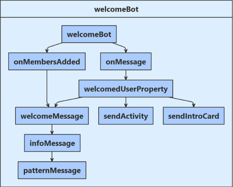
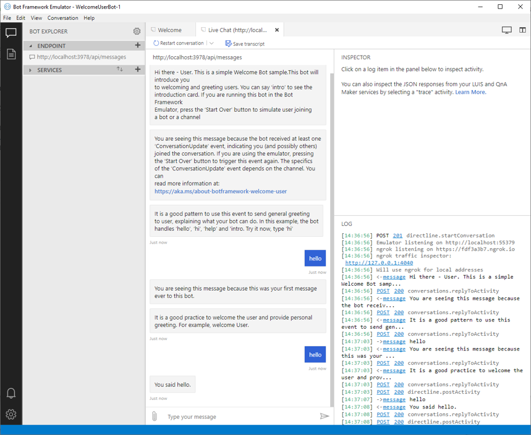
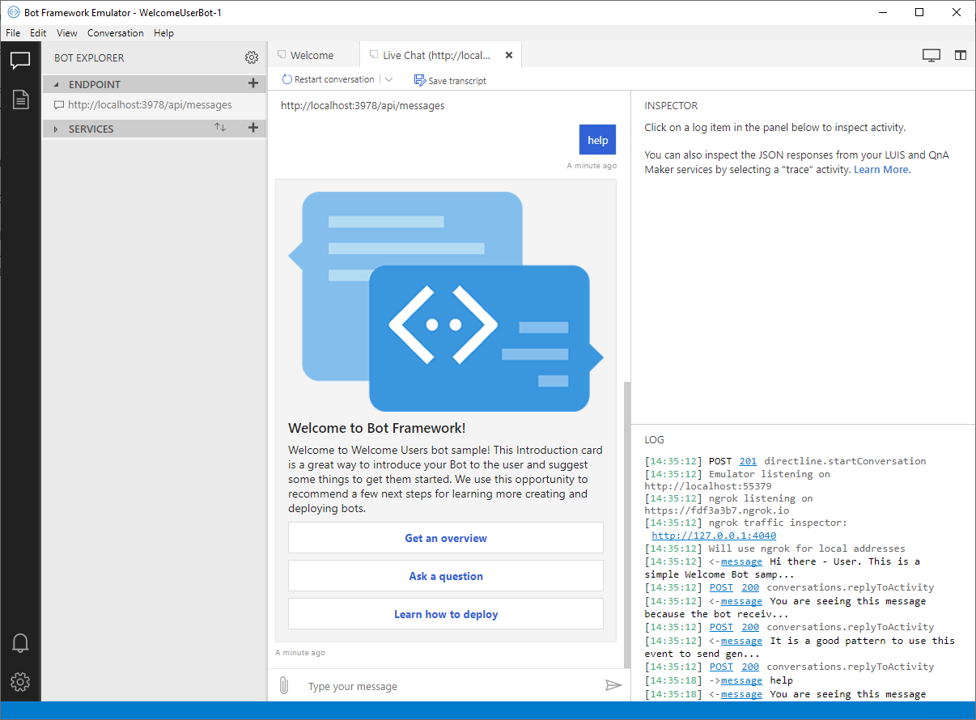

# Send welcome message to users

[!INCLUDE[applies-to](../includes/applies-to.md)]

The primary goal when creating any bot is to engage your user in a meaningful conversation. One of the best ways to achieve this goal is to ensure that from the moment a user first connects, they understand your bot’s main purpose and capabilities, the reason your bot was created. This article provides code examples to help you welcome users to your bot.

## Prerequisites
- Understand [bot basics](bot-builder-basics.md). 
- A copy of the **Welcome user sample** in either [C# Sample](https://aka.ms/welcome-user-mvc) or [JS Sample](https://aka.ms/bot-welcome-sample-js). The code from the sample is used to explain how to send welcome messages.

## About this sample code
This sample code shows how to detect and welcome new users when they are initially connected to your bot. The following diagram shows the logic flow for this bot. 

### [C#](#tab/csharp)
The two main events encountered by the bot are
- `OnMembersAddedAsync` which is called whenever a new user is connected to your bot
- `OnMessageActivityAsync` which is called whenever a new user input is received.

Whenever a new user is connected, they are provided with a `WelcomeMessage`, `InfoMessage`, and `PatternMessage` by the bot. 
When a new user input is received, WelcomeUserState is checked to see if `DidBotWelcomeUser` is set to _true_. If not, an initial welcome user message is returned to the user.

### [JavaScript](#tab/javascript)
The two main events encountered by the bot are
- `onMembersAdded` which is called whenever a new user is connected to your bot
- `onMessage` which is called whenever a new user input is received.

Whenever a new user is connected, they are provided with a `welcomeMessage`, `infoMessage`, and `patternMessage` by the bot. 
When a new user input is received, `welcomedUserProperty` is checked to see if `didBotWelcomeUser` is set to _true_. If not, an initial welcome user message is returned to the user.

---

 If DidBotWelcomeUser is _true_, the user's input is evaluated. Based on the content of the user's input this bot will do one of the following:
- Echo back a greeting received from the user.
- Display a hero card providing addition information about bots.
- Resend the `WelcomeMessage` explaining expected inputs for this bot.

## Create user object
### [C#](#tab/csharp)
The user state object is created at startup and dependency injected into the bot constructor.

**Startup.cs**  
[!code-csharp[ConfigureServices](~/../botBuilder-samples/samples/csharp_dotnetcore/03.welcome-user/Startup.cs?range=29-33)]

**WelcomeUserBot.cs**  
[!code-csharp[Class](~/../BotBuilder-Samples/samples/csharp_dotnetcore/03.welcome-user/bots/WelcomeUserBot.cs?range=41-47)]

### [JavaScript](#tab/javascript)
At startup, both memory storage and user state are defined in index.js.

**Index.js**  
[!code-javascript[DefineUserState](~/../BotBuilder-Samples/samples/javascript_nodejs/03.welcome-users/Index.js?range=8-10,33-41)]

---

## Create property accessors
### [C#](#tab/csharp)
We now create a property accessor that provides us a handle to WelcomeUserState inside the OnMessageActivityAsync method.
Then call the GetAsync method to get the properly scoped key. We then save user state data after each user input iteration using the `SaveChangesAsync` method.

**WelcomeUserBot.cs**  
[!code-csharp[OnMessageActivityAsync](~/../BotBuilder-Samples/samples/csharp_dotnetcore/03.welcome-user/bots/WelcomeUserBot.cs?range=68-71, 102-105)]

### [JavaScript](#tab/javascript)
We now create a property accessor that provides us a handle to WelcomedUserProperty which is persisted within UserState.

**WelcomeBot.js**  
[!code-javascript[DefineUserState](~/../BotBuilder-Samples/samples/javascript_nodejs/03.welcome-users/bots/welcomebot.js?range=7-10,16-22)]

---

## Detect and greet newly connected users

### [C#](#tab/csharp)
In **WelcomeUserBot**, we check for an activity update using `OnMembersAddedAsync()` to see if a new user has been added to the conversation and then send them a set of three initial welcome messages `WelcomeMessage`, `InfoMessage` and `PatternMessage`. Complete code for this interaction is shown below.

**WelcomeUserBot.cs**  
[!code-csharp[WelcomeMessages](~/../BotBuilder-Samples/samples/csharp_dotnetcore/03.welcome-user/bots/WelcomeUserBot.cs?range=20-40, 55-66)]

### [JavaScript](#tab/javascript)
This JavaScript code sends initial welcome messages when a user is added. This is done by checking the conversation activity and verifying that a new member was added to the conversation.

**WelcomeBot.js**  
[!code-javascript[DefineUserState](~/../BotBuilder-Samples/samples/javascript_nodejs/03.welcome-users/bots/welcomebot.js?range=65-87)]

---

## Welcome new user and discard initial input

### [C#](#tab/csharp)
It is also important to consider when your user’s input might actually contain useful information, and this can vary per channel. To ensure your user has a good experience on all possible channels, we check the status flag _didBotWelcomeUser_ and if this is "false", we do not process the initial user input. We instead provide the user with an initial welcome message. The bool _welcomedUserProperty_ is then set to "true", stored in UserState and our code will now process this user's input from all additional message activities.

**WelcomeUserBot.cs**  
[!code-csharp[DidBotWelcomeUser](~/../BotBuilder-Samples/samples/csharp_dotnetcore/03.welcome-user/bots/WelcomeUserBot.cs?range=68-82)]

### [JavaScript](#tab/javascript)
It is also important to consider when your user’s input might actually contain useful information, and this can vary per channel. To ensure your user has a good experience on all possible channels, we check the didBotWelcomedUser property, if it does not exist, we set  it to "false" and do not process the initial user input. We instead provide the user with an initial welcome message. The bool _didBotWelcomeUser_ is then set to "true" and our code processes the user input from all additional message activities.

**WelcomeBot.js**  
[!code-javascript[DidBotWelcomeUser](~/../BotBuilder-Samples/samples/javascript_nodejs/03.welcome-users/bots/welcomebot.js?range=24-38,57-59,63)]

---

## Process additional input

Once a new user has been welcomed, user input information is evaluated for each message turn and your bot provides a response based on the context of that user input. The following code shows the decision logic used to generate that response. 

### [C#](#tab/csharp)
An input of 'intro' or 'help' calls the function `SendIntroCardAsync` to present the user with an informational hero card. That code is examined in the next section of this article.

**WelcomeUserBot.cs**  
[!code-csharp[SwitchOnUtterance](~/../BotBuilder-Samples/samples/csharp_dotnetcore/03.welcome-user/bots/WelcomeUserBot.cs?range=85-100)]

### [JavaScript](#tab/javascript)
An input of 'intro' or 'help' uses CardFactory to present the user with an Intro Adaptive Card. That code is examined in the next section of this article.

**WelcomeBot.js**  
[!code-javascript[SwitchOnUtterance](~/../BotBuilder-Samples/samples/javascript_nodejs/03.welcome-users/bots/welcomebot.js?range=40-56)]

---

## Using hero card greeting

As mentioned above, some user inputs generate a _Hero Card_ in response to their request. You can learn more about hero card greetings here [Send an Intro Card](./bot-builder-howto-add-media-attachments.md). Below is the code required to create this bot's hero card response.

### [C#](#tab/csharp)

**WelcomeUserBot.cs**  
[!code-csharp[SendHeroCardGreeting](~/../BotBuilder-Samples/samples/csharp_dotnetcore/03.welcome-user/bots/WelcomeUserBot.cs?range=107-125)]

### [JavaScript](#tab/javascript)

**WelcomeBot.js**  
[!code-javascript[SendIntroCard](~/../BotBuilder-Samples/samples/javascript_nodejs/03.welcome-users/bots/welcomebot.js?range=91-116)]

---

## Test the bot

Download and install the latest [Bot Framework Emulator](https://aka.ms/bot-framework-emulator-readme)

1. Run the sample locally on your machine. If you need instructions, refer to the README file for [C# Sample](https://aka.ms/welcome-user-mvc) or [JS Sample](https://aka.ms/bot-welcome-sample-js).
1. Use the emulator to test the bot as shown below.

Test hero card greeting.

## Additional Resources

Learn more about various media responses in [Add media to messages](./bot-builder-howto-add-media-attachments.md).

## Next steps

> [!div class="nextstepaction"]
> [Gather user input](bot-builder-prompts.md)
