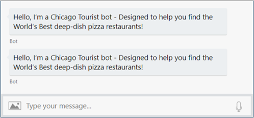

# Send welcome message to users

[!INCLUDE [pre-release-label](../includes/pre-release-label.md)]

The primary goal when creating any bot is to engage your user in a meaningful conversation. One of the best ways to achieve this goal is to ensure that from the moment a user first connects, they understand your bot’s main purpose and capabilities, the reason your bot was created. This article provides code examples to help you welcome users to your bot.

## Same welcome for different channels
A welcome message should be generated whenever your users first interacts with your bot. To achieve this, you can monitor your bot’s Activity types and watch for new connections. Each new connection can generate up to two conversation update activities depending on the channel.

- One when the user’s bot is connected to the conversation.
- One when the user joins the conversation.

It is tempting to simply generate a welcome message whenever a new conversation update is detected, but that can lead to unexpected results when your bot is accessed across a variety of channels.

Some channels create one conversation update when a user initially connects to that channel, and a separate conversation update only after an initial input message is received from the user. Other channels generate both these activities when the user initially connects to the channel. If you simply watch for a conversation update event and display a welcome message on a channel with two conversation update activities, your user could receive the following:



This duplicate message can be avoided by generating an initial welcome message for only the second conversation update event. The second event can be detected when both:
- A conversation update event has occurred.
- A new member (user) has been added to the conversation.

The following example watches for new *conversation update activity*, sends only one welcome message based on your user joining the conversation, and sets a Prompt status flag to ignore the user’s initial conversation input. You can download the complete source code in [[C#](https://aka.ms/bot-welcome-sample-cs) or [JS](https://aka.ms/bot-welcome-sample-js)] from GitHub.

[!INCLUDE [alert-await-send-activity](../includes/alert-await-send-activity.md)]

## [C#](#tab/csharp)

This set of libraries are used to support all of the following C# code example

```csharp
using System.Collections.Generic;
using System.Linq;
using System.Threading;
using System.Threading.Tasks;
using Microsoft.Bot.Builder;
using Microsoft.Bot.Builder.Dialogs;
using Microsoft.Bot.Schema;
```

Now we need to create a state object for a given user in a conversation and it's accessor.

```csharp
/// The state object is used to keep track of various state related to a user in a conversation.
/// In this example, we are tracking if the bot has replied to customer first interaction.
public class WelcomeUserState
{
    public bool DidBotWelcomeUser { get; set; } = false;
}

/// Initializes a new instance of the <see cref="WelcomeUserStateAccessors"/> class.
public class WelcomeUserStateAccessors
{
    public WelcomeUserStateAccessors(UserState userState)
    {
        this.UserState = userState ?? throw new ArgumentNullException(nameof(userState));
    }

    public IStatePropertyAccessor<bool> DidBotWelcomeUser { get; set; }

    public UserState UserState { get; }
}
```

We then simply check for an activity update to see if a new user has been added to the conversation and then send them a welcome message.

```csharp
public class WelcomeUserBot : IBot
{
// Generic message to be sent to user
private const string _genericMessage = @"This is a simple Welcome Bot sample. You can say 'intro' to 
                                         see the introduction card. If you are running this bot in the Bot 
                                         Framework Emulator, press the 'Start Over' button to simulate user joining a bot or a channel";

// The bot state accessor object. Use this to access specific state properties.
private readonly WelcomeUserStateAccessors _welcomeUserStateAccessors;

// Initializes a new instance of the <see cref="WelcomeUserBot"/> class.
public WelcomeUserBot(WelcomeUserStateAccessors statePropertyAccessor)
{
    _welcomeUserStateAccessors = statePropertyAccessor ?? throw new System.ArgumentNullException("state accessor can't be null");
}

// Every conversation turn for our WelcomeUser Bot will call this method, including
// any type of activities such as ConversationUpdate or ContactRelationUpdate which
// are sent when a user joins a conversation.
// This bot doesn't use any dialogs; it's "single turn" processing, meaning a single
// request and response.
// This bot uses UserState to keep track of first message a user sends.
public async Task OnTurnAsync(ITurnContext turnContext, CancellationToken cancellationToken = new CancellationToken())
{
    // Use state accessor to extract the didBotWelcomeUser flag
    var didBotWelcomeUser = await _welcomeUserStateAccessors.DidBotWelcomeUser.GetAsync(turnContext, () => false);

    if (turnContext.Activity.Type == ActivityTypes.Message)
    {
        // Your bot should proactively send a welcome message to a personal chat the first time
        // (and only the first time) a user initiates a personal chat with your bot.
        if (didBotWelcomeUser == false)
        {
            // Update user state flag to reflect bot handled first user interaction.
            await _welcomeUserStateAccessors.DidBotWelcomeUser.SetAsync(turnContext, true);
            await _welcomeUserStateAccessors.UserState.SaveChangesAsync(turnContext);

            // the channel should sends the user name in the 'From' object
            var userName = turnContext.Activity.From.Name;

            await turnContext.SendActivityAsync($"You are seeing this message because this was your first message ever to this bot.", cancellationToken: cancellationToken);
            await turnContext.SendActivityAsync($"It is a good practice to welcome the user and provide a personal greeting. For example, welcome {userName}.", cancellationToken: cancellationToken);
        }
    }
    else if (turnContext.Activity.Type == ActivityTypes.ConversationUpdate) // Greet when users are added to the conversation.
    {
        if (turnContext.Activity.MembersAdded.Any())
        {
            // Iterate over all new members added to the conversation
            foreach (var member in turnContext.Activity.MembersAdded)
            {
                // Greet anyone that was not the target (recipient) of this message
                // the 'bot' is the recipient for events from the channel,
                // turnContext.Activity.MembersAdded == turnContext.Activity.Recipient.Id indicates the
                // bot was added to the conversation.
                if (member.Id != turnContext.Activity.Recipient.Id)
                {
                    await turnContext.SendActivityAsync($"Hi there - {member.Name}. Welcome to the 'Welcome User' Bot. This bot will introduce you to welcoming and greeting users.", cancellationToken: cancellationToken);
                    await turnContext.SendActivityAsync($"You are seeing this message because the bot recieved atleast one 'ConversationUpdate' event,indicating you (and possibly others) joined the conversation. If you are using the emulator, pressing the 'Start Over' button to trigger this event again. The specifics of the 'ConversationUpdate' event depends on the channel. You can read more information at https://aka.ms/about-botframewor-welcome-user", cancellationToken: cancellationToken);
                    await turnContext.SendActivityAsync($"It is a good pattern to use this event to send general greeting to user, explaning what your bot can do. In this example, the bot handles 'hello', 'hi', 'help' and 'intro. Try it now, type 'hi'", cancellationToken: cancellationToken);
                }
            }
        }
    }
    // save any state changes made to your state objects.
    await _welcomeUserStateAccessors.UserState.SaveChangesAsync(turnContext);
}
```

## [JavaScript](#tab/js)

This JavaScript code sends a welcome message when a user is added. This is done by checking the conversation activity and verify that a new member was added to the conversation.

``` javascript
// Import required Bot Framework classes.
const { ActivityTypes } = require('botbuilder');
const { CardFactory } = require('botbuilder');

// Welcomed User property name
const WELCOMED_USER = 'DidBotWelcomeUser';

class MainDialog {
    constructor (userState) {
        // Creates a new user property accessor.
        // See https://aka.ms/about-bot-state-accessors to learn more about the bot state and state accessors.
        this.welcomedUserPropery = userState.createProperty(WELCOMED_USER);
    }

    async onTurn(turnContext) 
    {
        // See https://aka.ms/about-bot-activity-message to learn more about the message and other activity types.
        if (turnContext.activity.type === ActivityTypes.Message) 
        {
            // Read UserState. If the 'DidBotWelcomeUser' does not exist (first time ever for a user)
            // set the default to false.
            let didBotWelcomeUser = await this.welcomedUserPropery.get(turnContext, false);

            // Your bot should proactively send a welcome message to a personal chat the first time
            // (and only the first time) a user initiates a personal chat with your bot.
            if (didBotWelcomeUser === false) 
            {
                // The channel should send the user name in the 'From' object
                let userName = turnContext.activity.from.name;
                await turnContext.sendActivity("You are seeing this message because this was your first message ever sent to this bot.");
                await turnContext.sendActivity(`It is a good practice to welcome the user and provdie personal greeting. For example, welcome ${userName}.`);
                
                // Set the flag indicating the bot handled the user's first message.
                await this.welcomedUserPropery.set(turnContext, true);
            }
            . . .
            
            // Save state changes
            await this.userState.saveChanges(turnContext);
        } else if (turnContext.activity.type === ActivityTypes.ConversationUpdate) {
            // Send greeting when users are added to the conversation.
            await this.sendWelcomeMessage(turnContext);
        } else {
            // Generic message for all other activities
            await turnContext.sendActivity(`[${ turnContext.activity.type } event detected]`);
        }
    }
    
    // Sends welcome messages to conversation members when they join the conversation.
    // Messages are only sent to conversation members who aren't the bot.
    async sendWelcomeMessage(turnContext) {
        // If any new membmers added to the conversation
        if (turnContext.activity && turnContext.activity.membersAdded) {
            // Define a promise that will welcome the user
            async function welcomeUserFunc(conversationMember) {
                // Greet anyone that was not the target (recipient) of this message.
                // The bot is the recipient of all events from the channel, including all ConversationUpdate-type activities
                // turnContext.activity.membersAdded !== turnContext.activity.aecipient.id indicates 
                // a user was added to the conversation 
                if (conversationMember.id !== this.activity.recipient.id) {
                    // Because the TurnContext was bound to this function, the bot can call
                    // `TurnContext.sendActivity` via `this.sendActivity`;
                    await this.sendActivity(`Welcome to the 'Welcome User' Bot. This bot will introduce you to welcoming and greeting users.`);
                    await this.sendActivity("You are seeing this message because the bot recieved atleast one 'ConversationUpdate'" + 
                                            "event,indicating you (and possibly others) joined the conversation. If you are using the emulator, "+ 
                                            "pressing the 'Start Over' button to trigger this event again. The specifics of the 'ConversationUpdate' "+
                                            "event depends on the channel. You can read more information at https://aka.ms/about-botframewor-welcome-user");
                    await this.sendActivity(`It is a good pattern to use this event to send general greeting to user, explaining what your bot can do. `+ 
                                            `In this example, the bot handles 'hello', 'hi', 'help' and 'intro. ` +
                                            `Try it now, type 'hi'`);
                }
            }
    
            // Prepare Promises to greet the  user.
            // The current TurnContext is bound so `replyForReceivedAttachments` can also send replies.
            const replyPromises = turnContext.activity.membersAdded.map(welcomeUserFunc.bind(turnContext));
            await Promise.all(replyPromises);
        }
    }
}

module.exports = MainDialog;
```

---

## Discard initial user input
It is also important to consider when your user’s input may actually contain useful information, and this too can vary per channel. To ensure your user has a good experience on all possible channels, we avoid processing invalid response data by giving the initial prompt and setting up keywords to look for in the user's replies.

## [C#](#tab/csharpmulti)

```csharp
public async Task OnTurnAsync(ITurnContext turnContext, CancellationToken cancellationToken = new CancellationToken())
{
    // Use state accessor to extract the didBotWelcomeUser flag
    var didBotWelcomeUser = await _welcomeUserStateAccessors.DidBotWelcomeUser.GetAsync(turnContext, () => false);

    if (turnContext.Activity.Type == ActivityTypes.Message)
    {
        // Your bot should proactively send a welcome message to a personal chat the first time
        // (and only the first time) a user initiates a personal chat with your bot.
        if (didBotWelcomeUser == false)
        {
            // Previous Code Sample
        }
        else
        {
            // This example hardcodes specific uterances. You should use LUIS or QnA for more advance language understanding.
            var text = turnContext.Activity.Text.ToLowerInvariant();
            switch (text)
            {
                case "hello":
                case "hi":
                    await turnContext.SendActivityAsync($"You said {text}.", cancellationToken: cancellationToken);
                    break;
                case "intro":
                case "help":
                default:
                    await turnContext.SendActivityAsync(_genericMessage, cancellationToken: cancellationToken);
                    break;
            }
        }
    }
    else if (turnContext.Activity.Type == ActivityTypes.ConversationUpdate) // Greet when users are added to the conversation.
    {
        if (turnContext.Activity.MembersAdded.Any())
        {
            // Iterate over all new members added to the conversation
            foreach (var member in turnContext.Activity.MembersAdded)
            {
                // Previous Code Sample
            }
        }
    }
    else
    {
        // Default behaivor for all other type of events.
        var ev = turnContext.Activity.AsEventActivity();
        await turnContext.SendActivityAsync($"Received event: {ev.Name}");
    }
    // save any state changes made to your state objects.
    await _welcomeUserStateAccessors.UserState.SaveChangesAsync(turnContext);
}

```

## [JavaScript](#tab/jsmulti)

``` javascript
class MainDialog 
{ 
    // Previous Code Sample
    
    async onTurn(turnContext) 
    {
        // See https://aka.ms/about-bot-activity-message to learn more about the message and other activity types.
        if (turnContext.activity.type === ActivityTypes.Message) {
            
            // Previous Code Sample
            
            if (didBotWelcomeUser === false) 
            {
                // Previous Code Sample
            }
            else 
            {
                // This example hardcodes specific uterances. You should use LUIS or QnA for more advance language understanding.
                let text = turnContext.activity.text.toLowerCase();
                switch (text) 
                {
                    case "hello":
                    case "hi":
                        await turnContext.sendActivity(`You said "${turnContext.activity.text}"`);
                        break;
                    case "intro":
                    case "help":
                    default :
                        await turnContext.sendActivity(`This is a simple Welcome Bot sample. You can say 'intro' to 
                                                        see the introduction card. If you are running this bot in the Bot 
                                                        Framework Emulator, press the 'Start Over' button to simulate user joining a bot or a channel`);
                }
            }
        }
       
       // Previous Sample Code
    } 
}
```

---

## Using Adaptive Card Greeting

Another way to greeting users is using adaptive Card Greeting. You can learn more about Adaptive Card Greetings here [Send an Adaptive Card](./bot-builder-howto-add-media-attachments.md).

## [C#](#tab/csharpwelcomeback)

```csharp
// Sends an adaptive card greeting.
private static async Task SendIntroCardAsync(ITurnContext turnContext, CancellationToken cancellationToken)
{
    var response = turnContext.Activity.CreateReply();

    var introCard = File.ReadAllText(@".\Resources\IntroCard.json");

    response.Attachments = new List<Attachment>
    {
        new Attachment()
        {
            ContentType = "application/vnd.microsoft.card.adaptive",
            Content = JsonConvert.DeserializeObject(introCard),
        },
    };

    await turnContext.SendActivityAsync(response, cancellationToken);
}
```

Next, we can send the card by using the following await command. Let's put this into the bots _switch (text) case "help"_.

```csharp
switch (text)
{
    case "hello":"
    case "hi":
        await turnContext.SendActivityAsync($"You said {text}.", cancellationToken: cancellationToken);
        break;
    case "intro":
    case "help":
        await SendIntroCardAsync(turnContext, cancellationToken);
        break;
    default:
        await turnContext.SendActivityAsync(_genericMessage, cancellationToken: cancellationToken);
        break;
}
```


## [JavaScript](#tab/jswelcomeback)

First we want to add our Adaptive Card to the bot at the top of our _index.js_ right below our Imports.

``` javascript
// Adaptive Card content
const IntroCard = require('./Resources/IntroCard.json');
```

Next we can simply use the below code in our _switch (text)_ _case "help"_ section of our bot to respond to the users prompt with the adaptive card.

``` javascript
switch (text) 
{
    case "hello":
    case "hi":
        await turnContext.sendActivity(`You said "${turnContext.activity.text}"`);
        break;
    case "intro":
    case "help":
        await turnContext.sendActivity({
            text: 'Intro Adaptive Card',
            attachments: [CardFactory.adaptiveCard(IntroCard)]
        });
        break;
    default :
        await turnContext.sendActivity(`This is a simple Welcome Bot sample. You can say 'intro' to 
                                        see the introduction card. If you are running this bot in the Bot 
                                        Framework Emulator, press the 'Start Over' button to simulate user joining a bot or a channel`);
}
```
---

## Next steps
> [!div class="nextstepaction"]
> [Gather user input](bot-builder-prompts.md)
