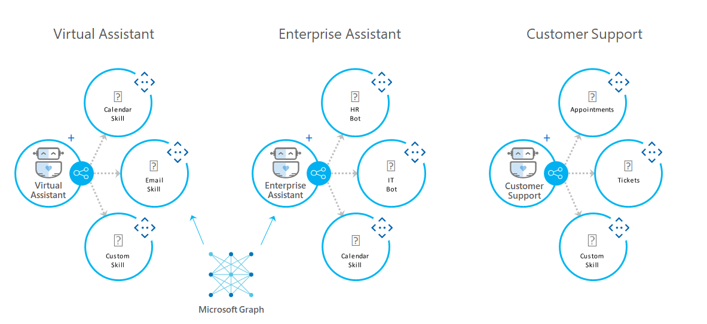

# Virtual Assistant - Skills Overview

> [!NOTE]
> This topic applies to v4 version of the SDK. 

## Overview

Developers can compose conversational experiences by stitching together re-usable conversational capabilities, known as Skills.

Within an Enterprise, this could be creating one parent bot bringing together multiple sub-bots owned by different teams, or more broadly leveraging common capabilities provided by other developers. With this preview of Skills, developers can create a new bot (typically through the Virtual Assistant template) and add/remove Skills with one command line operation incorporating all Dispatch and Configuration changes.     

Skills are themselves Bots, invoked remotely and a Skill developer template (.NET, TS) is available to facilitate creation of new Skills.

A key design goal for Skills was to maintain the consistent Activity protocol and ensure the development experience was as close to any normal V4 SDK bot as possible. 

## Bot Framework Skills

At this time we have made available the following Bot Framework Skills, powered by the Microsoft Graph and available in multiple languages.

| Name | Description |
| ---- | ----------- |
|[Calendar Skill](https://aka.ms/bfcalendarskill)|Add calendar capabilities to your assistant. Powered by Microsoft Graph and Google.|
|[Email Skill](https://aka.ms/bfemailskill)|Add email capabilities to your assistant. Powered by Microsoft Graph and Google.|
|[To Do Skill](https://aka.ms/bftodoskill)|Add task management capabilities to your assistant. Powered by Microsoft Graph.|
|[Point of Interest Skill](https://aka.ms/bfpoiskill)|Find points of interest and directions. Powered by Azure Maps and FourSquare.|
|[Automotive Skill](https://aka.ms/bfautoskill)|Industry-vertical Skill for showcasing enabling car feature control.|
|[Experimental Skills](https://aka.ms/bfexperimentalskills)|News, Restaurant Booking and Weather.|

## Getting Started

Refer to the [tutorials](https://aka.ms/bfstutorials) to learn how to leverage existing skills and build your own.
