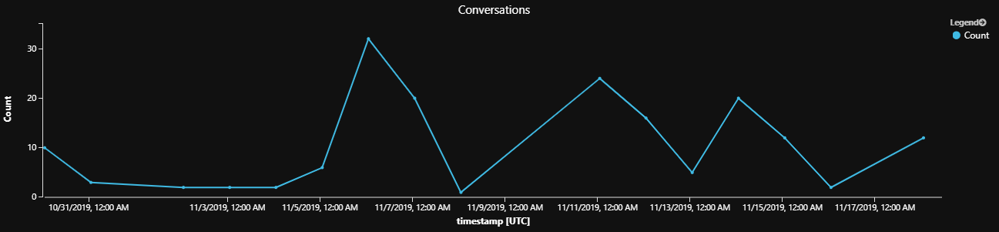
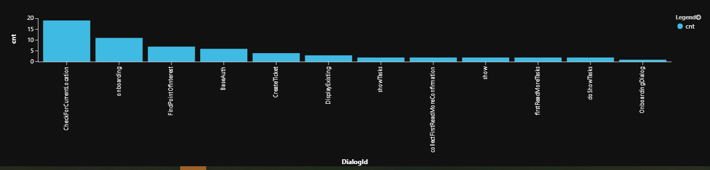
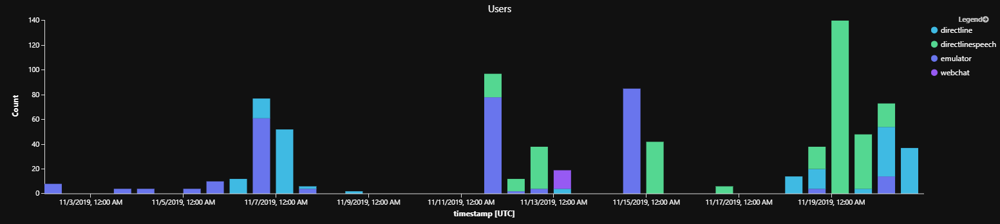
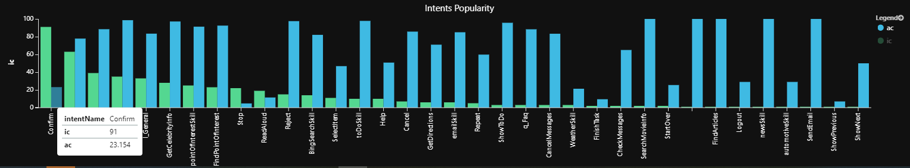

# Analyze your bot's telemetry data 

## Analyzing Bot behavior

The following collection of queries can be used to analyze bot behavior. You can use the collection to author custom queries in [Azure Monitor Log Analytics](https://aka.ms/log-analytics-azure-monitor) and to create monitoring and [PowerBI](https://aka.ms/power-bi-overview) visualization dashboards.

## Prerequisites
It is helpful to have a basic understanding of the following concepts:

* [Kusto queries](https://aka.ms/Kusto-query-overview)

* How to use [Log Analytics](https://aka.ms/azure-monitor-log-queries-get-started) in the Azure portal to write Azure Monitor log queries

* The basic concepts of [Log queries](https://aka.ms/azure-monitor-log-queries-get-started) in Azure Monitor

## Dashboards
Azure Dashboards offer a great way to view and share the information generated from your queries.  You can build custom dashboards to help monitor your bots activity by associating your queries with the tiles that you add to your dashboard. For more information on dashboards and how to associate your queries with them, see [Create and share dashboards of Log Analytics data](https://aka.ms/log-analytics-create-share-dashboards). The remainder of this article shows examples of some of the queries that you may find useful in monitoring your bots behavior.  

## Example Kusto queries

> [!NOTE]
> It is recommended to pivot on different dimensions such as period, channel, and locale for all queries in this article.

### Number of users per period
This example results in a line chart that shows how many distinct users communicated with your bot per day for the past 14 days.  The time period can be easily changed by assigning different values to the `queryStartDate`, `queryEndDate` and `interval` variables.

> [!IMPORTANT]
> You will only get a correct count of unique users in this query if they are authenticated users, and the results may also depend on the channel capabilities.

```Kusto
// number of users per period
let queryStartDate = ago(14d);
let queryEndDate = now();
let groupByInterval = 1d;
customEvents 
| where timestamp > queryStartDate
| where timestamp < queryEndDate
| summarize uc=dcount(user_Id) by bin(timestamp, groupByInterval)
| render timechart
```

> [!TIP]
> The Kusto [summarize operator](https://aka.ms/kusto-summarize-operator) is used to produce a table that aggregates the content of the input table.
>
> The [Bin](https://docs.microsoft.com/azure/kusto/query/binfunction) function is a Kusto scalar function that when used in conjunction with the `summarize operator` will group the query results into the specified value. In the above example, this is grouped by day, Kusto also will accept h=hours, m=minutes, s=seconds, ms=milliseconds, microsecond=microseconds.
>
> The [render operator](https://aka.ms/kusto-query-render-operator?pivots=Kusto) enables you to easily render charts, such as the _timechart_,  a line chart where the x-axis is a datetime and any other numeric column can be used for the y-axis. It automatically keeps the x-axis spaced nicely even if your data doesn't have every time specified.  If no render statement is used, it defaults to `table`.

#### Sample query results

<!-- 

OPEN ISSUE: Is it possible to define a more descriptive title in the legend when drawing the graph (vs. “Count”)?  Or overall title on top or underneath?  

Use the render PropertyName parameter:  title, xtitle, ytitle,, legend

-->


<!--  

OPEN ISSUE 1:

    "Days with little interaction may indicate service health issues"

    This is an interesting statement – I’m not sure if there’s a way to overlay service health metrics over these metrics.  It should all be in App Insights.

OPEN ISSUE 2:

    Gary Pretty: Overlap for activity per period - Looks like we have a large overlap between ‘Activity per period’ and ‘Activity per user per period’ – given that activity per user is only really useful in some scenarios, such as authenticated, I think it might simplify things to update the ‘Activity per period’ query / instructions to include a note as to how to filter down per user?   Not sure about this one myself, but thought it was worth bringing up.

    < I agree with you.  One approach might be to include both in the same section, with the ‘Activity per period’ as the primary with a note about what might be considered more of a ‘special case’ (I will need input on more details of where this is most applicable – as I’ve commented in a previous email). >


QUESTION: What changes are required?

-->

### Activity per period
This example illustrates how to measure the volume of activity per desired dimension, whether that be a count of the number of conversations, dialogs, or messages per day for the past 14 days. The time period can be easily changed by assigning different values to the `querystartdate`, `queryEndDate` and `interval` variables. The desired dimension is defined by the `extend` clause in the following example, `metric` can be set to either _InstanceId_, _DialogId_ or _ActivityId_.

Assign *metric* to the dimension that you want to display:
  * *InstanceId* measures the number of [Conversations](https://aka.ms/bot-builder-conversations)
  * *DialogId* measures the number of [Dialogs](https://aka.ms/bot-builder-concept-dialog)
  * *ActivityId* measures the number of [Messages](https://aka.ms/bot-rest-create-messages)

```Kusto
// measures the number of activity's (conversations, dialogs, messages) per period 
let queryStartDate = ago(14d);
let queryEndDate = now();
let groupByInterval = 1d;
customEvents 
| where timestamp > queryStartDate
| where timestamp < queryEndDate
| extend InstanceId = tostring(customDimensions['<InstanceId>'])
| extend DialogId = tostring(customDimensions['<DialogId>'])
| extend ActivityId = tostring(customDimensions['<activityId>'])
| where DialogId != '' and  InstanceId != '' and user_Id != ''
| extend metric = InstanceId // DialogId or ActivityId
| summarize Count=dcount(metric) by  bin(timestamp, groupByInterval)
| order by Count desc nulls last 
| render timechart
```

> [!TIP]
> The Kusto [extend operator](https://aka.ms/kusto-extend-operator) is used to create calculated columns and append them to the result set.


#### Sample query results




### Activity per user per period
This example demonstrates how to count the number of activities per user per period. This demonstrates drilling down in the _activity per period_ query to focus on the activity per user per period. The activities include dialogs, conversations or messages.  This helps to measure user interaction with your bot and can help in determining potential problems, for example: 

- Days with lots of activity by a single user may mean attack or test
- Days with little interaction may indicate service health issues

> [!TIP]
> You can remove _by user_Id_ to get the general bot activity volume which can be pivoted on time and dialogs, messages, or conversations.

```Kusto
// number of users per period per dialogs
let queryStartDate = ago(14d);
let queryEndDate = now();
let interval = 6h;
customEvents 
| where timestamp > queryStartDate
| where timestamp < queryEndDate
| extend InstanceId = tostring(customDimensions['InstanceId'])
| extend DialogId = tostring(customDimensions['DialogId'])
| extend ActivityId = tostring(customDimensions['activityId'])
| where DialogId != '' and InstanceId != '' and user_Id != ''
| extend metric = ActivityId // InstanceId // DialogId // or InstanceId for conversation count
| summarize Count=dcount(metric) by user_Id, bin(timestamp, groupByInterval)
| order by Count desc nulls last 
```

#### Sample query results 

| **user_Id**   | **timestamp**        | **Count** |
| ------------- | -------------------- | :------:  |
| User-8107ffd2 | 2019-09-03T00:00:00Z |    14     |
| User-75f2cc8f | 2019-08-30T00:00:00Z |    13     |
| User-75f2cc8d | 2019-09-03T00:00:00Z |    13     |
| User-3060aada | 2019-09-03T00:00:00Z |    10     |


### Dialog completion
Once you set the telemetry client for a dialog, the dialog (and its children) will emit some default telemetry data, such as _started_ and _completed_. This example can be used to measure the *completed* dialogs relative to *started* dialogs.  If the number of dialogs started is greater than the number completed, some of your users are not completing the dialog flow. This can be used as a starting point in identifying and troubleshooting any potential dialog logic.  It can also be used to identify the more popular and less frequented dialogs.

```Kusto
// % Completed Waterfall Dialog: shows completes relative to starts 
let queryStartDate = ago(14d);
let queryEndDate = now();
customEvents
| where timestamp > queryStartDate
| where timestamp < queryEndDate
| where name=="WaterfallStart"
| extend DialogId = customDimensions['DialogId']
| extend InstanceId = tostring(customDimensions['InstanceId'])
| join kind=leftouter (
    customEvents 
    | where name=="WaterfallComplete" 
    | extend InstanceId = tostring(customDimensions['InstanceId'])
  ) on InstanceId    
| summarize started=countif(name=='WaterfallStart'), completed=countif(name1=='WaterfallComplete') by tostring(DialogId)
| where started > 100  // filter for sample
// Show starts vs. completes
| project tostring(DialogId), started, completed
| order by started desc, completed asc  nulls last 
| render barchart  with (kind=unstacked, xcolumn=DialogId, ycolumns=completed, started, ysplit=axes) 
```

> [!TIP]
> The Kusto [join operator](https://aka.ms/kusto-join-operator) is used to merge the rows of two tables to form a new table by matching values of the specified column(s) from each table.
>
> The [project operator](https://aka.ms/kusto-project-operator) is used to select the fields that you want to show up in your output. Similar to the `extend operator` that adds a new field, the `project operator` can either choose from the existing set of fields or add a new field.

#### Sample query results


### Dialog incompletion
This example can be used to count the number of dialog flows that started but never completed due to cancellation or abandonment during the specified time period. You can use it to review incomplete dialogs and examine whether they were actively cancelled due to user confusion or simply abandoned due to user distraction or loss of interest.

<!--  

OPEN ISSUE:

“If number of started dialogs is much greater than number of completed, users do not complete the dialog flow. Troubleshoot dialog logic.”

you can use the funnel view to understand where step dropoff is.  If there is a doc describing how to do that in our docs, point to it... 

QUESTION: Who can I talk to about a a doc describing this? 

ALSO: I removed what was line 6 in the example because it was a duplicate where statement: | where timestamp > period    // change timespan accordingly

-->

```Kusto
// show incomplete dialogs
let queryStartDate = ago(14d);
let queryEndDate = now();
customEvents 
| where timestamp > queryStartDate 
| where timestamp < queryEndDate
| where name == "WaterfallStart" 
| extend DialogId = customDimensions['DialogId']
| extend instanceId = tostring(customDimensions['InstanceId'])
| join kind=leftanti (
  customEvents
  | where name == "WaterfallComplete" 
  | extend instanceId = tostring(customDimensions['InstanceId'])
  ) on instanceId
| summarize cnt=count() by  tostring(DialogId)
| order by cnt
| render barchart
```

> [!TIP]
> The Kusto [order operator](https://aka.ms/kusto-query-order-operator) (Same as the `sort operator`) is used to sort the rows of the input table into order by one or more columns.  Note: If you want to exclude null values from the results of any query, you can filter them out in your where statement, for example you could add "and isnotnull(Timestamp)", or to return null values at the beginning or end, add the `nulls first` or `nulls first` to the end of the order statement. 
>

#### Sample query results




### Dialog Sequence Drill Down 

#### Waterfall start/step/complete for dialog in conversation
This example shows the sequence of dialog steps, grouped by conversation (instanceId). This can be useful in determining which steps lead to dialog interruption. 

The run this query, enter the value of the desired `DialogId` in place of \<SampleDialogId> 

```Kusto
// Drill down: Show waterfall start/step/complete for specific dialog
let queryStartDate = ago(14d);
let queryEndDate = now();
let DialogActivity=(dlgid:string) {
customEvents
| where timestamp > queryStartDate
| where timestamp < queryEndDate
| extend DialogId = customDimensions['DialogId']
| extend StepName = customDimensions['StepName']
| extend InstanceId = customDimensions['InstanceId']
| where DialogId == dlgid
| project timestamp, name, StepName, InstanceId 
| order by tostring(InstanceId), timestamp asc
};
// For example see SampleDialogId behavior
DialogActivity("<SampleDialogId>")
```

> [!TIP]
> This query was written using a [query-defined function](https://aka.ms/kusto-user-functions), which is a user-defined function that is defined and used within the scope of a single query, and is defined through a let statement. This query written without the use of the `query-defined function`:
>
> ```Kusto
> let queryStartDate = ago(14d);
> let queryEndDate = now();
> customEvents
> | where timestamp > queryStartDate
> | where timestamp < queryEndDate
> | extend DialogId = customDimensions['DialogId']
> | extend StepName = customDimensions['StepName']
> | extend InstanceId = customDimensions['InstanceId']
> | where DialogId == "<SampleDialogId>"
> | project timestamp, name, StepName, InstanceId 
> | order by tostring(InstanceId), timestamp asc
> ```

##### Sample query results

| **timestamp**       | **name**                   | **StepName**                    | **InstanceId**  |
| ------------------- | -------------------------- | ------------------------------- | --------------- |
| 2019-08-23T20:04... | WaterfallStart             | null                            | ...79c0f03d8701 |
| 2019-08-23T20:04... | WaterfallStep              | GetPointOfInterestLocations     | ...79c0f03d8701 |
| 2019-08-23T20:04... | WaterfallStep              | ProcessPointOfInterestSelection | ...79c0f03d8701 |
| 2019-08-23T20:04... | WaterfallStep              | GetRoutesToDestination          | ...79c0f03d8701 |
| 2019-08-23T20:05... | WaterfallStep              | ResponseToStartRoutePrompt      | ...79c0f03d8701 |
| 2019-08-23T20:05... | WaterfallComplete _<sup>1_ | null                            | ...79c0f03d8701 |
| 2019-08-28T23:35... | WaterfallStart             | null                            | ...6ac8b3211b99 |
| 2019-08-28T23:35... | WaterfallStep _<sup>2_     | GetPointOfInterestLocations     | ...6ac8b3211b99 |
| 2019-08-28T19:41... | WaterfallStart             | null                            | ...8137d76a5cbb |
| 2019-08-28T19:41... | WaterfallStep _<sup>2_     | GetPointOfInterestLocations     | ...8137d76a5cbb |
| 2019-08-28T19:41... | WaterfallStart             | null                            | ...8137d76a5cbb |

<sub>1</sup> _Completed_ 

<sub>2</sup> _Abandoned_

_Interpretation: Users seem to abandon the conversation at the GetPointOfInterestLocations step._ 

> [!NOTE] 
> Waterfall dialogs execute a sequence (start, multiple steps, complete). If a sequence shows start with no complete, it means the dialog was interrupted either due to user abandoning or canceling the dialog. In this detailed analysis, one can see this behavior (see completed vs. abandoned steps).

#### Waterfall start/step/complete/cancel steps aggregate totals
This example shows the aggregate totals of the total number of times that a dialog sequence was started, the combined total number of waterfall steps, how many were successfully completed, how many were canceled and the difference between _WaterfallStart_ and the combined total of _WaterfallComplete_ plus _WaterfallCancel_ will give you the total number abandoned.

```Kusto
// Drill down: Aggregate view of waterfall start/step/complete/cancel steps totals for specific dialog
let queryStartDate = ago(14d);
let queryEndDate = now();
let DialogSteps=(dlgid:string) {
customEvents
| where timestamp > queryStartDate
| where timestamp < queryEndDate
| extend DialogId = customDimensions['DialogId']
| where DialogId == dlgid
| project name
| summarize count() by name
};
// For example see SampleDialogId behavior
DialogSteps("<SampleDialogId>")
```

##### Sample query results

| **name**          | **count** |
| ----------------- | --------: |
| WaterfallStart    | 21        |
| WaterfallStep     | 47        |
| WaterfallComplete | 11        |
| WaterfallCancel   | 1         |

_Interpretation: Of 21 invocations of dialog sequence, only 11 has completed, 9 were abandoned, and one was cancelled by the user_


### Average duration in dialog
This example measures the average amount of time users spend in a given dialog. A long time spend in a dialog may suggest opportunities to simplify.

 ```Kusto
// Average dialog duration
let queryStartDate = ago(14d);
let queryEndDate = now();
customEvents 
| where timestamp > queryStartDate
| where timestamp < queryEndDate
| where name=="WaterfallStart"
| extend DialogId = customDimensions['DialogId']
| extend instanceId = tostring(customDimensions['InstanceId'])
| join kind=leftouter (customEvents | where name=="WaterfallCancel" | extend instanceId = tostring(customDimensions['InstanceId'])) on instanceId 
| join kind=leftouter (customEvents | where name=="WaterfallComplete" | extend instanceId = tostring(customDimensions['InstanceId'])) on instanceId 
| extend duration = case(not(isnull(timestamp1)), timestamp1 - timestamp, 
not(isnull(timestamp2)), timestamp2 - timestamp, 0s) // Abandoned are not counted. Alternate: now()-timestamp)
| extend seconds = round(duration / 1s)
| summarize AvgSeconds=avg(seconds) by tostring(DialogId)
| order by AvgSeconds desc nulls last 
| render barchart with (title="Duration in Dialog")
 ```

#### Sample query results


### Average steps in dialog
This example shows each executed dialogs "length" as calculated by average, min, max and standard deviation. This can help analyze dialog quality. For example:

- Dialogs with a lot of steps should be evaluated for simplification opportunities
- Dialogs with a wide gap between min/max/average could mean that users get stalled trying to complete the tasks. You may need to evaluate the possibility of there being shorter paths to complete the tasks, or ways to reduce the dialog complexity.
- Dialogs with a large standard-deviation suggest complex paths or broken experience (abandon/cancel)
- Dialogs with very few steps may be so because they were never completed. Analyzing the completion/abandonment rates may help to make that determination.  

```Kusto
// min/max/std/avg steps per dialog
let queryStartDate = ago(14d);
let queryEndDate = now();
customEvents
| where timestamp > queryStartDate
| where timestamp < queryEndDate
| extend DialogId = tostring(customDimensions['DialogId'])
| extend StepName = tostring(customDimensions['StepName'])
| extend InstanceId = tostring(customDimensions['InstanceId'])
| where name == "WaterfallStart" or  name == "WaterfallStep" or  name == "WaterfallComplete" 
| order by InstanceId, timestamp asc
| project timestamp, DialogId, name, InstanceId, StepName 
| summarize cnt=count() by InstanceId, DialogId
| summarize avg=avg(cnt), minsteps=min(cnt),maxsteps=max(cnt), std=stdev(cnt) by DialogId
| extend avgsteps = round(avg, 1)
| extend avgshortbysteps=maxsteps-avgsteps
| extend avgshortbypercent=round((1.0 - avgsteps/maxsteps)*100.0, 1)
| project DialogId, avgsteps, minsteps, maxsteps, std, avgshortbysteps, avgshortbypercent
| order by std desc nulls last 
```

#### Sample query results

| Dialog Id               | avg steps | min steps | max steps | std  | avg short by steps | avg short by percent |
| ----------------------- | --------: | :-------: | :-------: | ---: | :----------------: | -------------------: |
| FindArticlesDialog      | 6.2       | 2         | 7         | 2.04 | 0.8                | 11.4%                |
| CreateTicket            | 4.3       | 2         | 5         | 1.5  | 0.7                | 14%                  |
| CheckForCurrentLocation | 3.9       | 2         | 5         | 1.41 | 1.1                | 22%                  |
| BaseAuth                | 3.3       | 2         | 4         | 1.03 | 0.7                | 17.5%                |
| onboarding              | 2.7       | 2         | 4         | 0.94 | 1.3                | 32.5%                |

__Interpretation: For example, FindArticlesDialog has a wide spread between min/max and should be investigated and possibly redesigned & optimized.


### Channel activity by activity metric
This example measures the amount of activity your bot receives per channel in the given period. It does this by counting any one of the following metrics: incoming messages, users, conversations or dialogs. This can be useful for service health analysis or to measure a channels popularity.


```Kusto
// number of metric: messages, users, conversations, dialogs by channel
let queryStartDate = ago(14d);
let queryEndDate = now();
let groupByInterval = 1d;
customEvents 
| where timestamp > queryStartDate
| where timestamp < queryEndDate
| extend InstanceId = tostring(customDimensions['InstanceId'])
| extend DialogId = tostring(customDimensions['DialogId'])
| extend ActivityId = tostring(customDimensions['activityId'])
| extend ChannelId = tostring(customDimensions['channelId'])
| where DialogId != '' and  InstanceId != '' and user_Id != ''
| extend metric = user_Id // InstanceId or ActivityId or user_Id
| summarize Count=count(metric) by  ChannelId, bin(timestamp, groupByInterval)
| order by Count desc nulls last 
| render barchart with (title="Users", kind=stacked) // or Incoming Messages or Conversations or Users
```

> [!TIP]
> You may want to consider trying these variations:
> - Run the query without the timestamp bucketing: `bin(timestamp, groupByInterval)`
> - You can also use `dcount` for distinct users vs `count` for all user event activities.  This also works for repeat users.
> 

#### Sample query results



 _Interpretation: Emulator testing used to be most popular but once we went live, DirectLineSpeech, is the most popular channel._

<!--  

Open Issue: More interesting than the “certainty” score would be linking intent to dialog completion %. That infers “certainty” by user’s actions. 

QUESTION: What changes are required?

-->
### Total Intents by Popularity
This example applies to LUIS enabled bots. It shows a summary of all [intents](https://aka.ms/botbuilder-luis-concept#recognize-intent) by popularity, and corresponding intent detection certainty score.

* In practice, the view should separated for each metric.
* Popular intent paths should be optimized for user experience.
* Low average scores indicate poor recognition & possible missing actual user intent.

```Kusto
// show total intents
let queryStartDate = ago(14d);
let queryEndDate = now();
customEvents
| where timestamp > queryStartDate
| where timestamp < queryEndDate
| where name startswith "LuisResult" 
| extend intentName = tostring(customDimensions['intent'])
| extend intentScore = todouble(customDimensions['intentScore'])
| summarize ic=count(), ac=avg(intentScore)*100 by intentName
| project intentName, ic, ac
| order by ic desc nulls last 
| render barchart with (kind=unstacked, xcolumn=intentName, ycolumns=ic,ac, title="Intents Popularity")
```

#### Sample query results



_Interpretation: For example the most popular intent, confirm is detected only with 23% confidence on average._


> [!TIP]
> Barcharts are one of over a dozen options available with Kusto queries.  Some other options include: anomalychart, areachart, columnchart, linechart, scatterchart. for more details see the [render operator](https://aka.ms/kusto-query-render-operator?pivots=Kusto) topic.


## Schema of Bot Analytics Instrumentation
The following tables show the most common fields that your bot will log telemetry data into.

### General Envelope

Common log analytics fields in Application Insights instrumentation.

| **Field**        | **Description**        | **Sample Values**                                            |
| ---------------- | ---------------------- | ------------------------------------------------------------ |
| name             | Message type           | BotMessageSend, BotMessageReceived, LuisResult, WaterfallStep, WaterfallStart, SkillWebSocketProcessRequestLatency, SkillWebSocketOpenCloseLatency, WaterfallComplete, QnaMessage, WaterfallCancel, SkillWebSocketTurnLatency, AuthPromptValidatorAsyncFailure |
| customDimensions | SDK Bot Analytics      | activityId=\<id>,  activityType=message,  channelId=emulator,  fromId=\<id>,  fromName=User,  locale=en-us,  recipientId=\<id>,  recipientName=Bot,  text=find  a coffee shop |
| timestamp        | Time of event          | 2019-09-05T18:32:45.287082Z                                  |
| instance_Id      | Conversation Id        | f7b2c416-a680-4b2c-b4cc-79c0f03d8711                         |
| operation_Id     | Turn Id                | 084b2856947e3844a5a18a8476d99aaa                             |
| user_Id          | Unique channel user id | emulator7c259c8e-2f47...                                     |
| client_IP        | Client ip address      | 127.0.0.1 (may be absent due to privacy block)               |
| client_City      | Client city            | Redmond (if detected, may be absent)                         |

### Custom Dimensions

Most of bot specific activity data is stored in _customDimensions_ field.

| **Field**     | **Description**      | **Sample Values**                                 |
| ------------- | -------------------- | ------------------------------------------------- |
| activityId    | Message id           | \<id>: 8da6d750-d00b-11e9-80e0-c14234b3bc2a       |
| activityType  | Type of message      | message, conversationUpdate,  event, invoke       |
| channelId     | Channel identifier   | emulator, directline, msteams,  webchat           |
| fromId        | From Identifier      | \<id>                                             |
| fromName      | Username from client | John Bonham, Keith Moon, Steve Smith,  Steve Gadd |
| locale        | Client origin locale | en-us, zh-cn, en-GB,  de-de, zh-CN                |
| recipientId   | Recipient identifier | \<id>                                             |
| recipientName | Recipient name       | John Bonham, Keith Moon, Steve Smith,  Steve Gadd |
| text          | Text in message      | find a coffee shop                                |

### Custom Dimensions: LUIS

LUIS instrumentation stores its data in the following Custom Dimensions fields.

| **Field**      | **Description**         | **Sample Values**                                       |
| -------------- | ----------------------- | ------------------------------------------------------- |
| intent         | LUIS detected intent    | pointOfInterestSkill                                    |
| intentScore    | LUIS recognition score  | 0.98                                                    |
| Entities       | LUIS detected entities  | FoodOfGrocery =  [["coffee"]], KEYWORD= ["coffee shop"] |
| Question       | LUIS detected question  | find a coffee shop                                      |
| sentimentLabel | LUIS detected sentiment | positive                                                |

### Custom Dimensions: QnAMaker

QnAMaker instrumentation stores its data in the following Custom Dimensions fields.

| **Field**       | **Description**            | **Sample Values**                                            |
| --------------- | -------------------------- | ------------------------------------------------------------ |
| question        | QnA detected question      | what can you do?                                             |
| answer          | QnA answer                 | You have questions, I may have  answers.                     |
| articleFound    | QnA                        | true                                                         |
| questionId      | QnA question Id            | 488                                                          |
| knowledgeBaseId | QnA KB Id                  | 2a4936f3-b2c8-44ff-b21f-67bc413b9727                         |
| matchedQuestion | Array of matched questions | ["Can you explain to me what your  role is?","Can  you tell me a bit about yourself?","Can  you tell me about you?","could  you help me","hmmm so  what can you do?","how  can you help me","How  can you help me?","How  can you help?","so  how can i  use you in my projects?","Talk to  me about your capability","What  are you capable of?",… |

 

## See Also

* For a tutorial on writing log queries, see [Get started with log queries in Azure Monitor](https://aka.ms/azure-monitor-log-queries-get-started)
* [Visualizing data from Azure Monitor](https://aka.ms/azure-monitor-visualize-data)
* Learn how to [Add telemetry to your bot](https://aka.ms/add-bot-telemetry)
* Learn more about [Azure Monitor log queries](https://aka.ms/azure-monitor-log-queries)
* [Create and share dashboards of Log Analytics data](https://aka.ms/log-analytics-create-share-dashboards)
