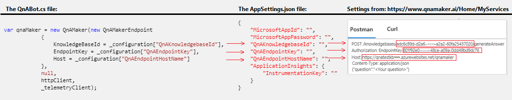
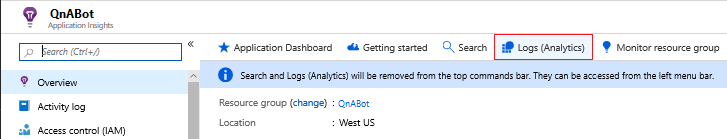

# Add telemetry to your QnAMaker bot

[!INCLUDE[applies-to](../includes/applies-to.md)]


Telemetry logging was added to version 4.2 of the Bot Framework SDK.  This enables bot applications to send event data to telemetry services such as [Application Insights](https://aka.ms/appinsights-overview). Telemetry offers insights into your bot by showing which features are used the most, detects unwanted behavior and offers visibility into availability, performance, and usage.

Two new components were added to the Bot Framework SDK that enable telemetry logging in QnA Maker enabled bots: `TelemetryLoggerMiddleware` and the `QnAMaker` class. `TelemetryLoggerMiddleware` is a middleware component that logs every time messages are received, sent, updated, or deleted, and the 'QnAMaker' class provides custom logging that extends telemetry capabilities.

In this article you will learn about:

* The code required to wire up telemetry in your bot 

* The code required to enable the out-of-the-box QnA logging and reports that use the standard event properties. 

* Modifying or extending the SDK's default event properties to enable a wide range of reporting needs.


## Prerequisites

* The [QnA Maker sample code](https://aka.ms/cs-qna)

* A subscription to [Microsoft Azure](https://portal.azure.com/)

* An [Application Insights key](../bot-service-resources-app-insights-keys.md)

* Familiarity with [QnA Maker](https://qnamaker.ai/) is helpful.

* A [QnA Maker](https://aka.ms/create-qna-maker) account.

* A published QnA Maker knowledge base. If you do not have one, follow the steps in [Create and answer from KB](https://aka.ms/create-publish-query-in-portal) tutorial to create a QnA Maker knowledge base with questions and answers.

> [!NOTE]
> This article will build on the [QnA Maker sample code](https://aka.ms/cs-qna) by stepping you through the steps required to incorporate telemetry. 

## Wiring up telemetry in your QnA Maker bot

We will start with the [QnA Maker sample app](https://aka.ms/cs-qna) and add the code required to integrate telemetry into a bot using the QnA service. This will enable Application Insights to begin tracking requests.

1. Open the [QnA Maker sample app](https://aka.ms/cs-qna) in Visual Studio

2. Add  the `Microsoft.Bot.Builder.Integration.ApplicationInsights.Core ` NuGet package. For more information on using NuGet, see [Install and manage packages in Visual Studio](https://aka.ms/install-manage-packages-vs):

3. Include the following statements in `Startup.cs`:
    ```csharp
    using Microsoft.ApplicationInsights.Extensibility;
    using Microsoft.Bot.Builder.ApplicationInsights;
    using Microsoft.Bot.Builder.Integration.ApplicationInsights.Core;
    ```

    > [!NOTE] 
    > If you're following along by updating the QnA Maker sample code you will notice that the using statement for `Microsoft.Bot.Builder.Integration.AspNet.Core` already exists in the QnA Maker sample.

4. Add the following code to the `ConfigureServices()` method in `Startup.cs`. This makes telemetry services available to your bot via [dependency injection (DI)](https://aka.ms/asp.net-core-dependency-interjection):
    ```csharp
    // This method gets called by the runtime. Use this method to add services to the container.
    public void ConfigureServices(IServiceCollection services)
    {
        ...
        // Create the Bot Framework Adapter with error handling enabled.
        services.AddSingleton<IBotFrameworkHttpAdapter, AdapterWithErrorHandler>();

        // Add Application Insights services into service collection
        services.AddApplicationInsightsTelemetry();

        // Add the standard telemetry client
        services.AddSingleton<IBotTelemetryClient, BotTelemetryClient>();

        // Create the telemetry middleware to track conversation events
        services.AddSingleton<TelemetryLoggerMiddleware>();

        // Add the telemetry initializer middleware
        services.AddSingleton<IMiddleware, TelemetryInitializerMiddleware>();

        // Add telemetry initializer that will set the correlation context for all telemetry items
        services.AddSingleton<ITelemetryInitializer, OperationCorrelationTelemetryInitializer>();

        // Add telemetry initializer that sets the user ID and session ID (in addition to other bot-specific properties, such as activity ID)
        services.AddSingleton<ITelemetryInitializer, TelemetryBotIdInitializer>();
        ...
    }
    ```
    
    > [!NOTE] 
    > If you are following along by updating the QnA Maker sample code you will notice that `services.AddSingleton<IBotFrameworkHttpAdapter, AdapterWithErrorHandler>();` already exists.

5. Instruct the adapter to use the middleware code that was added to the `ConfigureServices()` method. Open `AdapterWithErrorHandler.cs` and add `IMiddleware middleware` to the constructors parameter list. Add the `Use(middleware);` statement as the last line in the contructor:
    ```csharp
    public AdapterWithErrorHandler(ICredentialProvider credentialProvider, ILogger<BotFrameworkHttpAdapter> logger, IMiddleware middleware, ConversationState conversationState = null)
            : base(credentialProvider)
    {
        ...

        Use(middleware);
    }
    ```

6. Add the Application Insights instrumentation key in your `appsettings.json` file. The `appsettings.json` file contains metadata about external services the Bot uses while running. For example, CosmosDB, Application Insights and the QnA Maker service connection and metadata is stored there. The addition to your `appsettings.json` file must be in this format:

    ```json
    {
        "MicrosoftAppId": "",
        "MicrosoftAppPassword": "",
        "QnAKnowledgebaseId": "xxxxxxxx-xxxx-xxxx-xxxx-xxxxxxxxxxxx",
        "QnAEndpointKey": "xxxxxxxx-xxxx-xxxx-xxxx-xxxxxxxxxxxx",
        "QnAEndpointHostName": "https://xxxxxxxx.azurewebsites.net/qnamaker",
        "ApplicationInsights": {
            "InstrumentationKey": "xxxxxxxx-xxxx-xxxx-xxxx-xxxxxxxxxxxx"
        }
    }
    ```
   > [!Note] 
   > 
   > * Details on getting the _Application Insights instrumentation key_ can be found in the article [Application Insights keys](../bot-service-resources-app-insights-keys.md).
    >
    > * You should already have a [QnA maker account](https://aka.ms/create-qna-maker), if needed you can find information on getting the QnA Knowledgebase Id, Endpoint Key and HostName values [here](https://aka.ms/bot-framework-emulator-qna-keys).
    > 


At this point the preliminary work to enable telemetry using Application Insights is done.  You can run your bot locally using the bot emulator and then go into Application Insights to see what is being logged such as response time, overall app health, and general running information. 

> [!TIP] 
> For information on Enabling / disabling activity event and personal information logging see [Add telemetry to your bot](bot-builder-telemetry.md#enabling-or-disabling-activity-logging)

Next we will see what needs to be included to add telemetry functionality to the QnA Maker service. 


## Enabling telemetry to capture usage data from the QnA Maker service

The QnA Maker service has built-in telemetry logging available so there is very little you need to do to start getting telemetry data from QnA Maker.  First we will see how to incorporate telemetry into the QnA Maker code to enable the built-in telemetry logging, then we will learn how to replace or add additional properties to the existing event data to satisfy a wide range of reporting needs.

### Enabling default QnA logging

1. Create a private readonly field of type `IBotTelemetryClient` in your `QnABot` class in `QnABot.cs`:

    ```cs
    public class QnABot : ActivityHandler
        {
            private readonly IBotTelemetryClient _telemetryClient;
            ...
   }
    ```

2. Add an `IBotTelemetryClient` parameter to your `QnABot` class constructor in `QnABot.cs` and assign its value to the private field created in the previous step:

    ```cs
    public QnABot(IConfiguration configuration, ILogger<QnABot> logger, IHttpClientFactory httpClientFactory, IBotTelemetryClient telemetryClient)
    {
        ...
        _telemetryClient = telemetryClient;
    }
    ```

3. The _`telemetryClient`_ parameter is required when instantiating the new QnAMaker object in `QnABot.cs`:

    ```cs
    var qnaMaker = new QnAMaker(new QnAMakerEndpoint
                {
                    KnowledgeBaseId = _configuration["QnAKnowledgebaseId"],
                    EndpointKey = _configuration["QnAEndpointKey"],
                    Host = _configuration["QnAEndpointHostName"]
                },
                null,
                httpClient,
                _telemetryClient);
    ```

    > [!TIP] 
    > Make sure that the property names that you use in the `_configuration` entries match the property names you used in the AppSettings.json file and the values for those properties are obtained by selecting the _View Code_ button in https://www.qnamaker.ai/Home/MyServices:

        
    

#### Viewing Telemetry data logged from the QnA Maker default entries
You can view the results of your QnA Maker bot usage in Application Insights after running your bot in the bot emulator by taking the following steps :

1. Go to the [Azure portal](https://portal.azure.com/)

2. Navigate to your Application Insights by clicking on __Monitor > Applications__.

3. Once in your Application Insights, click on _Logs (Analytics)_ on the navigation bar as shown below:

    

4. Enter the following Kusto query and then select _Run_

    ```SQL
    customEvents
    | where name == 'QnaMessage'
    | extend answer = tostring(customDimensions.answer)
    | summarize count() by answer
    ```
5. Leave this page open in your browser, we will come back to it after adding a new custom property.

> [!TIP]
> If you are new to the Kusto query language that is used to write log queries in Azure Monitor, but are familiar with SQL query language, you may find the [SQL to Azure Monitor log query cheat sheet](https://aka.ms/azureMonitor-SQL-cheatsheet) useful. 

### Modifying or extending the default event properties
If you need properties that are not defined in the `QnAMaker` class there are two ways of handling this, both require creating your own class derived from the `QnAMaker` class. The first is explained in the section below titled [Adding properties](#adding-properties) in which you add properties to the existing `QnAMessage` event. The second method allows you to create new events to which you can add properties as described in [Adding new events with custom properties](#adding-new-events-with-custom-properties).  

> [!Note]
> The `QnAMessage` event is part of the Bot Framework SDK and provides all of the out-of-the-box event properties that are logged to Application Insights.


#### Adding properties 

The following demonstrates how you can derive from the `QnAMaker` class.  The example shows adding the property "MyImportantProperty" to the `QnAMessage` event.  The `QnAMessage` event is logged every time a QnA [GetAnswers](https://aka.ms/namespace-QnAMaker-GetAnswersAsync) call is performed.  

After learning how to add custom properties we will learn how to create a new custom event and associate properties with it, then we will run the bot locally using the Bot Framework Emulator and see what is being logged in Application Insights using the Kusto query language.

1. Create a new class named `MyQnAMaker` in the `Microsoft.BotBuilderSamples` namespace that inherits from the `QnAMaker` class and save it as `MyQnAMaker.cs`. In order to inherit from the `QnAMaker` class you will need to add the `Microsoft.Bot.Builder.AI.QnA` using statement. Your code should appear as follows:


    ```cs
    using Microsoft.Bot.Builder.AI.QnA;

    namespace Microsoft.BotBuilderSamples
    {
        public class MyQnAMaker : QnAMaker
        {

        }
    }
    ```
2. Add a class constructor to  `MyQnAMaker`. Note that you will need two additional using statements for the constructors parameters `System.Net.Http` and `Microsoft.Bot.Builder`:

    ```cs
    ...
    using Microsoft.Bot.Builder.AI.QnA;
    using System.Net.Http;
    using Microsoft.Bot.Builder;

    namespace Microsoft.BotBuilderSamples
    {
        public class MyQnAMaker : QnAMaker
        {
            public MyQnAMaker(
                QnAMakerEndpoint endpoint,
                QnAMakerOptions options = null,
                HttpClient httpClient = null,
                IBotTelemetryClient telemetryClient = null,
                bool logPersonalInformation = false)
                : base(endpoint, options, httpClient, telemetryClient, logPersonalInformation)
            {

            }
        } 
    }  
    ```
3. Add the new property to the QnAMessage event after the constructor and include the statements `System.Collections.Generic`, `System.Threading`, and `System.Threading.Tasks`:

    ```cs
    using Microsoft.Bot.Builder.AI.QnA;
    using System.Net.Http;
    using Microsoft.Bot.Builder;
    using System.Collections.Generic;
    using System.Threading;
    using System.Threading.Tasks;
 
    namespace Microsoft.BotBuilderSamples
    {
            public class MyQnAMaker : QnAMaker
            {
            ...

            protected override async Task OnQnaResultsAsync(
                                QueryResult[] queryResults,
                                Microsoft.Bot.Builder.ITurnContext turnContext,
                                Dictionary<string, string> telemetryProperties = null,
                                Dictionary<string, double> telemetryMetrics = null,
                                CancellationToken cancellationToken = default(CancellationToken))
            {
                var eventData = await FillQnAEventAsync(
                                        queryResults,
                                        turnContext,
                                        telemetryProperties,
                                        telemetryMetrics,
                                        cancellationToken)
                                    .ConfigureAwait(false);

                // Add new property
                eventData.Properties.Add("MyImportantProperty", "myImportantValue");

                // Log QnAMessage event
                TelemetryClient.TrackEvent(
                                QnATelemetryConstants.QnaMsgEvent,
                                eventData.Properties,
                                eventData.Metrics
                                );
            }

        } 
    }    
    ```

4. Modify your bot to use the new class, instead of creating a `QnAMaker` object you will create a `MyQnAMaker` object in  `QnABot.cs`:

    ```cs
    var qnaMaker = new MyQnAMaker(new QnAMakerEndpoint
                {
                    KnowledgeBaseId = _configuration["QnAKnowledgebaseId"],
                    EndpointKey = _configuration["QnAEndpointKey"],
                    Host = _configuration["QnAEndpointHostName"]
                },
                null,
                httpClient,
                _telemetryClient);
    ```

##### Viewing telemetry data logged from the new property _MyImportantProperty_
After running your bot in the emulator you can view the results in Application Insights by doing the following:

1. Switch back to your browser that has the _Logs (Analytics)_ view active.

2. Enter the following Kusto query and then select _Run_.  This will give a count of the number of times the new property was executed:

    ```SQL
    customEvents
    | where name == 'QnaMessage'
    | extend MyImportantProperty = tostring(customDimensions.MyImportantProperty)
    | summarize count() by MyImportantProperty
    ```

3. To show details instead of the count remove the last line and re-run the query:

    ```SQL
    customEvents
    | where name == 'QnaMessage'
    | extend MyImportantProperty = tostring(customDimensions.MyImportantProperty)
    ```
### Adding new events with custom properties
If you need to log data to a different event than `QnaMessage`, you can create your own custom event with its own properties.  To do this, we will add code to the end of the `MyQnAMaker` class as follows:

```CS
public class MyQnAMaker : QnAMaker
{
    ...

    // Create second event.
    var secondEventProperties = new Dictionary<string, string>();

    // Create new property for the second event.
    secondEventProperties.Add(
                        "MyImportantProperty2",
                        "myImportantValue2");

    // Log secondEventProperties event
    TelemetryClient.TrackEvent(
                    "MySecondEvent",
                    secondEventProperties);

} 
```                            
## The Application Insights dashboard

Anytime you create an Application Insights resource in Azure, a new dashboard will automatically be created and associated with it.  You can see that dashboard by selecting the button at the top of your Application Insights blade, labeled **Application Dashboard**. 


Alternatively, to view the data, go to the Azure portal. Click **Dashboard** on the left, then select the dashboard you want from the drop-down.

There you'll see some default information about your bot performance and any additional queries that you've pinned to your dashboard.


## Additional Information

* [Add telemetry to your bot](bot-builder-telemetry.md)

* [What is Application Insights?](https://aka.ms/appinsights-overview)

* [Using Search in Application Insights](https://aka.ms/search-in-application-insights)

* [Create custom KPI dashboards using Azure Application Insights](https://aka.ms/custom-kpi-dashboards-application-insights)
