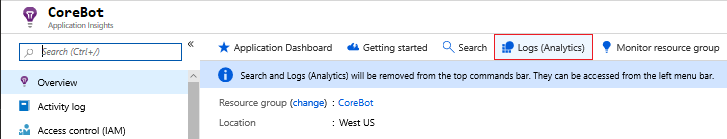
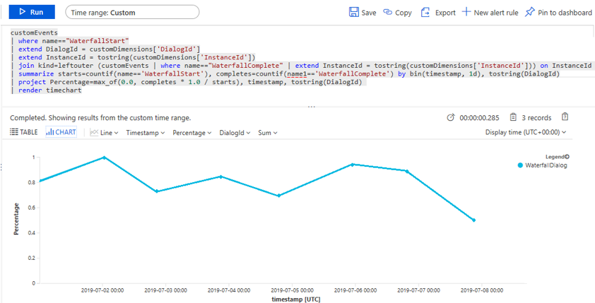
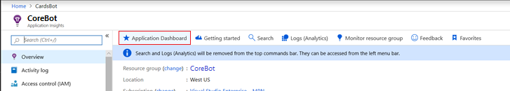

# Add telemetry to your bot

[!INCLUDE[applies-to](../includes/applies-to.md)]


Telemetry logging was added to version 4.2 of the Bot Framework SDK.  This enables bot applications to send event data to telemetry services such as [Application Insights](https://aka.ms/appinsights-overview). Telemetry offers insights into your bot by showing which features are used the most, detects unwanted behavior and offers visibility into availability, performance, and usage.

***Note: In version 4.6, the standard method for implementing telemetry into a bot has been updated in order to ensure telemetry is logged correctly when using a custom adapter. This article has been updated to show the updated method. The changes are backwards compatible and bots using the previous method will continue to log telemetry correctly.***


In this article you will learn how to implement telemetry into your bot using Application Insights:

* The code required to wire up telemetry in your bot and connect to Application Insights

* Enabling telemetry in your bots [Dialogs](bot-builder-concept-dialog.md)

* Enabling telemetry to capture usage data from other services like [LUIS](bot-builder-howto-v4-luis.md) and [QnA Maker](bot-builder-howto-qna.md).

* Visualizing your telemetry data in Application Insights

## Prerequisites

* The [CoreBot sample code](https://aka.ms/cs-core-sample)

* The [Application Insights sample code](https://aka.ms/csharp-corebot-app-insights-sample)

* A subscription to [Microsoft Azure](https://portal.azure.com/)

* An [Application Insights key](../bot-service-resources-app-insights-keys.md)

* Familiarity with [Application Insights](https://aka.ms/appinsights-overview)

> [!NOTE]
> The [Application Insights sample code](https://aka.ms/csharp-corebot-app-insights-sample) was built on top of the [CoreBot sample code](https://aka.ms/cs-core-sample). This article will step you through modifying the CoreBot sample code to incorporate telemetry. If you are following along in Visual Studio you will have the Application Insights sample code by the time we are finished.

## Wiring up telemetry in your bot

We will start with the [CoreBot sample app](https://aka.ms/cs-core-sample) and add the code required to integrate telemetry into any bot. This will enable Application Insights to begin tracking requests.

1. Open the [CoreBot sample app](https://aka.ms/cs-core-sample) in Visual Studio

2. Add  the `Microsoft.Bot.Builder.Integration.ApplicationInsights.Core ` NuGet package. For more information on using NuGet, see [Install and manage packages in Visual Studio](https://aka.ms/install-manage-packages-vs):


3. Include the following statements in `Startup.cs`:
    ```csharp
    using Microsoft.ApplicationInsights.Extensibility;
    using Microsoft.Bot.Builder.ApplicationInsights;
    using Microsoft.Bot.Builder.Integration.ApplicationInsights.Core;
    using Microsoft.Bot.Builder.Integration.AspNet.Core;
    ```

    Note: If you're following along by updating the CoreBot sample code you will notice that the using statement for `Microsoft.Bot.Builder.Integration.AspNet.Core` already exists in the CoreBot sample.

4. Include the following code in the `ConfigureServices()` method in `Startup.cs`. This will make telemetry services available to your bot via [dependency injection (DI)](https://aka.ms/asp.net-core-dependency-interjection):
    ```csharp
    // This method gets called by the runtime. Use this method to add services to the container.
    public void ConfigureServices(IServiceCollection services)
    {
        ...
        // Create the Bot Framework Adapter with error handling enabled.
        services.AddSingleton<IBotFrameworkHttpAdapter, AdapterWithErrorHandler>();

        // Add Application Insights services into service collection
        services.AddApplicationInsightsTelemetry();

        // Add the standard telemetry client
        services.AddSingleton<IBotTelemetryClient, BotTelemetryClient>();

        // Create the telemetry middleware to track conversation events
        services.AddSingleton<TelemetryLoggerMiddleware>();

        // Add the telemetry initializer middleware
        services.AddSingleton<IMiddleware, TelemetryInitializerMiddleware>();

        // Add telemetry initializer that will set the correlation context for all telemetry items
        services.AddSingleton<ITelemetryInitializer, OperationCorrelationTelemetryInitializer>();

        // Add telemetry initializer that sets the user ID and session ID (in addition to other bot-specific properties, such as activity ID)
        services.AddSingleton<ITelemetryInitializer, TelemetryBotIdInitializer>();
        ...
    }
    ```
    
    Note: If your following along by updating the CoreBot sample code you will notice that `services.AddSingleton<IBotFrameworkHttpAdapter, AdapterWithErrorHandler>();` already exists 

5. Instruct the adapter to use the middleware code that was added to the `ConfigureServices()` method. You do this in `AdapterWithErrorHandler.cs` with the parameter IMiddleware middleware in the constructors parameter list, and the `Use(middleware);` statement in the contructor as shown here:
    ```csharp
    public AdapterWithErrorHandler(ICredentialProvider credentialProvider, ILogger<BotFrameworkHttpAdapter> logger, IMiddleware middleware, ConversationState conversationState = null)
            : base(credentialProvider)
    {
        ...

        Use(middleware);
    }
    ```

7. Add the Application Insights instrumentation key in your `appsettings.json` file The `appsettings.json` file contains metadata about external services the Bot uses while running. For example, CosmosDB, Application Insights and the Language Understanding (LUIS) service connection and metadata is stored there. The addition to your `appsettings.json` file must be in this format:

    ```json
    {
        "MicrosoftAppId": "",
        "MicrosoftAppPassword": "",
        "ApplicationInsights": {
            "InstrumentationKey": "xxxxxxxx-xxxx-xxxx-xxxx-xxxxxxxxxxxx"
        }
    }
    ```
    Note: Details on getting the _Application Insights instrumentation key_ can be found in the article [Application Insights keys](../bot-service-resources-app-insights-keys.md).

At this point the preliminary work to enable telemetry using Application Insights is done.  You can run your bot locally using the bot emulator and then go into Application Insights to see what is being logged such as response time, overall app health, and general running information. 

## Enabling / disabling activity event and personal information logging

### Enabling or disabling Activity logging

By default, the `TelemetryInitializerMiddleware` will use the `TelemetryLoggerMiddleware` to log telemetry when your bot sends / receieves activities. Activity logging creates custom event logs in your Application Insights resource.  If you wish, you can disbale activity event logging by setting  `logActivityTelemetry` to false on the `TelemetryInitializerMiddleware` before registering it within **Startup.cs**.

```cs
public void ConfigureServices(IServiceCollection services)
{
    ...
    // Add the telemetry initializer middleware
    services.AddSingleton<IMiddleware, TelemetryInitializerMiddleware>(sp =>
            {
                var httpContextAccessor = sp.GetService<IHttpContextAccessor>();
                var loggerMiddleware = sp.GetService<TelemetryLoggerMiddleware>();
                return new TelemetryInitializerMiddleware(httpContextAccessor, loggerMiddleware, logActivityTelemetry: false);
            });
    ...
}
```

### Enable or disable logging personal information

By default, if activity logging is enabled, some properties on the incoming / outgoing activities are excluded from logging as they are likely to contain personal information, such as user name and the activity text. You can choose to include these properties in your logging by making the following change to **Startup.cs** when registering the `TelemetryLoggerMiddleware`.

```cs
public void ConfigureServices(IServiceCollection services)
{
    ...
    // Add the telemetry initializer middleware
    services.AddSingleton<TelemetryLoggerMiddleware>(sp =>
            {
                var telemetryClient = sp.GetService<IBotTelemetryClient>();
                return new TelemetryLoggerMiddleware(telemetryClient, logPersonalInformation: true);
            });
    ...
}
```

Next we will see what needs to be included to add telemetry functionality to the dialogs. This will enable you to get additional information such as what dialogs run, and statistics about each one.

## Enabling telemetry in your bots Dialogs

 Follow the steps below to update your CoreBot example:

1.  In `MainDialog.cs` add a new TelemetryClient field to the `MainDialog` class then update the constructor's parameter list to include an `IBotTelemetryClient` parameter, then pass that to each call to the `AddDialog()` method.


    * Add the parameter `IBotTelemetryClient telemetryClient` to the MainDialog class constructor, then assign it to the `TelemetryClient` field:

        ```csharp
        public MainDialog(IConfiguration configuration, ILogger<MainDialog> logger, IBotTelemetryClient telemetryClient)
            : base(nameof(MainDialog))
        {
            TelemetryClient = telemetryClient;

            ...

        }
        ```

    * When adding each dialog using the `AddDialog` method, set the `TelemetryClient` value:

        ```cs
        public MainDialog(IConfiguration configuration, ILogger<MainDialog> logger, IBotTelemetryClient telemetryClient)
            : base(nameof(MainDialog))
        {
            ...

            AddDialog(new TextPrompt(nameof(TextPrompt))
            {
                TelemetryClient = telemetryClient,
            });

            ...
        }
        ```

    * Waterfall Dialogs generate events independently of other dialogs. Set the `TelemetryClient` property after the list of Waterfall Steps:

        ```csharp
        // The IBotTelemetryClient to the WaterfallDialog
        AddDialog(new WaterfallDialog(
            nameof(WaterfallDialog),
            new WaterfallStep[]
        {
            IntroStepAsync,
            ActStepAsync,
            FinalStepAsync,
        })
        {
            TelemetryClient = telemetryClient,
        });

        ```

2. In `DialogExtensions.cs` set the `TelemetryClient` property of the `dialogSet` object in the `Run()` method:


    ```csharp
    public static async Task Run(this Dialog dialog, ITurnContext turnContext, IStatePropertyAccessor<DialogState> accessor, CancellationToken cancellationToken = default(CancellationToken))
    {
        ...

        dialogSet.TelemetryClient = dialog.TelemetryClient;

        ...
        
    }

    ```

3. In `BookingDialog.cs` use the same process used when updating `MainDialog.cs` to enable telemetry in the four dialogs added in this file. Don't forget to add the `TelemetryClient` field to the BookingDialog class and the `IBotTelemetryClient telemetryClient` parameter to the BookingDialog constructor.


> [!TIP] 
> If you are following along and updating the CoreBot sample code, you can refer to the [Application Insights sample code](https://aka.ms/csharp-corebot-app-insights-sample) if you run into any problems.

That's all there is to adding telemetry to your bots dialogs, at this point if you ran your bot you should see things being logged in Application Insights, however if you have any integrated technology such as LUIS and QnA Maker you will need to add the `TelemetryClient` to that code as well.


## Enabling telemetry to capture usage data from other services like LUIS and QnA Maker

We will next implement telemetry functionality in your LUIS service. The LUIS service has built-in telemetry logging available so there is very little you need to do to start getting telemetry data from LUIS.  

For this sample, we just need to provide the telemetry client in a similar way to how we did for dialogs. 

1. The _`IBotTelemetryClient telemetryClient`_ parameter is required in the `ExecuteLuisQuery()` method in `LuisHelper.cs`:

    ```cs
    public static async Task<BookingDetails> ExecuteLuisQuery(IBotTelemetryClient telemetryClient, IConfiguration configuration, ILogger logger, ITurnContext turnContext, CancellationToken cancellationToken)
    ```

2. The `LuisPredictionOptions` Class enables you to provide optional parameters for a LUIS prediction request.  To enable telemetry, you will need to set the `TelemetryClient` parameter when creating the `luisPredictionOptions` object in `LuisHelper.cs`:

    ```cs
    var luisPredictionOptions = new LuisPredictionOptions()
    {
        TelemetryClient = telemetryClient,
    };

    var recognizer = new LuisRecognizer(luisApplication, luisPredictionOptions);
    ```

3. The last step is to pass in the telemetry client to the call to `ExecuteLuisQuery` in the `ActStepAsync()` method of `MainDialog.cs`:

    ```cs
    await LuisHelper.ExecuteLuisQuery(TelemetryClient, Configuration, Logger, stepContext.Context, cancellationToken)
    ```

That's it, you should have a functional bot that logs telemetry data into Application insights. You can use the [Bot Framework Emulator](https://aka.ms/bot-framework-emulator-readme) to run your bot locally. You shouldn't see any changes in the bot's behavior, but it will be logging information into Application Insights. Interact with the bot by sending multiple messages and in the next section we will review the telemetry results in Application Insights.

For information on testing and debugging your bot, you can refer to the following articles:

 * [Debug a bot](../bot-service-debug-bot.md)
 * [Testing and debugging guidelines](bot-builder-testing-debugging.md)
 * [Debug with the emulator](../bot-service-debug-emulator.md)


## Visualizing your telemetry data in Application Insights
Application Insights monitors the availability, performance, and usage of your bot application whether it's hosted in the cloud or on-premises. It leverages the powerful data analysis platform in Azure Monitor to provide you with deep insights into your application's operations and diagnose errors without waiting for a user to report them. There are a few ways to see the telemetry data collected by Application Insights, two of the primary ways are through queries and the dashboard. 

### Querying your telemetry data in Application Insights using Kusto Queries
Use this section as a starting point to learn how to use log queries in Application Insights. It demonstrates two useful queries and provides links to other documentation with additional information.

To query your data

1. Go to the [Azure portal](https://portal.azure.com)
2. Navigate to your Application Insights. Easiest way to do so is click on **Monitor > Applications** and find it there. 
3. Once in your Application Insights, you can click on _Logs (Analytics)_ on the navigation bar.

    

4. This will bring up the Query window.  Enter the following query and select _Run_:

    ```sql
    customEvents
    | where name=="WaterfallStart"
    | extend DialogId = customDimensions['DialogId']
    | extend InstanceId = tostring(customDimensions['InstanceId'])
    | join kind=leftouter (customEvents | where name=="WaterfallComplete" | extend InstanceId = tostring(customDimensions['InstanceId'])) on InstanceId    
    | summarize starts=countif(name=='WaterfallStart'), completes=countif(name1=='WaterfallComplete') by bin(timestamp, 1d), tostring(DialogId)
    | project Percentage=max_of(0.0, completes * 1.0 / starts), timestamp, tostring(DialogId) 
    | render timechart
    ```
5. This will return the percentage of waterfall dialogs that run to completion.

    


> [!TIP]
> You can pin any query to your Application Insights dashboard   by selecting the button on the top right of the **Logs (Analytics)** blade. Just select the dashboard you want it pinned to, and it will be available next time you visit that dashboard.


## The Application Insights dashboard

Anytime you create an Application Insights resource in Azure, a new dashboard will automatically be created and associated with it.  You can see that dashboard by selecting the button at the top of your Application Insights blade, labeled **Application Dashboard**. 




Alternatively, to view the data, go to the Azure portal. Click **Dashboard** on the left, then select the dashboard you want from the drop-down.

There, you'll see some default information about your bot performance and any additional queries that you've pinned to your dashboard.


## Additional Information

* [What is Application Insights?](https://aka.ms/appinsights-overview)

* [Using Search in Application Insights](https://aka.ms/search-in-application-insights)

* [Create custom KPI dashboards using Azure Application Insights](https://aka.ms/custom-kpi-dashboards-application-insights)


<!--
The easiest way to test is by creating a dashboard using [Azure portal's template deployment page](https://portal.azure.com/#create/Microsoft.Template).
- Click ["Build your own template in the editor"]
- Copy and paste either one of these .json file that is provided to help you create the dashboard:
  - [System Health Dashboard](https://aka.ms/system-health-appinsights)
  - [Conversation Health Dashboard](https://aka.ms/conversation-health-appinsights)
- Click "Save"
- Populate `Basics`: 
   - Subscription: <your test subscription>
   - Resource group: <a test resource group>
   - Location: <such as West US>
- Populate `Settings`:
   - Insights Component Name: <like `core672so2hw`>
   - Insights Component Resource Group: <like `core67`>
   - Dashboard Name:  <like `'ConversationHealth'` or `SystemHealth`>
- Click `I agree to the terms and conditions stated above`
- Click `Purchase`
- Validate
   - Click on [`Resource Groups`](https://ms.portal.azure.com/#blade/HubsExtension/Resources/resourceType/Microsoft.Resources%2Fsubscriptions%2FresourceGroups)
   - Select your Resource Group from above (like `core67`).
   - If you don't see a new Resource, then look at "Deployments" and see if any have failed.
   - Here's what you typically see for failures:
     
```json
{"code":"DeploymentFailed","message":"At least one resource deployment operation failed. Please list deployment operations for details. Please see https://aka.ms/arm-debug-deployment for usage details.","details":[{"code":"BadRequest","message":"{\r\n \"error\": {\r\n \"code\": \"InvalidTemplate\",\r\n \"message\": \"Unable to process template language expressions for resource '/subscriptions/45d8a30e-3363-4e0e-849a-4bb0bbf71a7b/resourceGroups/core67/providers/Microsoft.Portal/dashboards/Bot Analytics Dashboard' at line '34' and column '9'. 'The template parameter 'virtualMachineName' is not found. Please see https://aka.ms/arm-template-structure for usage details.'\"\r\n }\r\n}"}]}
```
-->

<!--
## Additional information

### Customize your telemetry client

If you want to customize your telemetry to log into a separate service, you have to configure the system differently. If using Application Insights to do so, download the package `Microsoft.Bot.Builder.ApplicationInsights` via NuGet, or use npm to install `botbuilder-applicationinsights`. Details on getting the Application Insights keys can be found [here](../bot-service-resources-app-insights-keys.md). Otherwise, include what is necessary for logging to that service, then follow the section below.

**Use Custom Telemetry**
If you want to log telemetry events generated by the Bot Framework into a completely separate system, create a new class derived from the base interface `IBotTelemetryClient` and configure. Then, when adding your telemetry client as above, just inject your custom client. 

```csharp
public void ConfigureServices(IServiceCollection services)
{
    ...
    // Add the telemetry client.
    services.AddSingleton<IBotTelemetryClient, CustomTelemetryClient>();
    ...
}
```

### Add custom logging to your bot

Once the Bot has the new telemetry logging support configured, you can begin adding telemetry to your bot.  The `BotTelemetryClient`(in C#, `IBotTelemetryClient`) has several methods to log distinct types of events.  Choosing the appropriate type of event enables you to take advantage of Application Insights existing reports (if you are using Application Insights).  For general scenarios `TraceEvent` is typically used.  The data logged using `TraceEvent` lands in the `CustomEvent` table in Kusto.

If using a Dialog within your Bot, every Dialog-based object (including Prompts) will contain a new `TelemetryClient` property.  This is the `BotTelemetryClient` that enables you to perform logging.  This is not just a convenience, we'll see later in this article if this property is set, `WaterfallDialogs` will generate events.

### Details of telemetry options

There are three main components available for your bot to log telemetry, and each component has customization available for logging your own events, which are discussed in this section. 

- A  [Bot Framework Middleware component](#telemetry-middleware) (*TelemetryLoggerMiddleware*) that will log when messages are received, sent, updated or deleted. You can override for custom logging.
- [*LuisRecognizer* class.](#telemetry-support-luis)  You can override for custom logging in two ways - per invocation (add/replace properties) or derived classes.
- [*QnAMaker*  class.](#telemetry-qnamaker)  You can override for custom logging in two ways - per invocation (add/replace properties) or derived classes.

All components log using the `IBotTelemetryClient`  (or `BotTelemetryClient` in node.js) interface which can be overridden with a custom implementation.

#### Telemetry Middleware

|C#  | JavaScript |
|:-----|:------------|
|**Microsoft.Bot.Builder.TelemetryLoggerMiddleware** | **botbuilder-core** |

##### Out of box usage

The TelemetryLoggerMiddleware is a Bot Framework component that can be added without modification, and it will perform logging that enables out of the box reports that ship with the Bot Framework SDK. 

```csharp
// Create the telemetry middleware to track conversation events
services.AddSingleton<IMiddleware, TelemetryLoggerMiddleware>();

// Create the Bot Framework Adapter with error handling enabled.
services.AddSingleton<IBotFrameworkHttpAdapter, AdapterWithErrorHandler>();
```

And in our adapter, we would specify the use of middleware:

```csharp
public AdapterWithErrorHandler(ICredentialProvider credentialProvider, ILogger<BotFrameworkHttpAdapter> logger, IMiddleware middleware, ConversationState conversationState = null)
           : base(credentialProvider)
{
    ...
    Use(middleware);
    ...
}
```

##### Adding properties
If you decide to add additional properties, the TelemetryLoggerMiddleware class can be derived.  For example, if you would like to add the property "MyImportantProperty" to the `BotMessageReceived` event.  `BotMessageReceived` is logged when the user sends a message to the bot.  Adding the additional property can be accomplished in the following way:

```csharp
class MyTelemetryMiddleware : TelemetryLoggerMiddleware
{
    ...
    protected override Task OnReceiveActivityAsync(
                  Activity activity,
                  CancellationToken cancellation)
    {
        // Fill in the "standard" properties for BotMessageReceived
        // and add our own property.
        var properties = FillReceiveEventProperties(activity, 
                    new Dictionary<string, string>
                    { {"MyImportantProperty", "myImportantValue" } } );
                    
        // Use TelemetryClient to log event
        TelemetryClient.TrackEvent(
                        TelemetryLoggerConstants.BotMsgReceiveEvent,
                        properties);
    }
    ...
}
```

In Startup, we would add the new class:

```csharp
// Create the telemetry middleware to track conversation events
services.AddSingleton<IMiddleware, MyTelemetryMiddleware>();
```

##### Completely replacing properties / Additional event(s)

If you decide to completely replace properties being logged, the `TelemetryLoggerMiddleware` class can be derived (like above when extending properties).   Similarly, logging new events is performed in the same way.

For example, if you would like to completely replace the`BotMessageSend` properties and send multiple events, the following demonstrates how this could be performed:

```csharp
class MyTelemetryMiddleware : TelemetryLoggerMiddleware
{
    ...
    protected override Task OnReceiveActivityAsync(
                  Activity activity,
                  CancellationToken cancellation)
    {
        // Override properties for BotMsgSendEvent
        var botMsgSendProperties = new Dictionary<string, string>();
        properties.Add("MyImportantProperty", "myImportantValue");
        // Log event
        TelemetryClient.TrackEvent(
                        TelemetryLoggerConstants.BotMsgSendEvent,
                        botMsgSendProperties);
                        
        // Create second event.
        var secondEventProperties = new Dictionary<string, string>();
        secondEventProperties.Add("activityId",
                                   activity.Id);
        secondEventProperties.Add("MyImportantProperty",
                                   "myImportantValue");
        TelemetryClient.TrackEvent(
                        "MySecondEvent",
                        secondEventProperties);
    }
    ...
}
```
Note: When the standard properties are not logged, it will cause the out of box reports shipped with the product to stop working.

##### Events Logged from Telemetry Middleware
[BotMessageSend](bot-builder-telemetry-reference.md#customevent-botmessagesend)
[BotMessageReceived](bot-builder-telemetry-reference.md#customevent-botmessagereceived)
[BotMessageUpdate](bot-builder-telemetry-reference.md#customevent-botmessageupdate)
[BotMessageDelete](bot-builder-telemetry-reference.md#customevent-botmessagedelete)

#### Telemetry support LUIS 

|C#  | JavaScript |
|:-----|:------------|
| **Microsoft.Bot.Builder.AI.Luis** | **botbuilder-ai** |

##### Out of box usage
The LuisRecognizer is an existing Bot Framework component, and telemetry can be enabled by passing a IBotTelemetryClient interface through `luisOptions`.  You can override the default properties being logged and log new events as required.

During construction of `luisOptions`, an `IBotTelemetryClient` object must be provided for this to work.

```csharp
var luisPredictionOptions = new LuisPredictionOptions()
{
    TelemetryClient = telemetryClient
};
var recognizer = new LuisRecognizer(luisApplication, luisPredictionOptions);
```

##### Adding properties
If you decide to add additional properties, the `LuisRecognizer` class can be derived.  For example, if you would like to add the property "MyImportantProperty" to the `LuisResult` event.  `LuisResult` is logged when a LUIS prediction call is performed.  Adding the additional property can be accomplished in the following way:

```csharp
class MyLuisRecognizer : LuisRecognizer 
{
   ...
   protected override Task OnRecognizerResultAsync(
           RecognizerResult recognizerResult,
           ITurnContext turnContext,
           Dictionary<string, string> properties = null,
           CancellationToken cancellationToken = default(CancellationToken))
   {
       var luisEventProperties = FillLuisEventProperties(result, 
               new Dictionary<string, string>
               { {"MyImportantProperty", "myImportantValue" } } );
        
        TelemetryClient.TrackEvent(
                        LuisTelemetryConstants.LuisResultEvent,
                        luisEventProperties);
        ..
   }    
   ...
}
```

##### Add properties per invocation
Sometimes it's necessary to add additional properties during the invocation:
```csharp
var additionalProperties = new Dictionary<string, string>
{
   { "dialogId", "myDialogId" },
   { "conversationInfo", "myConversationInfo" },
};

var result = await recognizer.RecognizeAsync(turnContext,
     additionalProperties).ConfigureAwait(false);
```

##### Completely replacing properties / Additional event(s)
If you decide to completely replace properties being logged, the `LuisRecognizer` class can be derived (like above when extending properties).   Similarly, logging new events is performed in the same way.

For example, if you would like to completely replace the`LuisResult` properties and send multiple events, the following demonstrates how this could be performed:

```csharp
class MyLuisRecognizer : LuisRecognizer
{
    ...
    protected override Task OnRecognizerResultAsync(
             RecognizerResult recognizerResult,
             ITurnContext turnContext,
             Dictionary<string, string> properties = null,
             CancellationToken cancellationToken = default(CancellationToken))
    {
        // Override properties for LuisResult event
        var luisProperties = new Dictionary<string, string>();
        properties.Add("MyImportantProperty", "myImportantValue");
        
        // Log event
        TelemetryClient.TrackEvent(
                        LuisTelemetryConstants.LuisResult,
                        luisProperties);
                        
        // Create second event.
        var secondEventProperties = new Dictionary<string, string>();
        secondEventProperties.Add("MyImportantProperty2",
                                   "myImportantValue2");
        TelemetryClient.TrackEvent(
                        "MySecondEvent",
                        secondEventProperties);
        ...
    }
    ...
}
```
Note: When the standard properties are not logged, it will cause the Application Insights out of box reports shipped with the product to stop working.

##### Events Logged from TelemetryLuisRecognizer
[LuisResult](bot-builder-telemetry-reference.md#customevent-luisevent)

### Telemetry QnAMaker

|C#  | JavaScript |
|:-----|:------------|
| **Microsoft.Bot.Builder.AI.QnA** | **botbuilder-ai** |


##### Out of box usage
The QnAMaker class is an existing Bot Framework component that adds two additional constructor parameters which enable logging that enable out of the box reports that ship with the Bot Framework SDK. The new `telemetryClient` references a `IBotTelemetryClient` interface which performs the logging.  

```csharp
var qna = new QnAMaker(endpoint, options, client, 
                       telemetryClient: telemetryClient,
                       logPersonalInformation: true);
```
##### Adding properties 
If you decide to add additional properties, there are two methods of doing this - when properties need to be added during the QnA call to retrieve answers or deriving from the `QnAMaker` class.  

The following demonstrates deriving from the `QnAMaker` class.  The example shows adding the property "MyImportantProperty" to the `QnAMessage` event.  The`QnAMessage` event is logged when a QnA `GetAnswers`call is performed.  In addition, we log a second event "MySecondEvent".

```csharp
class MyQnAMaker : QnAMaker 
{
   ...
   protected override Task OnQnaResultsAsync(
                 QueryResult[] queryResults, 
                 ITurnContext turnContext, 
                 Dictionary<string, string> telemetryProperties = null, 
                 Dictionary<string, double> telemetryMetrics = null, 
                 CancellationToken cancellationToken = default(CancellationToken))
   {
            var eventData = await FillQnAEventAsync(queryResults, turnContext, telemetryProperties, telemetryMetrics, cancellationToken).ConfigureAwait(false);

            // Add my property
            eventData.Properties.Add("MyImportantProperty", "myImportantValue");

            // Log QnaMessage event
            TelemetryClient.TrackEvent(
                            QnATelemetryConstants.QnaMsgEvent,
                            eventData.Properties,
                            eventData.Metrics
                            );

            // Create second event.
            var secondEventProperties = new Dictionary<string, string>();
            secondEventProperties.Add("MyImportantProperty2",
                                       "myImportantValue2");
            TelemetryClient.TrackEvent(
                            "MySecondEvent",
                            secondEventProperties);       }    
    ...
}
```

##### Adding properties during GetAnswersAsync
If you have properties that need to be added during runtime, the `GetAnswersAsync` method can provide properties and/or metrics to add to the event.

For example, if you want to add a `dialogId` to the event, it can be done like the following:
```csharp
var telemetryProperties = new Dictionary<string, string>
{
   { "dialogId", myDialogId },
};

var results = await qna.GetAnswersAsync(context, opts, telemetryProperties);
```
The `QnaMaker` class provides the capability of overriding properties, including PersonalInfomation properties.

##### Completely replacing properties / Additional event(s)
If you decide to completely replace properties being logged, the `TelemetryQnAMaker` class can be derived (like above when extending properties).   Similarly, logging new events is performed in the same way.

For example, if you would like to completely replace the`QnAMessage` properties, the following demonstrates how this could be performed:

```csharp
class MyQnAMaker : QnAMaker
{
    ...
    protected override Task OnQnaResultsAsync(
         QueryResult[] queryResults, 
         ITurnContext turnContext, 
         Dictionary<string, string> telemetryProperties = null, 
         Dictionary<string, double> telemetryMetrics = null, 
         CancellationToken cancellationToken = default(CancellationToken))
    {
        // Add properties from GetAnswersAsync
        var properties = telemetryProperties ?? new Dictionary<string, string>();
        // GetAnswerAsync properties overrides - don't add if already present.
        properties.TryAdd("MyImportantProperty", "myImportantValue");

        // Log event
        TelemetryClient.TrackEvent(
                           QnATelemetryConstants.QnaMsgEvent,
                            properties);
    }
    ...
}
```
Note: When the standard properties are not logged, it will cause the out of box reports shipped with the product to stop working.

##### Events Logged from TelemetryLuisRecognizer
[QnAMessage](bot-builder-telemetry-reference.md#customevent-qnamessage)

### All other events

A full list of events logged for your bot's telemetry can be found on the [telemetry reference page](bot-builder-telemetry-reference.md).

#### Identifiers and Custom Events

When logging events into Application Insights, the events generated contain default properties that you won't have to fill.  For example, `user_id` and `session_id`properties are contained in each Custom Event (generated with the `TraceEvent` API).  In addition, `activitiId`, `activityType` and `channelId` are also added.

> [!NOTE]
> Custom telemetry clients will not be provided these values.


Property |Type | Details
--- | --- | ---
`user_id`| `string` | [ChannelID](https://github.com/Microsoft/BotBuilder/blob/master/specs/botframework-activity/botframework-activity.md#channel-id) + [From.Id](https://github.com/Microsoft/BotBuilder/blob/master/specs/botframework-activity/botframework-activity.md#from)
`session_id`| `string`|  [ConversationID](https://github.com/Microsoft/BotBuilder/blob/master/specs/botframework-activity/botframework-activity.md#conversation)
`customDimensions.activityId`| `string` | [The bot activity ID](https://github.com/Microsoft/BotBuilder/blob/master/specs/botframework-activity/botframework-activity.md#id)
`customDimensions.activityType` | `string` | [The bot activity type](https://github.com/Microsoft/BotBuilder/blob/master/specs/botframework-activity/botframework-activity.md#channel-id)
`customDimensions.channelId` | `string` |  [The bot activity channel ID](https://github.com/Microsoft/BotBuilder/blob/master/specs/botframework-activity/botframework-activity.md#channel-id)
-->
