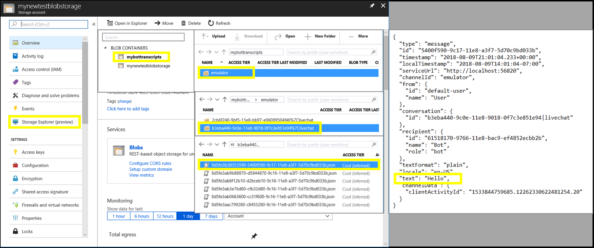

# Testing and debugging guidelines

[!INCLUDE[applies-to](../includes/applies-to.md)]

Bots are complex apps, with a lot of different parts working together. Like any other complex app, this can lead to some interesting bugs or cause your bot to behave differently than expected.

Testing, and subsequently debugging, your bot can sometimes be a difficult task. Every developer has their own preferred way to accomplish that task; guidelines we present below are suggestions for you to use that apply to a large majority of bots.

## Testing your bot

The guidelines below are presented in three different **levels**.  Each level adds complexity and features to the testing, and we therefore suggest that you’re happy with one level before moving onto the next. Doing so will allow you to isolate and fix the lowest level issues first before adding more complexity.

Testing best practice will cover different angles wherever applicable. This may include security, integration, badly formed URLs, validation exploits, HTTP status codes, JSON payloads, null values and so on. If your bot handles any information that has impact on user privacy, this is particularly important.

### Level 1: Use mock elements

Ensuring that each small piece of your app, or in this case our bot, works exactly as it should, is the first level of testing. To achieve this, you can use mock elements for the things you’re not currently testing. For reference, this level can generally be thought of as unit and integration testing.

#### Use mock elements to test individual sections

Mocking as many elements as you can allows for better isolation of the piece you’re testing. Candidates for mock elements include storage, the adapter, middleware, activity pipeline, channels, and anything else that is not directly part of your bot. This could also be removing certain aspects temporarily, such as middleware not involved in the part of your bot that you are testing, to isolate each piece. However, if you are testing your middleware, you may want to mock your bot instead.

Mocking elements can take a handful of forms, from replacing an element with a different known object to implementing a bare bones hello world functionality. This could also take the form of simply removing the element, if it’s not necessary, or simply force it to do nothing. 

This level should exercise individual methods and functions within your bot. Testing individual methods could be through built in unit tests, which are recommended, with your own testing app or test suite, or manually doing so within your IDE. 

#### Use mock elements to test larger features

Once you are happy with how each method behaves, use these mock elements to test more complete features in your bot. This demonstrates how a few layers work together to converse with your user. 

A handful of tools are provided to help with this. For example,
the [Azure Bot Framework Emulator](https://github.com/Microsoft/BotFramework-Emulator) provides an emulated channel to communicate with your bot. Using the emulator gets into a more complex situation than just unit and integration testing, and therefore also spills over into the next level of testing.

### Level 2: Use a Direct Line client

After verifying your bot appears to work how you’d like it to, the next step is connecting it to a channel. To do this, you can deploy your bot to a staging server and create your own direct line client for your bot to connect to.
<!--IBTODO [Direct Line client](bot-builder-howto-direct-line.md)-->

Creating your own client allows you to define the inner workings of the channel, as well as specifically test how your bot responds to certain activity exchanges. Once connected to your client, run your tests to set up your bot state and verify your features. If your bot utilizes a feature like speech, using these channels can offer a way to verify that functionality.

Use of both the Emulator and Web Chat via Azure portal here can provide further insight into how your bot performs while interacting with different channels.

### Level 3: Channel tests

Once you’re confident in your bot’s independent performance, it’s important to see how it works with various channels that it will be available on. 

How this is achieved can vary greatly, from individually using different channels and browsers to using a third-party tool, such as [Selenium](https://docs.seleniumhq.org/) to interact through a channel and scrape responses from your bot.

### Other testing

Different types of testing can be done in conjunction with the above levels or from different angles, such as stress testing, performance testing, or profiling your bot’s activity. Visual studio provides methods to do this locally as well as a [suite of tools](https://azure.microsoft.com/en-us/solutions/dev-test/) for testing your app, and the [Azure portal](https://portal.azure.com) provides insight into how your bot is performing.

## Debugging

Debugging your bot works similarly to other multi-threaded apps, with the ability to set breakpoints or use features like the immediate window. 

Bots follow an event driven programming paradigm, which can be hard to rationalize if you’re not familiar with it. The idea of your bot being stateless, multi-threaded, and dealing with async/await calls can result in unexpected bugs. While debugging your bot works similarly to other multi-threaded apps, we’ll cover some suggestions, tools, and resources to help.

### Understanding bot activities with the emulator

Your bot deals with different types of [activities](bot-builder-basics.md#the-activity-processing-stack) besides the normal _message_ activity. Using the [emulator](../bot-service-debug-emulator.md) will show you what those activities are, when they happen, and what information they contain. Understanding those activities will help you code your bot efficiently and allows you to verify the activities your bot is sending and receiving are what you expect.

### Saving and retrieving user interactions with transcripts

Azure blob transcript storage provides a specialized resource where you can both [store and retrieve transcripts](bot-builder-howto-v4-storage.md) containing interactions between your users and your bot.  

Additionally, once user input interactions have been stored, you can use Azure's "_storage explorer_" to manually view data contained in transcripts stored within your blob transcript store. The following example opens "_storage explorer_" from settings for "_mynewtestblobstorage_." To open a saved user input select:    Blob Container > ChannelId > TranscriptId > ConversationId

This opens the stored user conversation input in JSON format. User input is preserved together with the key "_text:_."

### How middleware works

[Middleware](bot-builder-concept-middleware.md) may not be intuitive when first attempting to use it, particularly regarding the continuation, or short-circuiting, of execution. Middleware can execute on the leading or trailing edge of a turn, with a call to the `next()` delegate dictating when execution is passed to the bot logic. 

If you are using multiple pieces of middleware the delegate may pass execution to a different piece of middleware if that is how your pipeline is oriented. Details on [the bot middleware pipeline](bot-builder-concept-middleware.md#the-bot-middleware-pipeline) can help make that idea clearer.

If the `next()` delegate is not called, that’s referred to as [short circuit routing](bot-builder-concept-middleware.md#short-circuiting). This happens when the middleware satisfies the current activity and determines it’s not necessary to pass execution on. 

Understanding when, and why, middleware short-circuits helps indicate which piece of middleware should come first in your pipeline. Additionally, understanding what to expect is particularly important for built-in middleware provided by the SDK or other developers. Some find it helpful to try creating your own middleware first to experiment a bit before diving into the built-in middleware.

<!-- Snip: QnA was once implemented as middleware.
For example [QnA maker](bot-builder-howto-qna.md) is designed to handle certain interactions and short-circuit the pipeline when it does, which can be confusing when first learning how to use it.
-->

### Understanding state

Keeping track of state is an important part of your bot, particularly for complex tasks. In general, best practice is to process activities as quickly as possible and let the processing complete so that state gets persisted. Activities can be sent to your bot at nearly the same time, and that can introduce very confusing bugs because of the asynchronous architecture.

Most importantly, make sure that state is persisting in a way that matches your expectations. Depending on where your persisted state lives, storage emulators for [Cosmos DB](https://docs.microsoft.com/en-us/azure/cosmos-db/local-emulator) and [Azure Table storage](https://docs.microsoft.com/en-us/azure/storage/common/storage-use-emulator) can help you verify that state before using production storage.

### How to use activity handlers

Activity handlers can introduce another layer of complexity, particularly since each activity runs on an independent thread (or web workers, depending on your language). Depending on what your handlers are doing, this can cause issues where the current state is not what you expect.

Built-in state gets written at the end of a turn, however any activities generated by that turn are executing independently of the turn pipeline. Often this doesn’t impact us, but if an activity handler changes state we need the state written to contain that change. In that case, the turn pipeline can wait on the activity to finish processing before completing to make sure it records the correct state for that turn.

The _send activity_ method, and its handlers, pose a unique problem. Simply calling _send activity_ from within the _on send activities_ handler causes an infinite forking of threads. There are ways you can work around that problem, such as by appending additional messages to the outgoing information or writing out to another location like the console or a file to avoid crashing your bot.

## Additional resources

* [Debugging in Visual Studio](https://docs.microsoft.com/en-us/visualstudio/debugger/index)
* [Debugging, Tracing, and Profiling](https://docs.microsoft.com/en-us/dotnet/framework/debug-trace-profile/) for the bot framework
* Use the [ConditionalAttribute](https://docs.microsoft.com/en-us/dotnet/api/system.diagnostics.conditionalattribute?view=netcore-2.0) for methods you don't want to include in production code
* Use tools like [Fiddler](https://www.telerik.com/fiddler) to see network traffic
* [Bot tools repo](https://github.com/Microsoft/botbuilder-tools)
* Frameworks can help with testing, such as [Moq](https://github.com/moq/moq4)
* [Troubleshoot general problems](../bot-service-troubleshoot-bot-configuration.md) and the other troubleshooting articles in that section
