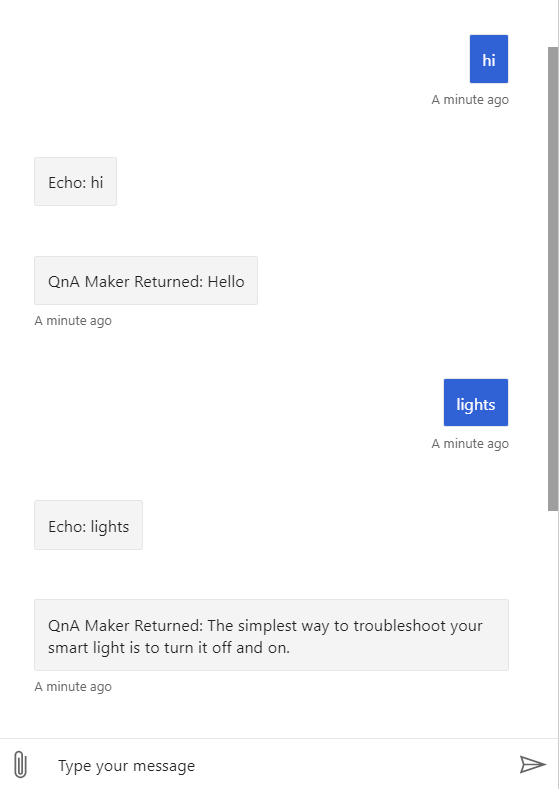

# Tutorial: Use QnA Maker in your bot to answer questions

[!INCLUDE [applies-to-v4](../includes/applies-to.md)]

You can use the QnA Maker service and a knowledge base to add question-and-answer support to your bot. When you create your knowledge base, you seed it with questions and answers.

In this tutorial, you learn how to:

> [!div class="checklist"]
> * Create a QnA Maker service and knowledge base
> * Add knowledge base information to your configuration file
> * Update your bot to query the knowledge base
> * Republish your bot

If you don’t have an Azure subscription, create a [free account](https://azure.microsoft.com/free/?WT.mc_id=A261C142F) before you begin.

## Prerequisites

* The bot created in the [previous tutorial](bot-builder-tutorial-basic-deploy.md). We will add a question-and-answer feature to the bot.
* Some familiarity with [QnA Maker](https://qnamaker.ai/) is helpful. We will use the QnA Maker portal to create, train, and publish the knowledge base to use with the bot.
* familiarity with [QnA bot creation](https://aka.ms/azure-create-qna) using Azure Bot Service.

You should also already have the prerequisites for the previous tutorial.

## Sign in to QnA Maker portal

<!-- This and the next step are close duplicates of what's in the QnA How-To -->

Sign into to the [QnA Maker portal](https://qnamaker.ai/) with your Azure credentials.

## Create a QnA Maker service and knowledge base

We will import an existing knowledge base definition from the QnA Maker sample in the [Microsoft/BotBuilder-Samples](https://github.com/Microsoft/BotBuilder-Samples) repo.

1. Clone or copy the samples repo to your computer.
1. In the QnA Maker portal, **create a knowledge base**.
   1. If necessary, create a QnA service. (You can use an existing QnA Maker service or create a new one for this tutorial.) For more detailed QnA Maker instructions, see [Create a QnA Maker service](https://docs.microsoft.com/en-us/azure/cognitive-services/qnamaker/how-to/set-up-qnamaker-service-azure) and [Create, train, and publish your QnA Maker knowledge base](https://docs.microsoft.com/en-us/azure/cognitive-services/qnamaker/quickstarts/create-publish-knowledge-base).
   1. Connect your QnA service to your knowledge base.
   1. Name your knowledge base.
   1. To populate your knowledge base, use the **BotBuilder-Samples\samples\csharp_dotnetcore\11.qnamaker\CognitiveModels\smartLightFAQ.tsv** file from the samples repo.
   1. Click **Create your kb** to create the knowledge base.
1. **Save and train** your knowledge base.
1. **Publish** your knowledge base.

Once your QnA Maker app is published, select the _SETTINGS_ Tab, and scroll down to 'Deployment details'. Record the following values from the _Postman_ Sample HTTP request.

```text
POST /knowledgebases/<knowledge-base-id>/generateAnswer
Host: <your-hostname>  // NOTE - this is a URL ending in /qnamaker.
Authorization: EndpointKey <qna-maker-resource-key>
```

The full URL string for your hostname will look like "https://< >.azure.net/qnamaker".

These values will be used within your `appsettings.json` or `.env` file in the next step.

The knowledge base is now ready for your bot to use.

## Add knowledge base information to your bot
Beginning with bot framework v4.3 Azure no longer provides a .bot file as part of your downloaded bot source code. Use the following instructions connect your CSharp or JavaScript bot to your knowledge base.

## [C#](#tab/csharp)

Add the following values to you appsetting.json file:

```json
{
  "MicrosoftAppId": "",
  "MicrosoftAppPassword": "",
  "ScmType": "None",
  
  "QnAKnowledgebaseId": "<knowledge-base-id>",
  "QnAAuthKey": "<qna-maker-resource-key>",
  "QnAEndpointHostName": "<your-hostname>" // This is a URL ending in /qnamaker
}
```

## [JavaScript](#tab/javascript)

Add the following values to your .env file:

```
MicrosoftAppId=""
MicrosoftAppPassword=""
ScmType=None

QnAKnowledgebaseId="<knowledge-base-id>"
QnAAuthKey="<qna-maker-resource-key>"
QnAEndpointHostName="<your-hostname>" // This is a URL ending in /qnamaker
```

---

| Field | Value |
|:----|:----|
| QnAKnowledgebaseId | The knowledge base ID that the QnA Maker portal generated for you. |
| QnAAuthKey | The endpoint key that the QnA Maker portal generated for you. |
| QnAEndpointHostName | The host URL that the QnA Maker portal generated. Use the complete URL, starting with `https://` and ending with `/qnamaker`. The full URL string will look like "look like "https://< >.azure.net/qnamaker". |

Now save your edits.

## Update your bot to query the knowledge base

Update your initialization code to load the service information for your knowledge base.

## [C#](#tab/csharp)

1. Add the **Microsoft.Bot.Builder.AI.QnA** NuGet package to your project.

   You can do this via the NuGet Package Manager or the command line:

   ```cmd
   dotnet add package Microsoft.Bot.Builder.AI.QnA
   ```

   For more information on NuGet, see the [NuGet documentation](https://docs.microsoft.com/nuget/#pivot=start&panel=start-all).

1. Add the **Microsoft.Extensions.Configuration** NuGet package to your project.

1. In your **Startup.cs** file, add these namespace references.

   **Startup.cs**

   ```csharp
   using Microsoft.Bot.Builder.AI.QnA;
   using Microsoft.Extensions.Configuration;
   ```

1. And, modify the _ConfigureServices_ method create a QnAMakerEndpoint that connects to the knowledge base defined in the **appsettings.json** file.

   **Startup.cs**

   ```csharp
   // Create QnAMaker endpoint as a singleton
   services.AddSingleton(new QnAMakerEndpoint
   {
      KnowledgeBaseId = Configuration.GetValue<string>($"QnAKnowledgebaseId"),
      EndpointKey = Configuration.GetValue<string>($"QnAAuthKey"),
      Host = Configuration.GetValue<string>($"QnAEndpointHostName")
    });

   ```

1. In your **EchoBot.cs** file, add these namespace references.

   **EchoBot.cs**

   ```csharp
   using System.Linq;
   using Microsoft.Bot.Builder.AI.QnA;
   ```

1. Add a `EchoBotQnA` connector and initialize it in the bot's constructor.

   **EchoBot.cs**

   ```csharp
   public QnAMaker EchoBotQnA { get; private set; }
   public EchoBot(QnAMakerEndpoint endpoint)
   {
      // connects to QnA Maker endpoint for each turn
      EchoBotQnA = new QnAMaker(endpoint);
   }
   ```

1. Below the _OnMembersAddedAsync( )_ method create the method _AccessQnAMaker( )_ by adding the following code:

   **EchoBot.cs**

   ```csharp
   private async Task AccessQnAMaker(ITurnContext<IMessageActivity> turnContext, CancellationToken cancellationToken)
   {
      var results = await EchoBotQnA.GetAnswersAsync(turnContext);
      if (results.Any())
      {
         await turnContext.SendActivityAsync(MessageFactory.Text("QnA Maker Returned: " + results.First().Answer), cancellationToken);
      }
      else
      {
         await turnContext.SendActivityAsync(MessageFactory.Text("Sorry, could not find an answer in the Q and A system."), cancellationToken);
      }
   }
   ```

1. Now within _OnMessageActivityAsync( )_ call your new method _AccessQnAMaker( )_ as follows:

   **EchoBot.cs**

   ```csharp
   protected override async Task OnMessageActivityAsync(ITurnContext<IMessageActivity> turnContext, CancellationToken cancellationToken)
   {
      // First send the user input to your QnA Maker knowledge base
      await AccessQnAMaker(turnContext, cancellationToken);
      ...
   }
   ```

## [JavaScript](#tab/javascript)

1. Open a terminal or command prompt to the root directory for your project.
1. Add the **botbuilder-ai** npm package to your project.
   ```shell
   npm i botbuilder-ai
   ```

1. In **index.js**, following the // Create Adapter section, add the following code to read your .env file configuration information needed to generate the QnA Maker services.

   **index.js**
   ```javascript
   // Map knowledge base endpoint values from .env file into the required format for `QnAMaker`.
   const configuration = {
      knowledgeBaseId: process.env.QnAKnowledgebaseId,
      endpointKey: process.env.QnAAuthKey,
      host: process.env.QnAEndpointHostName
   };

   ```

1. Update the bot construction to pass in the QnA services configuration information.

   **index.js**
   ```javascript
   // Create the main dialog.
   const myBot = new MyBot(configuration, {});
   ```

1. In your **bot.js** file, add this require for QnAMaker

   **bot.js**
   ```javascript
   const { QnAMaker } = require('botbuilder-ai');
   ```

1. Modify the constructor to now receive passed configuration parameters required to create a QnAMaker connector and throw an error if these parameters are not provided.

   **bot.js**
   ```javascript
      class MyBot extends ActivityHandler {
         constructor(configuration, qnaOptions) {
            super();
            if (!configuration) throw new Error('[QnaMakerBot]: Missing parameter. configuration is required');
            // now create a qnaMaker connector.
            this.qnaMaker = new QnAMaker(configuration, qnaOptions);
   ```

1. Finally, update your your `onMessage` function to query your knowledge bases for an answer. Pass each user input to your QnA Maker knowledge base, and return the first QnA Maker response back to the user.

    **bot.js**

    ```javascript
    this.onMessage(async (context, next) => {
        // send user input to QnA Maker.
        const qnaResults = await this.qnaMaker.getAnswers(context);

        // If an answer was received from QnA Maker, send the answer back to the user.
        if (qnaResults[0]) {
            await context.sendActivity(`QnAMaker returned response: ' ${ qnaResults[0].answer}`);
        }
        else {
            // If no answers were returned from QnA Maker, reply with help.
            await context.sendActivity('No QnA Maker response was returned.'
                + 'This example uses a QnA Maker Knowledge Base that focuses on smart light bulbs. '
                + `Ask the bot questions like "Why won't it turn on?" or "I need help."`);
        }
        await next();
    });
    ```

---

### Test the bot locally

At this point your bot should be able to answer some questions. Run the bot locally and open it in the Emulator.



## Republish your bot

We can now republish your bot back to Azure.

> [!IMPORTANT]
> Before creating a zip of your project files, make sure that you are _in_ the correct folder. 
> - For C# bots, it is the folder that has the .csproj file. 
> - For JS bots, it is the folder that has the app.js or index.js file. 
>
> Select all the files and zip them up while in that folder, then run the command while still in that folder.
>
> If your root folder location is incorrect, the **bot will fail to run in the Azure portal**.

## [C#](#tab/csharp)
```cmd
az webapp deployment source config-zip --resource-group <resource-group-name> --name <bot-name-in-azure> --src "c:\bot\mybot.zip"
```

## [JavaScript](#tab/javascript)

[!INCLUDE [publish snippet](~/includes/deploy/snippet-publish-js.md)]

---

### Test the published bot

After you publish the bot, give Azure a minute or two to update and start the bot.

Use the Emulator to test the production endpoint for your bot, or use the Azure portal to test the bot in Web Chat.
In either case, you should see the same behavior as you did when you tested it locally.

## Clean up resources

<!-- In the first tutorial, we should tell them to use a new resource group, so that it is easy to clean up resources. We should also mention in this step in the first tutorial not to clean up resources if they are continuing with the sequence. -->

If you're not going to continue to use this application, delete
the associated resources with the following steps:

1. In the Azure portal, open the resource group for your bot.
1. Click **Delete resource group** to delete the group and all the resources it contains.
1. In the confirmation pane, enter the resource group name, and click **Delete**.

## Next steps

For information on how to add features to your bot, see the **Send and receive text message** article and the other articles in the how-to develop section.
> [!div class="nextstepaction"]
> [Send and receive text message](bot-builder-howto-send-messages.md)
