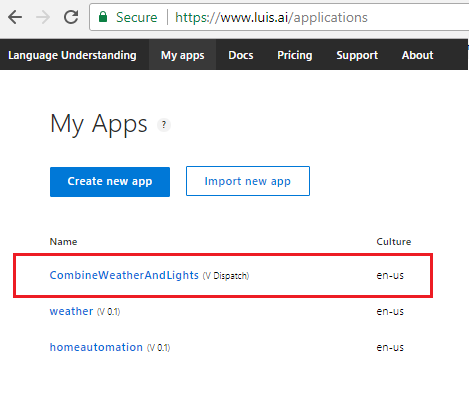
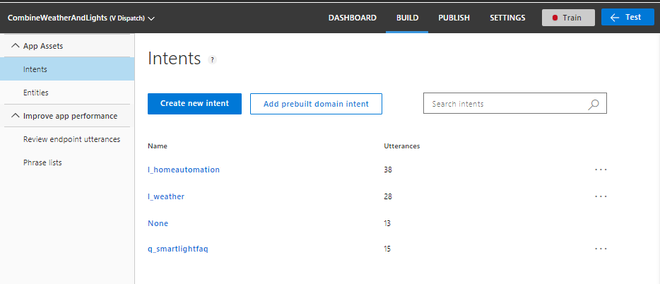
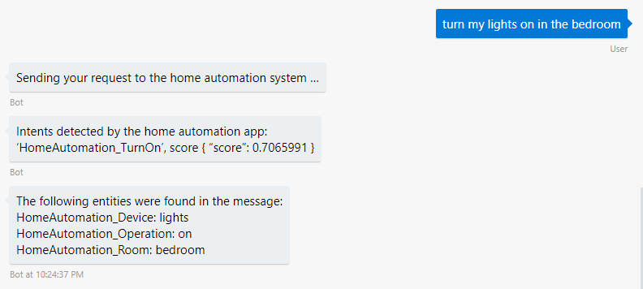

# Integrate multiple LUIS and QnA services with the Dispatch tool

[!INCLUDE [pre-release-label](../includes/pre-release-label.md)]

This tutorial demonstrates how to use a LUIS model generated by the Dispatch tool, to integrate your bot with multiple Language Understanding (LUIS) apps and QnAMaker services. 

Imagine you've developed the following services, and you want to create a bot that integrates with all of them.

| Service type | Name | Description |
|------|------|------|
| LUIS app | HomeAutomation | Recognizes the HomeAutomation.TurnOn, HomeAutomation.TurnOff, and HomeAutomation.None intents.|
| LUIS app | Weather | Recognizes the Weather.GetForecast and Weather.GetCondition intents.|
| QnAMaker service | FAQ  | Provides answers to questions about a home automation lighting system |

Let's first create the apps and services, then integrate them together using the Dispatch tool.

## Create the LUIS and QnA Maker apps

This tutorial is following the samples provided with the SDK, found in [this repository](https://github.com/Microsoft/BotBuilder-Samples). Navigate to "14.NLP-with-Dispatch" for your preferred language, and follow the directions for how to create the apps from the command line. If you have already created the apps, you can skip ahead to [Create the bot](#create-the-bot).

<!--

The fastest way to create the *HomeAutomation* and *Weather* LUIS apps is to download the [homeautomation.json][HomeAutomationJSON] and [weather.json][WeatherJSON] files. Then follow these steps to import these two LUIS apps.

1. Go to the [LUIS website](https://www.luis.ai/home) and sign in. 
2. From the **My Apps** page, click **Import new app**.
   1. For the *homeautomation* app, choose the **homeautomation.json** file and name it "homeautomation". Click **Done** to import the app. After the app is imported, click **Train**, then navigate to the **Publish** tab to publish the app.
   1. For the *weather* app, choose the **weather.json** file and name it "weather". Click **Done** to import the app. After the app is imported, click **Train**, then navigate to the **Publish** tab to publish the app.

## Create the QnA Cognitive Service in Azure

A QnA Maker service involves two parts, which are the Cognitive Service in Azure, and the knowledge base of Q&A pairs that you publish using the Cognitive Service. When you create your Knowledgebase, you can link it to the Azure service by choosing the **Azure service name** you created in this step.

To create the Cognitive Service in Azure, log in to the [Azure portal](https://portal.azure.com), and do the following:

1. Click **All services**.
1. Search on `Cognitive` and select **Cognitive Services**.
1. Click **Add**.
1. Search on `QnA` and select **QnA Maker**.
1. On the QnA Maker blade, click **Create**.
1. Fill in the information and create the QnA Maker service.

    * Enter a name for the service. For this tutorial we'll use `SmartLightQnA`.
    * Select the subscription to use.
    * Select the management pricing tier to use; we'll use the F0 (free) tier.
    * Create one, or select a new, resource group to use. For this tutorial we'll create a new `SmartLightQnA` resource group.
    * Select a search pricing tier; we'll use the B (basic) tier.
    * Select a search location; we'll use `West US`.
    * Enter an application name to use; we'll keep the default `SmartLightQnA`.
    * Select the website location; we'll use `West US`.
    * Keep the default of enabling app insights.
    * Select an app insights location; we'll use `West US`.
    * Click **Create** to create your QnA Maker service.
    * Azure creates and begins to deploy your service.

1. Once the service is deployed, view the notification and click **Go to resource** to navigate to the blade for the service.
1. Click **Keys** to grab your keys.

    * Copy the name of the service and the first key. You'll need to use this name when creating your knowledge base so that the service is linked with the KB. You will also use this key in place of YOUR-AZURE-QNA-SUBSCRIPTION-KEY in the dispatcher steps below.
    * You get two keys so that you can regenerate one of them at a time without having to interrupt your service.

## Create and publish the QnA Maker knowledge base

To create the KB, do the following:

1. Go to the [QnA Maker website](https://qnamaker.ai) and sign in. 
1. Click **Create a knowledge base** to create a new knowledge base. Since you created the Cognitive Service in Azure already, you can skip **Step 1**.
1. In **Step 2**, for the field **Azure QnA service**, choose the Cognitive Service name you created in Azure. This will associate this KB with the service you created in Azure.
1. In **Step 3**, name this KB "FAQ". 
1. In **Step 4**, populate the KB with this [sample TSV file][FAQ_TSV]. Or, use content from a web page. In that case, paste the link into the **URL** field.
1. In **Step 5**, click **Create your KB** to create the KB.

After the KB is create, you need to **Publish** the KB to get the KB ID and endpoint. You will need these in the later part of this process.


## Use the Dispatch tool to create the dispatcher LUIS app
Now that you have your two LUIS apps and a KB created; next, let's use the Dispatch tool to generate a LUIS app that combines them as one LUIS app. 

### Step 1: Install the Dispatch tool

Open a **Command prompt** window and navigate to your dispatcher project. Then, run the following NPM command to install the [Dispatch tool][DispatchTool].

```cmd
npm install -g botdispatch
```

### Step 2: Initialize the Dispatch tool

Run the following command to initialize the Dispatch tool with the name `CombineWeatherAndLights`. Substitute your [LUIS authoring key](https://docs.microsoft.com/en-us/azure/cognitive-services/LUIS/luis-concept-keys) for `<YOUR-LUIS-AUTHORING-KEY>` in the command line below.

```cmd
dispatch init -name CombineWeatherAndLights -luisAuthoringKey <YOUR-LUIS-AUTHORING-KEY> -luisAuthoringRegion westus
```

### Step 3: Add apps to dispatcher

For each of the LUIS apps that you have created, get the LUIS app ID. Those can be found for each app under **My Apps** on the [LUIS site](https://www.luis.ai/home); click the app name, and then click **Settings** to see the **Application ID**. Use the same *LUIS authoring key* you got from **Step 2**.

> [!NOTE] 
> The dispatch tool can also take services listed in a .bot file and add them to the .dispatch file. See [--bot option](https://github.com/Microsoft/botbuilder-tools/blob/master/packages/Dispatch/readme.md) in the readme.
>
> You can also specify which intents from a child LUIS model to include in your dispatch model. For example, an app has _Greet, Help, and Cancel_ intents, and you want only to include _Greet_ intent. The dipatch tool provides --includedIntents option to accomplish that. See [--includedIntents](https://github.com/Microsoft/botbuilder-tools/blob/master/packages/Dispatch/readme.md) in the readme.

Run the following command for each of the LUIS apps you created (e.g.: **homeautomation** and **weather**). Be sure to replace the appropriate ID for the appropriate command below.

```
dispatch add -type luis -id <HOMEAUTOMATION-APP-ID> -name homeautomation -version 0.1 -key <YOUR-LUIS-AUTHORING-KEY>
dispatch add -type luis -id <WEATHER-APP-ID> -name weather -version 0.1 -key <YOUR-LUIS-AUTHORING-KEY>

```

Next, add the QnAMaker KB by running the following command. In this command, the `<QNA-KB-ID>` refers to the KB ID given to you after you have published the KB and the `<YOUR-AZURE-QNA-SUBSCRIPTION-KEY>` refers to the key obtained from the Cognitive Service you created in Azure.

```
dispatch add -type qna -id <QNA-KB-ID> -name faq -key <YOUR-AZURE-QNA-SUBSCRIPTION-KEY>
```

### Step 4: Create the dispatcher LUIS app

After all of the apps are added to the Dispatch tool, run the following command to create the dispatch app. If you want to inspect the dispatch file, you can find the info in a file with the extension **.dispatch**.

```
dispatch create
```

This command creates the dispatcher LUIS app named **CombineWeatherAndLights**. You can see the new app in [https://www.luis.ai/home](https://www.luis.ai/home). 



Click on the new app. Under **Intents** you can see it has the `l_homeautomation`, `l_weather`, and `q_faq` intents.



Click the **Train** button to train the LUIS app, and use the **PUBLISH** tab to [publish](https://docs.microsoft.com/en-us/azure/cognitive-services/LUIS/publishapp) it. Click on **Settings** to copy the ID of the new app. You will need this ID for the bot to connect to this app.

-->

## Create the bot

Now you can use the dispatcher app's intents logic in your bot, which routes messages to the original LUIS apps and QnAMaker service.

This code walks through the sample linked below.

# [C#](#tab/csharp)

Start with the code in the [LUIS Dispatch sample][DispatchBotCS]. In Visual Studio,
[update Nuget packages](https://docs.microsoft.com/en-us/nuget/tools/package-manager-ui#updating-a-package) to the latest prerelease versions of the following:

* `Microsoft.Bot.Builder.Integration.AspNet.Core`
* `Microsoft.Bot.Builder.AI.QnA` (required for QnA Maker)
* `Microsoft.Bot.Builder.AI.Luis` (required for LUIS)

# [JavaScript](#tab/javascript)

Download the [LUIS Dispatch sample][DispatchBotJs].  Install the required packages, including the `botbuilder-ai` package for LUIS and QnA Maker, using npm:

* `npm install --save botbuilder`
* `npm install --save botbuilder-ai`

---

The sample is set up to pull configuration information from your `.bot` file, which you set up when creating your dispatch app.

# [C#](#tab/csharp)

For reference, all this code is available in the [Dispatch sample][DispatchBotCS].

In **Startup.cs**, take a look at the `ConfigureServices` method. It contains code to initialize the different natural language apps for our bot to use.

First, we pull the configuration information from the `.bot`, create the app instances via `InitBotServices()`, then pass those to the constructor via `connectedServices`.

```csharp
    var botConfig = BotConfiguration.Load(@".\NLP-With-Dispatch-Bot.bot");

    // Initialize Bot connected services clients
    var connectedServices = InitBotServices(botConfig);

    services.AddSingleton(sp => connectedServices);
    services.AddSingleton(sp => botConfig);
```

The `InitBotServices()` takes the configuration data loaded from `NLP-With-Dispatch-Bot.bot`, verifies values, and creates the apps.

```csharp
private static BotServices InitBotServices(BotConfiguration config)
{
    var qnaServices = new Dictionary<string, QnAMaker>();
    var luisServices = new Dictionary<string, LuisRecognizer>();

    foreach (var service in config.Services)
    {
        switch (service.Type)
        {
            // These types are defined in Microsoft.Bot.Configuration
            case ServiceTypes.Luis:
                {
                    // Create a Luis Recognizer that is initialized and suitable for passing
                    // into the IBot-derived class (NlpDispatchBot).
                    // In this case, we're creating a custom class (wrapping the original
                    // Luis Recognizer client) that logs the results of Luis Recognizer results
                    // into Application Insights for future anaysis.
                    var luis = (LuisService)service;
                    if (luis == null)
                    {
                        throw new InvalidOperationException("The LUIS service is not configured correctly in your '.bot' file.");
                    }

                    ///
                    /// Error checking removed here, but you can see it in the linked sample
                    ///

                    var app = new LuisApplication(luis.AppId, luis.AuthoringKey, luis.Region);
                    var recognizer = new LuisRecognizer(app);
                    luisServices.Add(luis.Name, recognizer);
                    break;
                }

            case ServiceTypes.Dispatch:
                // Create a Dispatch Recognizer that is initialized and suitable for passing
                // into the IBot-derived class (NlpDispatchBot).
                // In this case, we're creating a custom class (wrapping the original
                // Luis Recognizer client) that logs the results of Luis Recognizer results
                // into Application Insights for future anaysis.
                var dispatch = (DispatchService)service;
                if (dispatch == null)
                {
                    throw new InvalidOperationException("The LUIS service is not configured correctly in your '.bot' file.");
                }

                ///
                /// Error checking removed here, but you can see it in the linked sample
                ///

                var dispatchApp = new LuisApplication(dispatch.AppId, dispatch.AuthoringKey, dispatch.Region);

                // Since the Dispatch tool generates a LUIS model, we use LuisRecognizer to resolve dispatching of the incoming utterance
                var dispatchARecognizer = new LuisRecognizer(dispatchApp);
                luisServices.Add(dispatch.Name, dispatchARecognizer);
                break;

            case ServiceTypes.QnA:
                {
                    // Create a QnA Maker that is initialized and suitable for passing
                    // into the IBot-derived class (NlpDispatchBot).
                    // In this case, we're creating a custom class (wrapping the original
                    // QnAMaker client) that logs the results of QnA Maker into Application
                    // Insights for future anaysis.
                    var qna = (QnAMakerService)service;
                    if (qna == null)
                    {
                        throw new InvalidOperationException("The QnA service is not configured correctly in your '.bot' file.");
                    }

                    ///
                    /// Error checking removed here, but you can see it in the linked sample
                    ///

                    var qnaEndpoint = new QnAMakerEndpoint()
                    {
                        KnowledgeBaseId = qna.KbId,
                        EndpointKey = qna.EndpointKey,
                        Host = qna.Hostname,
                    };

                    var qnaMaker = new QnAMaker(qnaEndpoint);
                    qnaServices.Add(qna.Name, qnaMaker);

                    break;
                }
        }
    }

    return new BotServices(qnaServices, luisServices);
}
```

# [JavaScript](#tab/javascript)

For reference, all this code is available in the [LUIS Dispatch sample][DispatchBotJs].  

In **index.js**, we pull the configuration information from the `.bot file:

```javascript
    // .bot file path
const BOT_FILE = path.join(__dirname, (process.env.botFilePath || ''));

// Read bot configuration from .bot file. 
let botConfig;
try {
    botConfig = BotConfiguration.loadSync(BOT_FILE, process.env.botFileSecret);
} catch (err) {
    console.log(`Error reading bot file. Please ensure you have valid botFilePath and botFileSecret set for your environment`);
    process.exit(CONFIG_ERROR);
}
```

Then pass the `botConfig` to the constructor via `MainDialog` class:

**index.js** 

```javascript
// Create the main dialog.
let mainDlg;
try {
    mainDlg = new MainDialog(conversationState, userState, botConfig);
} catch (err) {
    console.log(err);
    process.exit(CONFIG_ERROR);
}
```

Inside the `MainDialog` class , the constructor initializes LUIS and QnA using the `botConfig` that's passed in.

**dialogs/mainDialog/index.js**

```javascript
constructor (convoState, userState, botConfig) {
        this.homeAutomationDialog = new homeAutomationDialog(convoState, userState, botConfig);
        this.weatherDialog = new weatherDialog(botConfig);
        this.qnaDialog = new qnaDialog(botConfig);
        
        // dispatch recognizer
        const dispatchConfig = botConfig.findServiceByNameOrId(DISPATCH_CONFIG);
        if(!dispatchConfig || !dispatchConfig.appId) throw (`No dispatch model found in .bot file. Please ensure you have dispatch model created and available in the .bot file. See readme.md for additional information\n`);
        this.dispatchRecognizer = new LuisRecognizer({
            applicationId: dispatchConfig.appId,
            azureRegion: dispatchConfig.region,
            // CAUTION: Its better to assign and use a subscription key instead of authoring key here.
            endpointKey: dispatchConfig.authoringKey
        });
    }
```

---


### Dispatch the message

# [C#](#tab/csharp)

Take a look at **LuisDispatchBot.cs**, where the bot dispatches the message to the LUIS app or QnA Maker for a subcomponent. 

In `DispatchToTopIntentAsync`, if your dispatcher app detects the `l_homeautomation-LUIS` or `l_weather-LUIS` intent, it calls the appropriate method that creates a `LuisRecognizer` to call the original `homeautomation.luis` or `weather.luis` apps, depending on the intent. If the bot detects the `q_sample_qna` intent, or the `None` intent that is used as a fallback case, it calls a method that queries QnAMaker.

> [!NOTE] 
> If the intent names `l_homeautomation-LUIS`, `l_weather-LUIS` or `q_sample_qna` don't match the LUIS app you created using Dispatch, edit them to match the lower case version of the intent names you see in the [LUIS portal](https://www.luis.ai).

```csharp
/// <summary>
/// Depending on the intent from Dispatch, routes to the right LUIS model or QnA service.
/// </summary>
private async Task DispatchToTopIntentAsync(ITurnContext context, (string intent, double score)? topIntent, CancellationToken cancellationToken = default(CancellationToken))
{
    const string homeAutomationDispatchKey = "l_homeautomation-LUIS";
    const string weatherDispatchKey = "l_weather-LUIS";
    const string noneDispatchKey = "None";
    const string qnaDispatchKey = "q_sample_qna";

    switch (topIntent.Value.intent.ToLowerInvariant())
    {
        case homeAutomationDispatchKey:
            await DispatchToLuisModelAsync(context, HomeAutomationLuisKey);

            // Here, you can add code for calling the hypothetical home automation service, passing in any entity information that you need
            break;
        case weatherDispatchKey:
            await DispatchToLuisModelAsync(context, WeatherLuisKey);

            // Here, you can add code for calling the hypothetical weather service,
            // passing in any entity information that you need
            break;
        case noneDispatchKey:
            // You can provide logic here to handle the known None intent (none of the above).
            // In this example we fall through to the QnA intent.
        case qnaDispatchKey:
            await DispatchToQnAMakerAsync(context, QnAMakerKey);
            break;

        default:
            // The intent didn't match any case, so just display the recognition results.
            await context.SendActivityAsync($"Dispatch intent: {topIntent.Value.intent} ({topIntent.Value.score}).");
            break;
    }
}
```

The `DispatchToQnAMakerAsync` method sends the user's message to the QnA Maker service, and then sends the first answer back to the user. Make sure you have published that service in the [QnA Maker portal](https://qnamaker.ai) before you run the bot.

```csharp
private async Task DispatchToQnAMakerAsync(ITurnContext context, string appName, CancellationToken cancellationToken = default(CancellationToken))
{
    if (!string.IsNullOrEmpty(context.Activity.Text))
    {
        var results = await _services.QnAServices[appName].GetAnswersAsync(context).ConfigureAwait(false);
        if (results.Any())
        {
            await context.SendActivityAsync(results.First().Answer, cancellationToken: cancellationToken);
        }
        else
        {
            await context.SendActivityAsync($"Couldn't find an answer in the {appName}.");
        }
    }
}
```

The `DispatchToLuisModelAsync` method sends the user's message to the original `homeautomation.luis` and `weather.luis` LUIS apps. Make sure you have published those LUIS apps in the [LUIS portal](https://www.luis.ai) before you run the bot.

```csharp
private async Task DispatchToLuisModelAsync(ITurnContext context, string appName, CancellationToken cancellationToken = default(CancellationToken))
{
    await context.SendActivityAsync($"Sending your request to the {appName} system ...");
    var result = await _services.LuisServices[appName].RecognizeAsync(context, cancellationToken);

    await context.SendActivityAsync($"Intents detected by the {appName} app:\n\n{string.Join("\n\n", result.Intents)}");

    if (result.Entities.Count > 0)
    {
        await context.SendActivityAsync($"The following entities were found in the message:\n\n{string.Join("\n\n", result.Entities)}");
    }

    // Here, you can add code for calling the hypothetical home automation or weather service, 
    // passing in the appName and any intent or entity information that you need
}
```

The `RecognizeAsync` method calls the specific LUIS app, with the current context, to get the results.

# [JavaScript](#tab/javascript)

Take a look at **dialogs/mainDialog/index.js**, where the bot dispatches the message to the LUIS app or QnA Maker for a subcomponent. 

In `onTurn` handler, if your dispatcher app detects the `l_homeautomation-LUIS` or `l_weather-LUIS` intent, it calls the appropriate method that creates a `LuisRecognizer` to call the original `homeautomation.luis` or `weather.luis` apps, depending on the intent. If the bot detects the `q_sample_qna` intent, or the `None` intent that is used as a fallback case, it calls a method that queries QnAMaker or sends a standard message to the user.

> [!NOTE] 
> If the intent names `l_homeautomation-LUIS`, `l_weather-LUIS` or `q_sample_qna` don't match the LUIS app you created using Dispatch, edit them to match the lower case version of the intent names you see in the [LUIS portal](https://www.luis.ai).

**dialogs/mainDialog/index.js**

```javascript
async onTurn(context) {
    if (context.activity.type === 'message') {
        // determine which dialog should fulfill this request
        const dispatchResults = await this.dispatchRecognizer.recognize(context);
        const dispatchTopIntent = LuisRecognizer.topIntent(dispatchResults);
        switch (dispatchTopIntent) {
            case HOME_AUTOMATION_INTENT: 
                await this.homeAutomationDialog.onTurn(context);
                break;
            case WEATHER_INTENT:
                await this.weatherDialog.onTurn(context);
                break;
            case QNA_INTENT:
                await this.qnaDialog.onTurn(context);
                break;
            case NONE_INTENT: 
            default:
                // Unknown request
                await context.sendActivity(`I do not understand that.`);
                await context.sendActivity(`I can help with weather forecast, turning devices on and off and answer general questions like 'hi', 'who are you' etc.`);    
        }            
    }
    else {
        if(context.activity.type === 'conversationUpdate' && context.activity.membersAdded[0].name !== 'Bot') {
            // welcome user
            await context.sendActivity(`Hello, I am the NLP Dispatch bot!`);
            await context.sendActivity(`I can help with weather forecast, turning devices on and off and answer general questions like 'hi', 'who are you' etc.`);
        }
    }
}
```

---

> [!NOTE]
> If the intent names referenced in this topic does not match with the actual intent names defined in the LUIS apps, update your bot code intent names accordingly. 

## Run the bot

Test out the bot using the [Bot Framework Emulator](../bot-service-debug-emulator.md). Send it messages like "turn on the lights" to dispatch the message to the home automation LUIS app, and send it messages like "get the weather in Seattle" to dispatch to the weather LUIS app.

> [!NOTE] 
> Before you run the bot, make sure you have published all the LUIS apps that you created in the [LUIS portal](https://www.luis.ai), and check that you've published the QnA Maker service in the [QnA Maker portal](https://qnamaker.ai).



## Evaluate the dispatcher's performance

Sometimes there are user messages that are provided as examples in both the LUIS apps and the QnA maker services, and the combined LUIS app that Dispatch generates won't perform well for those inputs. Check your app's performance using the `eval` option. 

```
dispatch eval
```

Running `dispatch eval` generates a **Summary.html** file that provides statistics on the performance of the new language model.

> [!TIP] 
> You can actually run `dispatch eval` on any LUIS app, not just LUIS apps created by the dispatch tool.

### Edit intents for duplicates and overlaps

Review example utterances that are flagged as duplicates in **Summary.html**, and remove similar or overlapping examples. For example, let's say that in the `homeautomation` LUIS app for homeautomation, requests like "turn my lights on" map to a "TurnOnLights" intent, but requests like "Why won't my lights turn on?" map to a "None" intent so that they can be passed on to QnA maker. When you combine the LUIS app and the QnA maker service using dispatch, you need to do one of the following: 

* Remove the "None" intent from the original `homeautomation` LUIS app, and add the utterances in that intent to the "None" intent in the dispatcher app.
* If you don't remove the "None" intent from the original LUIS app, you need to add logic in your bot to pass those messages that match that intent on to the QnA maker service.

> [!TIP] 
> Review [Best practices for Language Understanding](./bot-builder-concept-luis.md#best-practices-for-language-understanding) for tips on improving your language model's performance.

## Additional resources

* [Using LUIS for conversation flow][luis-v4-how-to]

[luis-v4-how-to]: bot-builder-howto-v4-luis.md
<!-- links -->

[HomeAutomationJSON]: https://aka.ms/dispatch-luis1
[WeatherJSON]: https://aka.ms/dispatch-luis2
[DispatchJSON]: https://aka.ms/dispatch-luis
[FAQ_TSV]: https://aka.ms/dispatch-qna-tsv

[DispatchTool]: https://aka.ms/botbuilder-tools-dispatch
[DispatchBotCS]: https://aka.ms/csDispatch
[DispatchBotJs]: https://aka.ms/dispatch-sample-js
