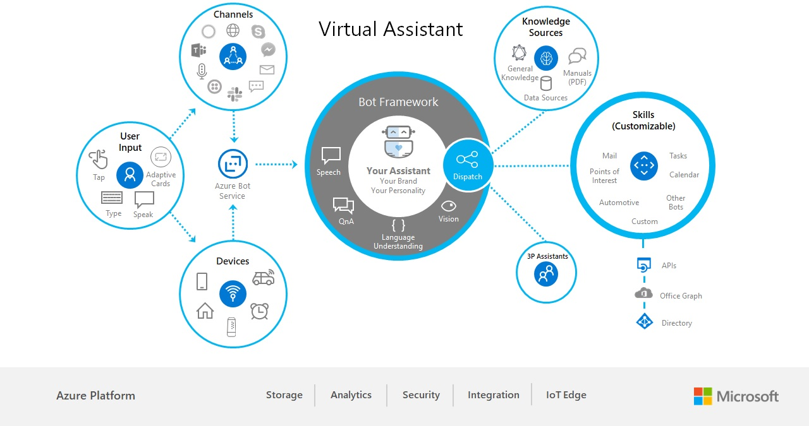

# Virtual Assistant Overview

## Overview

Customers and partners have a significant need to deliver a conversational assistant tailored to their brand, personalized to their users, and made available across a broad range of canvases and devices.    Continuing Microsoft's open-sourced approach towards the Bot Framework SDK, the open-source Virtual Assistant solution provides you with a set of core foundational capabilities and full control over the end user experience.    This template incorporates the previous Enterprise Template and brings together all of the best practices and supporting components identified through building conversational experiences and greatly simplifies the creation of a new bot project including: basic conversational intents, Dispatch integration, QnA Maker, Application Insights and an automated deployment.

We strongly believe our customers should own and enrich their customer relationships and insights. Therefore, any Virtual Assistant provides complete control of the user experience to our customers and partners through open-sourcing the code on GitHub. The name, voice and personality can be changed to suit the organization’s needs. Our Virtual Assistant solution simplifies creation of your own assistant enabling you to get started in minutes and then extended using our end to end development tooling.

The scope of Virtual Assistant functionality is broad, typically offering end users a range of capabilities. To increase developer productivity and to enable a vibrant ecosystem of reusable conversational experiences, we are providing developers initial examples of reusable conversational skills. These Skills can be added into a conversational application to light up a specific conversation experience, such as finding a point of interest, interacting with calendar, tasks, email and many other scenarios. Skills are fully customizable and consist of language models for multiple languages, dialogs and code.

## Get Started

Explore the [Virtual Assistant and Skills](https://github.com/Microsoft/AI) documentation for more detailed information.

## What's in the box 

The Virtual Assistant Template brings together a number of best practices we've identified through the building of conversational experiences and automates integration of components that we've found to be highly beneficial to Bot Framework developers. This section covers some background to key decisions to help explain why the template works the way it does.

The Virtual Assistant template now incorporates the previous Enterprise Template  capabilities including base conversational intents in multiple languages, Dispatching, QnA and conversational insights. The following Assistant related capabilities are provided at this time, further capabilities are planned and we'll be working closely with customers and partners to help inform the roadmap.

Feature | Description |
------------ | -------------
Onboarding | An example OnBoarding flow enabling your Assistant to greet the user and collect initial information.
Eventing Architecture | Events in the context of the Virtual Assistant enable the client application hosting the assistant (in a web-browser or on a device such as a car or speaker) to exchange information about the user or device events whilst also receiving events to perform device operations.
Linked Accounts | In a speech-led scenario it's not practical for a user to enter their username and password for supporting systems through voice commands. Therefore a separate companion experience provides an opportunity for the user to signin and provide permission for an Virtual Assistant to retrieve tokens for later use.
Skill Enablement | A broad set of common capabilities exist today, which require each developer to build themselves. Our Virtual Assistant solution includes a new Skill capability enabling new capabilities to be plugged into an Virtual Assistant through configuration only and provide an authentication mechanism for Skills to request tokens for down-stream activities.
Point of Interest Skill | The preview Point of Interest (PoI) skill provides a comprehensive language model for finding points of interest and requesting directions. The skill currently provides integration into Azure Maps.
Calendar Skill | The preview Calendar Skill provides a comprehensive language model for common calendar related activities, The skill is currently integrated into Microsoft Graph (Office 365/Outlook.com) with support for Google APIs to follow soon..
Email Skill | The preview Email Skill provides a comprehensive language model for common email related activities, The skill is currently integrated into Microsoft Graph (Office 365/Outlook.com) with support for Google APIs to follow soon.
ToDo Skill | The preview ToDo Skill provides a comprehensive language model for common task related activities, The skill is currently integrated into OneNote with Microsoft Graph (outlookTask) support to follow soon.
Device Integration | Our Azure Bot Service SDKs (DirectLine) along with Adaptive Card and Speech SDKs enable easy cross platform integration to devices. Additional device integration examples and platform including Edge are planned.
Test Harnesses | In addition to the Bot Framework Emulator, a WebChat based test harness is provided enabling more complex authentication scenarios to be tested. A simple Console based test harness demonstrates the approach to exchange messages to help frame the ease of device integration.
Automated Deployment | All the Azure resources required for your Assistant are automatically deployed: Bot registration, Azure App Service, LUIS, QnAMaker, Content Moderator, CosmosDB, Azure Storage, and Application Insights. Additionally, LUIS models for all skills, QnAMaker, and Dispatch models are created, trained, and published to enable immediate testing.
Automotive Language Model | An Automotive language model covering core domains such as telephone, navigation and control of in-car features is coming soon

## Example Scenarios

The Virtual Assistant extends across a broad number of industry scenarios. Some example scenarios are shown below for reference purposes.

- Automotive Industry: Voice enabled Personal Assistant integrated into the car providing end users the ability to perform traditional car operations (e.g. navigation, radio) along with productivity focused scenarios such as moving meetings when your running late, adding items to your task list and proactive experiences where the car can suggest tasks to complete based on events such as starting the engine, traveling home or enabling cruise control. Adaptive Cards are rendered within the Head Unit and Speech integration performed through Push-To-Talk or Wake Word interactions.

- Hospitality: Voice enabled Personal Assistant integrated into a hotel room device providing a broad range of hospitality focused scenarios (e.g. extend your stay, request late checkout, room service) including concierge and the ability to find local restaurants and attractions. Optional linking to your productivity accounts open up more personalised experiences such as suggested alarm calls, weather warnings and learning of patterns across stays. An evolution of the current TV personalisation experienced in room today.

- Enterprise: Voice and Text enabled branded Employee Assistant experiences integrated into enterprise devices and existing conversation canvases (e.g. Teams, WebChat, Slack) enabling employees to manage their calendars, find available meeting rooms, find people with specific skills or perform HR related operations.

## Virtual Assistant Principles

### Your data, your brand and your experience
All aspects of the end user experience are owned and controlled by you. This includes the branding, name, voice, personality, responses and avatar. The source-code to the Virtual Assistant and supporting Skills are provided in full, enabling you to adjust as required.

Your Virtual Assistant will be deployed within your Azure subscription. Therefore all data generated by your assistant (questions asked, user behaviour, etc.) is entirely contained within your Azure subscription. See [Cognitive Services Azure Trusted Cloud](https://www.microsoft.com/en-us/trustcenter/cloudservices/cognitiveservices) and the [Azure section of the Trust Center](https://www.microsoft.com/en-us/TrustCenter/CloudServices/Azure) more specifically for more information.

### Write it once, embed it anywhere
The Virtual Assistant leverages the Microsoft Conversational AI platform and therefore can be surfaced through any Bot Framework [channel](https://docs.microsoft.com/en-us/azure/bot-service/bot-service-manage-channels?view=azure-bot-service-4.0) – e.g. WebChat, FaceBook Messenger, Skype, etc. 

In addition, through the [Direct Line](https://docs.microsoft.com/en-us/azure/bot-service/rest-api/bot-framework-rest-direct-line-3-0-concepts?view=azure-bot-service-4.0) channel we can embed experiences into Desktop and Mobile Apps including devices such as Cars, Speakers, Alarm Clocks, etc.

### Enterprise Grade Solutions
The Virtual Assistant solution is built on the Azure Bot Service, Language Understanding Cognitive Service, Unified Speech along with a broad set of supporting Azure components meaning that you benefit from the [Azure global infrastructure](https://azure.microsoft.com/en-gb/global-infrastructure/) including ISO 27018, HIPPA, PCI DSS, SOC 1,2 and 3 certification.

In addition, Language Understanding support is provided by the LUIS Cognitive Service which supports a broad set of languages [listed here](https://docs.microsoft.com/en-us/azure/cognitive-services/luis/luis-supported-languages). The [Translator Cognitive Service](https://azure.microsoft.com/en-us/services/cognitive-services/translator-text-api/) provides additional Machine Translation capabilities to extend the reach of your Virtual Assistant even further.

### Integrated and Context Aware
Your Virtual Assistant can be integrated into your device and ecosystem enabling a truly integrated and intelligent experience . Through this contextual awareness more intelligent experiences can be developed and deliver further personalisation than otherwise possible.

### 3rd Party assistant integration
The Virtual Assistant enables you to deliver your own unique experience but also hand-off to the end-users chosen Digital Assistant for certain types of questions.

### Flexible integration
Our Virtual Assistant architecture is flexible and can be integrated with existing investments you may have made into device based Speech or Natural Language processing capabilities and of course integrate with your existing back-end systems and APIs.

### Adaptive Cards
[Adaptive Cards](https://adaptivecards.io/) provide the ability for your Virtual Assistant to return User Experience elements (e.g. Cards, Images, Buttons) alongside text base responses. If the device or conversation canvas has a screen these Adaptive Cards can be rendered across a broad range of devices and platforms providing supporting User Experience where appropriate. Examples of Adaptive Cards can be found [here](https://adaptivecards.io/samples/) with information on Rendering options in the documentation [here](https://docs.microsoft.com/en-us/adaptive-cards/rendering-cards/getting-started).

### Skills
In addition to the base assistant, there exists a broad set of common capabilities which require each developer to build themselves. Productivity is a great example where each organisation would need to create Language Models (LUIS), Dialogs (Code), Integration (Code) and Language Generation (Responses) to enable popular Calendar, Task or email experiences.

This is then further complicated by the need to support multiple languages and results in a large amount of work required for any organisation building their own assistant.

Our Virtual Assistant solution includes a new Skill capability enabling new capabilities to be plugged into an custom-assistant through configuration only. 

All aspects of each Skill (Language Model, Dialogs, Integration Code and Language Generation) are completely customisable by developers as the full source code is provided on GitHub along with the Virtual Assistant.

## Getting Started

The Virtual Assistant solution is available in [this GitHub repository](https://github.com/Microsoft/AI/) which is updated regularly by the Virtual Assistant team. More detailed documentation is available in the same repository and issues/feedback can be provided directly through the GitHub feedback mechanisms.