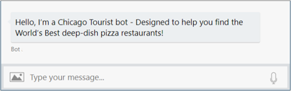
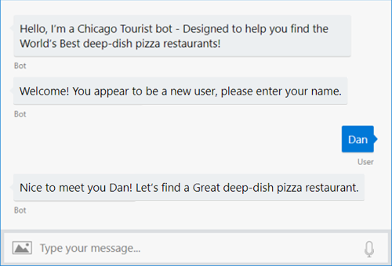
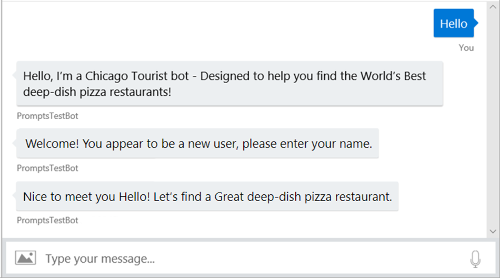
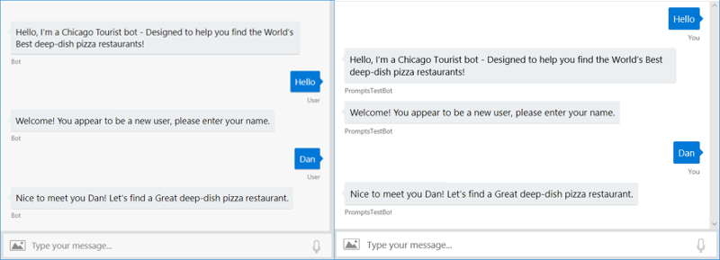
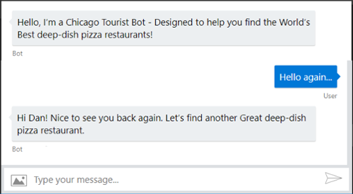
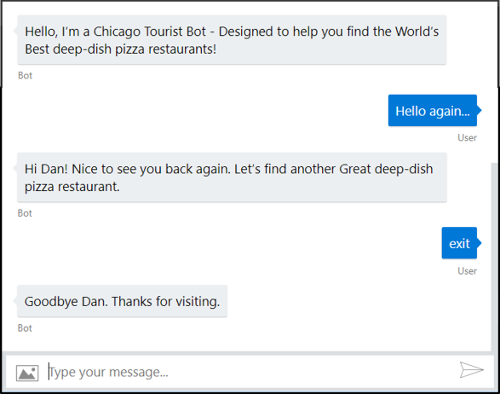

# Welcoming the user

The primary goal when creating any bot is to engage your user in a meaningful conversation. One of the best ways to achieve this goal is to ensure that from the moment a user first connects, they understand your bot’s main purpose and capabilities, the reason your bot was created.

## Show your purpose

Imagine for a moment the experience of a user who connects to your bot labeled, “Chicago Tourist Information,” hoping to find out about hotels in Chicago. Little do they know, your bot is actually for deep-dish pizza enthusiasts and only offers restaurant tips. Once it became clear that their questions were not being answered correctly, this user would quickly disengage and consider that your site provided a bad online experience. A bad user experience such as this can be avoided by welcoming your users with enough information for them to understand the primary purpose and capabilities of your bot. 

Upon reading your welcome message, if your bot does not provide the type of information a user desires, they can then quickly move on before experiencing a frustrating interaction.
A welcome message should be generated whenever your users first interacts with your bot. To achieve this, you can monitor your bot’s **Activity** types and watch for new connections. Each new connection can generate up to two conversation update activities depending upon the channel.

- One when the user’s bot is connected to the conversation.
- One when the user joins the conversation.

It is tempting to simply generate a welcome message whenever a new conversation update is detected, but that can lead to unexpected results when your bot is accessed across a variety of channels.

## Design for different channels

While you have full control over the information presented by your bot, you may not have control over how different channels implement the presentation of that information. Some channels create one conversation update when a user initially connects to that channel, and a separate conversation update only after an initial input message is received from the user. Other channels generate both these activities when the user initially connects to the channel. If you simply watch for a conversation update event and display a welcome message on a channel with two conversation update activities, your user could receive the following:

This duplicate message can be avoided by generating an initial welcome message for only the second conversation update event. The second event can be detected when both:
- A conversation update event has occurred.
- A new member (user) has been added to the conversation.

It is also important to consider when your user’s input may actually contain useful information, and this too can vary per channel. If a channel generates both conversation update activities upon a bot’s initial connection, then the user’s first input can be successfully evaluated as an answer to your welcome message’s prompt like the conversation shown below.

However, if a channel waits for an initial user input before generating a second conversation update event, then the exact same code used above would instead produce the following user experience.

To ensure that your users have a good experience on all possible channels a best practice is to not expect useful information within a user’s initial conversation input. Instead, consider the initial input as “throw away” data and upon receipt, prompt your user to provide you with information needed to continue the conversation. This technique will produce a consistent user experience regardless of the channel used to initially access your bot.

## Personalize the user experience

Nothing feels less welcoming and more impersonal to a user than being continually prompted for information they have already provided. If your bot preserves information for users who have previously visited, it’s a good practice to check this information first and, if available, welcome your user back using the name you stored from their previous visit. 

In this case, your conversation logic skips prompting for a name and moves on to your next conversation activity.

Your bot can also personalize a user’s experience through timely response to unexpected user inputs, such as requests to terminate a conversation.

Keeping your interactions timely and conversational helps users experience a more welcoming and enjoyable interaction with your bot.

## Next steps
> [!div class="nextstepaction"]
> [Send welcome message to users](bot-builder-send-welcome-message.md)
