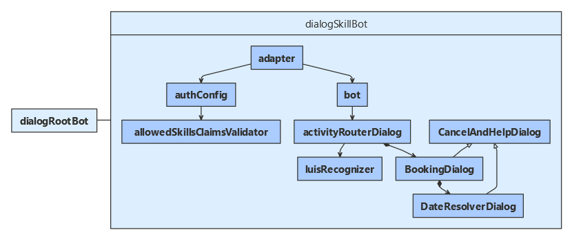

# Use dialogs within a skill

[!INCLUDE [applies-to-v4](../includes/applies-to-v4-current.md)]

This article demonstrates how to create a skill that supports multiple actions. It supports these actions using dialogs. The main dialog receives the initial input from the skill consumer, and then starts the appropriate action. For information about implementing the skill consumer for the associated sample code, see how to [consume a skill using dialogs](skill-use-skilldialog.md).

This article assumes you are already familiar with creating skills.
For how to create a skill bot in general, see how to [implement a skill](skill-implement-skill.md).

## Prerequisites

- Knowledge of [bot basics](bot-builder-basics.md), [how skills bots work](skills-conceptual.md), and how to [implement a skill](skill-implement-skill.md).
- An Azure subscription (to deploy your skill). If you don't have one, create a [free account](https://azure.microsoft.com/free/?WT.mc_id=A261C142F) before you begin.
- Optionally, a [LUIS](https://www.luis.ai/) account. (For more information, see how to [add natural language understanding to your bot](bot-builder-howto-v4-luis.md).)
- A copy of the **skills skillDialog** sample in [**C#**](https://aka.ms/skills-using-dialogs-cs), [**JavaScript**](https://aka.ms/skills-using-dialogs-js) or [**Python**](https://aka.ms/skills-using-dialogs-py).

> [!NOTE]
> Starting with version 4.11, you do not need an app ID and password to test a skill locally in the Emulator. An Azure subscription is still required to deploy your skill to Azure.

## About this sample

The **skills skillDialog** sample includes projects for two bots:

- The _dialog root bot_, which uses a _skill dialog_ class to consume a skill.
- The _dialog skill bot_, which uses a dialog to handle activities coming from skill consumers. This skill is an adaptation of the **core bot** sample. (For more about the core bot, see how to [add natural language understanding to your bot](bot-builder-howto-v4-luis.md).)

This article focuses on how to use a dialogs within a skill bot to manage multiple actions.

### [C#](#tab/cs)

### [JavaScript](#tab/js)

### [Python](#tab/python)

---

For information about the skill consumer bot, see how to [consume a skill using dialogs](skill-use-skilldialog.md).

## Resources

For deployed bots, bot-to-bot authentication requires that each participating bot has a valid app ID and password.
However, you can test skills and skill consumers locally with the Emulator without an app ID and password.

To make the skill available to user-facing bots, register the skill with Azure. You can use a Bot Channels Registration. For more information, see how to [register a bot with Azure Bot Service](../bot-service-quickstart-registration.md).

Optionally, the skill bot can use a flight-booking LUIS model. To use this model, use the CognitiveModels/FlightBooking.json file to create, train, and publish the LUIS model.

## Application configuration

1. Optionally, add the skill's app ID and password to the skill's configuration file.
   (If either the skill or skill consumer uses an app ID and password, both must.)

1. If you are using the LUIS model, Add the LUIS app ID, API key, and API host name.

### [C#](#tab/cs)

**DialogSkillBot\appsettings.json**

[!code-json[configuration file](~/../botbuilder-samples/samples/csharp_dotnetcore/81.skills-skilldialog/DialogSkillBot/appsettings.json?highlight=2-3)]

### [JavaScript](#tab/js)

**dialogSkillBot/.env**

[!code-javascript[configuration file](~/../botbuilder-samples/samples/javascript_nodejs/81.skills-skilldialog/dialogSkillBot/.env?highlight=1-2)]

### [Python](#tab/python)

**dialog-skill-bot/config.py**

[!code-python[configuration file](~/../botbuilder-samples/samples/python/81.skills-skilldialog/dialog-skill-bot/config.py?range=11-22&highlight=2-3)]

---

## Activity-routing logic

The skill supports a couple different features. It can book a flight or get the weather for a city. In addition, if it receives a message outside either of these contexts, it can use LUIS to try to interpret the message.
The skill's manifest describes these actions, their input and output parameters, and the skill's endpoints.
Of note, the skill can handle a "BookFlight" or "GetWeather" event. It can also handle message activities.

The skill defines an activity-routing dialog it uses to select which action to initiate, based on the initial incoming activity from the skill consumer.
If provided, the LUIS model can recognize book-flight and get-weather intents in an initial message.

The book-flight action is a multi-step process, implemented as a separate dialog. Once the action begins, incoming activities are handled by that dialog. The get-weather action has placeholder logic that would be replaced in a fully implemented bot.

The activity-routing dialog includes code to:

- [Initialize the dialog](#initialize-the-dialog)
- [Process an initial activity](#process-an-initial-activity)
- [Handle message activities](#handle-message-activities)
- [Begin a multi-step action](#begin-a-multi-step-action)
- [Return a result](#return-a-result)

The dialogs used in the skill inherit from the _component dialog_ class. For more about component dialogs, see how to [manage dialog complexity](bot-builder-compositcontrol.md).

### Initialize the dialog

The activity-routing dialog includes a child dialog for booking a flight. The main waterfall dialog has one step that will start an action based on the initial activity received.

It also accepts a LUIS recognizer. If this recognizer is initialized, the dialog will use it to interpret the intent of an initial message activity.

#### [C#](#tab/cs)

**DialogSkillBot\Dialogs\ActivityRouterDialog.cs**

[!code-csharp[constructor](~/../botbuilder-samples/samples/csharp_dotnetcore/81.skills-skilldialog/DialogSkillBot/Dialogs/ActivityRouterDialog.cs?range=22-34)]

#### [JavaScript](#tab/js)

**dialogSkillBot/dialogs/activityRouterDialog.js**

[!code-javascript[constructor](~/../botbuilder-samples/samples/javascript_nodejs/81.skills-skilldialog/dialogSkillBot/dialogs/activityRouterDialog.js?range=17-32)]

#### [Python](#tab/python)

**dialog-skill-bot/dialogs/activity_router_dialog.py**

[!code-python[constructor](~/../botbuilder-samples/samples/python/81.skills-skilldialog/dialog-skill-bot/dialogs/activity_router_dialog.py?range=26-36)]

---

### Process an initial activity

In the first (and only) step of the main waterfall dialog, the skill checks the incoming activity type.

- Event activities are forwarded to an _on event activity_ handler that starts the appropriate action based on the name of the event.
- Message activities are forwarded to an _on message activity_ handler that performs additional processing before deciding what to do.

If the skill doesn't recognize the type of the incoming activity or the name of the event, it sends an error message and ends.

#### [C#](#tab/cs)

**DialogSkillBot\Dialogs\ActivityRouterDialog.cs**

[!code-csharp[ProcessActivityAsync](~/../botbuilder-samples/samples/csharp_dotnetcore/81.skills-skilldialog/DialogSkillBot/Dialogs/ActivityRouterDialog.cs?range=36-54)]

[!code-csharp[OnEventActivityAsync](~/../botbuilder-samples/samples/csharp_dotnetcore/81.skills-skilldialog/DialogSkillBot/Dialogs/ActivityRouterDialog.cs?range=56-76)]

#### [JavaScript](#tab/js)

**dialogSkillBot/dialogs/activityRouterDialog.js**

[!code-javascript[processActivity](~/../botbuilder-samples/samples/javascript_nodejs/81.skills-skilldialog/dialogSkillBot/dialogs/activityRouterDialog.js?range=34-58)]

[!code-javascript[onEventActivity](~/../botbuilder-samples/samples/javascript_nodejs/81.skills-skilldialog/dialogSkillBot/dialogs/activityRouterDialog.js?range=60-88)]

#### [Python](#tab/python)

**dialog-skill-bot/dialogs/activity_router_dialog.py**

[!code-python[process_activity](~/../botbuilder-samples/samples/python/81.skills-skilldialog/dialog-skill-bot/dialogs/activity_router_dialog.py?range=38-61)]

[!code-python[_on_event_activity](~/../botbuilder-samples/samples/python/81.skills-skilldialog/dialog-skill-bot/dialogs/activity_router_dialog.py?range=63-82)]

---

### Handle message activities

If the LUIS recognizer is configured, the skill calls LUIS and then starts an action based on the intent.
If the LUIS recognizer is not configured or the intent is not supported, the skill sends an error message and ends.

#### [C#](#tab/cs)

**DialogSkillBot\Dialogs\ActivityRouterDialog.cs**

[!code-csharp[OnMessageActivityAsync](~/../botbuilder-samples/samples/csharp_dotnetcore/81.skills-skilldialog/DialogSkillBot/Dialogs/ActivityRouterDialog.cs?range=78-120&highlight=14,27-31)]

#### [JavaScript](#tab/js)

**dialogSkillBot/dialogs/activityRouterDialog.js**

[!code-javascript[onMessageActivity](~/../botbuilder-samples/samples/javascript_nodejs/81.skills-skilldialog/dialogSkillBot/dialogs/activityRouterDialog.js?range=90-136&highlight=22-23,33-36)]

#### [Python](#tab/python)

**dialog-skill-bot/dialogs/activity_router_dialog.py**

[!code-python[_on_message_activity](~/../botbuilder-samples/samples/python/81.skills-skilldialog/dialog-skill-bot/dialogs/activity_router_dialog.py?range=88-142&highlight=20,37-43)]

---

### Begin a multi-step action

The book-flight action starts a multi-step dialog to get the booking details from the user.

The get-weather action is not implemented. Currently, it sends a placeholder message and then ends.

#### [C#](#tab/cs)

**DialogSkillBot\Dialogs\ActivityRouterDialog.cs**

[!code-csharp[BeginBookFlight](~/../botbuilder-samples/samples/csharp_dotnetcore/81.skills-skilldialog/DialogSkillBot/Dialogs/ActivityRouterDialog.cs?range=138-150)]

[!code-csharp[BeginGetWeather](~/../botbuilder-samples/samples/csharp_dotnetcore/81.skills-skilldialog/DialogSkillBot/Dialogs/ActivityRouterDialog.cs?range=122-136)]

#### [JavaScript](#tab/js)

**dialogSkillBot/dialogs/activityRouterDialog.js**

[!code-javascript[beginBookFlight](~/../botbuilder-samples/samples/javascript_nodejs/81.skills-skilldialog/dialogSkillBot/dialogs/activityRouterDialog.js?range=148-155)]

[!code-javascript[beginGetWeather](~/../botbuilder-samples/samples/javascript_nodejs/81.skills-skilldialog/dialogSkillBot/dialogs/activityRouterDialog.js?range=138-146)]

#### [Python](#tab/python)

**dialog-skill-bot/dialogs/activity_router_dialog.py**

[!code-python[_begin_book_flight](~/../botbuilder-samples/samples/python/81.skills-skilldialog/dialog-skill-bot/dialogs/activity_router_dialog.py?range=162-172)]

[!code-python[_begin_get_weather](~/../botbuilder-samples/samples/python/81.skills-skilldialog/dialog-skill-bot/dialogs/activity_router_dialog.py?range=144-160)]

---

### Return a result

The skill starts a booking dialog for the book-flight action. Since the activity-routing dialog has just one step, when the booking dialog ends, the activity-routing dialog also ends, and the dialog result from the booking dialog becomes the dialog result for the activity-routing dialog.

The get-weather action simply ends without setting a return value.

## Canceling a multi-step action

The booking dialog and its child date-resolver dialog both derive from the base cancel-and-help dialog, which checks messages from the user.

- On "help" or "?", it displays a help message, and then continues the conversation flow on the following turn.
- On "cancel" or "quit", it cancels all dialogs, which ends the skill.

For more information, see how to [handle user interruptions](bot-builder-howto-handle-user-interrupt.md).

## Service registration

The services needed for this skill are the same as those needed for a skill bot in general.
See how to [implement a skill](skill-implement-skill.md) for a discussion of the required services.

## Skill manifest

A _skill manifest_ is a JSON file that describes the activities the skill can perform, its input and output parameters, and the skill's endpoints.
The manifest contains the information you need to access the skill from another bot.

### [C#](#tab/cs)

**DialogSkillBot\wwwroot\manifest\dialogchildbot-manifest-1.0.json**

[!code-json[Manifest](~/../botbuilder-samples/samples/csharp_dotnetcore/81.skills-skilldialog/DialogSkillBot/wwwroot/manifest/dialogchildbot-manifest-1.0.json)]

### [JavaScript](#tab/js)

**dialogSkillBot/manifest/dialogchildbot-manifest-1.0.json**

[!code-json[Manifest](~/../botbuilder-samples/samples/javascript_nodejs/81.skills-skilldialog/dialogSkillBot/manifest/dialogchildbot-manifest-1.0.json)]

### [Python](#tab/python)

**dialog-skill-bot/wwwroot/manifest/dialogchildbot-manifest-1.0.json**

[!code-json[Manifest](~/../botbuilder-samples/samples/python/81.skills-skilldialog/dialog-skill-bot/wwwroot/manifest/dialogchildbot-manifest-1.0.json)]

---

The _skill manifest schema_ is a JSON file that describes the schema of the skill manifest.
The latest schema version is [v2.1](https://schemas.botframework.com/schemas/skills/v2.1/skill-manifest.json).

## Test the skill bot

You can test the skill in the Emulator with the skill consumer. To do so, you need to run both the skill and skill consumer bots at the same time. See how to [use a dialog to consume a skill](skill-use-skilldialog.md) for information on how to configure the skill.

Download and install the latest [Bot Framework Emulator](https://aka.ms/bot-framework-emulator-readme).

1. Run the dialog skill bot and dialog root bot locally on your machine. If you need instructions, refer to the README file for the  [C#](https://aka.ms/skills-using-dialogs-cs), [JavaScript](https://aka.ms/skills-using-dialogs-js) or [Python](https://aka.ms/skills-using-dialogs-py) sample.
1. Use the Emulator to test the bot.
   - When you first join the conversation, the bot displays a welcome message and asks you what skill you would like to call. The skill bot for this sample has just one skill.
   - Select **DialogSkillBot**.
1. The bot next asks you to choose an action for the skill. Choose "BookFlight".
   1. The skill begins its book-flight action; answer the prompts.
   1. When the skill completes, the root bot displays the booking details before prompting again for the skill you'd like to call.
1. Select **DialogSkillBot** again and "BookFlight".
   1. Answer the first prompt, then enter "cancel" to cancel the action.
   1. The skill bot ends without completing the action, and the consumer prompts for the skill you'd like to call.

## Additional information

- [Use a dialog to consume a skill](skill-use-skilldialog.md) describes how to consume a skill by using a skill dialog.
