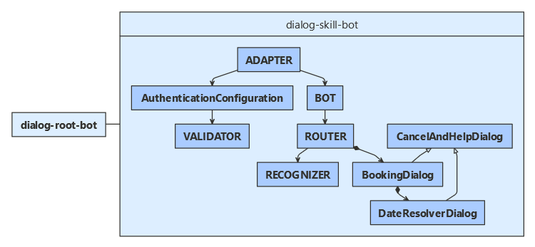

# Use dialogs within a skill

[!INCLUDE[applies-to](../includes/applies-to.md)]

This article demonstrates how to create a skill that supports multiple actions. It supports these actions using dialogs. The main dialog receives the initial input from the skill consumer, and then starts the appropriate action. For information about implementing the skill consumer for the associated sample code, see how to [consume a skill using dialogs](skill-use-skilldialog.md).

This article assumes you are already familiar with creating skills.

## Prerequisites

- Knowledge of [bot basics](bot-builder-basics.md), [how skills bots work](skills-conceptual.md), and how to [implement a skill](skill-implement-skill.md).
- An Azure subscription. If you don't have one, create a [free account](https://azure.microsoft.com/free/?WT.mc_id=A261C142F) before you begin.
- A copy of the **skills skillDialog** sample in [**C#**](https://aka.ms/skills-using-dialogs-cs), [**JavaScript**](https://aka.ms/skills-using-dialogs-js) or [**Python**](https://aka.ms/skills-using-dialogs-py).

## About this sample

The **skills skillDialog** sample includes projects for two bots:

- The _dialog root bot_, which uses a _skill dialog_ class to consume a skill.
- The _dialog skill bot_, which uses a dialog to handle activities coming from skill consumers.

This article focuses on how to use a dialogs within a skill bot to manage multiple actions.

### [C#](#tab/cs)

### [JavaScript](#tab/js)

### [Python](#tab/python)

---

For information about the skill consumer bot, see how to [consume a skill using dialogs](skill-use-skilldialog.md).

## Resources

Bot-to-bot authentication requires that each participating bot has a valid appID and password.

Register both the skill and the skill consumer with Azure. You can use a Bot Channels Registration. For more information, see how to [register a bot with Azure Bot Service](../bot-service-quickstart-registration.md).

## Application configuration
