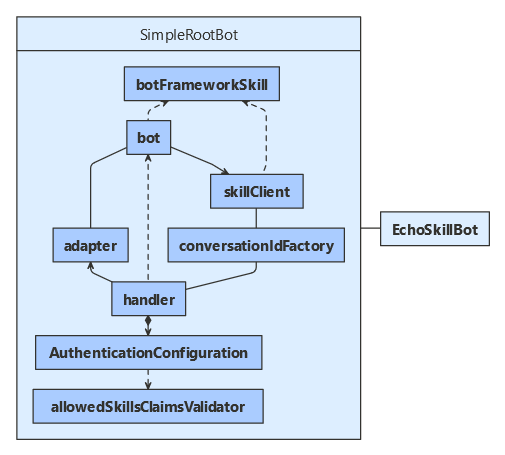

# Implement a skill consumer

[!INCLUDE[applies-to](../includes/applies-to.md)]

You can use skills to extend another bot.
A _skill_ is a bot that can perform a set of tasks for another bot and uses a manifest to describe its interface.
A _root bot_ is a user-facing bot that can invoke one or more skills. A root bot is a type of _skill consumer_.

- A skill consumer can use claims validation to manage which skills or users can access it.
- A skill consumer can use multiple skills.
- Developers who don't have access to the skill's source code can use the information in the skill's manifest to design their skill consumer.

This article demonstrates how to implement a skill consumer that uses the echo skill to echo the user's input. For a sample skill manifest and information about implementing the echo skill, see how to [implement a skill](skill-implement-skill.md).

## Prerequisites

- Knowledge of [bot basics](bot-builder-basics.md), [how skills bots work](skills-conceptual.md), and how to [implement a skill](skill-implement-skill.md).
- An Azure subscription. If you don't have one, create a [free account](https://azure.microsoft.com/free/?WT.mc_id=A261C142F) before you begin.
- A copy of the **skills simple bot-to-bot** sample in [**C#**](https://aka.ms/skills-simple-bot-to-bot-csharp), [**JavaScript**](https://aka.ms/skills-simple-bot-to-bot-js) or [**Python**](https://aka.ms/skills-simple-bot-to-bot-python).

## About this sample

The **skills simple bot-to-bot** sample includes projects for two bots:

- The _echo skill bot_, which implements the skill.
- The _simple root bot_, which implements a root bot that consumes the skill.

This article focuses on the root bot, which includes support logic in its bot and adapter objects and includes objects used to exchange activities with a skill. These include:

- A skill client, used to send activities to a skill.
- A skill handler, used to receive activities from a skill.
- A skill conversation ID factory, used by the skill client and handler to translate between the user-root conversation reference and the root-skill conversation reference.

### [C#](#tab/cs)

### [JavaScript](#tab/js)

### [Python](#tab/python)

---

For information about the echo skill bot, see how to [Implement a skill](skill-implement-skill.md).

## Resources

Bot-to-bot authentication requires that each participating bot has a valid appID and password.

Register both the skill and the skill consumer with Azure. You can use a Bot Channels Registration. For more information, see how to [register a bot with Azure Bot Service](../bot-service-quickstart-registration.md).

## Application configuration

1. Add the root bot's app ID and password.
1. Add the endpoint URL to which the skills should reply to the skill consumer.
1. Add an entry for each skill the skill consumer will use. Each entry includes:
   - An ID the skill consumer will use to identify each skill.
   - The skill's app ID.
   - The skill's messaging endpoint.

### [C#](#tab/cs)

**SimpleRootBot\appsettings.json**

Add the root bot's app ID and password to the appsettings.json file. Also, add the app ID for the echo skill bot to the `BotFrameworkSkills` array.

[!code-csharp[configuration file](~/../botbuilder-samples/samples/csharp_dotnetcore/80.skills-simple-bot-to-bot/SimpleRootBot/appsettings.json)]

### [JavaScript](#tab/js)

**echo-skill-bot/.env**

Add the root bot's app ID and password to the .env file. Also, add the app ID for the echo skill bot.

[!code-javascript[configuration file](~/../botbuilder-samples/samples/javascript_nodejs/80.skills-simple-bot-to-bot/simple-root-bot/.env)]

### [Python](#tab/python)

**simple_root_bot/config.py**

Add the root bot's app ID and password to the .env file. Also, add the app ID for the echo skill bot.

[!code-python[configuration file](~/../botbuilder-samples/samples/python/80.skills-simple-bot-to-bot/simple-root-bot/config.py?range=16-29)]

---

## Skills configuration

This sample reads information for each skill in the configuration file into a collection of _skill_ objects.

### [C#](#tab/cs)

**SimpleRootBot\SkillsConfiguration.cs**

[!code-csharp[skills configuration](~/../botbuilder-samples/samples/csharp_dotnetcore/80.skills-simple-bot-to-bot/SimpleRootBot/SkillsConfiguration.cs?range=14-38)]

### [JavaScript](#tab/js)

**simple-root-bot/skillsConfiguration.js**

[!code-javascript[skills configuration](~/../botbuilder-samples/samples/javascript_nodejs/80.skills-simple-bot-to-bot/simple-root-bot/skillsConfiguration.js?range=7-33)]

### [Python](#tab/python)

**simple-root-bot/config.py**

[!code-python[skills configuration](~/../botbuilder-samples/samples/python/80.skills-simple-bot-to-bot/simple-root-bot/config.py?range=32-36)]

---

## Conversation ID factory

This creates the conversation ID for use with the skill and can recover the original user conversation ID from the skill conversation ID.

The conversation ID factory for this sample supports a simple scenario where:

- The root bot is designed to consume one specific skill.
- The root bot has only one active conversation with a skill at a time.

### [C#](#tab/cs)

**SimpleRootBot\SkillConversationIdFactory.cs**

[!code-csharp[Conversation ID factory](~/../botbuilder-samples/samples/csharp_dotnetcore/80.skills-simple-bot-to-bot/SimpleRootBot/SkillConversationIdFactory.cs?range=17-40)]

### [JavaScript](#tab/js)

**simple-root-bot/skillConversationIdFactory.js**

[!code-javascript[Conversation ID factory](~/../botbuilder-samples/samples/javascript_nodejs/80.skills-simple-bot-to-bot/simple-root-bot/skillConversationIdFactory.js?range=10-29)]

### [Python](#tab/python)

**simple-root-bot/skill_conversation_id_factory.py**

[!code-python[Conversation ID factory](~/../botbuilder-samples/samples/python/80.skills-simple-bot-to-bot/simple-root-bot/skill_conversation_id_factory.py?range=9-47)]

---

To support more complex scenarios, design your conversation ID factory so that:

- The _create skill conversation ID_ method gets or generates the appropriate skill conversation ID.
- The _get conversation reference_ method gets the correct user conversation.

## Skill client and skill handler

The skill consumer uses a skill client to forward activities to the skill.
The client uses the skills configuration information and conversation ID factory to do so.

The skill consumer uses a skill handler to receive activities from a skill.
The handler uses the conversation ID factory, the authentication configuration, and a credential provider to do so, and also has dependencies on the root bot's adapter and activity handler

### [C#](#tab/cs)

**SimpleRootBot\Startup.cs**

[!code-csharp[skill client and handler](~/../botbuilder-samples/samples/csharp_dotnetcore/80.skills-simple-bot-to-bot/SimpleRootBot/Startup.cs?range=42-43)]

### [JavaScript](#tab/js)

**simple-root-bot/index.js**

[!code-javascript[skill client](~/../botbuilder-samples/samples/javascript_nodejs/80.skills-simple-bot-to-bot/simple-root-bot/index.js?range=107-108)]

[!code-javascript[skill handler](~/../botbuilder-samples/samples/javascript_nodejs/80.skills-simple-bot-to-bot/simple-root-bot/index.js?range=132)]

### [Python](#tab/python)

**simple-root-bot/app.py**

[!code-python[skill client](~/../botbuilder-samples/samples/python/80.skills-simple-bot-to-bot/simple-root-bot/app.py?range=58)]

[!code-python[skill handler](~/../botbuilder-samples/samples/python/80.skills-simple-bot-to-bot/simple-root-bot/app.py?range=120-122)]

---

HTTP traffic from the skill will come into the service URL endpoint that the skill consumer advertizes to the skill. Use a language-specific endpoint handler to forward traffic to the skill handler.

The default skill handler:

- Uses an authentication configuration object to perform both bot-to-bot authentication and claims validation.
- Uses the conversation ID factory to translate from the consumer-skill conversation back to the root-user conversation.
- Generates a proactive message so that the skill consumer can reestablish a root-user turn context and forward activities to the user.

## Activity handler logic

Of note, the skill consumer logic should:

- Remember whether there are any active skills and forward activities to them as appropriate.
- Notice when a user makes a request that should be forwarded to a skill, and start the skill.
- Look for an `endOfConversation` activity from any active skill, to notice when it completes.
- If appropriate, add logic to let the user or skill consumer cancel a skill that has not completed yet.
- Save state before making the call to a skill, as any response may come back to a different instance of the skill consumer. (load balancing, etc.)

### [C#](#tab/cs)

**SimpleRootBot\Bots\RootBot.cs**

The root bot has dependencies on conversation state, the skills information, the skill client, and the general configuration. ASP.NET provides these objects through dependency injection.
The root bot also defines a conversation state property accessor to track which skill is active.

[!code-csharp[Root bot dependencies](~/../botbuilder-samples/samples/csharp_dotnetcore/80.skills-simple-bot-to-bot/SimpleRootBot/Bots/RootBot.cs?range=21-55)]

This sample has a helper method for forwarding activities to a skill. It saves conversation state before invoking the skill, and it checks whether the HTTP request was successful.

[!code-csharp[Send to skill](~/../botbuilder-samples/samples/csharp_dotnetcore/80.skills-simple-bot-to-bot/SimpleRootBot/Bots/RootBot.cs?range=125-139)]

Of note, the root bot includes logic for handling messages from the user and `endOfConversation` activities from the skill.

[!code-csharp[message/end-of-conversation handlers](~/../botbuilder-samples/samples/csharp_dotnetcore/80.skills-simple-bot-to-bot/SimpleRootBot/Bots/RootBot.cs?range=57-112)]

### [JavaScript](#tab/js)

**simple-root-bot/rootBot.js**

The root bot has dependencies on conversation state, the skills information, and the skill client.
The root bot also defines a conversation state property accessor to track which skill is active.

[!code-javascript[Root bot dependencies](~/../botbuilder-samples/samples/javascript_nodejs/80.skills-simple-bot-to-bot/simple-root-bot/rootBot.js?range=7-30)]

This sample has a helper method for forwarding activities to a skill. It saves conversation state before invoking the skill, and it checks whether the HTTP request was successful.

[!code-javascript[Send to skill](~/../botbuilder-samples/samples/javascript_nodejs/80.skills-simple-bot-to-bot/simple-root-bot/rootBot.js?range=108-120)]

Of note, the root bot includes logic for handling messages from the user and `endOfConversation` activities from the skill.

[!code-javascript[message/end-of-conversation handlers](~/../botbuilder-samples/samples/javascript_nodejs/80.skills-simple-bot-to-bot/simple-root-bot/rootBot.js?range=33-85)]

### [Python](#tab/python)

**simple-root-bot/bots/root_bot.py**

The root bot has dependencies on conversation state, the skills information, the skill client, and the general configuration.
The root bot also defines a conversation state property accessor to track which skill is active.

[!code-python[Root bot dependencies](~/../botbuilder-samples/samples/python/80.skills-simple-bot-to-bot/simple-root-bot/bots/root_bot.py?range=23-37)]

This sample has a helper method for forwarding activities to a skill. It saves conversation state before invoking the skill, and it checks whether the HTTP request was successful.

[!code-python[Send to skill](~/../botbuilder-samples/samples/python/80.skills-simple-bot-to-bot/simple-root-bot/bots/root_bot.py?range=104-117)]

Of note, the root bot includes logic for handling messages from the user and `endOfConversation` activities from the skill.

[!code-python[Handled activities](~/../botbuilder-samples/samples/python/80.skills-simple-bot-to-bot/simple-root-bot/bots/root_bot.py?range=39-93)]

---

## On turn error handler

When an error occurs, the adapter clears conversation state to reset the conversation with the user and avoid persisting an error state.

It is a good practice to send an _end of conversation_ activity to any active skill before clearing conversation state in the skill consumer. This lets the skill release any resources associated with the consumer-skill conversation before the skill consumer releases the conversation.

### [C#](#tab/cs)

**SimpleRootBot\AdapterWithErrorHandler.cs**

In this sample the turn error logic is split up among a few helper methods.

[!code-csharp[On turn error](~/../botbuilder-samples/samples/csharp_dotnetcore/80.skills-simple-bot-to-bot/SimpleRootBot/AdapterWithErrorHandler.cs?range=40-120)]

### [JavaScript](#tab/js)

**simple-root-bot/index.js**

[!code-javascript[On turn error](~/../botbuilder-samples/samples/javascript_nodejs/80.skills-simple-bot-to-bot/simple-root-bot/index.js?range=34-87)]

### [Python](#tab/python)

**app.py**

[!code-python[On turn error](~/../botbuilder-samples/samples/python/80.skills-simple-bot-to-bot/simple-root-bot/app.py?range=62-115)]

---

## Skills endpoint

The bot defines an endpoint that forwards incoming skill activities to the root bot's skill handler.

### [C#](#tab/cs)

**SimpleRootBot\Controllers\SkillController.cs**

[!code-csharp[skill endpoint](~/../botbuilder-samples/samples/csharp_dotnetcore/80.skills-simple-bot-to-bot/SimpleRootBot/Controllers/SkillController.cs?range=15-23)]

### [JavaScript](#tab/js)

**simple-root-bot/index.js**

[!code-javascript[skill endpoint](~/../botbuilder-samples/samples/javascript_nodejs/80.skills-simple-bot-to-bot/simple-root-bot/index.js?range=133-134)]

### [Python](#tab/python)

**simple-root-bot/app.py**

[!code-python[skill endpoint](~/../botbuilder-samples/samples/python/80.skills-simple-bot-to-bot/simple-root-bot/app.py?range=144)]

---

## Service registration

Include an authentication configuration object with any claims validation, plus all the additional objects.

### [C#](#tab/cs)

**SimpleRootBot\Startup.cs**

[!code-csharp[services](~/../botbuilder-samples/samples/csharp_dotnetcore/80.skills-simple-bot-to-bot/SimpleRootBot/Startup.cs?range=22-53)]

### [JavaScript](#tab/js)

**simple-root-bot/index.js**

[!code-javascript[services](~/../botbuilder-samples/samples/javascript_nodejs/80.skills-simple-bot-to-bot/simple-root-bot/index.js?range=27-31)]

[!code-javascript[services](~/../botbuilder-samples/samples/javascript_nodejs/80.skills-simple-bot-to-bot/simple-root-bot/index.js?range=95-134)]

### [Python](#tab/python)

**simple-root-bot/app.py**

[!code-python[services](~/../botbuilder-samples/samples/python/80.skills-simple-bot-to-bot/simple-root-bot/app.py?range=35-58)]

[!code-python[services](~/../botbuilder-samples/samples/python/80.skills-simple-bot-to-bot/simple-root-bot/app.py?range=118-144)]

---

## Test the root bot

You can test the skill consumer in the Emulator as if it were a normal bot; however, you need to run both the skill and skill consumer bots at the same time.
See how to [implement a skill](skill-implement-skill.md) for information on how to configure the skill.

Download and install the latest [Bot Framework Emulator](https://aka.ms/bot-framework-emulator-readme)

1. Run the echo skill bot and simple root bot locally on your machine. If you need instructions, refer to the README file for the [C#](https://aka.ms/skills-simple-bot-to-bot-csharp), [JavaScript](https://aka.ms/skills-simple-bot-to-bot-js), or [Python](https://aka.ms/skills-simple-bot-to-bot-python) sample.
1. Use the Emulator to test the bot as shown below. Note that when you send an `end` or `stop` message to the skill, the skill sends to the root bot an `endOfConversation` activity, in addition to the reply message. The `endOfConversation` activity's _code_ property indicates that the skill completed successfully.

## Additional information

Here are some things to consider when implementing a more complex root bot.

### To allow the user to cancel a multi-step skill

The root bot should check the user's message before forwarding it to the active skill. If the user wants to cancel the current process, the root bot can send an `endOfConversation` activity to the skill, instead of forwarding the message.

### To exchange data between the root and skill bots

To send parameters to the skill, the skill consumer can set the _value_ property on messages it sends to the skill. To receive return values from the skill, the skill consumer should check the _value_ property when the skill sends an `endOfConversation` activity.

### To use multiple skills

- If a skill is active, the root bot needs to determine which skill is active and forward the user's message to the correct skill.
- If no skill is active, the root bot needs to determine which skill to start, if any, based on bot state and the user's input.
- If you want to allow the user to switch between multiple concurrent skills, the root bot needs to determine which of the active skills the user is intending to interact with before forwarding the user's message.

<!--
## Next steps

TBD: Claims validation? Skill manifest?

> [!div class="nextstepaction"]
> [Add claims validation](skill-add-claims-validation.md)
-->
