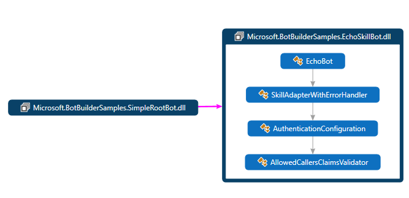
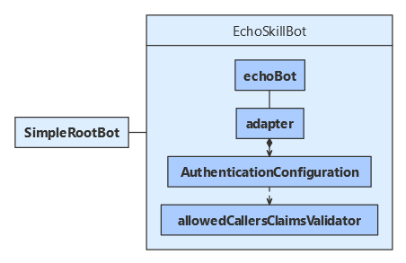
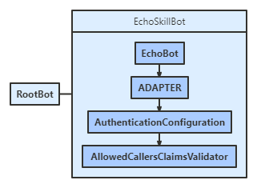
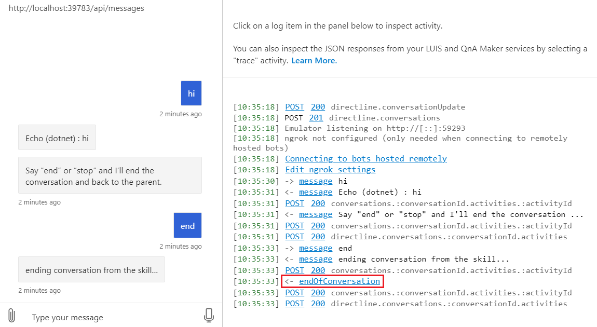

# Implement a skill

[!INCLUDE[applies-to](../includes/applies-to.md)]

You can use skills to extend another bot.
A _skill_ is a bot that can perform a set of tasks for another bot.

- A skill's interface is described by a manifest. Developers who don't have access to the skill's source code can use the information in the manifest to design their skill consumer.
- A skill can use claims validation to manage which bots or users can access it.

This article demonstrates how to implement a skill that echoes the user's input.

<!-- I haven't discussed passing values back-and-forth mid conversation. That could be the basis of another article. -->

## Prerequisites

- Knowledge of [bot basics](bot-builder-basics.md) and [skills](skills-conceptual.md).
- An Azure subscription. If you don't have one, create a [free account](https://azure.microsoft.com/free/?WT.mc_id=A261C142F) before you begin.
- A copy of the **skills simple bot-to-bot** sample in [**C#**](https://aka.ms/skills-simple-bot-to-bot-csharp), [**JavaScript**](https://aka.ms/skills-simple-bot-to-bot-js) or [**Python**](https://aka.ms/skills-simple-bot-to-bot-python).

## About this sample

The **skills simple bot-to-bot** sample includes projects for two bots:

- The _echo skill bot_, which implements the skill.
- The _simple root bot_, which implements a root bot that consumes the skill.

This article focuses on the skill, which includes support logic in its bot and adapter.

### [C#](#tab/cs)

### [JavaScript](#tab/javascript)

### [Python](#tab/python)

---

For information about the simple root bot, see how to [Implement a skill consumer](skill-implement-consumer.md).

## Resources

Bot-to-bot authentication requires that each participating bot has a valid app ID and password.

To be able to test the skill as a user-facing bot, register the skill with Azure. You can use a Bot Channels Registration. For more information, see how to [register a bot with Azure Bot Service](../bot-service-quickstart-registration.md).

## Application configuration

Add the skill's app ID and password to the skill's configuration file.

The _allowed callers_ array can restrict which skill consumers can access the skill.
Leave this array empty, to accept calls from any skill consumer.

### [C#](#tab/cs)

**EchoSkillBot\appsettings.json**

Add the skill's app ID and password to the appsettings.json file.

[!code-csharp[configuration file](~/../botbuilder-samples/samples/csharp_dotnetcore/80.skills-simple-bot-to-bot/EchoSkillBot/appsettings.json)]

### [JavaScript](#tab/javascript)

**echo-skill-bot/.env**

Add the skill's app ID and password to the .env file.

[!code-javascript[configuration file](~/../botbuilder-samples/samples/javascript_nodejs/80.skills-simple-bot-to-bot/echo-skill-bot/.env)]

### [Python](#tab/python)

Add the skill's app ID and password to the config.py file.

**config.py**

[!code-python[configuration file](~/../botbuilder-samples/samples/python/80.skills-simple-bot-to-bot/echo-skill-bot/config.py?range=14-19)]

---

## Activity handler logic

### To accept input parameters

The skill consumer can send information to the skill. One way to accept such information is to accept them via the _value_ property on incoming messages. Another way is to handle event and invoke activities.

The skill in this example does not accept input parameters.

### To continue or complete a conversation

When the skill sends an activity, the skill consumer should forward the activity on to the user.

However, you need to send an `endOfConversation` activity when the skill finishes; otherwise, the skill consumer will continue to forward user activities to the skill.
Optionally, use the activity's _value_ property to include a return value, and use the activity's _code_ property to indicate why the skill is ending.

#### [C#](#tab/cs)

**EchoSkillBot\Bots\EchoBot.cs**

[!code-csharp[Message handler](~/../botbuilder-samples/samples/csharp_dotnetcore/80.skills-simple-bot-to-bot/EchoSkillBot/Bots/EchoBot.cs?range=14-29)]

#### [JavaScript](#tab/javascript)

**echo-skill-bot/bot.js**

[!code-javascript[Message handler](~/../botbuilder-samples/samples/javascript_nodejs/80.skills-simple-bot-to-bot/echo-skill-bot/bot.js?range=10-26)]

#### [Python](#tab/python)

**echo-skill-bot/bots/echo_bot.py**

[!code-python[Message handler](~/../botbuilder-samples/samples/python/80.skills-simple-bot-to-bot/echo-skill-bot/bots/echo_bot.py?range=10-27)]

---

### To cancel the skill

For multi-turn skills, you would also accept `endOfConversation` activities from a skill consumer, to allow the consumer to cancel the current conversation.

The logic for this skill does not change from turn to turn. If you implement a skill that allocates conversation resources, add resource cleanup code to the end-of-conversation handler.

#### [C#](#tab/cs)

**EchoSkillBot\Bots\EchoBot.cs**

[!code-csharp[End-of-conversation handler](~/../botbuilder-samples/samples/csharp_dotnetcore/80.skills-simple-bot-to-bot/EchoSkillBot/Bots/EchoBot.cs?range=31-37)]

#### [JavaScript](#tab/javascript)

**echo-skill-bot/bot.js**

 Use the `onUnrecognizedActivityType` method to add an end-of-conversation logic. In the handler, check whether the unrecognized activity's `type` equals `endOfConversation`.

[!code-javascript[End-of-conversation handler](~/../botbuilder-samples/samples/javascript_nodejs/80.skills-simple-bot-to-bot/echo-skill-bot/bot.js?range=28-35)]

#### [Python](#tab/python)

**echo-skill-bot/bots/echo_bot.py**

[!code-python[End-of-conversation handler](~/../botbuilder-samples/samples/python/80.skills-simple-bot-to-bot/echo-skill-bot/bots/echo_bot.py?range=29-33)]

---

## Claims validator

This sample uses an allowed callers list for claims validation. The list is defined in the skill's configuration file and is read into the validator object when it's created.

You can add a _claims validator_ to the authentication configuration. The claims are evaluated after the authentication header. Your validation code should throw an error or exception to reject the request. There are many reasons you may want to reject an otherwise authenticated request. For example:

- The skill is part of a paid-for service. User's not in the data base should not have access.
- The skill is proprietary. Only certain skill consumers can call the skill.

<!--TODO Need a link for more information about claims and claims-based validation.-->

### [C#](#tab/cs)

Derive a claims validator from the `ClaimsValidator` class. It will throw an `UnauthorizedAccessException` to reject an incoming request. Note that the `IConfiguration.Get` method returns null if the value in the configuration file is an empty array.

**EchoSkillBot\Authentication\AllowedCallersClaimsValidator.cs**

[!code-csharp[Claims validator](~/../botbuilder-samples/samples/csharp_dotnetcore/80.skills-simple-bot-to-bot/EchoSkillBot/Authentication/AllowedCallersClaimsValidator.cs?range=22-52&highlight=24-27)]

### [JavaScript](#tab/javascript)

Define a claims validation method that throws an error to reject an incoming request.

**echo-skill-bot/authentication/allowedCallersClaimsValidator.js**

[!code-javascript[Claims validator](~/../botbuilder-samples/samples/javascript_nodejs/80.skills-simple-bot-to-bot/echo-skill-bot/authentication/allowedCallersClaimsValidator.js?range=6-27&highlight=18-20)]

### [Python](#tab/python)

Define a claims validation method that throws an error to reject an incoming request.

**echo-skill-bot/authentication/allowed_callers_claims_validator.py**

[!code-python[Claims validator](~/../botbuilder-samples/samples/python/80.skills-simple-bot-to-bot/echo-skill-bot/authentication/allowed_callers_claims_validator.py?range=7-28&highlight=17-22)]

---

## Skill adapter

When an error occurs, the skill's adapter should clear conversation state for the skill, and it should also send an `endOfConversation` activity to the skill consumer. Use the _code_ property of the activity to signal that the skill ended due to an error.

### [C#](#tab/cs)

**EchoSkillBot\SkillAdapterWithErrorHandler.cs**

[!code-csharp[Error handler](~/../botbuilder-samples/samples/csharp_dotnetcore/80.skills-simple-bot-to-bot/EchoSkillBot/SkillAdapterWithErrorHandler.cs?range=20-59&highlight=19-24)]

### [JavaScript](#tab/javascript)

**echo-skill-bot/index.js**

[!code-javascript[Error handler](~/../botbuilder-samples/samples/javascript_nodejs/80.skills-simple-bot-to-bot/echo-skill-bot/index.js?range=41-69&highlight=21-28)]

### [Python](#tab/python)

**echo-skill-bot/app.py**

[!code-python[Error handler](~/../botbuilder-samples/samples/python/80.skills-simple-bot-to-bot/echo-skill-bot/app.py?range=38-69&highlight=27-32)]

---

## Service registration

The _Bot Framework adapter_ uses an _authentication configuration_ object (set when the adapter is created) to validate the authentication header on incoming requests.

This samples adds claims validation to the authentication configuration and uses the _skill adapter with error handler_ described in the previous section.

### [C#](#tab/cs)

**EchoSkillBot\Startup.cs**

[!code-csharp[Configuration](~/../botbuilder-samples/samples/csharp_dotnetcore/80.skills-simple-bot-to-bot/EchoSkillBot/Startup.cs?range=28-32)]

### [JavaScript](#tab/javascript)

**echo-skill-bot/index.js**

[!code-javascript[configuration](~/../botbuilder-samples/samples/javascript_nodejs/80.skills-simple-bot-to-bot/echo-skill-bot/index.js?range=34-38)]

<!--C# & JS snippets checked 1/14-->
### [Python](#tab/python)

**app.py**

[!code-python[configuration](~/../botbuilder-samples/samples/python/80.skills-simple-bot-to-bot/echo-skill-bot/app.py?range=22-34)]

---

## Skill manifest

A _skill manifest_ is a JSON file that describes the activities the skill can perform, its input and output parameters, and the skill's endpoints.
The manifest contains the information you need to access the skill from another bot.

### [C#](#tab/cs)

**EchoSkillBot\wwwroot\manifest\echoskillbot-manifest-1.0.json**

[!code-json[Manifest](~/../botbuilder-samples/samples/csharp_dotnetcore/80.skills-simple-bot-to-bot/EchoSkillBot/wwwroot/manifest/echoskillbot-manifest-1.0.json)]

### [JavaScript](#tab/javascript)

**echo-skill-bot/manifest/echoskillbot-manifest-1.0.json**

[!code-json[Manifest](~/../botbuilder-samples/samples/javascript_nodejs/80.skills-simple-bot-to-bot/echo-skill-bot/manifest/echoskillbot-manifest-1.0.json)]

### [Python](#tab/python)

**echo_skill_bot/wwwroot/manifest/echoskillbot-manifest-1.0.json**

[!code-json[Manifest](~/../botbuilder-samples/samples/python/80.skills-simple-bot-to-bot/echo-skill-bot/wwwroot/manifest/echoskillbot-manifest-1.0.json)]

---

The _skill manifest schema_ is a JSON file that describes the schema of the skill manifest. The current schema version is [skill-manifest-2.0.0.json](https://github.com/microsoft/botframework-sdk/blob/master/schemas/skills/skill-manifest-2.0.0.json).

## Test the skill

At this point, you can test the skill in the Emulator as if it were a normal bot. However, to test it as a skill, you would need to [implement a skill consumer](skill-implement-consumer.md).

Download and install the latest [Bot Framework Emulator](https://aka.ms/bot-framework-emulator-readme)

1. Run the echo skill bot locally on your machine. If you need instructions, refer to the README file for the [C#](https://aka.ms/skills-simple-bot-to-bot-csharp), [JavaScript](https://aka.ms/skills-simple-bot-to-bot-js), or [Python](https://aka.ms/skills-simple-bot-to-bot-python) sample.
1. Use the Emulator to test the bot as shown below. Note that when you send an "end" or "stop" message to the skill, it sends an `endOfConversation` activity in addition to the reply message. The skill sends the `endOfConversation` activity to indicate the skill has finished.

## Next steps

> [!div class="nextstepaction"]
> [Implement a skill consumer](skill-implement-consumer.md)
