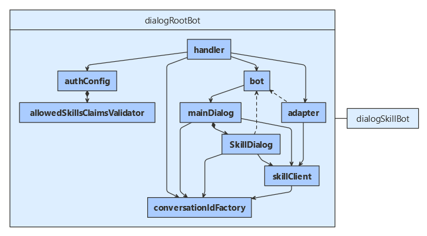

# Use a dialog to consume a skill

[!INCLUDE[applies-to](../includes/applies-to.md)]

This article demonstrates how to use a _skill dialog_ within a root bot use a skill bot.
The skill bot can handle both message and event activities.
It demonstrates how to post activities from the parent bot to the skill bot and return the skill responses to the user.
For a sample skill manifest and information about implementing the skill, see how to [use dialogs within a skill]().

For information about using a skill bot outside of dialogs, see how to [implement a skill consumer](skill-implement-consumer.md).

## Prerequisites

- Knowledge of [bot basics](bot-builder-basics.md), [how skills bots work](skills-conceptual.md), and how to [implement a skill](skill-implement-skill.md).
- An Azure subscription. If you don't have one, create a [free account](https://azure.microsoft.com/free/?WT.mc_id=A261C142F) before you begin.
- A copy of the **skills skillDialog** sample in [**C#**](https://aka.ms/skills-using-dialogs-cs), [**JavaScript**](https://aka.ms/skills-using-dialogs-js) or [**Python**](https://aka.ms/skills-using-dialogs-py).

## About this sample

The **skills skillDialog** sample includes projects for two bots:

- The _dialog root bot_, which uses a _skill dialog_ class to consume a skill.
- The _dialog skill bot_, which uses a dialog to handle activities coming from skill consumers.

This article focuses on these aspects of the root bot:

- Use a _skill dialog_ class to manage the skill: to send message and event activities and to cancel the skill.
- Use a _skills configuration_ class to load skill definitions and to configure the _skill dialog_.

For information about defining a skills endpoint and the _skills configuration_, _skill conversation ID factory_, _skill client_, _skill handler_, and _adapter_ classes, see how to [implement a skill consumer](skill-implement-consumer.md), as the use of these classes is the same.

For information about logging activities coming from a skill, see how to [manage logging in a skill consumer]().

### [C#](#tab/cs)

### [JavaScript](#tab/js)

### [Python](#tab/python)

---

For information about the dialog skill bot, see how to [use dialogs within a skill]().

## Resources

Bot-to-bot authentication requires that each participating bot has a valid appID and password.

Register both the skill and the skill consumer with Azure. You can use a Bot Channels Registration. For more information, see how to [register a bot with Azure Bot Service](../bot-service-quickstart-registration.md).

## Application configuration

1. Add the root bot's app ID and password.
1. Add the endpoint URL to which the skills should reply to the skill consumer.
1. Add an entry for each skill the skill consumer will use. Each entry includes:
   - An ID the skill consumer will use to identify each skill.
   - The skill's app ID.
   - The skill's messaging endpoint.

### [C#](#tab/cs)

**SimpleRootBot\appsettings.json**

Add the root bot's app ID and password to the appsettings.json file. Also, add the app ID for the echo skill bot to the `BotFrameworkSkills` array.

[!code-csharp[configuration file](~/../botbuilder-samples/samples/csharp_dotnetcore/81.skills-skilldialog/DialogRootBot/appsettings.json)]

### [JavaScript](#tab/js)

**echo-skill-bot/.env**

Add the root bot's app ID and password to the .env file. Also, add the app ID for the echo skill bot.

[!code-javascript[configuration file](~/../botbuilder-samples/samples/javascript_nodejs/81.skills-skilldialog/dialogRootBot/.env)]

### [Python](#tab/python)

**simple_root_bot/config.py**

Add the root bot's app ID and password to the .env file. Also, add the app ID for the echo skill bot.

[!code-python[configuration file](~/../botbuilder-samples/samples/python/81.skills-skilldialog/dialog-root-bot/config.py?range=14-25)]

---

## Dialog logic

The bot's main dialog includes a _skill dialog_ that will manage the skill this bot uses. The skill dialog manages the various skill-related objects for you, such as the _skill client_ and the _skill converation ID factory_ objects.

The main dialog also demonstrates how to cancel the skill (through the skill dialog) based on user input.

The skill this bot uses supports a couple different features. It can book a flight or get the wether for a city. In addition, if it receives a message outside either of these contexts, it sends and echo message.

### The skill manifest

The skill manifest ([**C#**](https://aka.ms/skilldialog-manifest-cs), [**JavaScript**](https://aka.ms/skilldialog-manifest-js), [**Python**](https://aka.ms/skilldialog-manifest-py)) describes the actions the skill can perform, its input and output parameters, and the skill's endpoints.
Of note, the skill can handle a "BookFlight" or "GetWeather" event. It can also handle messages.

### Initialize the main dialog

The main dialog includes dialogs for managing conversation flow outside the skill and a skill dialogs for managing skills.
The waterfall includes these steps, which will be described in more detail in the next few sections.

1. Prompt the user to select the skill to use. (The root bot defines 1 skill.)
1. Prompt the user to select the action to use for that skill. (The skill bot defines 3 actions.)
1. Start the chosen skill with an initial activity based on the chosen action.
1. Once the skill completes, display the results, if any. Then, restart the waterfall.

#### [C#](#tab/cs)

In addition to conversation state, the dialog needs references to the skill conversation ID factory, the skill HTTP client, and the skills configuration objects and the root bot's app ID.

**DialogRootBot\Dialogs\MainDialog.cs**

The `AddSkillDialogs` helper method creates a `SkillDialog` for each skill that is included in the configuration file.

[!code-csharp[configuration file](~/../botbuilder-samples/samples/csharp_dotnetcore/81.skills-skilldialog/DialogRootBot/Dialogs/MainDialog.cs?range=204-233)]

The dialog constructor checks its input parameters, adds skills dialogs, adds prompt and a waterfall dialogs for managing conversation flow outside the skill, and creates a property accessor for tracking the active skill, if any.

[!code-csharp[configuration file](~/../botbuilder-samples/samples/csharp_dotnetcore/81.skills-skilldialog/DialogRootBot/Dialogs/MainDialog.cs?range=39-85)]

#### [JavaScript](#tab/js)

#### [Python](#tab/python)

---

### Select a skill

#### [C#](#tab/cs)

#### [JavaScript](#tab/js)

#### [Python](#tab/python)

---

### Select a skill action

#### [C#](#tab/cs)

#### [JavaScript](#tab/js)

#### [Python](#tab/python)

---

### Start a skill

#### [C#](#tab/cs)

#### [JavaScript](#tab/js)

#### [Python](#tab/python)

---

### Summarize skill result

#### [C#](#tab/cs)

#### [JavaScript](#tab/js)

#### [Python](#tab/python)

---

### Allow user to cancel the skill

#### [C#](#tab/cs)

#### [JavaScript](#tab/js)

#### [Python](#tab/python)

---

## Activity handler logic

Since skill logic for each turn is handled by a main dialog, the activity handler looks much like it would for other dialog samples.

### [C#](#tab/cs)

### [JavaScript](#tab/js)

### [Python](#tab/python)

---

## Service registration

### [C#](#tab/cs)

### [JavaScript](#tab/js)

### [Python](#tab/python)

---

## Test the root bot

## Additional information

<!--
TODO Write:
- use dialogs within a skill
- manage logging in a skill consumer
-->
