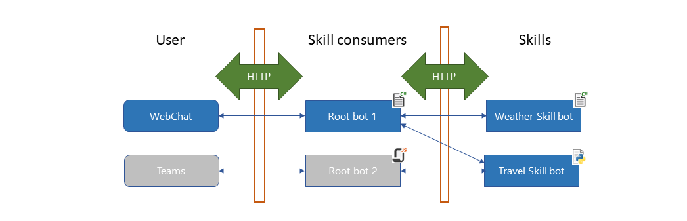

# Skills overview

[!INCLUDE [applies-to-v4](../includes/applies-to-v4-current.md)]

You can extend a bot using a _skill_ bot.
A skill can be consumed by various other bots, facilitating reuse, and in this way, you can create a user-facing bot and extend it by consuming your own or third-party skills.

- A _skill_ is a bot that can perform a set of tasks for another bot&mdash;a bot can be both a skill and a user-facing bot.
- A _skill consumer_ is a bot that can call one or more skills.
  A user-facing skill consumer is also called a _root bot_.
- A _skill manifest_ is a JSON file that describes the actions the skill can perform, its input and output parameters, and the skill's endpoints.
  - Developers who don't have access to the skill's source code can use the information in the manifest to design their skill consumer.
  - The _skill manifest schema_ is a JSON file that describes the schema of the skill manifest.
  - See how to [implement a skill](./skill-implement-skill.md) and how to [write a skill manifest](skills-write-manifest.md) for sample skill manifests.

In other words, the user interacts directly with the root bot, and the root bot delegates some of its conversational logic to a skill.

The skills feature is designed so that:

- Skills and consumers communicate over HTTP using the Bot Framework protocol.
- A skill consumer can consume multiple skills.
- A skill consumer can consume a skill regardless of the language used to implement the skill. For example, a C# bot can consume a skill implemented using JavaScript.
- A skill can also be a skill consumer and call other skills.
- Skills support user authentication; however, user authentication is local to the skill and can't be transferred to another bot.
- Skills can work with both the Bot Framework adapter and custom adapters.

This diagram shows some of the possible permutations.

## Conceptual architecture

A skill and skill consumer are separate bots, and you publish them independently.

- A skill consumer requires added logic for managing a skill, such as when to call or cancel the skill, and so on. In addition to the usual bot and adapter objects, the consumer includes a few skill-related objects, used to exchange activities with the skill. A skill consumer implements at least two HTTP endpoints:
  - A _messaging endpoint_ receives activities from the user or channel. This is the usual messaging endpoint that all bots implement.
  - A _skill host endpoint_ for receiving activities from a skill. This acts as a callback URL, the service URL to which the skill replies. (The skill consumer needs to pair code that receives the HTTP method request from the skill with a skill handler.)
- A skill requires added logic to send an `endOfConversation` activity when it completes, so that the skill consumer knows when to stop forwarding activities to the skill.

This diagram outlines the flow of activities from the user to the root bot to a skill and back again.

1. The root bot's adapter receives activities from the user and forwards them to the root bot's activity handler.
   (Activities from the user are received at the root bot's messaging endpoint.)
1. The root bot uses a skill HTTP client to send an activity to the skill. The client gets the consumer-skill conversation information from a skill definition and a skill conversation ID factory. This includes the service URL that the skill will use to reply to the activity.
1. The skill's adapter receives activities from the skill consumer and forwards them to the skill's activity handler.
   (Activities from the consumer are received at the skill bot's messaging endpoint.)
1. When the skill responds, the root bot's skill handler receives the activity. It gets the root-user conversation information from the skill conversation ID factory. It then forwards the activity to the root bot's adapter.
   (Activities from the skill are received at the root bot's skill host endpoint.)
1. The root bot's adapter internally generates a proactive message to resume the conversation with the user.
1. The root bot's adapter sends any messages from the skill to the user.

These objects help manage skills and route skill traffic:

- A _Bot Framework skill_ describes routing information for a skill and can be read from the skill consumer's configuration file.
- A _skill HTTP client_ sends activities to a skill.
- A _skill handler_ receives activities from a skill.
- The _skill conversation ID factory_ translates between the user-root conversation reference and the root-skill conversation reference.
- The Bot Connector service provides both channel and bot-to-bot authentication. Using an _authentication configuration_ object, you can add claims validation to a skill or skill consumer to limit which applications or users have access.

The skill client and skill handler objects both use the _conversation ID factory_ to translate between the conversation the root bot uses to interact with the user and the conversation the root bot uses to interact with the skill.

## Skill manifests

A _skill manifest_ is a JSON file that describes the actions the skill can perform, its input and output parameters, the skill's endpoints, and dispatch models for the skill.

For information about the skill manifest schema, see how to [write a skill manifest](skills-write-manifest.md).

## Bot-to-bot communication

It's important to understand certain aspects of this design, independent of which bot you're designing.

### Skill actions

Some skills can perform multiple tasks or _actions_. For example, a to-do skill might allow create, update, view, and delete activities that can be accessed as discrete conversations.

- See how to [implement a skill](skill-implement-skill.md) for a simple skill that implements one action.
- See how to [use dialogs within a skill](skill-actions-in-dialogs.md) for a skill that uses dialogs to implement multiple actions.

### Conversation references

The user-root conversation is different than the root-skill conversation.

The _conversation ID factory_ helps to manage traffic between a skill consumer and a skill. The factory translates between the ID of the conversation the root has with the user and the one it has with the skill.
In other words, it generates a conversation ID for use between the root and the skill, and recovers the original user-root conversation ID from the root-skill conversation ID.

### Cross-server coordination

The root and skill bots communicate over HTTP.
So, the instance of the root bot that receives an activity from a skill may not be the same instance that sent the initiating activity; in other words, different servers may handle these two requests.

- Always save state in the skill consumer before forwarding an activity to a skill.
  This ensures that the instance that receives traffic from a skill can pick up where the previous instance left off before it called the skill.
- When the skill handler receives an activity from a skill, it translates it into a form appropriate for the skill consumer, and forwards it to the consumer's adapter.

### Skill consumer and skill state

The skill consumer and skill manage their own state separately. However, the consumer creates the conversation ID that it uses to communicate with the skill. This can have an effect on conversation state in the skill.

> [!IMPORTANT]
> As noted previously, when the skill consumer delegates a user activity to a skill, a different instance of the consumer may receive the skill response. The consumer should always save conversation state immediately before forwarding an activity to a skill.

### Bot-to-bot authentication

You don't need an app ID and password to test a skill and skill consumer locally in the Bot Framework Emulator. An Azure subscription is still required to deploy your skill to Azure.

Service-level authentication is managed by the Bot Connector service. The framework uses bearer tokens and bot application IDs to verify the identity of each bot. (The Bot Framework uses an _authentication configuration_ object to validate the authentication header on incoming requests.)

> [!IMPORTANT]
> This requires all deployed bots (the skill consumer and any skills it consumes) to have valid application credentials.

### Claims validation

You must add a _claims validator_ to the authentication configuration. The claims are evaluated after the authentication header. Throw an error or exception in your validation code to reject the request.

> [!NOTE]
> The bot performs claims validation if it has an app ID and password; otherwise, claims validation isn't performed.

There are various reasons you might reject an otherwise authenticated request:

- When the skill consumer should accept traffic only from skills that it may have initiated a conversation with.
- When a skill is part of a paid-for service, and users not in the database shouldn't have access.
- When you want to restrict access to the skill to specific skill consumers.

> [!IMPORTANT]
> If you don't provide a claims validator, your bot will generate an error or exception upon receiving an activity from another bot, whether your bot is a skill or a skill consumer.

## Debugging skill conversations

[!INCLUDE [skills-about-debugging](../includes/skills-about-debugging.md)]

## Additional information

From the user's perspective, they are interacting with the root bot.
From the skill's perspective, the skill consumer is the channel over which it communicates with the user.

- For more information about skill consumers, see [about skill consumers](skills-about-skill-consumers.md).
