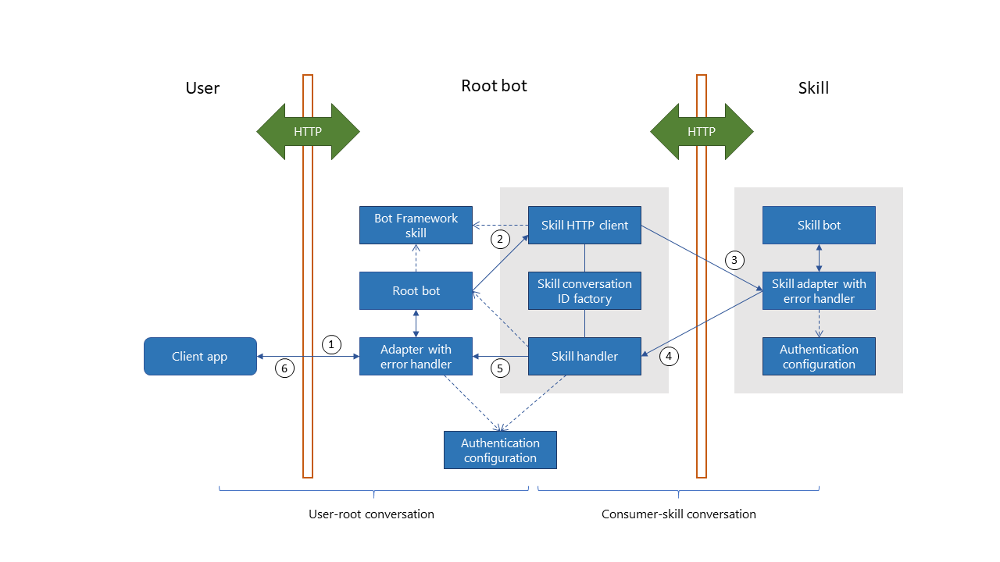

# How skills bots work

[!INCLUDE [applies-to-v4](../includes/applies-to.md)]

Starting with version 4.7 of the Bot Framework SDK, you can design bots that can delegate some of their conversational logic to other bots.
The bot that delegates processing to another bot is called a _host bot_, and a bot that handles the delegated processing is a _skill bot_.
In other words, the user interacts directly with the _host_, and the host delegates some of its conversational logic to a _skill_.

A host and a skill are separate bots, and you publish them independently.

## Architecture

The host bot requires added logic for managing a skill, such as when to invoke or cancel a skill, and so on. In addition to the usual bot and adapter objects, the host includes a few skill-related objects for exchanging activities with the skill, as illustrated in this diagram.

- The host and skill communicate over HTTP.
- Skill definitions in the host's configuration file provide routing information for the skills.
- To send an activity to a skill, the host uses a _skill HTTP client_.
- To receive an activity from a skill, the host uses a _skill handler_. (The host implements at least two HTTP endpoints, one for receiving activities from the user and one for receiving activities from skills.)
- The skill client and skill handler both use a _conversation ID factory_ to translate between the conversation ID and service URL the host uses to interact with the user and the conversation ID and service URL the host uses to interact with the skill.
- The Bot Connector service provides both channel and bot-to-bot authentication.
- Using the _authentication configuration_ object, you can add claims validation to a bot (host or skill) to limit which applications have access.

## Bot-to-bot communication

Before diving into specifics, it's important to understand certain aspects of this design.

<!--
- infrastructure concerns:
  - stateless, cross-server application (memory management and middleware).
  - authentication, in both directions, plus claims validation.
- implementation concerns:
  - classes, objects, and logic you need to add to your host (and skill).
  - when to start and stop a skill.
  - managing multiple skills.
-->

### Conversation references

The user-host conversation is different than the host-skill conversation.

The _conversation ID factory_ helps to manage traffic between the host and the skill. The factory translates between the ID of the conversation the host has with the user and the one it has with the skill.
In other words, it generates a conversation ID for use between the host and the skill, and recovers the original user-host conversation ID from the host-skill conversation ID.

<!-- Hopefully, this just gets folded into the SDK and does not need to get described in detail.
- The host needs to save or encode original conversation ID and service URL and create a conversation ID for use between it and the skill.
  - Generated conversation IDs must be usable as a URL path parameter.
  - A modified activity gets the new conversation ID and service URL (of the host, as the host provides a channel interface to the skill).
- Upon receiving an activity from the skill, host needs to decode or recover the original conversation ID and service URL so that the activity can get forwarded back to the user in the original conversation.
-->

### Cross-server coordination
<!-- or, Statelessness in the host -->

The host and skill communicate over HTTP.
Thus, the host instance that receives an activity from a skill may not be the same instance that sent the initiating activity; different servers may handler these two requests.

- Always save state in the host bot before forwarding an activity to a skill.
  This ensures that the instance that receives traffic from a skill can pick up where the another instance left off before it invoked the skill.
- When the skill handler receives an activity from a skill, it translates it into a form appropriate for the bot, and forwards it to the bot adapter.

### Host and skill state

The host and skill manage their own state separately. However, the host creates the conversation ID that it uses to communicate with the skill. So this can have an effect on conversation state in the skill.

> [!IMPORTANT]
> As noted previously, when the host delegates a user activity to a skill, a different instance of the host may receive the skill response. The host should always save conversation state immediately before forwarding an activity to a skill.

### Bot-to-bot authentication

<!-- TODO Add appropriate info about this new(?) feature to the bot basics article. -->

Service-level authentication is managed by the Bot Connector service. The framework uses bearer tokens and the bot application IDs to verify the identity of each bot.

The Bot Framework uses an _authentication configuration_ object to validate the authentication header on incoming requests.

#### Claims validation

You can add a _claims validator_ to the authentication configuration. The claims are evaluated after the authentication header. Your validation code should throw an _unauthorized access exception_ to reject the request. There are various reasons you might reject an otherwise authenticated request. For example,

- When the host should accept traffic only from skills that it may have initiated a conversation with.
- When a skill is part of a paid-for service. User's not in the data base should not have access.
- When you want to restrict access to the skill to specific hosts.

<!--TODO Need a link for more information about claims and claims-based validation.-->

## Host bots

From the user's perspective, the host is the bot they are interacting with.
From the skill's perspective, the host is the channel over which it communicates with the user.

A host bot includes some additional logic to manage traffic between it and a skill:

- Configuration information for each skill the bot uses.
- A _conversation ID factory_ that allows the host to switch back and forth between the conversation it is having with the user and the one it is having with a skill.
- A _skill client_ that can package and forward activities to a skill bot.
- A _skill handler_ that can receive request and unpack activities from a skill bot.

### Managing skills

Starting and letting a single skill run to completion is managed with a few additions to the host. More complicated scenarios are possible, with multiple skills or conversation threads, but you would need to add logic specific to your scenario to the host.

#### Skill descriptions

For each skill, add a _Bot Framework skill_ object to the host's configuration file. Each one will have an ID, an app ID, and the endpoint for the skill.

| Property | Description
| :--- | :--- |
| _ID_ | The ID or key of the skill, specific to the host bot. |
| _App ID_ | The `appId` assigned to the bot resource when the skill was registered on Azure. |
| _Skill endpoint_ | The messaging endpoint for the skill. This is the URL the host will use to communicate with the skill. |

#### Skill client and skill handler

<!-- Is this still accurate? -->
The host uses the skill client to send activities to the skill. The client:

- takes an activity to forward to a skill, either from a user or generated by the host
- manufactures a conversation ID (for the associated host-to-skill conversation)
- replaces the original conversation reference with one for the host-to-skill conversation
- adds a bot-to-bot authentication token
- sends the updated activity to the skill

The host uses the skill handler to receive activities from the skill. The handler:

- handles the channel service `SendToConversation` and `ReplyToActivity` REST API methods
- enforces authentication and claims validation
- retrieves the original host-to-user conversation reference
- initiates a proactive message to the user, using the activity information that the skill sent to the host

<!-- These last three sections should probably reference a how-to. -->
#### Managing a skill from a host

You need to add logic to your host to track any active skills.
It is up to the host as to how it manages skills in general, whether it can maintain multiple active skills in parallel or not, and so on.
Specific scenarios to consider include:

- Initiating a new host-to-skill conversation. (This will be associated with a specific host-to-user conversation.)
  - To pass parameters to a skill, set the _value_ property in the initial activity to the skill.
- Continuing an existing host-to-skill conversation.
- Recognizing an `endOfConversation` activity from the skill as signalling an end of a host-to-skill conversation.
  - To retrieve any return value from a skill, check the activity's _value_ property.
  - To check why the skill is ending, check the activity's _code_ parameter, which could indicate that the skill encountered an error.
- Cancelling a skill from the host by sending an `endOfConversation` activity to the skill.

## Skill bots

With minor modifications, any bot can act as a skill. However, hierarchical skills are not currently a supported feature.
Skill bots:

- Implement access restrictions via a claims validator.
- As appropriate, check for initialization parameters in the initial activity's _value_ property.
- Send messages to the user as normal, via `message` activities.
- Signal skill completion or cancellation via an `endOfConversation` activity.
  - Provide the return value, if any, in the activity's _value_ property.
  - Provide an error code, if any, in the activity's _code_ property.

### Skill manifest

Publish a skill manifest to make your skill publicly available. <!--What does this mean and entail?-->
For the skill-manifest schema, see [skill-manifest-2.0.0.json](https://github.com/microsoft/botframework-sdk/blob/master/schemas/skills/skill-manifest-2.0.0.json).

<!--
## Additional information

- You publish host and the skill bots separately. For more information, see _TBD: link to create a skills bot from scratch how-to or tutorial_.
- For more on how to implement host and skill bots, see _TBD: link to how-to's in the **How to/Develop/Skills** section_.
- For more about skill manifests, see the _TBD: creating a manifest section of implementing a skill bot_.
-->
