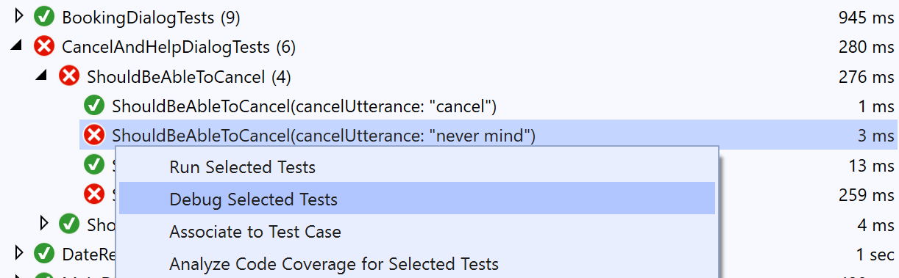
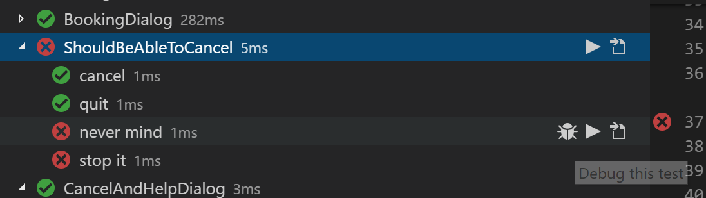
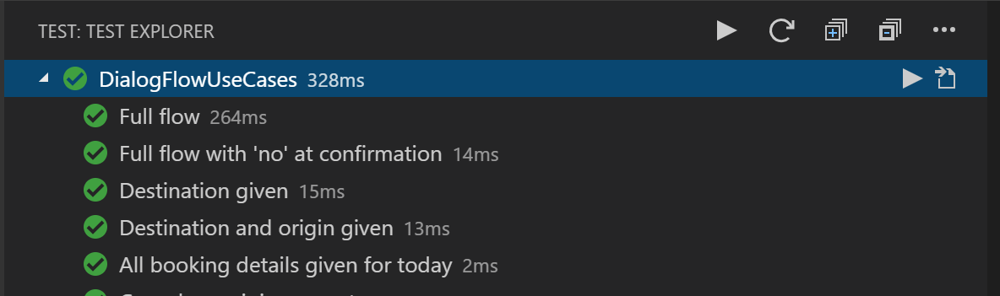

# How to unit test bots

[!INCLUDE[applies-to](../includes/applies-to.md)]

In this topic we'll show you how to:

- Create unit tests for bots
- Use assert to check for activities returned by a dialog turn against expected values
- Use assert to check the results returned by a dialog
- Create different types of data driven tests
- Create mock objects for the different dependencies of a dialog (i.e. LUIS recognizers, etc.)

## Prerequisites

## [C#](#tab/csharp)

The [CoreBot Tests](https://aka.ms/cs-core-test-sample) sample used in this topic references the [Microsoft.Bot.Builder.Testing](https://www.nuget.org/packages/Microsoft.Bot.Builder.Testing/) package, [XUnit](https://xunit.net/), and [Moq](https://github.com/moq/moq) to create unit tests.

## [JavaScript](#tab/javascript)

The [CoreBot Tests](https://aka.ms/js-core-test-sample) sample used in this topic references the [botbuilder-testing](https://www.npmjs.com/package/botbuilder-testing) package, [Mocha](https://mochajs.org/) to create unit tests and [Mocha Test Explorer](https://marketplace.visualstudio.com/items?itemName=hbenl.vscode-mocha-test-adapter) to visualize test results in VS Code.

---

## Testing Dialogs

In the CoreBot sample, dialogs are unit tested through the `DialogTestClient` class which provides a mechanism for testing them in isolation outside of a bot and without having to deploy your code to a web service.

Using this class, you can write unit tests that validate dialogs responses on a turn-by-turn basis. Unit tests using `DialogTestClient` class should work with other dialogs built using the botbuilder dialogs library.

The following example demonstrates tests derived from `DialogTestClient`:

## [C#](#tab/csharp)

```csharp
var sut = new BookingDialog();
var testClient = new DialogTestClient(Channels.Msteams, sut);

var reply = await testClient.SendActivityAsync<IMessageActivity>("hi");
Assert.Equal("Where would you like to travel to?", reply.Text);

reply = await testClient.SendActivityAsync<IMessageActivity>("Seattle");
Assert.Equal("Where are you traveling from?", reply.Text);

reply = await testClient.SendActivityAsync<IMessageActivity>("New York");
Assert.Equal("When would you like to travel?", reply.Text);

reply = await testClient.SendActivityAsync<IMessageActivity>("tomorrow");
Assert.Equal("OK, I will book a flight from Seattle to New York for tomorrow, Is this Correct?", reply.Text);

reply = await testClient.SendActivityAsync<IMessageActivity>("yes");
Assert.Equal("Sure thing, wait while I finalize your reservation...", reply.Text);

reply = testClient.GetNextReply<IMessageActivity>();
Assert.Equal("All set, I have booked your flight to Seattle for tomorrow", reply.Text);
```

The `DialogTestClient` class is defined in the `Microsoft.Bot.Builder.Testing` namespace and included in the [Microsoft.Bot.Builder.Testing](https://www.nuget.org/packages/Microsoft.Bot.Builder.Testing/) NuGet package.

## [JavaScript](#tab/javascript)

```javascript
const sut = new BookingDialog();
const testClient = new DialogTestClient('msteams', sut);

let reply = await testClient.sendActivity('hi');
assert.strictEqual(reply.text, 'Where would you like to travel to?');

reply = await testClient.sendActivity('Seattle');
assert.strictEqual(reply.text, 'Where are you traveling from?');

reply = await testClient.sendActivity('New York');
assert.strictEqual(reply.text, 'When would you like to travel?');

reply = await testClient.sendActivity('tomorrow');
assert.strictEqual(reply.text, 'OK, I will book a flight from Seattle to New York for tomorrow, Is this Correct?');

reply = await testClient.sendActivity('yes');
assert.strictEqual(reply.text, 'Sure thing, wait while I finalize your reservation...');

reply = testClient.getNextReply();
assert.strictEqual(reply.text, 'All set, I have booked your flight to Seattle for tomorrow');
```

The `DialogTestClient` class is included in the [botbuilder-testing]() npm package.

---

### DialogTestClient

The first parameter of `DialogTestClient` is the target channel. This allows you to test different rendering logic based on the target channel for your bot (Teams, Slack, Cortana, etc.). If you are uncertain about your target channel, you can use the `Emulator` or `Test` channel ids but keep in mind that some components may behave differently depending on the current channel, for example, `ConfirmPrompt` renders the Yes/No options differently for the `Test` and `Emulator` channels. You can also use this parameter to test conditional rendering logic in your dialog based on the channel ID.

The second parameter is an instance of the dialog being tested (Note: **"sut"** stands for "System Under Test", we use this acronym in the code snippets in this article).

The `DialogTestClient` constructor provides additional parameters that allows you to further customize the client behavior or pass parameters to the dialog being tested if needed. You can pass initialization data for the dialog, add custom middleware or use your own TestAdapter and `ConversationState` instance.

### Sending and receiving messages

## [C#](#tab/csharp)

The `SendActivityAsync<IActivity>` method allows you to send a text utterance or an `IActivity` to your dialog and returns the first message it receives. The `<T>` parameter is used to return a strong typed instance of the reply so you can assert it without having to cast it.

```csharp
var reply = await testClient.SendActivityAsync<IMessageActivity>("hi");
Assert.Equal("Where would you like to travel to?", reply.Text);
```

In some scenarios your bot may send several messages in response to a single activity, in these cases `DialogTestClient` will queue the replies and you can use the `GetNextReply<IActivity>` method to pop the next message from the response queue.

```csharp
reply = testClient.GetNextReply<IMessageActivity>();
Assert.Equal("All set, I have booked your flight to Seattle for tomorrow", reply.Text);
```

`GetNextReply<IActivity>` will return null if there are no further messages in the response queue.

## [JavaScript](#tab/javascript)

The `sendActivity` method allows you to send a text utterance or an `Activity` to your dialog and returns the first message it receives.

```javascript
let reply = await testClient.sendActivity('hi');
assert.strictEqual(reply.text, 'Where would you like to travel to?');
```

In some scenarios your bot may send several messages in response to a single activity, in these cases `DialogTestClient` will queue the replies and you can use the `getNextReply` method to pop the next message from the response queue.

```javascript
reply = testClient.getNextReply();
assert.strictEqual(reply.text, 'All set, I have booked your flight to Seattle for tomorrow');
```

`getNextReply` will return null if there are no further messages in the response queue.

---

### Asserting activities

## [C#](#tab/csharp)

The code in the CoreBot sample only asserts the `Text` property of the returned activities. In more complex bots you may want to assert other properties like `Speak`, `InputHint`, `ChannelData`, etc.

```csharp
Assert.Equal("Sure thing, wait while I finalize your reservation...", reply.Text);
Assert.Equal("One moment please...", reply.Speak);
Assert.Equal(InputHints.IgnoringInput, reply.InputHint);
```

You can do this by checking each property individually as shown above, you can write your own helper utilities for asserting activities or you can use other frameworks like [FluentAssertions](https://fluentassertions.com/) to write custom assertions and simplify your test code.

## [JavaScript](#tab/javascript)

The code in the CoreBot sample only asserts the `text` property of the returned activities. In more complex bots you may want to assert other properties like `speak`, `inputHint`, `channelData`, etc.

```javascript
assert.strictEqual(reply.text, 'Sure thing, wait while I finalize your reservation...');
assert.strictEqual(reply.speak, 'One moment please...');
assert.strictEqual(reply.inputHint, InputHints.IgnoringInput);
```

You can do this by checking each property individually as shown above, you can write your own helper utilities for asserting activities or you can use other libraries like [Chai](https://www.chaijs.com/) to write custom assertions and simplify your test code.

---

### Passing parameters to your dialogs

The `DialogTestClient` constructor has an `initialDialogOptions` that can be used to pass parameters to your dialog. For example, the `MainDialog` in this sample, initializes a `BookingDetails` object from the LUIS results with the entities it resolves from the user's utterance and passes this object in the call to invoke `BookingDialog`.

You can implement this in a test as follows:

## [C#](#tab/csharp)

```csharp
var inputDialogParams = new BookingDetails()
{
    Destination = "Seattle",
    TravelDate = $"{DateTime.UtcNow.AddDays(1):yyyy-MM-dd}"
};

var sut = new BookingDialog();
var testClient = new DialogTestClient(Channels.Msteams, sut, inputDialogParams);

```

`BookingDialog` receives this parameter and accesses it in the test the same way as it would have been when invoked from `MainDialog`.

```csharp
private async Task<DialogTurnResult> DestinationStepAsync(WaterfallStepContext stepContext, CancellationToken cancellationToken)
{
    var bookingDetails = (BookingDetails)stepContext.Options;
    ...
}
```

## [JavaScript](#tab/javascript)

```javascript
const inputDialogParams = {
    destination: 'Seattle',
    travelDate: formatDate(new Date().setDate(now.getDate() + 1))
};

const sut = new BookingDialog();
const testClient = new DialogTestClient('msteams', sut, inputDialogParams);
```

`BookingDialog` will receive this parameter and can access it in the test the same way as if it would have been invoked from `MainDialog`.

```javascript
async destinationStep(stepContext) {
    const bookingDetails = stepContext.options;
    ...
}
```

---

### Asserting dialog turn results

## [C#](#tab/csharp)

Some dialogs like `BookingDialog` or `DateResolverDialog` return a value to the calling dialog. The `DialogTestClient` object exposes a `DialogTurnResult` property that can be used to analyze and assert the results returned by the dialog.

For example:

```csharp
var sut = new BookingDialog();
var testClient = new DialogTestClient(Channels.Msteams, sut);

var reply = await testClient.SendActivityAsync<IMessageActivity>("hi");
Assert.Equal("Where would you like to travel to?", reply.Text);

...

var bookingResults = (BookingDetails)testClient.DialogTurnResult.Result;
Assert.Equal("New York", bookingResults?.Origin);
Assert.Equal("Seattle", bookingResults?.Destination);
Assert.Equal("2019-06-21", bookingResults?.TravelDate);
```

The `DialogTurnResult` property can also be used to inspect and assert intermediate results returned by the steps in a waterfall.

## [JavaScript](#tab/javascript)

Some dialogs like `BookingDialog` or `DateResolverDialog` return a value to the calling dialog. The `DialogTestClient` object exposes a `dialogTurnResult` property that can be used to analyze and assert the results returned by the dialog.

For example:

```javascript
const sut = new BookingDialog();
const testClient = new DialogTestClient('msteams', sut);

let reply = await testClient.sendActivity('hi');
assert.strictEqual(reply.text, 'Where would you like to travel to?');

...

const bookingResults = client.dialogTurnResult.result;
assert.strictEqual('New York', bookingResults.destination);
assert.strictEqual('Seattle', bookingResults.origin);
assert.strictEqual('2019-06-21', bookingResults.travelDate);
```

The `dialogTurnResult` property can also be used to inspect and assert intermediate results returned by the steps in a waterfall.

---

### Analyzing test output

Sometimes it is necessary to read a unit test transcript to analyze the test execution without having to debug the test.

## [C#](#tab/csharp)

The [Microsoft.Bot.Builder.Testing](https://www.nuget.org/packages/Microsoft.Bot.Builder.Testing/) package includes a `XUnitDialogTestLogger` that logs the messages sent and received by the dialog to the console.

To use this middleware, your test needs to expose a constructor that receives an `ITestOutputHelper` object that is provided by the XUnit test runner and create a `XUnitDialogTestLogger` that will be passed to `DialogTestClient` through the `middlewares` parameter.

```csharp
public class BookingDialogTests
{
    private readonly IMiddleware[] _middlewares;

    public BookingDialogTests(ITestOutputHelper output)
        : base(output)
    {
        _middlewares = new[] { new XUnitDialogTestLogger(output) };
    }

    [Fact]
    public async Task SomeBookingDialogTest()
    {
        // Arrange
        var sut = new BookingDialog();
        var testClient = new DialogTestClient(Channels.Msteams, sut, middlewares: _middlewares);

        ...
    }
}
```

Here is an example of what the `XUnitDialogTestLogger` logs to the output window when it is configured:


For additional information on sending test output to the console when using XUnit see [Capturing Output](https://xunit.net/docs/capturing-output.html) in the XUnit documentation.

## [JavaScript](#tab/javascript)

The [botbuilder-testing](https://www.npmjs.com/package/botbuilder-testing) package includes a `DialogTestLogger` that logs the messages sent and received by the dialog to the console.

To use this middleware, simply pass it to `DialogTestClient` through the `middlewares` parameter.

```javascript
const client = new DialogTestClient('msteams', sut, testData.initialData, [new DialogTestLogger()]);
```

Here is an example of what the `DialogTestLogger` logs to the output window when it is configured:


---

This output will be also logged on the build server during the continuous integration builds and helps you analyze build failures.

## Data Driven Tests

In most cases the dialog logic doesn't change and the different execution paths in a conversation are based on the user utterances. Rather than writing a single unit test for each variant in the conversation it is easier to use data driven tests (also known as parameterized test).

For example, the sample test in the overview section of this document shows how to test one execution flow, but what happens if the user says no to the confirmation? what if they use a different date? etc.

Data driven tests allow us to test all these permutations without having to rewrite the tests.

## [C#](#tab/csharp)

In the CoreBot sample, we use `Theory` tests from XUnit to parameterize tests.

### Theory tests using InlineData

The following test checks that a dialog gets cancelled when the user says "cancel".

```csharp
[Fact]
public async Task ShouldBeAbleToCancel()
{
    var sut = new TestCancelAndHelpDialog();
    var testClient = new DialogTestClient(Channels.Test, sut);

    var reply = await testClient.SendActivityAsync<IMessageActivity>("Hi");
    Assert.Equal("Hi there", reply.Text);
    Assert.Equal(DialogTurnStatus.Waiting, testClient.DialogTurnResult.Status);

    reply = await testClient.SendActivityAsync<IMessageActivity>("cancel");
    Assert.Equal("Cancelling...", reply.Text);
}
```

To cancel a dialog, users can type "quit", "never mind", and "stop it". Rather then writing a new test case for every possible word, write a single `Theory` test method that accepts parameters via a list of `InlineData` values to define the parameters for each test case:

```csharp
[Theory]
[InlineData("cancel")]
[InlineData("quit")]
[InlineData("never mind")]
[InlineData("stop it")]
public async Task ShouldBeAbleToCancel(string cancelUtterance)
{
    var sut = new TestCancelAndHelpDialog();
    var testClient = new DialogTestClient(Channels.Test, sut, middlewares: _middlewares);

    var reply = await testClient.SendActivityAsync<IMessageActivity>("Hi");
    Assert.Equal("Hi there", reply.Text);
    Assert.Equal(DialogTurnStatus.Waiting, testClient.DialogTurnResult.Status);

    reply = await testClient.SendActivityAsync<IMessageActivity>(cancelUtterance);
    Assert.Equal("Cancelling...", reply.Text);
}
```

The new test will be executed 4 times with the different parameters and each case will show as a child item under the `ShouldBeAbleToCancel` test in Visual Studio Test Explorer. If any of them fail as shown below, you can right click and debug the scenario that failed rather than re-running the entire set of tests.



### Theory tests using MemberData and complex types

`InlineData` is useful for small data driven tests that receive simple value type parameters (string, int, etc.).

The `BookingDialog` receives a `BookingDetails` object and returns a new `BookingDetails` object. A non-parameterized version of a test for this dialog would look as follows:

```csharp
[Fact]
public async Task DialogFlow()
{
    // Initial parameters
    var initialBookingDetails = new BookingDetails
    {
        Origin = "Seattle",
        Destination = null,
        TravelDate = null,
    };

    // Expected booking details
    var expectedBookingDetails = new BookingDetails
    {
        Origin = "Seattle",
        Destination = "New York",
        TravelDate = "2019-06-25",
    };

    var sut = new BookingDialog();
    var testClient = new DialogTestClient(Channels.Test, sut, initialBookingDetails);

    // Act/Assert
    var reply = await testClient.SendActivityAsync<IMessageActivity>("hi");
    ...

    var bookingResults = (BookingDetails)testClient.DialogTurnResult.Result;
    Assert.Equal(expectedBookingDetails.Origin, bookingResults?.Origin);
    Assert.Equal(expectedBookingDetails.Destination, bookingResults?.Destination);
    Assert.Equal(expectedBookingDetails.TravelDate, bookingResults?.TravelDate);
}
```

To parameterize this test, we created a `BookingDialogTestCase` class that contains our test case data. It contains the initial `BookingDetails` object, the expected `BookingDetails` and an array of strings containing the utterances sent from the user and the expected replies from the dialog for each turn.

```csharp
public class BookingDialogTestCase
{
    public BookingDetails InitialBookingDetails { get; set; }

    public string[,] UtterancesAndReplies { get; set; }

    public BookingDetails ExpectedBookingDetails { get; set; }
}
```

We also created a helper `BookingDialogTestsDataGenerator` class that exposes a `IEnumerable<object[]> BookingFlows()` method that returns a collection of the test cases to be used by the test.

In order to display each test case as a separate item in Visual Studio Test Explorer, the XUnit test runner requires that complex types like `BookingDialogTestCase` implement `IXunitSerializable`, to simplify this, the Bot.Builder.Testing framework provides a `TestDataObject` class that Implements this interface and can be used to wrap the test case data without having to implement `IXunitSerializable`. 

Here is a fragment of `IEnumerable<object[]> BookingFlows()` that shows how the two classes are used:

```csharp
public static class BookingDialogTestsDataGenerator
{
    public static IEnumerable<object[]> BookingFlows()
    {
        // Create the first test case object
        var testCaseData = new BookingDialogTestCase
        {
            InitialBookingDetails = new BookingDetails(),
            UtterancesAndReplies = new[,]
            {
                { "hi", "Where would you like to travel to?" },
                { "Seattle", "Where are you traveling from?" },
                { "New York", "When would you like to travel?" },
                { "tomorrow", $"Please confirm, I have you traveling to: Seattle from: New York on: {DateTime.Now.AddDays(1):yyyy-MM-dd}. Is this correct? (1) Yes or (2) No" },
                { "yes", null },
            },
            ExpectedBookingDetails = new BookingDetails
            {
                Destination = "Seattle",
                Origin = "New York",
                TravelDate = $"{DateTime.Now.AddDays(1):yyyy-MM-dd}",
            }, 
        };
        // wrap the test case object into TestDataObject and return it.
        yield return new object[] { new TestDataObject(testCaseData) };

        // Create the second test case object
        testCaseData = new BookingDialogTestCase
        {
            InitialBookingDetails = new BookingDetails
            {
                Destination = "Seattle",
                Origin = "New York",
                TravelDate = null,
            },
            UtterancesAndReplies = new[,]
            {
                { "hi", "When would you like to travel?" },
                { "tomorrow", $"Please confirm, I have you traveling to: Seattle from: New York on: {DateTime.Now.AddDays(1):yyyy-MM-dd}. Is this correct? (1) Yes or (2) No" },
                { "yes", null },
            },
            ExpectedBookingDetails = new BookingDetails
            {
                Destination = "Seattle",
                Origin = "New York",
                TravelDate = $"{DateTime.Now.AddDays(1):yyyy-MM-dd}",
            },
        };
        // wrap the test case object into TestDataObject and return it.
        yield return new object[] { new TestDataObject(testCaseData) };
    }
}
```

Once we create an object to store the test data and a class that exposes a collection of test cases, we use the XUnit `MemberData` attribute instead of `InlineData` to feed the data into the test, the first parameter for `MemberData` is the name of the static function that returns the collection of test cases and the second parameter is the type of the class that exposes this method.

```csharp
[Theory]
[MemberData(nameof(BookingDialogTestsDataGenerator.BookingFlows), MemberType = typeof(BookingDialogTestsDataGenerator))]
public async Task DialogFlowUseCases(TestDataObject testData)
{
    // Get the test data instance from TestDataObject
    var bookingTestData = testData.GetObject<BookingDialogTestCase>();
    var sut = new BookingDialog();
    var testClient = new DialogTestClient(Channels.Test, sut, bookingTestData.InitialBookingDetails);

    // Iterate over the utterances and replies array.
    for (var i = 0; i < bookingTestData.UtterancesAndReplies.GetLength(0); i++)
    {
        var reply = await testClient.SendActivityAsync<IMessageActivity>(bookingTestData.UtterancesAndReplies[i, 0]);
        Assert.Equal(bookingTestData.UtterancesAndReplies[i, 1], reply?.Text);
    }

    // Assert the resulting BookingDetails object
    var bookingResults = (BookingDetails)testClient.DialogTurnResult.Result;
    Assert.Equal(bookingTestData.ExpectedBookingDetails?.Origin, bookingResults?.Origin);
    Assert.Equal(bookingTestData.ExpectedBookingDetails?.Destination, bookingResults?.Destination);
    Assert.Equal(bookingTestData.ExpectedBookingDetails?.TravelDate, bookingResults?.TravelDate);
}
```

Here is an example of the results for the `DialogFlowUseCases` tests in Visual Studio Test Explorer when the test is executed:


## [JavaScript](#tab/javascript)

### Simple data driven tests

The following test checks that a dialog gets cancelled when the user says "cancel".

```javascript
describe('ShouldBeAbleToCancel', () => {
    it('Should cancel', async () => {
        const sut = new TestCancelAndHelpDialog();
        const client = new DialogTestClient('test', sut, null, [new DialogTestLogger()]);

        // Execute the test case
        let reply = await client.sendActivity('Hi');
        assert.strictEqual(reply.text, 'Hi there');
        assert.strictEqual(client.dialogTurnResult.status, 'waiting');

        reply = await client.sendActivity('cancel');
        assert.strictEqual(reply.text, 'Cancelling...');
    });
});
```

Consider that later on we need to be able to handle other utterances for cancel like "quit", "never mind" and "stop it". Rather than writing 3 more repetitive tests for each new utterance, we can refactor the test to use a list of utterances to define the parameters for each test case:

```javascript
describe('ShouldBeAbleToCancel', () => {
    const testCases = ['cancel', 'quit', 'never mind', 'stop it'];

    testCases.map(testData => {
        it(testData, async () => {
            const sut = new TestCancelAndHelpDialog();
            const client = new DialogTestClient('test', sut, null, [new DialogTestLogger()]);

            // Execute the test case
            let reply = await client.sendActivity('Hi');
            assert.strictEqual(reply.text, 'Hi there');
            assert.strictEqual(client.dialogTurnResult.status, 'waiting');

            reply = await client.sendActivity(testData);
            assert.strictEqual(reply.text, 'Cancelling...');
        });
    });
});
```

The new test will be executed 4 times with the different parameters and each case will show as a child item under the `ShouldBeAbleToCancel` test suite in [Mocha Test Explorer](https://marketplace.visualstudio.com/items?itemName=hbenl.vscode-mocha-test-adapter). If any of them fail like shown below, you can run and debug the scenario that failed rather than re-running the entire set of tests.



### Data driven tests with complex types

Using a simple list of utterances is useful for small data driven tests that receive simple value type parameters (string, int, etc.) or small objects.

The `BookingDialog` receives a `BookingDetails` object and returns a new `BookingDetails` object. A non parameterized version of a test for this dialog would look as follows:

```javascript
describe('BookingDialog', () => {
    it('Returns expected booking details', async () => {
        // Initial parameters
        const initialBookingDetails = {
            origin: 'Seattle',
            destination: undefined,
            travelDate: undefined
        };

        // Expected booking details
        const expectedBookingDetails = {
            origin: 'Seattle',
            destination: 'New York',
            travelDate: '2019-06-25'
        };

        const sut = new BookingDialog('bookingDialog');
        const client = new DialogTestClient('test', sut, initialBookingDetails, [new DialogTestLogger()]);

        // Execute the test case
        const reply = await client.sendActivity('Hi');
        ...

        // Check dialog results
        const result = client.dialogTurnResult.result;
        assert.strictEqual(result.destination, expectedBookingDetails.destination);
        assert.strictEqual(result.origin, expectedBookingDetails.origin);
        assert.strictEqual(result.travelDate, expectedBookingDetails.travelDate);
    });
});
```

To parameterize this test, we created a `bookingDialogTestCases` module that returns the test case data. Each item contains a test case name, the initial 'BookingDetails' object, the expected 'BookingDetails' and an array of strings with the utterances sent from the user and the expected replies from the dialog for each turn.

```javascript
module.exports = [
    // Create the first test case object
    {
        name: 'Full flow',
        initialData: {},
        steps: [
            ['hi', 'To what city would you like to travel?'],
            ['Seattle', 'From what city will you be travelling?'],
            ['New York', 'On what date would you like to travel?'],
            ['tomorrow', `Please confirm, I have you traveling to: Seattle from: New York on: ${ tomorrow }. Is this correct? (1) Yes or (2) No`],
            ['yes', null]
        ],
        expectedResult: {
            destination: 'Seattle',
            origin: 'New York',
            travelDate: tomorrow
        }
    },
    // Create the second test case object
    {
        name: 'Destination and Origin provided',
        initialData: {
            destination: 'Seattle',
            origin: 'New York'
        },
        steps: [
            ['hi', 'On what date would you like to travel?'],
            ['tomorrow', `Please confirm, I have you traveling to: Seattle from: New York on: ${ tomorrow }. Is this correct? (1) Yes or (2) No`],
            ['yes', null]
        ],
        expectedStatus: 'complete',
        expectedResult: {
            destination: 'Seattle',
            origin: 'New York',
            travelDate: tomorrow
        }
    }
];
```

Once we created the list that contain the test data, we can refactor our test to map this list into individual test cases.

```javascript
describe('DialogFlowUseCases', () => {
    const testCases = require('./testData/bookingDialogTestCases.js');

    testCases.map(testData => {
        it(testData.name, async () => {
            const sut = new BookingDialog('bookingDialog');
            const client = new DialogTestClient('test', sut, testData.initialData, [new DialogTestLogger()]);

            // Execute the test case
            for (let i = 0; i < testData.steps.length; i++) {
                const reply = await client.sendActivity(testData.steps[i][0]);
                assert.strictEqual((reply ? reply.text : null), testData.steps[i][1]);
            }

            // Check dialog results
            const actualResult = client.dialogTurnResult.result;
            assert.strictEqual(actualResult.destination, testData.expectedResult.destination);
            assert.strictEqual(actualResult.origin, testData.expectedResult.origin);
            assert.strictEqual(actualResult.travelDate, testData.expectedResult.travelDate);
        });
    });
});
```

Here is an example of the results for the `DialogFlowUseCases` test suite in Mocha Test Explorer when the test suite is executed:



---

## Using Mocks

You can use mock elements for the things that are not currently tested. For reference, this level can generally be thought of as unit and integration testing.

Mocking as many elements as you can allows for better isolation of the piece you’re testing. Candidates for mock elements include storage, the adapter, middleware, activity pipeline, channels, and anything else that is not directly part of your bot. This could also involve removing certain aspects temporarily, such as middleware not involved in the part of your bot that you are testing, to isolate each piece. However, if you are testing your middleware, you may want to mock your bot instead.

Mocking elements can take a handful of forms, from replacing an element with a different known object to implementing a bare bones hello world functionality. This could also take the form of simply removing the element, if it’s not necessary, or simply force it to do nothing.

Mocks allow us to configure the dependencies of a dialog and ensure they are in a known state during the execution of the test without having to rely on external resources like databases, LUIS models or other objects.

In order to make your dialog easier to test and reduce its dependencies on external objects, you may need to inject the external dependencies in the dialog constructor.

For example, instead of instantiating `BookingDialog` in `MainDialog`:

## [C#](#tab/csharp)

```csharp
public MainDialog()
    : base(nameof(MainDialog))
{
    ...
    AddDialog(new BookingDialog());
    ...
}
```

## [JavaScript](#tab/javascript)

```javascript
constructor() {
    super('MainDialog');
    ...
    this.addDialog(new BookingDialog('bookingDialog'));
    ...
}
```

---

We pass an instance of `BookingDialog` as a constructor parameter:

## [C#](#tab/csharp)

```csharp
public MainDialog(BookingDialog bookingDialog)
    : base(nameof(MainDialog))
{
    ...
    AddDialog(bookingDialog);
    ...
}
```

## [JavaScript](#tab/javascript)

```javascript
constructor(bookingDialog) {
    super('MainDialog');
    ...
    this.addDialog(bookingDialog);
    ...
}
```

---

This allow us to replace the `BookingDialog` instance with a mock object and write unit tests for `MainDialog` without having to call the actual `BookingDialog` class.

## [C#](#tab/csharp)

```csharp
// Create the mock object
var mockDialog = new Mock<BookingDialog>();

// Use the mock object to instantiate MainDialog
var sut = new MainDialog(mockDialog.Object);

var testClient = new DialogTestClient(Channels.Test, sut);
```

## [JavaScript](#tab/javascript)

```javascript
// Create the mock object
const mockDialog = new MockBookingDialog();

// Use the mock object to instantiate MainDialog
const sut = new MainDialog(mockDialog);

const testClient = new DialogTestClient('test', sut);
```

---

### Mocking Dialogs

As described above, `MainDialog` invokes `BookingDialog` to obtain the `BookingDetails` object. We implement and configure a mock instance of `BookingDialog` as follows:

## [C#](#tab/csharp)

```csharp
// Create the mock object for BookingDialog.
var mockDialog = new Mock<BookingDialog>();
mockDialog
    .Setup(x => x.BeginDialogAsync(It.IsAny<DialogContext>(), It.IsAny<object>(), It.IsAny<CancellationToken>()))
    .Returns(async (DialogContext dialogContext, object options, CancellationToken cancellationToken) =>
    {
        // Send a generic activity so we can assert that the dialog was invoked.
        await dialogContext.Context.SendActivityAsync($"{mockDialogNameTypeName} mock invoked", cancellationToken: cancellationToken);

        // Create the BookingDetails instance we want the mock object to return.
        var expectedBookingDialogResult = new BookingDetails()
        {
            Destination = "Seattle",
            Origin = "New York",
            TravelDate = $"{DateTime.UtcNow.AddDays(1):yyyy-MM-dd}"
        };

        // Return the BookingDetails we need without executing the dialog logic.
        return await dialogContext.EndDialogAsync(expectedBookingDialogResult, cancellationToken);
    });

// Create the sut (System Under Test) using the mock booking dialog.
var sut = new MainDialog(mockDialog.Object);
```

In this example, we used [Moq](https://github.com/moq/moq) to create the mock dialog and the `Setup` and `Returns` methods to configure its behavior.

## [JavaScript](#tab/javascript)

```javascript
class MockBookingDialog extends BookingDialog {
    constructor() {
        super('bookingDialog');
    }

    async beginDialog(dc, options) {
        // Send a generic activity so we can assert that the dialog was invoked.
        await dc.context.sendActivity(`${ this.id } mock invoked`);

        // Create the BookingDetails instance we want the mock object to return.
        const bookingDetails = {
            origin: 'New York',
            destination: 'Seattle',
            travelDate: '2025-07-08'
        };

        // Return the BookingDetails we need without executing the dialog logic.
        return await dc.endDialog(bookingDetails);
    }
}
...
// Create the sut (System Under Test) using the mock booking dialog.
const sut = new MainDialog(new MockBookingDialog());
...

```

In this example, we implement the mock dialog by deriving from `BookingDialog`  and overriding the `beginDialog` method to bypass the underlying dialog logic.

---

### Mocking LUIS results

In simple scenarios, you can implement mock LUIS results through code as follows:

## [C#](#tab/csharp)

```csharp
var mockRecognizer = new Mock<IRecognizer>();
mockRecognizer
    .Setup(x => x.RecognizeAsync<FlightBooking>(It.IsAny<ITurnContext>(), It.IsAny<CancellationToken>()))
    .Returns(() =>
    {
        var luisResult = new FlightBooking
        {
            Intents = new Dictionary<FlightBooking.Intent, IntentScore>
            {
                { FlightBooking.Intent.BookFlight, new IntentScore() { Score = 1 } },
            },
            Entities = new FlightBooking._Entities(),
        };
        return Task.FromResult(luisResult);
    });
```

## [JavaScript](#tab/javascript)

```javascript

// Create a mock class for the recognizer that overrides executeLuisQuery.
class MockFlightBookingRecognizer extends FlightBookingRecognizer {
    constructor(mockResult) {
        super();
        this.mockResult = mockResult;
    }

    async executeLuisQuery(context) {
        return this.mockResult;
    }
}
...
// Create a mock result from a string
const mockLuisResult = JSON.parse(`{"intents": {"BookFlight": {"score": 1}}, "entities": {"$instance": {}}}`);
// Use the mock result with the mock recognizer.
const mockRecognizer = new MockFlightBookingRecognizer(mockLuisResult);
...
```

---

But LUIS results can be complex, and when they are it is simpler to capture the desired result in a json file, add it as a resource to your project and deserialize it into a LUIS result. Here is an example:

## [C#](#tab/csharp)

```csharp
var mockRecognizer = new Mock<IRecognizer>();
mockRecognizer
    .Setup(x => x.RecognizeAsync<FlightBooking>(It.IsAny<ITurnContext>(), It.IsAny<CancellationToken>()))
    .Returns(() =>
    {
        // Deserialize the LUIS result from embedded json file in the TestData folder.
        var bookingResult = GetEmbeddedTestData($"{GetType().Namespace}.TestData.FlightToMadrid.json");

        // Return the deserialized LUIS result.
        return Task.FromResult(bookingResult);
    });
```

## [JavaScript](#tab/javascript)

```javascript
// Create a mock result from a json file
const mockLuisResult = require(`./testData/FlightToMadrid.json`);
// Use the mock result with the mock recognizer.
const mockRecognizer = new MockFlightBookingRecognizer(mockLuisResult);
```

---

## Additional information

- [CoreBot Test Sample (C#)](https://aka.ms/cs-core-test-sample)
- [CoreBot Test Sample (JavaScript)](https://aka.ms/js-core-test-sample)
- [Bot Testing](https://github.com/microsoft/botframework-sdk/blob/master/specs/testing/testing.md)
