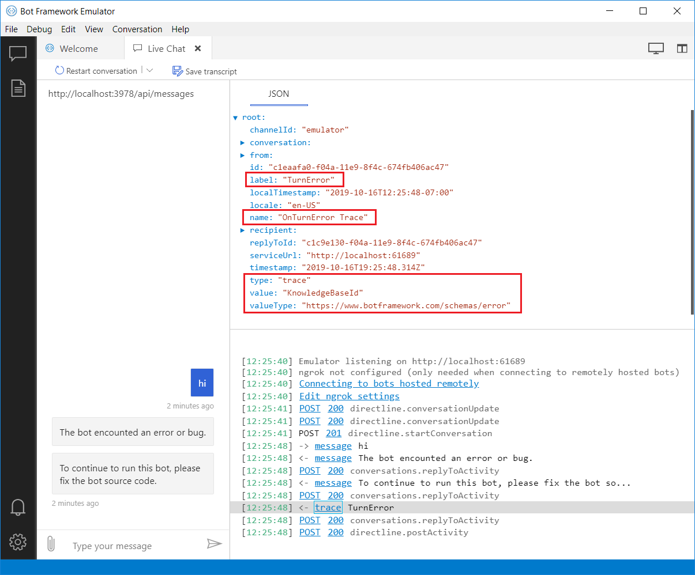

# Add trace activities to your bot

[!INCLUDE[applies-to](../includes/applies-to.md)]

<!-- What is it and why use it -->

A _trace activity_ is an activity that your bot can send to the Bot Framework Emulator.
You can use trace activities to interactively debug a bot, as they allow you to view information about your bot while it runs locally.

<!-- Details -->

Trace activities are sent only to the Emulator and not to any other client or channel.
The Emulator displays them in the log but not the main chat panel.

- Trace activities sent via the turn context are sent through the _send activity handlers_ registered on the turn context.
- Trace activities sent via the turn context are associated with the inbound activity, by applying the conversation reference, if there was one.
  For a proactive message, the _reply to ID_ will be a new GUID.
- Regardless of how it is sent, a trace activity never sets the _responded_ flag.

## To use a trace activity

In order to see a trace activity in the Emulator, you need a scenario in which your bot will send a trace activity, such as throwing an exception and sending a trace activity from the adapter's on turn error handler.

To send a trace activity from your bot:

1. Create a new activity.
   - Set its _type_ property to "trace". This is required.
   - Optionally set its _name_, _label_, _value_, and _value type_ properties, as appropriate for the trace.
1. Use the _turn context_ object's _send activity_ method to send the trace activity.
   - This method adds values for the remaining required properties of the activity, based on the incoming activity.
     These include the _channel ID_, _service URL_, _from_, and _recipient_ properties.

To view a trace activity in the Emulator:

1. Run the bot locally on your machine.
1. Test it using the Emulator.
   - Interact with the bot and use the steps in your scenario to generate the trace activity.
   - When your bot emits the trace activity, the trace activity is displayed in the Emulator log.

Here is a trace activity you might see if you ran the Core bot without first setting up the QnAMaker knowledge base that the bot relies upon.



## Add a trace activity to the adapter's on-error handler

The adapter's _on turn error_ handler catches any otherwise uncaught exception thrown from the bot during a turn.
This is a good place for a trace activity, as you can send a user-friendly message to the user and send debugging information about the exception to the Emulator.

This example code is from the **Core Bot** sample. See the complete sample in [**C#**](https://aka.ms/cs-core-sample) or [**JavaScript**](https://aka.ms/js-core-sample) or [**Python**](https://aka.ms/py-core-sample).

# [C#](#tab/csharp)

The **SendTraceActivityAsync** helper method defined in this sample sends exception information to the Emulator as a trace activity.

**AdapterWithErrorHandler.cs**

[!code-csharp[SendTraceActivityAsync](~/../BotBuilder-Samples/samples/csharp_dotnetcore/13.core-bot/AdapterWithErrorHandler.cs?range=16-51&highlight=33-34)]

# [JavaScript](#tab/javascript)

The adapter's **onTurnError** handler creates the trace activity to include the exception information and sends it to the Emulator.

**index.js**

[!code-javascript[onTurnError ](~/../BotBuilder-Samples/samples/javascript_nodejs/13.core-bot/index.js?range=35-57&highlight=8-14)]

# [Python](#tab/python)

The adapter's **on_error** handler creates the trace activity to include the exception information and sends it to the Emulator.
```python
async def on_error(context: TurnContext, error: Exception):
...

if context.activity.channel_id == "emulator":

# Create a trace activity that contains the error object
trace_activity = Activity(
    label="TurnError",
    name="on_turn_error Trace",
    timestamp=datetime.utcnow(),
    type=ActivityTypes.trace,
    value=f"{error}",
    value_type="https://www.botframework.com/schemas/error",
)

# Send a trace activity, which will be displayed in Bot Framework Emulator
await context.send_activity(trace_activity)

...
```
---

## Additional resources

- How to [Debug a bot with inspection middleware](../bot-service-debug-inspection-middleware.md) describes how to add middleware that emits trace activities.
- For debugging a deployed bot, you can use Application Insights. For more information, see [Add telemetry to your bot](bot-builder-telemetry.md).
- For detailed information about each activity type, see the [Bot Framework Activity schema](https://aka.ms/botSpecs-activitySchema).
