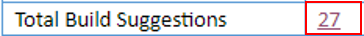
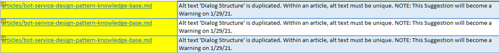
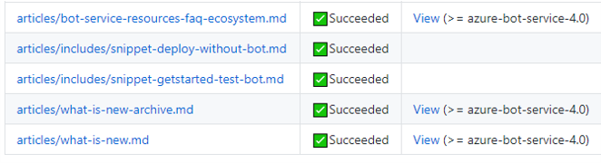

# Frequent asked questions

Contains a list of frequent asked questions that writers might have when going about their daily tasks. It is meant to be a living document, as more questions and answers are created. A quick reference before redirecting the writers to more in depth answers.

<hr/>

[A](#a) &MediumSpace; [B](#b) &MediumSpace; [C](#c) &MediumSpace; [D](#d) &MediumSpace; [E](#e) &MediumSpace;
[F](#f) &MediumSpace; [G](#g) &MediumSpace; [H](#h) &MediumSpace; [I](#i) &MediumSpace; [J](#j) &MediumSpace;
[K](#k) &MediumSpace; [L](#l) &MediumSpace; [M](#m) &MediumSpace; [N](#n) &MediumSpace; [O](#o) &MediumSpace;
[P](#p) &MediumSpace; [Q](#q) &MediumSpace; [R](#r) &MediumSpace; [S](#s) &MediumSpace; [T](#t) &MediumSpace;
[U](#u) &MediumSpace; [V](#v) &MediumSpace; [W](#w) &MediumSpace; [X](#x) &MediumSpace; [Y](#y) &MediumSpace; [Z](#z)

<hr/>

<a id="a"></a>
<a id="b"></a>
<a id="c"></a>
<a id="d"></a>
<a id="e"></a>
<a id="f"></a>

<a id="g"></a>

## GitHub

### How to fix a local repository that's out of sync?

If your copy of the GitHub repo is out of sync with the remote, follow the steps described in this article: [To make sure your local copy is completely in sync with the remote](github-tips-and-tricks.md#to-make-sure-your-local-copy-is-completely-in-sync-with-the-remote).

### What can I do to show my PR isn't ready to be merged?

- Make the PR a [draft pull request](https://github.blog/2019-02-14-introducing-draft-pull-requests/). Draft pull requests cannot be merged.
- Use one of the following labels that indicate a PR isn't ready to be merged:
    - **status: writing** (work in progress)
    - **DO NOT MERGE**

<a id="h"></a>
<a id="i"></a>
<a id="j"></a>
<a id="k"></a>

<a id="l"></a>

## Links

### When do I create reference-style links?

You can use **reference-style links** to make your source content easier to read. They are most useful when you repeatedly link to the same target. They are for convenience and readability (especially if the repeated target is long).

If the link text and the link target ID are the same, you can shorten the Markdown even further:

```markdown
Blah blah [unique link text][] blah blah.
```
<!--Reference links in article-->
[unique link text]: link-target

For more information, see [Reference-style links](https://review.docs.microsoft.com/help/contribute/links-how-to?branch=master#reference-style-links).

### How do I define link text?

- See link markdown rules described in this article: [Create-links-markdown](#create-links-markdown.md)
- In the footnote links definitions such as `[1]:bot-builder-concept-dialog.md` do not use numbers in the square brackets, but short text.

### How do I check for duplicate alternate text descriptions?

In Markdown, links can be made using the following formats:

- Link to a page: `[link name to display](link to the page)`.
- Link to an image: ``.

The strings in the square brackets, that is `link name to display` and `hidden name` are called **alternate text**.

> The **alternate text** must be **unique in a page**.

To find duplicate alternate text follow these steps:

1. In an active *Pull Request*, click the **build report** link.
1. In the **Total Build Suggestions** row, click the number in the related column.

    

1. In the page, search for **duplicate-alt-text**.
1. You can copy all the related rows, with relevant information, in an Excel page.

    

1. Finally, edit the duplicate alt text in the linked article.

### How to verify that deprecated links are fixed?

Sometimes you may need to fix links, like when they're obsolete. The examples below show how to verify different kinds of links.

#### Example 1

1. Wrong format: `https://aka.ms/azure-bot-subscribe-to-conversation-events)`.
1. Correct format: `/microsoftteams/platform/bots/how-to/conversations/subscribe-to-conversation-events`.

To verify that the links are fixed follow these steps:

1. In the PR page click the **Conversation** tab.
1. Search the most recent iteration of the `<article name>.md` file that has the links to be fixed.
1. Right click the **View** link and open the article in a new tab.
1. In the new tab, fix the link to the article by removing `review.` from the address. You get the current article containing the links to fix.
1. Find the link and verify that the fix you made works.

#### Example 2 - footnote links

1. Wrong format: `[prompts]:https://aka.ms/bot-builder-concept-dialog#prompts`.
1. Correct format: `[prompts]:bot-builder-concept-waterfall-dialogs.md#prompts`.

These kind of links, which are usually defined in the page footnote and are not visible, are slightly more difficult to verify. Follow these steps to verify footnote links:

1. In the PR page click the **Conversation** tab.
1. Search the most recent iteration of the `<article name>.md` file that has the links to be fixed.
1. Right click the **View** link and open the article in a new tab.
1. Right click the `<article name>.md` file and open the file in a new tab.
1. Click the **Raw** tab and search for the string that is in the square brackets. In the example it is `prompts`.
1. Find the place where it is used.
1. Go to the tab that contains the article find the place where the link is used and check if it works.

<a id="m"></a>

## Markdown

### When to include Markdown files?

Use include Markdown files *only if their content need to be repeated in multiple articles*. The include feature instructs the documentation build system to replace the reference with the content of the include file at build time. For more information, see [Included Markdown files](https://docs.microsoft.com/contribute/markdown-reference#included-markdown-files).

### How to remove unused include files?

When building your PR, you may notice that some include files do not have a *View* link. It's likely that they are not used anymore and have not been deleted from the repository.



Go ahead and delete them and rebuild the PR. It should not happen, but if you get broken links errors, put the include files back and investigate further.

### How to create FAQ content?

When you have frequently asked questions (FAQ) and answers about products, features, and services, you can use a *structured YAML template* to present the content. The purpose of using a structured YAML template is to align with a specific schema that Google has defined for FAQ pages. That schema provides better crawlability, ranking, and relevance in the search engine. For more information, see [Create FAQ content](https://review.docs.microsoft.com/en-us/help/contribute/contribute-how-to-faq-guide?branch=master).

Writing in YAML format can be a little tricky because you have to obey to strict rules such as proper spacing, positioning of keywords and so on. Below you can find a few trips and tricks that can alleviate the  task.

1. A YAML file has the `.yml` extension. It has this comment `### YamlMime:<your topic conventional name>` as its first line. For example `### YamlMime:FAQ`
1. Next you need to create the applicable metadata. The following is an example:
    ```yml
    metadata:
        title: # Required; page title displayed in search results. Include the brand. < 60 chars.
        description: # Required; article description that is displayed in search results. < 160 chars.
        ms.service: bot-service #Required; service per approved list. service slug assigned to your service by ACOM.
        ms.topic: # Required, one of the currently accepted values.
        author: #Required; your GitHub user alias, with correct capitalization.
        ms.author: #Required; microsoft alias of author; optional team alias.
        ms.date: #Required; mm/dd/yyyy format.
    ```
1. The metadata is followed by the **title** and **summary** information as shown in the example below.

    ```yml
    title: Bot Framework Ecosystem Frequently Asked Questions # < 60 chars
    summary: |
        This article answers commonly asked ecosystem questions.

        <!-- Attention writers!!
        1 - This article contains FAQs regarding Bot Framework Ecosystem.
        1 - When you create a new FAQ, please add the related link to the proper section in bot-service-resources-bot-framework-faq.yml.-->

    [!INCLUDE [applies-to-v4](includes/applies-to-v4-current.md)]
    ```

    > [!NOTE]
    > The keywords **metadata**, **title**, and **summary** must be alligned and start in the first column.
    > The content under them must be one tab in.

1. Finally you have the actual FAQs. You have two choices: one section or multiple sections. For actual examples, see the Bot Framework FAQ articles in Visual Studio cede.

    > [!WARNING]
    > Please, strictly follow the keywords and content alignment.

1. The following is a single section FAQ example:

    ```yml
    sections:
    - name: Ecosystem
        questions:
        - question: How do I enable the Emulator to connect to localhost while behind a corporate proxy?
            answer: |
            When developing a bot in a corporate environment, typically, the proxy will block the connection unless you specify that it should be bypassed for `localhost`.
            To do that on your local machine you must define the following environment variable :

            ```cmd
            NO_PROXY=localhost
            ```
            For more information, see [Configure proxy settings](bot-service-debug-emulator.md#configure-proxy-settings).

        - question: When will you add more conversation experiences to the Bot Framework?
            answer: |
            We plan on making continuous improvements to the Bot Framework, including additional channels, but cannot provide a schedule at this time.
            If you would like a specific channel added to the framework, [let us know][Support].
    ```

In the case of single section the **name** of the section (*Ecosystem* in the example) is ignored.

1. The following is a multiple sections FAQ example:

    ```yml
    sections:
        - name: Ecosystem 1
            questions:
                - question: How do I enable the Emulator to connect to localhost while behind a corporate proxy?
                answer: |
                    When developing a bot in a corporate environment, typically, the proxy will block the connection unless you specify that it should be bypassed for `localhost`.
                    To do that on your local machine you must define the following environment variable :

                    ```cmd
                    NO_PROXY=localhost
                    ```
                    For more information, see [Configure proxy settings](bot-service-debug-emulator.md#configure-proxy-settings).

                - question: When will you add more conversation experiences to the Bot Framework?
                answer: |
                    We plan on making continuous improvements to the Bot Framework, including additional channels, but cannot provide a schedule at this time.
                    If you would like a specific channel added to the framework, [let us know][Support].
        - name: Ecosystem 2
            questions:
                - question: I have a communication channel I'd like to be configurable with Bot Framework. Can I work with Microsoft to do that?
                answer: |
                    We have not provided a general mechanism for developers to add new channels to Bot Framework, but you can connect your bot to your app via the [Direct Line API][DirectLineAPI].
                    If you are a developer of a communication channel and would like to work with us to enable your channel in the Bot Framework [we'd love to hear from you][Support].

                - question: If I want to create a bot for Microsoft Teams, what tools and services should I use?
                answer: |
                    The Bot Framework is designed to build, connect, and deploy high quality, responsive, performant and scalable bots for Teams and many other channels.
                    The SDK can be used to create text/sms, image, button and card-capable bots (which constitute the majority of bot interactions today across conversation experiences)
                    as well as bot interactions which are Teams-specific such as rich audio and video experiences.
                    If you already have a great bot and would like to reach the Teams audience, your bot can easily be connected to Teams (or any supported channel) via the Bot Framework
                    for REST API (provided it has an internet-accessible REST endpoint).

    ```
1. At the end of the FAQs you can also have additional content. The following is an example:

    ```yml
    additionalContent: |
    ## References
    - [Essential Migration Guidance](./v4sdk/migration/migration-overview.md)
    - Primary V4 Repositories to develop Bot Framework bots
        - [Botbuilder for dotnet](https://github.com/microsoft/botbuilder-dotnet)
        - [Botbuilder for JS](https://github.com/microsoft/botbuilder-js)
    - QnA Maker Libraries were replaced with the following V4 libraries
        - [Libraries for dotnet](https://github.com/Microsoft/botbuilder-dotnet/tree/master/libraries/Microsoft.Bot.Builder.AI.QnA)
        - [Libraries for JS](https://github.com/Microsoft/botbuilder-js/blob/master/libraries/botbuilder-ai/src/qnaMaker.ts)
    - Azure Libraries were replaced with the following V4 libraries
        - [Botbuilder for JS Azure](https://github.com/Microsoft/botbuilder-js/tree/master/libraries/botbuilder-azure)
        - [Botbuilder for dotnet Azure](https://github.com/Microsoft/botbuilder-dotnet/tree/master/libraries/Microsoft.Bot.Builder.Azure)
    ```

<a id="n"></a>
<a id="o"></a>
<a id="p"></a>
<a id="q"></a>
<a id="r"></a>

<a id="s"></a>

## Sentences

### How do I use the word "we"?

The use of **we** is discouraged. Instead, focus on the customer, and avoid making Microsoft the subject.
For more information, see [WE](https://docs.microsoft.com/en-us/style-guide/a-z-word-list-term-collections/w/we).

### How do I use verbs?

Using verbs correctly helps you write clear and simple sentences. The present tense is often easier to read and understand than the past or future tense. It’s the best choice for most content. For more information, see [Verbs](https://docs.microsoft.com/en-us/style-guide/grammar/verbs).

<a id="t"></a>
<a id="u"></a>
<a id="v"></a>
<a id="w"></a>
<a id="x"></a>
<a id="y"></a>
<a id="z"></a>

## References

- [How to Write Good](https://www.plainlanguage.gov/resources/humor/how-to-write-good/)
- [Federal plain language guidelines](https://www.plainlanguage.gov/guidelines/)
- [Contributor Guide](https://review.docs.microsoft.com/help/contribute/?branch=master)
- [Create FAQ content](https://review.docs.microsoft.com/en-us/help/contribute/contribute-how-to-faq-guide?branch=master)
