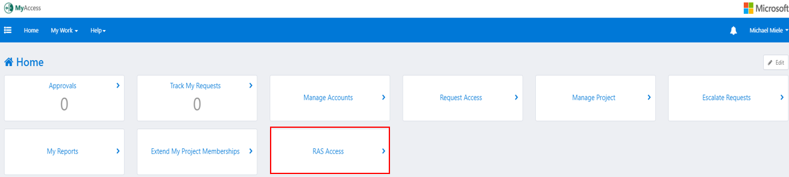
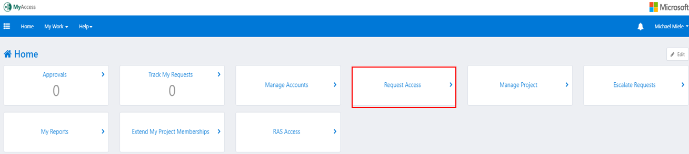
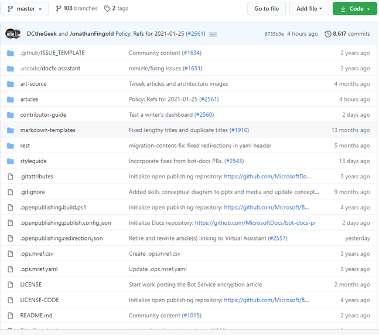

# Writer's help

## Onboarding for new writers

**WARNING**.
If you are working **without MS credentials, you will not have access to RAS, MyAccess, and a few other MS sites and services**.

### Getting started

1. **Set up 2-factor (multi-factor) authentication**.
    1. If working remotely, this will be set up for you as part of joining your laptop to the domain.
    1. Otherwise, visit the CSWeb **Identity & Authentication** page for [phone authentication](https://microsoft.sharepoint.com/sites/Identity_Authentication/SitePages/PhoneAuth/Registration.aspx).

1. **Request remote (RAS) access**.
    1. In your Edge browser, navigate to [MyAccess](https://myaccess/identityiq/home.jsf).
    1. Select **RAS Access** and follow the instructions.

       

1. **Request group access**.
    1. In your Edge browser, navigate to [MyAccess](https://myaccess/identityiq/home.jsf)
    1. Select **Request Access** and request access to the following groups:
        1. Project: **Bot Framework Non-FTE**, permissions: Bot Framework Non-FTE.
        1. Optionally, Project: **CEAPEX Work Items Access**, permissions: read/write. You'll need this to open and view onboarding requests (for publishing ref docs).

        

### Basic tools

1. **VS Code** from this location: http://code.visualstudio.com. Add the **Docs Authoring Pack** extension. For more information, see [Install Visual Studio Code extensions](https://review.docs.microsoft.com/en-us/help/contribute/contribute-get-started-setup-tools?branch=master#install-visual-studio-code-extensions).

1. **Microsoft Teams** from this location: http://teams.microsoft.com. (fix)
    1. The documentation team uses Microsoft Teams for miscellaneous artifacts.  The writers should contact their agency's tech support if they need help installing or accessing Teams. Once granted access, you'll be able to browse (and manage) content.

1. Optionally, download and install VS 2019 or later version with these workloads. (This will take at least an hour.)
    1. Web & Cloud: ASP.NET and web development, Azure development, Python development, Node.js development.
    1. Desktop & Mobile: .NET desktop development.
    1. Other tool sets: Visual Studio extension development, .NET Core cross-platform development.

1. **Git**, and optionally, your favorite **Git client**. GitHub Desktop is a good choice for beginners and includes Git.
    1. Add Git extensions to VS and VS Code, as applicable.

1. [aka/Redirection](https://redirectiontool.trafficmanager.net/am/redirection/home?options=host:aka.ms). View and create **aka** links.

1. Optionally, MS Office desktop if you're on corpnet. The writers' agency should provide an Office 365 account.

1. [Docs portal](https://ops.microsoft.com/#/login). Find links to contributor guide, onboarding and admin guide, docs support team, portal help.

1. [Broken link report in Docs Portal](https://review.docs.microsoft.com/en-us/help/contribute/broken-link-report?branch=master). A new broken link report is enabled on all repos that are live on Docs. The report is available through the Docs Portal. Any user with Read permissions for a repo can view the broken link report for that repo. (doc)

<!-- 1. http://skyeyereports.cloudapp.net/home.?? Provides analytics about our docs including stuff like page views, CSAT ratings, verbatims, etc.-->

### Additional tools

|Tool |Description|
|:---|:---|
|[Notepad++](https://notepad-plus-plus.org/downloads/)|Editing tool and more|
|[Irfanview](https://www.irfanview.com/)|Fast, compact and innovative graphic viewer|
|[Screen to Gif](https://www.screentogif.com/)|Screen, webcam and sketch-board recorder with an integrated editor|
|[Nomnoml](https://nomnoml.com/)|A tool for drawing UML diagrams based on syntax with customizable styling|
|[Snip & Sketch](https://www.microsoft.com/en-us/p/snip-sketch/9mz95kl8mr0l?activetab=pivot:overviewtab)|Quickly annotate screenshots, photos and other images with your pen, touch, or mouse and save, paste or share with other apps|

### Set work environment and tools

#### Set GitHub

1. If you don't have an account that you'd like to use for this, create a new GitHub account at http://github.com.
1. Set up **2-factor authentication** on your GitHub account (**Settings/Account Security**).
1. At https://repos.opensource.microsoft.com.
    1. Join the **MicrosoftDocs** and **Microsoft** GitHub orgs.
    1. Join the **Microsoft/bot-framework-docs** and **MicrosoftDocs/bot-docs-team** GitHub teams. Kamran may need to do this bit for you.
1. Add your full name, Microsoft as the company, and a picture of yourself to your GitHub profile (**Settings/Profile**).
1. Email Kamran Iqbal your GitHub username to let him know you are in the GitHub orgs so he can add you to teams.

For more information, see [Setup a GitHub account](https://review.docs.microsoft.com/en-us/help/contribute/contribute-get-started-setup-github?branch=master).

#### Set local environment

1. If you have not done it yet, download and install Visual Studio Code at http://code.visualstudio.com.
1. Download and install Git here: https://desktop.github.com/
    1. If you are a pro user of git, use whichever Git client you like.
1. Verify that you have access to Bot Framework project board at [BFDocs board stories](https://fuselabs.visualstudio.com/BFDocs/_backlogs/board/Stories)

### Where is the documentation?

We have two main private content repos for the Bot Framework docs, and a number of others for intermediate files for the reference documentation, as well as a couple of public repositories for users to open issues in. You will need to be a member of the **MicrosoftDocs GitHub** organization before you can access the private repositories.

#### Clone the documentation

1. After you receive confirmation that you are in the MicrosoftDocs github organization, clone the repo from https://github.com/MicrosoftDocs/bot-docs-pr/.
1. Review the contributor guide and keep it handy. https://github.com/MicrosoftDocs/bot-docs-pr/tree/master/contributor-guide
1. Review the style guide and the Markdown template for new articles in the bot-docs-pr repo:
    1. style guide:  https://github.com/MicrosoftDocs/bot-docs-pr/tree/master/styleguide
    1. Markdown template:  https://github.com/MicrosoftDocs/bot-docs-pr/blob/master/markdown-templates/markdown-template-for-new-articles.md.
1. We write our documentation in **Markdown** using **VS Code**.  For information about markdown see:
    1. [Docs Markdown reference](https://docs.microsoft.com/en-us/contribute/markdown-reference) on Microsoft contributor guide.
    2. [Markdown Viewer / Browser Extension](https://github.com/simov/markdown-viewer) on GitHub.

#### Primary writing repositories for our team

|Repository |Description|
|:---|:---|
|https://github.com/MicrosoftDocs/bot-docs-pr|Private repo for SDK docs|
|https://github.com/MicrosoftDocs/bot-docs|Public repo for issues against the SDK docs|
|https://github.com/MicrosoftDocs/composer-docs-pr|Private repo for Composer docs|
|https://github.com/MicrosoftDocs/composer-docs|Public repo for issues against the Composer docs|
|https://github.com/Kaiqb/experiment/tree/master/BotDocs_Tools/GitTools|Kamran's experimental repo|

The **bot-docs-pr** repository has the following structure:

Please, view repository [README](https://github.com/MicrosoftDocs/bot-docs-pr/blob/master/README.md) file to understand the various elements that make up this repository.

## API reference documentation

The SDK API reference documentation differs from the conceptual one. It is created from the code comments written by the development team and contained in the various  language related SDK packages (NuGet, npm, PyPi, etc.).

The following are the steps to create the API reference documentation:

1. The documentation team opens a request with the publishing team to build the reference documentation based on a list of packages. To open a request, this [onboarding request](https://aka.ms/publish-on-docs/reference) form must be filled and submitted. See [Create an onboarding request](#create-an-onboarding-request) for details.
1. The publishing team builds the reference documentation and posts it to the publishing review site.
1. If for some reason the docs can't be built, the publishing team notifies the documentation team to fix the problem so a fixed set of packages can be published.
1. Once the documentation team signs off on the build, the publishing team pushes it live. Until then, the live docs site will continue to show content from the previous release.

### Create an onboarding request

In the form enter the following:

1. What is the name and version of SDK or API you would like reference content published on docs.microsoft.com? - **Bot Framework SDK**.
1. Is this for a preview release of your API? Required to answer. Yes/No
1. What is your `ms.service` or `ms.product` value? Please enter "ms.prod: <your value>" or "ms.service: <your value>"  - **bot-service**.
1. What organization is your product in? - **Other/Unsure**.
1. Do you have a planned release date that we need to coordinate with? - **No, please make content available as soon as possible**
1. These languages are supported by the Reference Onboarding Team. Which Languages are you intending to publish? - Depending on the language, enter; **?  .NET.** or **Javascript/Typescript**, or **Python** or **Java**.
1. For JavaScript, Node, or TypeScript onboarding, please provide the URL to your npm package from [npmjs.com](http://npmjs.com/) or from another private unauthenticated registry. See https://www.nuget.org/.
1. Then provide the complete list of packages and versions for the specific language.
1. Do you need Monikers created or updated for this release? - **No or Unsure**.
1. Please provide additional contacts to be included in follow-up emails we need to send. - Enter your email, the manager's email and another writer's email.
1. Any other notes or comments or context that you have? For example: *We are replacing the content labeled 4.0 with content from the 4.7 packages*.

To search for the latest onboarding request:

1. Navigate to https://ceapex.visualstudio.com/Onboarding/_workitems/recentlyupdated/.
1. In the search box enter *Bot Framework SDK*.
1. Select the onboarding request.

For more information, see [Reference Onboarding](https://review.docs.microsoft.com/en-us/help/onboard/reference?branch=master).

### Secondary repositories

The following are intermediate reference documentation archives used by the publishing team to generate API reference documentation during an on-boarding request.

|Repository |Description|
|:---|:---|
|https://github.com/MicrosoftDocs/botbuilder-docs-sdk-dotnet|.NET/C#|
|https://github.com/MicrosoftDocs/botbuilder-docs-sdk-java/|Java|
|https://github.com/MicrosoftDocs/botbuilder-docs-sdk-python|Python|
|https://github.com/MicrosoftDocs/botbuilder-docs-sdk-typescript|Node.js/TypeScript/JavaScript|

## Related repositories

|Repository |Description|
|:---|:---|
|https://github.com/MicrosoftDocs/msteams-docs|Public repo for issues against the Teams docs |

## Guides

|Location |Description|
|:---|:---|
|https://styleguides.azurewebsites.net|MS Style guides|
|https://review.docs.microsoft.com/help/contribute/?branch=master|Docs contributor guide|
|https://review.docs.microsoft.com/help/onboard/?branch=master|Reference Onboarding|

## Links

|Location |Description|
|:---|:---|
|https://docs.microsoft.com/azure/bot-service/|Bot Framework documentation portal|
|https://dev.botframework.com/|Microsoft Bot Framework development portal|
|https://github.com/MicrosoftDocs/bot-docs-archive-pr|Archived documentation articles|

|Repository |Description|
|:---|:---|
|https://github.com/Microsoft/BotBuilder|Bot Framework SDK for building conversation applications or bots.|
|https://github.com/Microsoft/BotBuilder-Samples/|Bot builder samples also used in the docs|
|https://ops.microsoft.com/#/sites/Docs/docsets/bot-framework?tabName=builds|Docs build portal|
|https://fuselabs.visualstudio.com/BFDocs/_backlogs/board/Stories|Bot Framework Docs board stories (tracks work items)|
|https://mseng.visualstudio.com/_projects|This is the site to log bugs or work items that publishing/production team needs to do. Use it to get help on conflicts between branches etc.|
