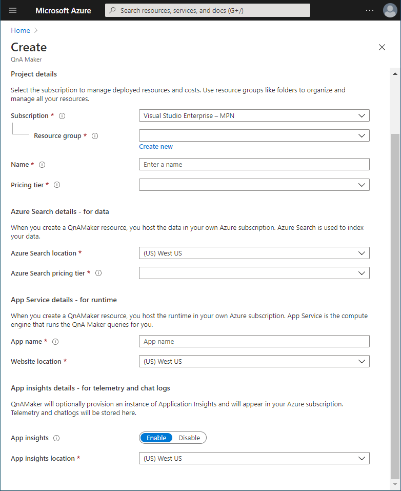
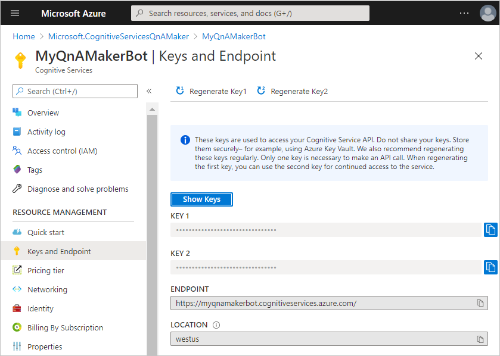
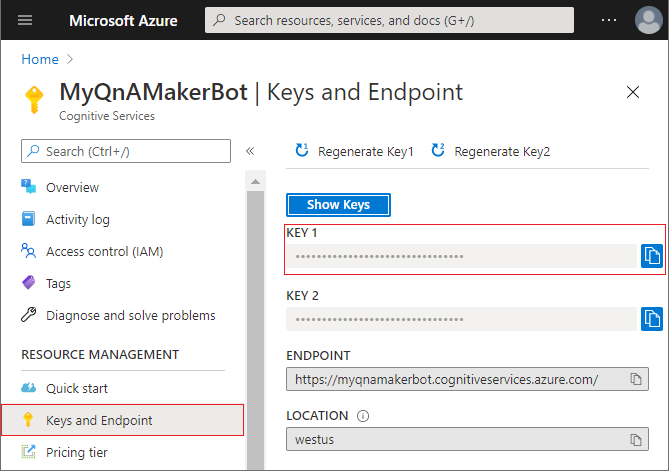
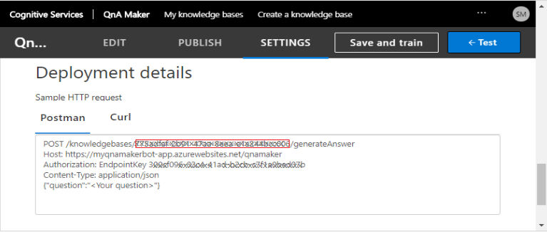
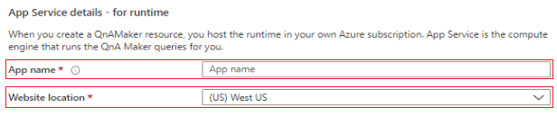
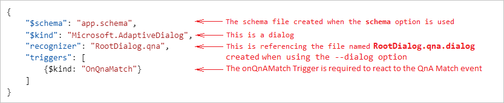

# Deploy QnA Maker knowledge base using the Bot Framework qnamaker CLI commands

[!INCLUDE [applies-to-v4](../includes/applies-to-v4-current.md)]

The Bot Framework Command Line Interface (CLI) lets you automate the management of QnA Maker knowledge base (KB). It lets you create, update, and delete QnA Maker KB from the command line or a script. This article explains how to deploy QnA Maker KB to a QnA Maker KB in Azure.

## Prerequisites

- Basic understanding of [QnA Maker][qna-overview].
- Knowledge of the [.qna file format][qna-file-format].
- Have a bot project with .qna files.
- If working with adaptive dialogs, you should have an understanding of:
  - [Natural Language Processing in adaptive dialogs][natural-language-processing-in-adaptive-dialogs].
  - how the [QnA Maker recognizer][qna-maker-recognizer] is used.

## Using the qnamaker CLI commands to enable QnA Maker in your bot

This article describes how to perform some common tasks used to deploy a QnA Maker KB using the Bot Framework CLI.

- [Deploy QnA Maker knowledge base using the Bot Framework qnamaker CLI commands](#deploy-qna-maker-knowledge-base-using-the-bot-framework-qnamaker-cli-commands)
  - [Prerequisites](#prerequisites)
  - [Using the qnamaker CLI commands to enable QnA Maker in your bot](#using-the-qnamaker-cli-commands-to-enable-qna-maker-in-your-bot)
  - [Create Azure AI QnA Maker resource](#create-azure-ai-qna-maker-resource)
  - [Install the Bot Framework CLI](#install-the-bot-framework-cli)
  - [Create your QnA Maker initialization file](#create-your-qna-maker-initialization-file)
  - [Create your QnA Maker model](#create-your-qna-maker-model)
  - [Create your QnA Maker knowledge base](#create-your-qna-maker-knowledge-base)
  - [Test your QnA Maker knowledge base](#test-your-qna-maker-knowledge-base)
  - [Publish your QnA Maker knowledge base](#publish-your-qna-maker-knowledge-base)
  - [Create a QnA Maker knowledge base and publish it to production using the build command](#create-a-qna-maker-knowledge-base-and-publish-it-to-production-using-the-build-command)
    - [How to use the build command](#how-to-use-the-build-command)
      - [The qnamaker:build parameters](#the-qnamakerbuild-parameters)
      - [The qnamaker configuration file](#the-qnamaker-configuration-file)
    - [QnA and multiple language variations](#qna-and-multiple-language-variations)
    - [QnA Maker Knowledge Bases created](#qna-maker-knowledge-bases-created)
    - [The settings file generated using the build command](#the-settings-file-generated-using-the-build-command)
    - [The dialog file](#the-dialog-file)
  - [Additional information](#additional-information)

Once your bot project's QnA Maker KB .qna files have been created, you are ready to follow the steps outlined in this article to create your QnA Maker KB. If you do not have a project with QnA Maker KB .qna files, you can use the [QnAMaker][qna-maker-sample]. See the sample repository's `README` for information on [Getting the samples][getting-the-samples].

## Create your Azure AI QnA Maker resource

The QnA Maker resource is an [Azure AI services][ai-services-overview] resource that you create using Azure's [Create Azure AI services][create-ai-services] page. This provides the security keys and endpoint needed to access your QnA Maker KB in Azure.

1. Go to the Azure [Create Azure AI services][create-ai-services] page.
2. Enter values for each of the fields, then select the **Review + create** button.

   

    > [!NOTE]
    > When entering the **Resource Group** and **Name**, keep in mind that you cannot change these values later. Also note that the value you give for **Name** will be part of your **Endpoint URL**.

3. Review the values to ensure they are correct, then select the **Create** button.

The QnA Maker resource includes information your bot will use to access your QnA Maker knowledge base:

- **Keys**. These are called _subscription keys_ and are auto generated. You will need the subscription key when referencing your QnA Maker resource for any action, such as when creating or updating your QnA Maker KB which will be detailed in this article. You can find the keys in the **Keys and Endpoint** blade in your QnA Maker resource.
- **Endpoint**. This is auto-generated using the QnA Maker resource name that you provide when creating it. It has the following format: `https://<qnamaker-resource-name>.cognitiveservices.azure.com/`. When referencing your QnA Maker resource for any action, such as when creating your QnA Maker KB which will be detailed in this article. You can find the key in the **Keys and Endpoint** blade in your QnA Maker resource. 

    > [!TIP]
    >
    > It is important to understand the difference between this QnA Maker resource authoring endpoint which is referenced in all BF CLI qnamaker authoring commands and the QnA Maker Knowledge base endpoint key which is referenced in a source code configuration files such as appsettings.json in C#, or `.env` in JavaScript or `config.py` in Python.

- **Location**. This is the Azure region that contains your QnA Maker KB. You select this when creating the QnA Maker resource.

   

## Install the Bot Framework CLI

If you have already installed the Bot Framework CLI you can skip ahead to [Create your QnA Maker model](#create-your-qna-maker-model).

[!INCLUDE [applies-to-v4](../includes/install-bf-cli.md)]

## Create your QnA Maker initialization file

The Bot Framework CLI provides a mechanism to store all commonly used parameter values in an initialization file. Once this file is created, every `qnamaker` command you run will check this file for the required values if they are not included in the command line. If you do supply that parameter's value, it will override the value in the init file.

You create this init file using the `qnamaker:init` command. This will create a JSON file containing the data that is required when running many of the QnAMaker BF CLI commands, including _subscriptionKey_, _kbId_, _endpointKey_ and _hostname_.

> [!NOTE]
>
> Since you have not yet created your QnA Maker KB, you will not be able to provide the KB ID when prompted for it. That will result in an init file that is missing a value for `kbId` as well `hostname`. These values will be added automatically when you create your QnA Maker KB when you include the `--save` option when running the command.

The command to create the qnamaker init file:

``` cli
bf qnamaker:init
```

To create the QnA Maker CLI init file:

1. From your console, enter `bf qnamaker:init`
1. You will be prompted for the subscription key to your Azure AI QnA Maker resource in Azure. You can find this in the _Keys and Endpoint_ blade:

    

1. Next you will be prompted for your knowledge base ID (`kbId`). Since you have not yet created your QnA Maker KB, enter **none**.
1. The values are gathered and written out to the screen for you to verify. If correct type `yes` or just press the **Enter** key.
1. The file is then created and saved to _C:\Users\\\<unsername>\AppData\Local\@microsoft\botframework-cli\config.json_. Since this file contains sensitive data it is not saved in the same directory as your bot's project files to prevent it from being checked into any potentially unsecured location when checking in your source code.

> [!TIP]
> When you enter a `bf qnamaker` CLI command, it will automatically look for the _subscriptionKey_, _kbId_, _endpointKey_ and _hostname_ values in this init file unless you include them when entering the command, at which point the values entered will override the values from the init file.

For additional information on using this command, see [`bf qnamaker:init`][bf-qnamakerinit] in the BF CLI QnA Maker `README`.

> [!IMPORTANT]
>
> The commands explained in this article assume that you have an init file. If you do not have an init file, you will have to include those values when executing each command.

## Create your QnA Maker model

Once you have created the individual .qna files for your bot, you can convert them into a single _QnA Maker model_ using the `qnamaker:convert` command. The QnA Maker model is a JSON file used to create a QnA Maker KB.

To create your QnA Maker model:

``` cli
bf qnamaker:convert -i <input-folder-name> -o <output-folder-name> --name <QnA-KB-Name> -r
```

For example, the command `bf qnamaker:convert -i dialogs -o output --name MyQnAMakerBot -r` will recursively search for all .qna files in the _dialogs__ directory and any subdirectories and merge them into a single file named **converted.json** in the _output_ directory. This JSON file will contain all of the information needed to create a QnA Maker KB, including the name _MyQnAMakerBot_ which will be the name of the QnA Maker knowledge base that will exist in Azure.

For additional information on using this command, see [`bf qnamaker:convert`][bf-qnamakerconvert] in the BF CLI QnA Maker `README`.

## Create your QnA Maker knowledge base

The _QnA Maker resource_ you perviously created consists of two subscription keys and an endpoint. These are values that you need when creating your QnA Maker KB (QnA Maker KB). You can have multiple QnA Maker KBs associated with a single QnA Maker resource, each QnA Maker KB will have its own ID, named `kbId`. This value will be returned as a part of the creation process. You will need this ID when referring to this QnA Maker KB in the future. This QnA Maker KB provides your bot with all functionality provided by QnA Maker.

To create your QnA Maker KB:

``` cli
bf qnamaker:kb:create --in <QnA-Maker-model-JSON-file> --name <QnA-Maker-kb-name>
```

> [!NOTE]
>
> - The input file for this command is the file that is created by running the `qnamaker:convert` command as discussed in the previous step. The filename is **converted.json** by default.
> - The `name` option is the name of the QnA Maker KB and is optional if the QnA Model JSON file has a value for the name property, otherwise it will be required.

For additional information on using this command, see [`bf qnamaker:kb:create`][bf-qnamakerkbcreate] in the BF CLI QnA Maker `README`.

## Test your QnA Maker knowledge base

There are no BF CLI qnamaker commands available to test your KB, however you can [Test knowledge base with batch questions and expected answers][batch-testing].

If you plan to create scripts to automate this process from end to end, this will enable you to include testing.

## Publish your QnA Maker knowledge base

Newly created QnA Maker KBs are automatically published to the _test_ endpoint where it can be tested prior to it going live. For general information about testing your KB, see [Test your knowledge base in QnA Maker][test-knowledge-base].

Once tested you can use the `qnamaker:kb:publish` to publish it to the _production_ endpoint.

To publish your QnA Maker knowledge base:

``` cli
bf qnamaker:kb:publish
```

To publish your QnA Maker KB if you do not have an [init file](#create-your-qna-maker-initialization-file) file:

``` cli
bf qnamaker:kb:publish --subscriptionKey <Subscription-Key> --kbId <knowledge-base-id>
```

> [!TIP]
>
> If you have multiple QnA Maker KB's and want to publish one other than the one pointed to in the init file, you will need to provide the KB ID using the `--kbId` option:
>
> `bf qnamaker:kb:publish --kbId <knowledge-base-id>`
>
> You can find the knowledge base ID in [QnAMaker](https://www.qnamaker.ai/) in the _Deployment details_ section of the _SETTINGS_ page:
>
> 

<!-------------------------------------------------------------------------------------------------------------------------->
## Create a QnA Maker knowledge base and publish it to production using the build command

It is helpful to understand how the process of deploying a QnA Maker KB works, and after completing this article up to this point, you should have a better understanding of the processes involved to publish to your test or prod endpoint using the Bot Framework CLI commands.

Using these commands gives you flexibility when tailoring scripts to your specific needs. If this flexibility is not needed there is another BF CLI command that combines most of the commands discussed in this article into a single command that you can use to create or update, then train and publish a QnA Maker KB to the _production_ endpoint, and that is the `qnamaker:build` command.

The `build` command only publishes to the production endpoint. You can use it separately from the previous commands discussed in this article, as they are primarily used during the development process to publish to the test endpoint, where testing can take place before publishing to production.

The QnAMaker build command combines all the following actions into a single command:

1. Creates one QnA Maker model for [every locale](#qna-and-multiple-language-variations) found using your existing .qna files.
1. Creates a new QnA Maker KB if none exists, otherwise it will overwrite the existing KB.
1. It trains your QnA Maker KB then publishes it to the production endpoint.
1. If you include the optional `dialog` parameter, it will output the `.dialog` definition files that can be used by the [QnA Maker recognizer][qna-maker-recognizer] when developing using the [declarative approach][declarative]. This is explained in [The dialog file](#the-dialog-file) section.

### How to use the build command

The QnAMaker build command with its required parameters:

``` cli
bf qnamaker:build --in <input-file-or-folder> --subscriptionKey <Subscription-Key> --botName <bot-name>
```

> [!IMPORTANT]
>
> This command will overwrite your previous QnA Maker model as well any content you might have in your QnA Maker KB, including any content created directly in [QnA Maker.ai](https://www.qnamaker.ai/).

#### The qnamaker:build parameters

- `in`: The directory, including sub-directories, that will be searched for .qna files.
- `out`: The directory to save output files to. This includes all the recognizer files as well as the settings file, and optionally the dialog files. If you omit the `out` option, no files will be saved to disk and only the authoring keys and endpoint will be written to the console.
- `log`: A Boolean value that determines if a log is created during this process.
- `botName`: The name of your bot. This will be used to generate the name of the QnA Maker KB, this is explained in more detail in the [QnA Maker Knowledge Bases created](#qna-maker-knowledge-bases-created) section below.
- `subscriptionKey`: The same subscription key that is in your [initialization file](#create-your-qna-maker-initialization-file).

For information on additional parameters, see [bf qnamaker:build][bf-qnamakerbuild] in the BF CLI `README`.

Alternatively, you can include these required parameters in a configuration file and provide them via the `qnaConfig` parameter.

#### The qnamaker configuration file

The qnamaker configuration file is a JSON file that can contain any valid `qnamaker:build` option.

```json
{
  "in": "<location-of-qna-files>",
  "out": "<location-to-save-output-files>",
  "subscriptionKey": "<Enter-subscription-key-here>",
  "botName": "<Enter-botName-here>"
}
```

Once created all you need to do is reference it in your `qnamaker:build` command, for example:

``` cli
bf qnamaker:build --qnaConfig qnaConfig.json
```

### QnA and multiple language variations

Each [.qna file][qna-file-format] can have multiple language variations, one for each language supported.

The pattern for the .qna file name when language variants are used is as follows:

`<file-name>.<locale>.qna`

For example:

```qna
example.en-us.qna
example.fr-fr.qna
example.de-de.qna
etc.
```

In the above example, each one of the .qna files will result in one QnA Maker KB created for each of the languages.

> [!TIP]
>
> If the language cannot be determined from file name, then the value specified in the CLI parameter `--defaultCulture` will be used. If the CLI parameter `--defaultCulture` is missing, the language will default to `en-us`.

### QnA Maker Knowledge Bases created

To enable the scenario where multiple people are working with LUIS models and need to be able to work with them independently from each other while all being tied to the same source control, the `qnamaker:build` command creates the QnA Maker knowledge base using a combination of the value you proved as the `botName` parameter followed by the user name you are logged in as, then the locale followed by .qna.

The QnA Maker KB name:

`<botName>(<user-name>).locale.qna`

For example, if your botName is _MyProject_ and your username is _YuuriTanaka_, the names of your KBs would be as follows:

```qna
MyProject(YuuriTanaka).en-us.qna
MyProject(YuuriTanaka).fr-fr.qna
MyProject(YuuriTanaka).de-de.qna
```

> [!TIP]
>
> Including the username as part of the KB name enables multiple developers to work independently. This value is generated automatically, using the username of the person logged in, however you can override this using the `--suffix` option.

### The settings file generated using the build command

The output of `qnamaker:build` includes one settings file that contains the mapping to all of the QnA Maker knowledge bases, including the KB ID and hostname for each.

The QnA Maker KB settings file:

`qnamaker.settings.<app-name>.<website-location>.json`

For example the settings file for user _YuuriTanaka_ targeting region _westus_ is named:

**qnamaker.settings.YuuriTanaka.westus.json**

Example settings file:

```json
{
    "qna": {
        "RootDialog_en_us_qna": "<knowledge-base-ID-for-en-us-locale>",
        "RootDialog_fr_fr_qna": "<knowledge-base-ID-for-fr-fr-locale>",
        "hostname": "https://<app-name>.azurewebsites.net/qnamaker"
    }
}
```

> [!TIP]
>
> The _website-location_ portion of the file name, as well as the _app-name_ portion of the file name and hostname value in the file, both come from the values given when [creating the QnA Maker resource in Azure](#create-your-qna-maker-resource-in-azure-cognitive-services), in the _App Service details - for runtime_ section.
>
> 

### The dialog file

When you use the optional `--dialog` option, a dialog file will be generated for all language variations of each of your .qna files.

> [!IMPORTANT]
>
> The `--schema` option is used in conjunction with the `--dialog` option. Including the `--schema` option will ensure that every dialog file created will have a reference to the projects root schema file. This schema file contains the schemas of all the components that are consumed by your bot. Every consumer of declarative files, including [Composer][composer], needs a schema file. If your project does not have a schema file you can generate one using the `dialog:merge` command. You will need to run this command before running the `luis:build` command. For additional information refer to the article on [Using declarative assets in adaptive dialogs][dialog-merge-command].

The qnamaker:build dialog and schema parameters:

- **dialog**. There are two valid values for the dialog option, `multiLanguage` and `crosstrained`.
- **schema**. This takes a relative path and filename pointing to the bot's schema file.

 These files will be written to the directory specified in the `out` option. For example:

```
 ./rootDialog/RootDialog.qna.dialog <-- MultiLanguageRecognizer configured to use all of the languages
 ./rootDialog/RootDialog.en-us.qna.dialog <-- QnARecognizer for en-us locale
 ./rootDialog/RootDialog.fr-fr.qna.dialog <-- QnARecognizer for fr-fr locale
```


Here is an example of the _MultiLanguageRecognizer_ file:

```json
{
    "$schema": "app.schema",
    "$kind": "Microsoft.MultiLanguageRecognizer",
    "id": "QnA_RootDialog",
    "recognizers": {
        "en-us": "RootDialog.en-us.qna",
        "fr-fr": "RootDialog.fr-fr.qna",
        "": "RootDialog.en-us.qna"
    }
}
```

You will use these files if you are using the declarative approach to developing your bot, and you will need to add a reference to this recognizer in your adaptive dialogs `.dialog` file. In the following example the `"recognizer": "RootDialog.qna"` is looking for the recognizer that is defined in the file **RootDialog.qna.dialog**:

 

See [Using declarative assets in adaptive dialogs][declarative] for more information.

## Additional information

- How to [Create customized lists of synonyms for your QnA Maker knowledge base](bot-builder-howto-bf-cli-alterations-qna.md)

<!-------------------------------------------------------------------------------------------------->
[qna-overview]: /azure/ai-services/qnamaker/overview/overview
[ai-services-overview]: /azure/ai-services/
[create-ai-services]: https://portal.azure.com/#create/Microsoft.CognitiveServicesQnAMaker
[qna-maker-recognizer]: bot-builder-concept-adaptive-dialog-recognizers.md#qna-maker-recognizer
[qna-file-format]: ../file-format/bot-builder-qna-file-format.md
[natural-language-processing-in-adaptive-dialogs]: bot-builder-concept-adaptive-dialog-recognizers.md#introduction-to-natural-language-processing-in-adaptive-dialogs
[bf-qnamakerconvert]: https://github.com/microsoft/botframework-cli/tree/main/packages/cli#bf-qnamakerconvert
[bf-qnamakerkbcreate]: https://github.com/microsoft/botframework-cli/tree/main/packages/cli#bf-qnamakerkbcreate
[bf-qnamakerinit]: https://github.com/microsoft/botframework-cli/tree/main/packages/cli#bf-qnamakerinit
[bf-qnamakerbuild]: https://github.com/microsoft/botframework-cli/tree/main/packages/cli#bf-qnamakerbuild
[dialog-merge-command]: bot-builder-concept-adaptive-dialog-declarative.md#the-merge-command
[test-knowledge-base]: /azure/ai-services/QnAMaker/how-to/test-knowledge-base
[batch-testing]: /azure/ai-services/QnAMaker/quickstarts/batch-testing
[declarative]: bot-builder-concept-adaptive-dialog-declarative.md
[qna-maker-sample]: https://aka.ms/csharp-adaptive-dialog-07-qnamaker-sample
[getting-the-samples]: https://aka.ms/botbuilder-samples-repo#getting-the-samples
<!-------------------------------------------------------------------------------------------------->
