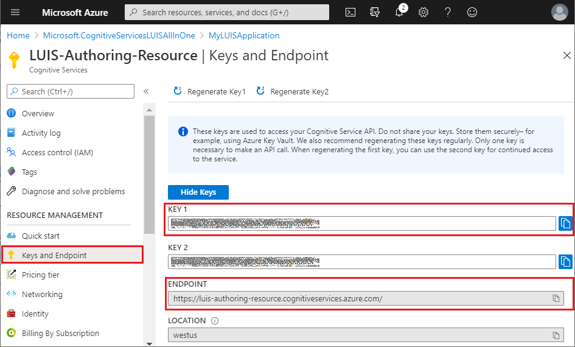

# Update LUIS resources using Bot Framework LUIS CLI commands

[!INCLUDE [applies-to-v4](../includes/applies-to-v4-current.md)]

The Bot Framework CLI lets you automate the management of LUIS resources. From a command line or a script, you can create, update, and delete LUIS properties.

This article explains how to update an existing LUIS resource. For information on getting started, and how to deploy your LUIS resources using the CLI, see how to [deploy LUIS resources using the Bot Framework LUIS CLI commands][how-to-deploy-using-luis-cli].

## Prerequisites

- Knowledge of [LU templates][lu-templates].
- A bot project with .lu files.
- If you're working with adaptive dialogs, you should have an understanding of:
  - [Natural language processing in adaptive dialogs][natural-language-processing-in-adaptive-dialogs].
  - [Language understanding in adaptive dialogs][language-understanding].
  - How the [LUIS recognizer][luis-recognizer] is used.

## Using the LUIS CLI commands to update the LUIS resources used in your bot

This article describes how to update your existing LUIS authoring resources in Azure using Bot Framework CLI. These instructions explain how to use LUIS application versions to backup your active LUIS application version before creating a new active version.

1. [Install the Bot Framework CLI](#install-bot-framework-cli)
1. [Get settings from your LUIS app](#get-settings-from-your-luis-app)
1. [Create your LUIS model](#create-your-luis-model)
1. [Delete backup version if it exists](#delete-a-backup-version-of-a-luis-model)
1. [Save current version as backup](#save-the-current-luis-model-version-as-a-backup)
1. [Import new version of LUIS model](#import-a-new-version-of-a-luis-model)
1. [Train your LUIS application](#train-your-luis-application)
1. [Publish your LUIS application](#publish-your-luis-application)
1. [Generate source code](#generate-source-code)

## Install Bot Framework CLI

[!INCLUDE [applies-to-v4](../includes/install-bf-cli.md)]

## Get settings from your LUIS app

You'll need your _LUIS application ID_ and _active version ID_ to update your LUIS resources. There are two ways you can get this information. This section explains both and when you would use each. Regardless of which approach you use, you'll need to have the subscription key and endpoint that your LUIS app is associated with. You can find this information in your _LUIS authoring resource_ in Azure, in the **Keys and Endpoint** blade.



If you know what your LUIS application ID is, but need to get the active version ID, you can use the `luis:application:show` command. This only returns information for the specified LUIS application.

``` cli
bf luis:application:show --appId <application-id> --endpoint <endpoint> --subscriptionKey <subscription-key>
```

For additional information on using this command, see [bf luis:application:show][bf-luisapplicationshow] in the Bot Framework CLI LUIS README.

If you don't know your LUIS application ID, you can use the [luis:application:list][bf-luisapplicationlist] command to get it, along with the active version ID. This command lists all LUIS apps that have been created in the specified LUIS authoring resource. The LUIS application ID is returned as `id` and the active version ID is returned as `activeVersion`.

``` cli
bf luis:application:list --endpoint <endpoint> --subscriptionKey <subscription-key>
```

For additional information on using this command, see [bf luis:application:list][bf-luisapplicationlist] in the Bot Framework CLI LUIS README.

## Create your LUIS Model

Anytime you make updates to any of the individual .lu files used in your project, you'll need to create a new LUIS model using the `luis:convert` command. You'll use this new model to update your LUIS application that's hosted in Azure. Doing so will enable these changes to take effect in your bot.

``` cli
bf luis:convert -i <input-folder-name> -o <output-file-name> -r --name <name>
```

For additional information on using this command, see [bf luis:convert][bf-luisconvert] in the Bot Framework CLI LUIS README.

<!--
In the example below, the command is run in a command line while in the root directory of your project. It will search for all .lu files in the _dialogs_ directory and because of the `-r` option, all of its sub-directories. It will save a file named **LUISModel.json** in the _output_ directory.

``` cli
bf luis:convert -i dialogs -o .\output\LUISModel.json -r --name LUISModel.json
```
-->

> [!TIP]
>
> The `name` option isn't required, however if you don't include this option you'll need to manually update your LUIS model JSON before you import it or you'll get an error:
>
> "Failed to import app version: Error: Application name cannot be null or empty."

## Delete a backup version of a LUIS model

Before creating a new version of your LUIS model, you can create a backup of the active version. The next time you create a new update of your LUIS model you may want to delete the old backup before creating your new backup. Use the `luis:version:delete` command to do this.

``` cli
bf luis:version:delete --appId <application-id> --versionId <version-id> --endpoint <endpoint> --subscriptionKey <subscription-key>
```

For additional information on using this command, see [bf luis:version:delete][bf-luisversiondelete] in the Bot Framework CLI LUIS README.

> [!IMPORTANT]
>
> Be careful not to mistake the `luis:application:delete` command with the `luis:version:delete` command. The `luis:application:delete` command permanently deletes the LUIS application, along with all versions of all LUIS models associated with it. The `luis:version:delete` command only deletes the specified version. This command deletes a version, without warning, even if it's the only version of the model.

## Save the current LUIS model version as a backup

Before you import the new version of your LUIS model, you can backup your active version. You can do this using the `luis:version:rename` command. You'll need the `versionId` of the active version that you got from the previous section [Get settings from your LUIS app](#get-settings-from-your-luis-app), and you can set the `newVersionId` value to *backup* to specify that it's your backup version.

``` cli
bf luis:version:rename --appId <application-id> --versionId <version-id> --newVersionId <new-version-id> --endpoint <endpoint> --subscriptionKey <subscription-key>
```

For additional information on using this command, see [bf luis:version:rename][bf-luisversionrename] in the Bot Framework CLI LUIS README.

> [!TIP]
>
> You're not limited to numeric characters for a versionId. If you name your backup version *backup*, it'll simplify the process of deleting your backup version.

## Import a new version of a LUIS model

You're now ready to import the new version of your model that you created in the [Create your LUIS Model](#create-your-luis-model) section of this article. You do this using the `luis:version:import` command.

To update your LUIS app:

``` cli
luis:version:import --in <luis-model-json-file> --endpoint <endpoint> --subscriptionKey <subscription-key> --appId <app-id> --versionId <version-id>
```

For more details and to see all options available for this command, see the [bf luis:application:import][bf-luisapplicationimport] section of the Bot Framework CLI LUIS README.

## Train your LUIS Application

Training is the process of teaching your LUIS app to improve its natural language understanding. You need to train your LUIS app after you've made any updates to the model. For additional information see the [Train your active version of the LUIS app][luis-how-to-train] article in the LUIS docs.

To train your LUIS app, use the `luis:train:run` command:

```cli
bf luis:train:run --appId <application-id> --versionId <version-id> --endpoint <endpoint> --subscriptionKey <subscription-key>
```

For additional information on using this command, see [bf luis:train:run][bf-luistrainrun] in the Bot Framework CLI LUIS README.

> [!TIP]
>
> After training your LUIS app, you should [test][luis-concept-test] it with sample utterances to see if the intents and entities are recognized correctly. If they're not, make updates to the LUIS app, and import, train, and test again. This testing can be done manually in the LUIS site; for more information see the article [Test an utterance][test-an-utterance].

## Publish your LUIS Application

When you finish building, training, and testing your active LUIS app, you can make it available to your client application by publishing it to the endpoint. You can do this using the `luis:application:publish` command.

```cli
bf luis:application:publish --appId <application-id> --versionId <version-id> --endpoint <endpoint> --subscriptionKey <subscription-key>
```

For additional information on using this command, see [bf luis:application:publish][luisapplicationpublish] in the Bot Framework CLI LUIS README.

For information about publishing a LUIS application, see [Publish your active, trained app to a staging or production endpoint][luis-how-to-publish-app].

## Generate source code

[!INCLUDE [applies-to-v4](../includes/generate-source-code-luis-cli.md)]

<!-------------------------------------------------------------------------------------------------->
[luis-recognizer]: bot-builder-concept-adaptive-dialog-recognizers.md#luis-recognizer
[natural-language-processing-in-adaptive-dialogs]: bot-builder-concept-adaptive-dialog-recognizers.md#introduction-to-natural-language-processing-in-adaptive-dialogs
[language-understanding]: bot-builder-concept-adaptive-dialog-recognizers.md#language-understanding
[lu-templates]: ../file-format/bot-builder-lu-file-format.md
[luis-how-to-azure-subscription]: /azure/cognitive-services/luis/luis-how-to-azure-subscription

[bf-luisapplicationimport]: https://github.com/microsoft/botframework-cli/tree/main/packages/cli-luis#bf-luisapplicationimport
[bf-luisapplicationcreate]: https://github.com/microsoft/botframework-cli/tree/main/packages/cli-luis#bf-luisapplicationcreate
[bf-luisapplicationlist]: https://github.com/microsoft/botframework-cli/tree/main/packages/cli-luis#bf-luisapplicationlist
[bf-luisapplicationshow]: https://github.com/microsoft/botframework-cli/tree/main/packages/cli-luis#bf-luisapplicationshow
[bf-luistrainrun]: https://github.com/microsoft/botframework-cli/tree/main/packages/cli-luis#bf-luistrainrun
[luisapplicationpublish]: https://github.com/microsoft/botframework-cli/tree/main/packages/cli-luis#bf-luisapplicationpublish
[bf-luisversionrename]: https://github.com/microsoft/botframework-cli/tree/main/packages/cli-luis#bf-luisversionrename
[bf-luisversiondelete]:  https://github.com/microsoft/botframework-cli/tree/main/packages/cli-luis#bf-luisversiondelete
[bf-luisconvert]: https://github.com/microsoft/botframework-cli/tree/main/packages/cli-luis#bf-luisconvert

[luis-how-to-add-intents]: /azure/cognitive-services/LUIS/luis-how-to-add-intents
[luis-how-to-start-new-app]: /azure/cognitive-services/LUIS/luis-how-to-start-new-app
[luis-how-to-train]: /azure/cognitive-services/LUIS/luis-how-to-train
[luis-concept-test]: /azure/cognitive-services/LUIS/luis-concept-test
[test-an-utterance]: /azure/cognitive-services/LUIS/luis-interactive-test#test-an-utterance
[luis-interactive-test]: /azure/cognitive-services/LUIS/luis-interactive-test
[luis-how-to-publish-app]: /azure/cognitive-services/LUIS/luis-how-to-publish-app

[how-to-deploy-using-luis-cli]: bot-builder-howto-bf-cli-deploy-luis.md
<!-------------------------------------------------------------------------------------------------->
