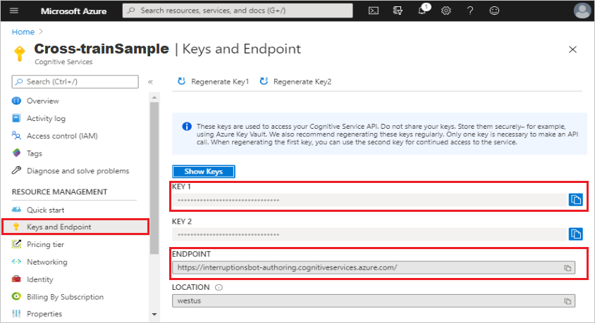
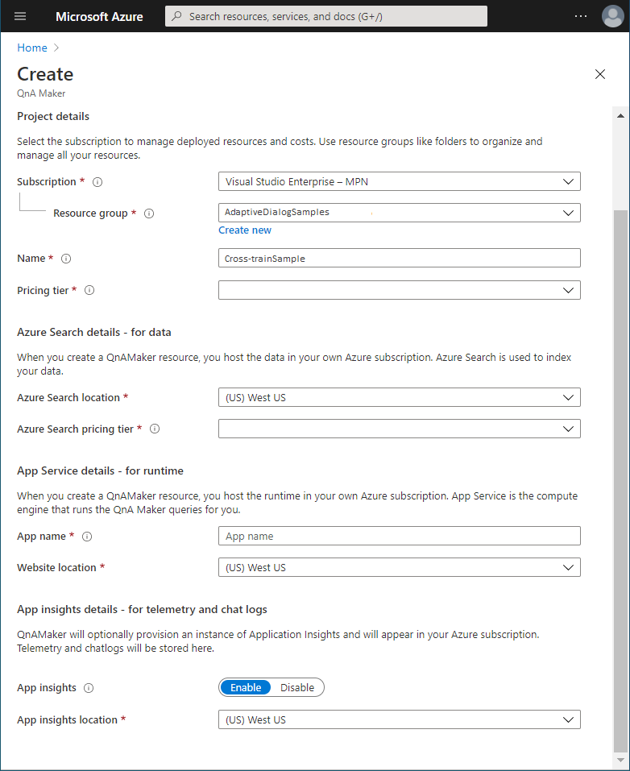
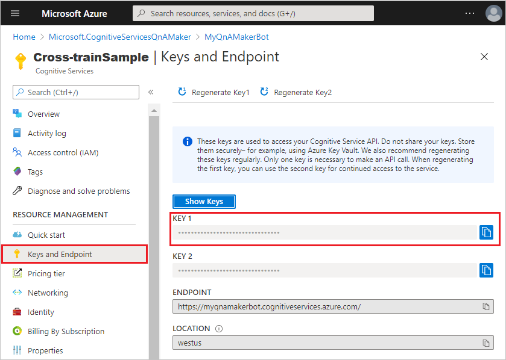
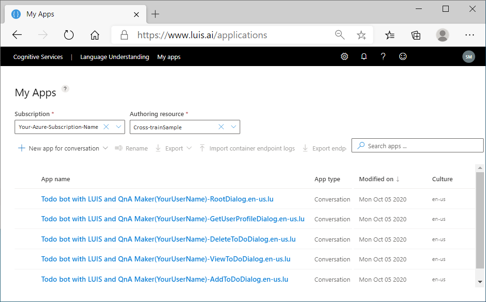
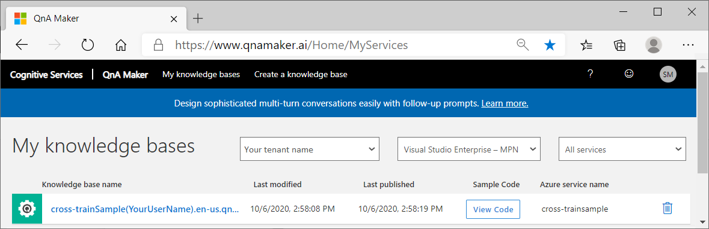

# Create a bot cross trained to use both LUIS and QnA Maker recognizers

[!INCLUDE [applies-to-v4](../includes/applies-to-v4-current.md)]

This how to article describes the steps required to create a bot that integrates the capabilities of both [LUIS][luis] and [QnA Maker][qnamaker] together in each of your adaptive dialogs enabling each to determine the best possible response to the user, using [language generation][language-generation], regardless of which dialog is active.

Integrating the capabilities of both LUIS and QnA Maker requires the use of either the `luis:cross-train` or `qnamaker:cross-train` CLI command to cross train your .lu and .qna files, as well as using the [cross-trained recognizer set][cross-trained-recognizer-set-concept] as the adaptive dialogs recognizer.

## Prerequisites

This article walks you through the steps required to create a fully functional bot using adaptive dialogs, demonstrated using the C# [todo bot with LUIS and QnA Maker](#the-todo-bot-with-luis-and-qna-maker-sample) sample. 

- [Introduction to adaptive dialogs](bot-builder-adaptive-dialog-introduction.md)
- [Events and triggers in adaptive dialogs](bot-builder-concept-adaptive-dialog-triggers.md)
- [Actions in adaptive dialogs](bot-builder-concept-adaptive-dialog-actions.md)
- [Recognizers in adaptive dialogs](bot-builder-concept-adaptive-dialog-recognizers.md)
- [Cross training your LUIS and QnA Maker models](bot-builder-concept-cross-train.md)
- [Handling interruptions in adaptive dialogs](bot-builder-concept-adaptive-dialog-interruptions.md)
- [.lu file format][lu-templates]
- [.qna file format][qna-file-format]

You will also need an [Azure account][create-azure-account].
<!--
## What is covered

This article describes how to create a bot that is cross trained to use both LUIS and QnA Maker recognizers to respond to a user. This will entail the following steps:

1. Introduction to the [todo bot with LUIS and QnA Maker](#the-todo-bot-with-luis-and-qna-maker-sample) sample
1. [Create your LUIS authoring resource in Azure Cognitive Services](#create-your-luis-authoring-resource-in-azure)
1. [Create your QnA Maker resource in Azure Cognitive Services](#create-your-qna-maker-resource-in-azure-cognitive-services)
1. [Install the Bot Framework SDK CLI](#install-the-bot-framework-cli)
1. [Generate cross-trained LU models](#generate-cross-trained-lu-models)
1. [Create and publish LUIS applications using the build command](#create-and-publish-luis-applications-using-the-build-command)
1. [Create and publish QnA Maker knowledge bases using the build command](#create-and-publish-qna-maker-knowledge-bases-using-the-build-command)
1. [Update your project's configuration file to include connection information for LUIS and QnA Maker](#update-your-projects-configuration-file-to-include-connection-information-for-luis-and-qna-maker)
1. [Testing the bot using Bot Framework Emulator](#testing-the-bot-using-bot-framework-emulator)
-->

## The Todo bot with LUIS and QnA Maker sample

The adaptive **Todo bot with LUIS and QnA Maker** ([**C#**][cs-sample-todo-bot]) sample has five .lu files and six .qna files for language understanding. When creating the cross-trained language understanding models, you will combine the .lu and .qna files in a way that will enable you to utilize the capabilities of both LUIS and QnA Maker together in the same recognizer. This is one approach to train the recognizer how to best interpret and respond to a user's request. After running the cross-train command you will have new copies of each file, but they will be updated so that the .lu files contain the required .qna information and the .qna files contain the required .lu information, enabling the [Cross-trained recognizer set][crosstrainedrecognizerset-ref-guide] to determine how to best handle a users request.

If you haven't done it yet, clone the latest samples repository. You can use the following git command from a terminal:

```console
git clone https://github.com/Microsoft/botbuilder-samples.git
```

## Create your LUIS authoring resource in Azure

If you don't already have a LUIS authoring resource you want to use for this, you can follow the steps below to create one. For an in-depth explanation of this process, see the article [Deploy LUIS resources using the Bot Framework LUIS CLI commands][create-your-luis-authoring-resource-in-azure].

1. Go to the Azure [Create LUIS Cognitive Services][create-cognitive-services-luis] page.  
2. In the **Create options** section, select **Authoring** to create a LUIS authoring resource.

   

3. Enter values for each of the fields, then select the **Review + create** button.

   

4. Review the values to ensure they are correct, then select the **Create** button.

The LUIS authoring resource will contain the information needed when running the [build command](#create-and-publish-luis-applications-using-the-build-command) or updating your bot's [configuration file](#update-your-projects-configuration-file-to-include-connection-information-for-luis-and-qna-maker). Once the resource is created, you can find the information shown below  in the **Keys and Endpoint** blade in your LUIS authoring resource. Copy and save the values for later use.

- **Keys**. Either of the two key values are used as the _subscriptionKey_ option in the [build command](#create-and-publish-luis-applications-using-the-build-command), as well as the _LuisAPIKey_ in your [configuration file](#update-your-projects-configuration-file-to-include-connection-information-for-luis-and-qna-maker).
- **Endpoint**. This is the value that is used as the _endpoint_ option in the [build command](#create-and-publish-luis-applications-using-the-build-command), as well as the _LuisAPIHostName_ in your [configuration file](#update-your-projects-configuration-file-to-include-connection-information-for-luis-and-qna-maker).
- **Location**.   This is the value that is used as the _region_ option in the [build command](#create-and-publish-luis-applications-using-the-build-command).

   

## Create your QnA Maker resource in Azure Cognitive Services

If you don't already have a QnA Maker resource, you can follow the steps below to create one. For an in-depth explanation of this process, see the article [Deploy QnA Maker knowledge base using the Bot Framework qnamaker CLI commands][create-your-qna-maker-resource-in-azure-cognitive-services].

1. Go to the Azure [Create Qna Maker Cognitive Services][create-cognitive-services-qnamaker] page.
2. Enter values for each of the fields, then select the **Review + create** button.

   

3. Review the values to ensure they are correct, then select the **Create** button.

The QnA Maker resource will contain the value needed for the _subscriptionKey_ option used when running the [build command](#create-and-publish-qna-maker-knowledge-bases-using-the-build-command). Copy and save the value for later use.

   

## Install the Bot Framework CLI

[!INCLUDE [applies-to-v4](../includes/install-bf-cli.md)]

## Generate cross-trained LU models

Before running the build command to create your LUIS applications and QnA Maker knowledge base in Azure cognitive services, you need to cross train your .lu and .qna files to include the information required by your bot's recognizer to defer user input to either LUIS or QnA Maker for processing. To better understand the concept of cross training please refer to the [Cross train your bot to use both LUIS and QnA Maker recognizers](bot-builder-concept-cross-train.md) article. For details on the `cross-train` command, please refer to the _Cross-trained recognizer set_ section of the [Recognizers in adaptive dialogs - reference guide](../adaptive-dialog/adaptive-dialog-prebuilt-recognizers.md#cross-trained-recognizer-set).

#### Cross train the Todo bot with LUIS and QnA Maker sample

To cross train the **Todo bot with LUIS and QnA Maker** sample:

> [!IMPORTANT]
>
> The instructions in the remainder of this article will refer to the sample code that you were instructed to get in the section [todo bot with LUIS and QnA Maker](#the-todo-bot-with-luis-and-qna-maker-sample) above. Once you have cloned the repository the sample can be found in the **..\BotBuilder-Samples\samples\csharp_dotnetcore\adaptive-dialog\08.todo-bot-luis-qnamaker** directory.

1. From a terminal, navigate to the **08.todo-bot-luis-qnamaker** directory.

1. Create a directory in which to store the output of the command. This article uses _generated_ as the name for this directory.

   ```cmd
      md generated
   ```

1. Run the `luis:cross-train` command.

   ```cmd
      bf luis:cross-train -i dialogs -o generated --config dialogs\DialogLuHierarchy.config.json --force
   ```

Once finished you will have cross-trained versions of the five .lu files and six .qna files. Here `--force` is used to force overwrite the existing .lu and .qna files if they already exist. Otherwise, for .lu files like **AddToDoDialog.lu**, the cross trained content will write to file with name **AddToDoDialog(1).lu**. When running the build commands in the following sections, point to the generated directory for the input files.

> [!IMPORTANT]
>
> You need to run either the `luis:cross-train` command or the `qnamaker:cross-train` command; you do not need to run both. When you run `luis:cross-train`, all of the required cross-train information will be included in the resulting .lu and .qna files.

## Create and publish LUIS applications using the build command

For each .lu file, including .lu files for each locale, the build command combines all the following actions into a single command:

1. Creates one LUIS model for every locale found using your existing .lu files.
1. Using that model, it creates a new (or updates an existing) LUIS app in the specified Azure Cognitive Services resource.
   - When updating an existing LUIS app, it will automatically increment the versionId and optionally delete the old version.
1. Trains the new or updated LUIS app, then publishes it.

For a detailed explanation on how to use the `luis:build` command, see [Deploy LUIS applications using the Bot Framework LUIS CLI commands][luis-build].

> [!IMPORTANT]
>
> This command will overwrite your previous LUIS model as well any content you might have in your [LUIS applications](https://www.luis.ai/applications).

### How to use the luis:build command

Here's the LUIS build command with required parameters:

``` cli
bf luis:build --in <input-file-or-folder> --out <output-file-or-folder> --botName <bot-name> --authoringKey <subscription-key> --region <authoring-region>
```

The `luis:build` command will create all assets you need from your local .lu files.

### Required luis:build parameters

- `--in`: The directory that will be searched for .lu files.
- `--out`: The directory to save output files to.
- `--botName`: The name of your bot. This will be used as the prefix for the name of the LUIS applications generated.
- `--authoringKey`: The subscriptionKey.
- `--region`: The region to publish your LUIS applications.

For information on the additional options, see [bf luis:build][bf-luisbuild] in the Bot Framework CLI README.

Alternatively, you can include these required, as well as any of the other parameters, in a configuration file and refer to them using the `--luConfig` option.

### LUIS build configuration file

The following is a sample of the **luconfig.json** file that you can reference using the `--luConfig` option.

```json
{
    "in": "generated",
    "out": "output",
    "botName":"<your-bot-name>",
    "authoringKey":"<your-32-digit-subscription-key>",
    "endpoint":"<your-endpoint>",
    "region": "<your-region-default-is-westus>"
}
```

Once this configuration file is created, all you need to do is reference it in your `luis:build` command. For example:

``` cli
bf luis:build --luConfig luconfig.json
```

For a detailed explanation on how to use the `luis:build` command, see [Deploy LUIS applications using the Bot Framework LUIS CLI commands][luis-build].

#### Create the LUIS applications for the todo bot with LUIS and QnA Maker sample

To create the LUIS applications for the **Todo bot with LUIS and QnA Maker** sample:

1. From a terminal, navigate to the **08.todo-bot-luis-qnamaker** directory.

1. Create a directory in which to store the output of the command. This article uses **output** as the name for this directory.

   ```cmd
      md output
   ```

1. Create your **luconfig.json** file, as shown in the previous section and save it to the root directory of the sample. Make sure you update the entries for the _botName_, _authoringKey_ and _region_ options:

    **08.todo-bot-luis-qnamaker\luconfig.json**

    ```json
    {
       "in": "generated",
       "out": "output",
       "botName":"todo bot with LUIS and QnA Maker",
       "authoringKey":"<your-32-digit-subscription-key>",
       "endpoint":"<your-endpoint>",
       "region": "<your-region-default-is-westus>"
    }
    ```

1. Run the `luis:build` command, using **luconfig.json**.

   ```cmd
      bf luis:build --luConfig luconfig.json
   ```

> [!TIP]
>
> If you haven't done so already, you'll need to [Migrate to an Azure resource authoring key][luis-migration-authoring]. If you don't, you'll not see the LUIS Applications in [LUIS][luis] created using the `luis:build` command.

Once finished you will have a LUIS application for each of the five .lu files in [LUIS](https://www.luis.ai/conversations/applications):



> [!TIP]
>
> The `luis:build` command will save a file named **luis.settings.YourUserName.westus.json** to the output directory. This file contains the LUIS application IDs that you'll need to add to your configuration file, described in [Update your project's configuration file to include connection information for LUIS and QnA Maker](#update-your-projects-configuration-file-to-include-connection-information-for-luis-and-qna-maker).

## Create and publish QnA Maker knowledge bases using the build command

The `qnamaker:build` command combines all the following actions into a single command:

1. Creates one QnA Maker model for every locale found using your existing .qna files.
1. Creates a new QnA Maker KB if none exists, otherwise it will overwrite the existing KB.
1. Trains your QnA Maker KB then publishes it to the production endpoint.

For a detailed explanation on how to use the `qnamaker:build` command, see [Deploy QnA Maker knowledge base using the Bot Framework qnamaker CLI commands][qnamaker-build].

### How to use the qnamaker:build command

Here's the QnA Maker build command with required parameters:

``` cli
bf qnamaker:build --in <input-file-or-folder> --out <folder-to-save-files-to> --subscriptionKey <Subscription-Key> --botName <bot-name>
```

> [!IMPORTANT]
>
> This command will overwrite your previous QnA Maker model as well any content you might have in your QnA Maker KB, including any content created directly in [QnA Maker.ai](https://www.qnamaker.ai/).

#### The qnamaker:build parameters

- `--in`: The directory, including sub-directories, that will be searched for .qna files.
- `--out`: The directory to save output files to.
- `--botName`: The name of your bot. This will be used to generate the name of the QnA Maker KB, this is explained in more detail in the [Deploy QnA Maker knowledge base using the Bot Framework qnamaker CLI commands][qna-maker-knowledge-bases-created] article.
- `--subscriptionKey`: The same subscription key that is in your [initialization file][create-your-qna-maker-initialization-file].

For information on additional parameters, see [bf qnamaker:build][bf-qnamakerbuild] in the Bot Framework CLI qnamaker README.

Alternatively, you can include these required parameters in a configuration file and provide them via the `qnaConfig` parameter.

#### The qnamaker configuration file

The qnamaker configuration file is a JSON file that can contain any valid `qnamaker:build` option.

```json
{
  "in": "<location-of-qna-files>",
  "out": "<location-to-save-output-files>",
  "subscriptionKey": "<Enter-subscription-key-here>",
  "botName": "<Enter-botName-here>"
}
```

Once created, all you need to do is reference it in your `qnamaker:build` command, for example:

``` cli
bf qnamaker:build --qnaConfig qnaConfig.json
```

For a detailed explanation on how to use the `qnamaker:build` command, see [Deploy QnA Maker knowledge base using the Bot Framework qnamaker CLI commands][qnamaker-build].

#### Create the QnA Maker knowledge base for the todo bot with LUIS and QnA Maker sample

To create the QnA Maker knowledge base for the **Todo bot with LUIS and QnA Maker** sample:

1. From a terminal, navigate to the **08.todo-bot-luis-qnamaker** directory.

1. If it doesn't already exist, create a new directory named **output**

   ```cmd
      md output
   ```

1. Create your **qnaConfig.json** file, as shown in the previous section, and save it to the **08.todo-bot-luis-qnamaker** directory. Make sure you update the entries for the _botName_, _subscriptionKey_ and _region_ options:

    **08.todo-bot-luis-qnamaker\qnaConfig.json**

    ```json
    {
        "in": "generated",
        "out": "output",
        "botName":"<todo bot with LUIS and QnA Maker>",
        "subscriptionKey":"<your-32-digit-subscription-key>",
        "region": "<your-region-default-is-westus>"
    }
    ```

1. Run the `qnamaker:build` command, using **qnaConfig.json**.

   ```cmd
      bf qnamaker:build --qnaConfig qnaConfig.json
   ```

Once finished you'll have a QnA Maker knowledge base with all of the questions and answers from the five .qna files in [QnA Maker](https://www.qnamaker.ai/Home/MyServices):



> [!TIP]
>
> The `qnamaker:build` command will save a file named **qnamaker.settings.\<your-user-name>.westus.json** to the output directory. This file contains the knowledge base ID that you'll need to add to your configuration file, described in the next section.

## Update your project's configuration file to include connection information for LUIS and QnA Maker

The configuration file is named **appsettings.json**. The following shows the configuration file for Todo bot with LUIS and QnA Maker sample:

```json
{
    // The first two values are used to connect to your bot channel in Azure.
    // See the "Bot channels registration" section below for more information.
    "MicrosoftAppId": "",
    "MicrosoftAppPassword": "",
    // The next two values are used to connect to your Azure cognitive services LUIS
    // authoring resource. See the "LUIS key and hostname" section below for more information.
    "LuisAPIKey": "",
    "LuisAPIHostName": "",
    // The luis section contains all luis application IDs, created by the luis build
    // command and saved to the specified output directory in the file named:
    //  "luis.settings.<username>.<authoring-region>.json"
    // See "LUIS application IDs" section below for more details.
    "luis": {
        "GetUserProfileDialog_en_us_lu": "",
        "ViewToDoDialog_en_us_lu": "",
        "DeleteToDoDialog_en_us_lu": "",
        "RootDialog_en_us_lu": "",
        "AddToDoDialog_en_us_lu": ""
    },
    // The next two values are used to connect to your Azure cognitive services QnA Maker
    // resource. See "QnA Maker hostname and endpoint key" section below for more details.
    "QnAHostName": "",
    "QnAEndpointKey": "",
    // The qna section contains all QnA Maker knowledge base IDs, created from the .qna files by
    // the qnamaker build command and saved to the specified output directory in the file named:
    //  "qnamaker.settings.<username>.<authoring-region>.json"
    // See "QnA Maker knowledge base IDs" section below for more details.
    "qna": {
        "TodoBotWithLuisAnDQnA_en_us_qna": ""
    }
}
```

<!--
NOTE:

There is a PR that will change this sample: https://github.com/microsoft/BotBuilder-Samples/pull/2899. After the change, QnA Maker will have the same structure as the luis does in appsettings.json, once completed, update this article by adding these additional QnA Maker recognizer items to align with the changes in this PR:

        "AddToDoDialog_en_us_qna": "",
        "ChitChat_en_us_qna": "",
        "DeleteToDoDialog_en_us_qna": "",
        "GetUserProfileDialog_en_us_qna": "",
        "RootDialog_en_us_qna": "",
        "ViewToDoDialog_en_us_qna": ""
    }

-->

### The configuration file details

This section explains the **appsettings.json** file for the Todo bot with LUIS and QnA Maker sample in detail.

<!---->

#### Bot channels registration

See the [Bot channels registration][bot-channels-registration] article for details how to get the `MicrosoftAppId` and `MicrosoftAppPassword` values if needed, however, these values are not required to complete this article.

#### LUIS key and hostname

The *LuisAPIKey* is the `subscriptionKey`, and the *LuisAPIHostName* is the `ENDPOINT` value. Both values are found in the **Keys and Endpoint** blade in the Azure cognitive services LUIS authoring resource page as shown in the screen shot below:


#### LUIS application IDs

The _luis_ section contains all luis application IDs used by your bot. These values can be found in the **Application Settings** page for a LUIS application in [www.luis.ai](https://www.luis.ai/), however They're also listed in the settings file created by the `luis:build` command, and saved to the location provided as the `--out` option. This settings file contains a list of every LUIS application ID that was created for each locale. The full name of this JSON file is **luis.settings.<username>.<authoring-region>.json**. For example, if your logged in username is _YuuriTanaka_ and you are targeting authoring region **westus**, your filename would be **luis.settings.YuuriTanaka.westus.json**. This is where you will find all the values for the _luis_ section of your **appsettings.json** file.

#### QnA Maker hostname and endpoint key

`QnAHostName` is the **Host** value and `QnAEndpointKey` is the **EndpointKey** value, both found in QnA Maker, accessed by selecting the **view code** button when in the **My knowledge bases** page as shown in the screen shot below:


#### QnA Maker knowledge base IDs

The `qnamaker:build` command will save a settings file to the location provided as the `--out` option. This file contains a list of every QnA Maker knowledge base ID created for each locale. The full name of this JSON file is `qnamaker.settings.<username>.<authoring-region>.json`. For example, if your logged in username is _YuuriTanaka_ and you are targeting authoring region **westus**, your filename would be **qnamaker.settings.YuuriTanaka.westus.json**. This is where you will find all the values for the `qna` section of your **appsettings.json** file.

> [!IMPORTANT]
>
> The settings file created by the `qnamaker:build` command will contain an entry for each of the five QnA Maker models. The value for each will be the ID for the one QnA Maker KB created by the build command. Since each contain the same ID value, use any of them for the value for the **TodoBotWithLuisAndQnA_en_us_qna** key. If you replace this single value with all five values from the qnamaker.settings file, you'll get an error: "System.Exception: NOTE: QnA Maker is not configured for RootDialog.".

<!--
NOTE:

Once PR2899 (https://github.com/microsoft/BotBuilder-Samples/pull/2899) is done, change the important message above to this:

The settings file created by the `qnamaker:build` command will contain an entry for each of the five QnA Maker models, the value for each will be the ID for the one QnA Maker KB created by the build command.

-->

## Source code updates for cross-trained models

There are no source code updates needed in the adaptive Todo bot with LUIS and QnA Maker ([C#][cs-sample-todo-bot]) sample to take advantage of cross-trained models since the sample was created with cross-training in mind. This section explains the code in this sample that relates to bots utilizing cross-trained models, using **AddToDoDialog.cs** as an example. The same concepts apply to the other adaptive dialogs in this bot.

### Define the recognizer

The recognizer needed to work with models that have been cross-trained is the [CrossTrainedRecognizerSet][crosstrainedrecognizerset-ref-guide].

In this sample bot, the recognizer is set by calling a method, and passing the `configuration` property as its one parameter:

<!-- Line 44 -->

```csharp
Recognizer = CreateCrossTrainedRecognizer(configuration)
```

The method `CreateCrossTrainedRecognizer` creates a `CrossTrainedRecognizerSet` recognizer that consists of a `Recognizers` list containing both a LUIS and QnA Maker recognizer.

<!-- Line 318-328 -->

```csharp
private static Recognizer CreateCrossTrainedRecognizer(IConfiguration configuration)
{
   return new CrossTrainedRecognizerSet()
   {
      Recognizers = new List<Recognizer>()
      {
         CreateLuisRecognizer(configuration),
         CreateQnAMakerRecognizer(configuration)
      }
   };
}

```

The `CreateLuisRecognizer` method creates the LUIS recognizer. See comments in the code snippet below for code explanations:
<!-- Line 360-375 -->

```csharp
public static Recognizer CreateLuisRecognizer(IConfiguration Configuration)
{
   // Verify that all required values exist in the configuration file appsettings.json and throw an error
   if (string.IsNullOrEmpty(Configuration["luis:RootDialog_en_us_lu"]) || string.IsNullOrEmpty(Configuration["LuisAPIKey"]) || string.IsNullOrEmpty(Configuration["LuisAPIHostName"]))
   {
      throw new Exception("Your RootDialog LUIS application is not configured. Please see README.MD to set up a LUIS application.");
   }
   return new LuisAdaptiveRecognizer()
   {
      // Get settings from the configuration file appsettings.json
      Endpoint = Configuration["LuisAPIHostName"],
      EndpointKey = Configuration["LuisAPIKey"],
      ApplicationId = Configuration["luis:RootDialog_en_us_lu"],

      // Id needs to be LUIS_<dialogName> for cross-trained recognizer to work.
      Id = $"LUIS_{nameof(RootDialog)}"
   };
}
```

The method `CreateQnAMakerRecognizer` creates a QnA Maker recognizer. See comments in the code snippet below for code explanations:

<!-- Line 330-358

NOTE:

Once PR2899 (https://github.com/microsoft/BotBuilder-Samples/pull/2899) is done, change the code below:

if (string.IsNullOrEmpty(configuration["qna:RootDialog_en_us_qna"]) || string.IsNullOrEmpty(configuration["QnAHostName"]) || string.IsNullOrEmpty(configuration["QnAEndpointKey"]))

throw new Exception("NOTE: QnA Maker is not configured for RootDialog. Please follow instructions in README.md to add 'qna:RootDialog_en_us_qna', 'QnAHostName' and 'QnAEndpointKey' to the appsettings.json file.");

KnowledgeBaseId = configuration["qna:RootDialog_en_us_qna"],

 -->

```csharp
private static Recognizer CreateQnAMakerRecognizer(IConfiguration configuration)
{
   // Verify that all required values exist in the configuration file appsettings.json
   if (string.IsNullOrEmpty(configuration["qna:TodoBotWithLuisAndQnA_en_us_qna"]) || string.IsNullOrEmpty(configuration["QnAHostName"]) || string.IsNullOrEmpty(configuration["QnAEndpointKey"]))
   {
      throw new Exception("NOTE: QnA Maker is not configured for RootDialog. Please follow instructions in README.md. To enable all capabilities, add 'qnamaker:qnamakerSampleBot_en_us_qna', 'qnamaker:LuisAPIKey' and 'qnamaker:endpointKey' to the appsettings.json file.");
   }

   return new QnAMakerRecognizer()
   {
      // Get settings from the configuration file appsettings.json
      HostName = configuration["QnAHostName"],
      EndpointKey = configuration["QnAEndpointKey"],
      KnowledgeBaseId = configuration["qna:TodoBotWithLuisAndQnA_en_us_qna"],

      // property path that holds qna context
      Context = "dialog.qnaContext",

      // Property path where previous qna id is set. This is required to have multi-turn QnA working.
      QnAId = "turn.qnaIdFromPrompt",

      // Disable Personal Information telemetry logging
      LogPersonalInformation = false,

      // Enable to automatically including dialog name as meta data filter on calls to QnA Maker.
      IncludeDialogNameInMetadata = true,

      // Id needs to be QnA_<dialogName> for cross-trained recognizer to work.
      Id = $"QnA_{nameof(RootDialog)}"
   };
}

```

### Allowing interruptions
<!--When your models are not cross trained, and a user utterance-->
If a user input doesn't result in a match from the recognizer, prior to cross training your LUIS and QnA Maker models, the bot will automatically send it to the active dialogs parent, as long as the `AllowInterruptions` property evaluates to _true_. When you cross train your models, the active dialog becomes aware of other dialogs intent handling capabilities, so if no match is returned, there is no need to consult the parent dialog. In this case, how do you determine if the active dialog should handle the users response or bubble it up to the parent? Consider this scenario using the todo bot with LUIS and QnA Maker sample:

> [!NOTE]
> You can follow along by running the bot using the Emulator, instructions for doing this are given in the next section [Testing the bot using Bot Framework Emulator](#testing-the-bot-using-bot-framework-emulator).

- When starting the bot the user is greeted with _Hi, nice to meet you! I'm a sample bot. Here are some things I can help with_, then prompted with SuggestedActions = **Add item | View lists | Remove item | Profile | Cancel | Help**
- The user selects _View lists_

> at this point the **ViewToDoDialog** becomes the active adaptive dialog

- The user is prompted with _Which list would you like to see?_ and given these three options: **Todo | Grocery | Shopping | All**
- Instead of selecting any of the options presented, the user enters _Remove todo_

The utterance _Remove todo_ doesn't belong to any intents in the **ViewToDoDialog**, but since the models have been cross trained, LUIS returns a match. The bot just needs to know to use the consultation mechanism to bubble up the request to **RootDialog** where this utterance is associated with the intent that results in the **DeleteToDoDialog** being called.

Below is the code to prompt the user with in **ViewToDoDialog.lg**:

[!code-csharp[AllowInterruptions](~/../botbuilder-samples/samples/csharp_dotnetcore/adaptive-dialog/08.todo-bot-luis-qnamaker/Dialogs/ViewToDoDialog/ViewToDoDialog.cs?range=55-71&highlight=3-4,6)]
<!--
**The following code snippet is for comparison with the code link above. Remove before merging with main**

```csharp
new TextInput()
{
   Property = "dialog.listType",                       //highlight
   Prompt = new ActivityTemplate("${GetListType()}"),  //highlight
   Value = "=@listType",
   AllowInterruptions = "!@listType && turn.recognized.score >= 0.7",   //highlight
   Validations = new List<BoolExpression>()
   {
      // Verify using expressions that the value is one of todo or shopping or grocery
      "contains(createArray('todo', 'shopping', 'grocery', 'all'), toLower(this.value))",
   },
   OutputFormat = "=toLower(this.value)",
   InvalidPrompt = new ActivityTemplate("${GetListType.Invalid()}"),
   MaxTurnCount = 2,
   DefaultValue = "todo",
   DefaultValueResponse = new ActivityTemplate("${GetListType.DefaultValueResponse()}")
},
```
 -->
- The `Prompt` for this `TextInput` calls the `GetListType()` template in **ViewToDoDialog.lg**.
- The value returned from the user input is saved into `turn.recognized.entities.listType`. Shorthand for `turn.recognized.entities.listType` is `@listType`
- The expression for `AllowInterruptions` checks `@listType`, which will exist if the user selected or entered a valid list type. if it doesn't exist it checks to see is the match returned by LUIS has a 70% or higher prediction score, `turn.recognized.score >= 0.7`. If it does, that means that a parent or sibling dialog has an intent with a high prediction score. This results in `AllowInterruptions` evaluating to true and the users utterance is then passed up to the parent dialog to be handled. When the parent dialog handles this utterance it finds a match in the `DeleteItem` intent which results in the **DeleteToDoDialog**.

> [!NOTE]
>
>The [Cross training your LUIS and QnA Maker models](bot-builder-concept-cross-train.md) article describes the changes made to your .lu and .qna files when they are cross trained, and the [recognizer responses table](bot-builder-concept-cross-train.md#recognizer-responses) in that article shows all possible recognizer responses and the resulting action taken by the bot.

## Testing the bot using Bot Framework Emulator

## Prerequisites for testing the bot using Bot Framework Emulator

- [Visual Studio 2019 or later](https://www.visualstudio.com/downloads) or [Visual Studio Code](https://code.visualstudio.com/Download)
- [.NET Core 3.1](https://dotnet.microsoft.com/download)
- A copy of the C# [Todo bot with LUIS and QnA Maker][cs-sample-todo-bot] sample.
- [Bot Framework Emulator](https://github.com/microsoft/BotFramework-Emulator/blob/master/README.md)

## Build and run the bot locally

To run your bot locally, execute the command shown below.

1. From a terminal, navigate to the **08.todo-bot-luis-qnamaker** directory.

1. Run the bot.

   ```cmd
      dotnet run
   ```

This builds the application, deploys it to localhost, and launches the web browser to display the application's **default.htm** page. At this point, your bot should be running locally on port 3978, unless the `applicationUrl` setting in **launchSettings.json** was modified.

## Start the Emulator and connect to your bot

1. Start the Bot Framework Emulator.

1. Select **Open Bot** on the Emulator's **Welcome** tab.

1. Enter your bot's URL, which is the URL of the local port, with /api/messages added to the path, typically **http://localhost:3978/api/messages**.

   <!--This is the same process in the Emulator for all three languages.-->
   

1. Then select **Connect**.

You can now interact with your bot.

<!------------------------------------------------------------------------------------------------------------------>
[create-azure-account]: https://azure.microsoft.com/free/?WT.mc_id=A261C142F
[luis]: /azure/cognitive-services/luis/what-is-luis
[qnamaker]: /azure/cognitive-services/qnamaker/overview/overview
[cs-sample-todo-bot]: https://github.com/microsoft/BotBuilder-Samples/tree/main/samples/csharp_dotnetcore/adaptive-dialog/08.todo-bot-luis-qnamaker
[lu-templates]: ../file-format/bot-builder-lu-file-format.md
[qna-file-format]: ../file-format/bot-builder-qna-file-format.md
[create-your-luis-authoring-resource-in-azure]: bot-builder-howto-bf-cli-deploy-luis.md#create-your-luis-authoring-resource-in-azure
[create-your-qna-maker-resource-in-azure-cognitive-services]: bot-builder-howto-bf-cli-deploy-qna.md#create-your-qna-maker-resource-in-azure-cognitive-services

[bot-channels-registration]: ../bot-service-quickstart-registration.md

[cross-trained-recognizer-set-concept]: bot-builder-concept-adaptive-dialog-recognizers.md#cross-trained-recognizer-set

[crosstrainedrecognizerset-ref-guide]: ../adaptive-dialog/adaptive-dialog-prebuilt-recognizers.md#cross-trained-recognizer-set

[language-generation]: bot-builder-concept-adaptive-dialog-generators.md
[create-cognitive-services-luis]: https://portal.azure.com/#create/Microsoft.CognitiveServicesLUISAllInOne
[create-cognitive-services-qnamaker]: https://portal.azure.com/#create/Microsoft.CognitiveServicesQnAMaker

[bf-qnamakerbuild]: https://github.com/microsoft/botframework-cli/tree/main/packages/cli#bf-qnamakerbuild
[qnamaker-build]: bot-builder-howto-bf-cli-deploy-qna.md#create-a-qna-maker-knowledge-base-and-publish-it-to-production-using-the-build-command
[qna-maker-knowledge-bases-created]: bot-builder-howto-bf-cli-deploy-qna.md#qna-maker-knowledge-bases-created
[create-your-qna-maker-initialization-file]: bot-builder-howto-bf-cli-deploy-qna.md#create-your-qna-maker-initialization-file

[bf-luisbuild]: https://github.com/microsoft/botframework-cli/tree/main/packages/cli#bf-luisbuild
[luis-build]: bot-builder-howto-bf-cli-deploy-luis.md#create-and-train-a-luis-app-then-publish-it-using-the-build-command

[luis-migration-authoring]: /azure/cognitive-services/luis/luis-migration-authoring

<!---------------------------------------------------------------------------------------------------------------->
