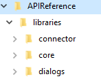
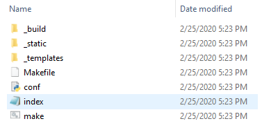
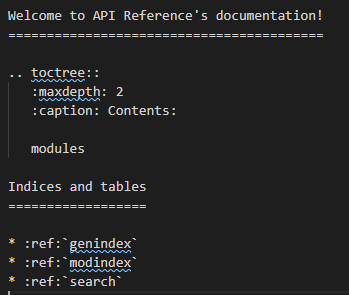
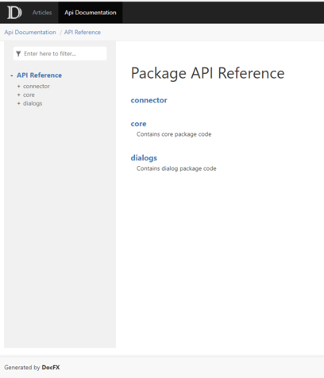

# Python local reference documentation build

This article describes how to create a local build for Python API reference documentation.

The API reference documentation is generated from comments in the source code and created using the [reStructuredText](https://en.wikipedia.org/wiki/ReStructuredText) format.

The **reStructuredText** (RST) is a file format for textual data used primarily in the Python programming language community for technical documentation.
It is a lightweight markup language designed to be both processable by documentation-processing software, and easily readable by humans.

- For the RST syntax, see [How to document a Python API](https://review.docs.microsoft.com/en-us/help/onboard/admin/reference/python/documenting-api?branch=master).

- This article follows the instructions provided in [Testing Python Content Locally](https://review.docs.microsoft.com/en-us/help/onboard/admin/reference/python/testing-locally?branch=master).

## Prerequisites

- Install [Python 3.6](https://www.python.org/downloads/) or higher.
- Install [Sphinx](http://www.sphinx-doc.org/en/master/). Refer to the steps described below. It creates Python documentation from `reStructuredText`, and has facilities for the documentation of software projects in a range of languages. Its output (YML files) feds into the DocFX tool.
- Downloaded [DocFX](https://dotnet.github.io/docfx/). It generates static sites from markdown and code. Accepts as input the Sphinx output (YML files). It is recommended to extract it in C:\Program Files\docfx. If you create a PATH variable it is even better.

### Install Sphinx

    ```cmd
    pip install -U Sphinx
    ```

Install an additional component to support the DocFX tool:

    ```cmd
    pip install -U sphinx-docfx-yaml
    ```

### Check files for errors (optional)

Before creating Sphinx content you can check your files for any issues. Run `pip install rstcheck` from a command line to install [rstcheck](https://pypi.org/project/rstcheck/).

You can set a variety of [options](https://github.com/myint/rstcheck#options), like [ignoring specific errors](https://github.com/myint/rstcheck#ignore-specific-errors) or messages, when running rstcheck. To check a single file run:

```cmd
rstcheck <file_name>
```

## Organize your code directory

We suggest to perform the steps below to facilitate the creation of a local reference build.

1. In your local repository clone the SDK library for which you want to create a local documentation build. For example for Python, clone https://github.com/microsoft/botbuilder-python.
1. Create a folder named `<local path>\APIReference` folder.
1. In the folder, create a sub-folder named `libraries`.
1. From your cloned SDK copy into the `libraries` the folders that contain the actual code (with related sub-folders). For examples from `\botbuilder-python\libraries\botbuilder-core\botbuilder\core` copy the `core` folder. From `botbuilder-python\libraries\botbuilder-dialogs\botbuilder\dialogs` copy the `dialogs` folder.
The following is a an example of how the library directory looks like:

    

1. Once done copying, make sure that each library folder (and sub-folders) contain an `__init__.py` file. These **files must be empty**; delete whatever code they contain.
1. Now, we are ready to `rock and roll`.


## Create Sphinx content

The following steps produce a local doc build structure. `.rst` files that contain the info about packages and modules, and finally a set of `YML` files from the source code.

1. Switch to the reference directory on your local machine where to create the documentation: `<local path>\APIReference`.
1. Open a terminal console in this directory and set the Sphinx base configuration by executing this command:

    ```cmd
    sphinx-quickstart
    ```

> [!NOTE]
> If you get this sphinx error: `could not import extension docfx_yaml.extension` you must (re)install **Sphinx DocFX YAML** which is an exporter for the Sphinx Autodoc module into DocFX YAML. Execute this command: `pip install sphinx-docfx-yaml`. For more information, see [Sphinx DocFX YAML](https://github.com/docascode/sphinx-docfx-yaml).

1. You will be asked some questions. Answer as follows:

    1. Root path accept the current directory: Accept default (simply enter).
    1. Separate source and build directories (y/n) [n]: y.
    1. Accept the default hyphen prefix for the other directories to be created (simply enter).
    1. Project name: `API Reference` or whatever name you decide.
    1. Author name(s): your alias
    1. Project version: 1.0
    1. Project release: 1.0.0
    1. For all the requested values accept the defaults by just clicking enter.

    After done entering the above values the following directory structure is created in the source folder.

    

1. Open the `conf.py` file and add the following directive:

    ```python
    extensions = ['sphinx.ext.autodoc', 'docfx_yaml.extension']
    ```

1. Add the following path information:

    ```python
    import os
    import sys
    sys.path.insert(0, os.path.abspath('../libraries'))
    ```

1. Create a number of  `.rst` files in the `source` folder representing of the APIs to document.

    ```cmd
        sphinx-apidoc -f .\libraries  -o source
    ```
1. Edit the `index.rst` file by adding the `modules` line as shown below. Make sure the alignment is correct

    

<!--
sphinx-apidoc <path to folder where the .py files are> -o . --module-first --no-headings --no-toc --implicit-namespaces
-->

1. Create the `YML` files in the `build/docfx_yaml` folder by executing this command:

    ```cmd
        sphinx-build source build
    ```

    Once the build completes, you should have the `YML` files in `build/docfx_yaml` folder.

    > [!NOTE
    > If encounter this error: `contents.rst not found`, add the following entry to the `config.py` file: `master_doc = 'index'`. See also [Sphinx error: master file [..]/checkouts/latest/contents.rst not found #2569](https://github.com/readthedocs/readthedocs.org/issues/2569).

## Documentation preview

Now that we have the `YML` files, we can preview them with a locally-running `DocFX` instance.

1. Bootstrap a documentation project based on our own pipeline. In the current folder, create a new folder, for example _docfx. In the console terminal, navigate to this folder and bootstrap a new DocFX project by executing this command:

    ```cmd
    "<path to DocFX folder>\docfx.exe" init -q
    ```
This creates a new `docfx_project` folder.

1. Copy the `YML` files previously generated via Sphinx in `build/docfx_yaml`. into the `docfx_project/api` folder.
1. Once done, make sure that your terminal console is open in the `docfx_project` folder.
1. Build the site (on line docs) locally and display the documentation by running this command:

    ```cmd
    "<path to DocFX folder>\docfx.exe" --serve
    ```

1. In your browser, navigate to http://localhost:8080 to see the online docs. The output should look similar to this:

    

## Some shortcuts

When you rebuild the documentation because comments have changed or for whatever other reasons, you do not have to start from scratch. Instead, perform the steps described below.

1. In the `source` folder, delete the `.rst` files, excluding the `index.rst` file.
1. Delete the content of the `build` folder.
1. Delete the content of the `docfx_project/api` folder, excluding the `index.md` file.
1. in the directory `<local path>\APIReference` execute the commands:

```cmd

sphinx-apidoc -f .\libraries  -o source
sphinx-build source build

```

1. Copy the `YML` files previously generated in `build/docfx_yaml`. into the `docfx_project/api` folder.
1. Once done, make sure that your terminal console is open in the `docfx_project` folder.
1. Build the site (on line docs) locally and display the documentation by running this command:

    ```cmd

    "<path to DocFX folder>\docfx.exe" --serve

    ```