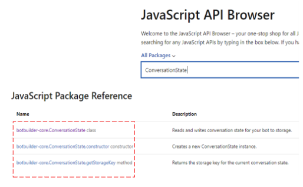

# Reference documentation guidance

Contains guidance for the SDK team when adding reference documentation to the code.

## C\#

uses docXML

## JavaScript/TypeScript

- [JSDoc](#jsdoc)
- [TypeDoc](#typedoc)
- [JavaScript API Browser](#[javaScript-api-browser])
- [Tips and Tricks](#tips-and-tricks)


The following recommendations are for developers and writers working on JavaScript/TypeScript reference comment content.

### JSDoc

Standard **JSDoc** conventions apply for **JavaScript** documentation. You can read more about them here: [JsDoc](https://jsdoc.app/).

### TypeDoc

**TypeDoc** conventions apply to **TypeScript** documentation (please, read [platform breakdown](https://review.docs.microsoft.com/en-us/help/onboard/admin/reference/concepts/platforms)). You can read more about them here: [TypeDoc](http://typedoc.org/guides/doccomments/).

### JavaScript API Browser

All JavaScript and TypeScript API documentation on *docs.microsoft.com* is indexed in the [JavaScript API Browser](https://review.docs.microsoft.com/en-us/javascript/api). This ensures that the customers have a single entry point to discover all possible JavaScript APIs.

## Reference SDK-defined types

To link to auto-generated API reference pages in the current documentation set or other documentation sets, use XRef links with the **unique ID** (UID) of the type or member. The following is the syntax to create a link:

```xml
<xref:UID>
<xref:UID?displayProperty=nameWithType>
```

> [!NOTE]
> By default, link text shows only the member or type name. The optional `displayProperty=nameWithType` query parameter produces fully qualified link text, that is, *namespace.type* for types, and *type.member* for type members, including enumeration type members.


To find the UDI for the API to link to is on `docs.microsoft.com`, type all or some of its full name in the  [JavaScript API Browser](https://review.docs.microsoft.com/en-us/javascript/api) search box. The UDI are displayed on the left side of the browser. The following picture shows an example, where the UDIs are in the red box:




### Examples

> [!div class="mx-tdBreakAll"]
> |Type|Example|Link|Comments|
> |------|-----|------|-----|
> |Class|`[ConversationState](xref:botbuilder-core.ConversationState)`|[ConversationState](https://review.docs.microsoft.com/en-us/javascript/api/botbuilder-core/conversationstate?view=botbuilder-ts-latest&branch=master)|
> |Method|`[clear()](xref:botbuilder-core.ConversationState.clear)`|[ConversationState.clear](https://docs.microsoft.com/javascript/api/botbuilder-core/conversationstate#clear-turncontext-)| |


## Tips and Tricks

### Errors
> [!div class="mx-tdBreakAll"]
> |Error Type|Error Example|Error Message|Solution|
> |-------------|----------|---------|---------|
> |Invalid link warning|`<a href=""#add"">add()</a>`|The file `docs-ref-autogen/botbuilder-dialogs/DialogSet.yml` doesn't contain a bookmark named `add`.|Replace the link `<a href=""#add"">add()</a>` with `[add()](xref:botbuilder-dialogs.DialogSet.add)`.|
> | Add snippet code in comment|

#### Good practices

- Add snippet code in comment example.

    \```JavaScript <br/>
    const { ConversationState, MemoryStorage } = require('botbuilder'); <br/>
    \```
- Tbd


## Python

\<include a mini toc>

Here are recommendations for developers and writers working on Python reference comment content.

Follow the Sphinx syntax in [how to document a Python API](https://review.docs.microsoft.com/help/onboard/admin/reference/python/documenting-api). Failing to do so will possibly result in malformed code comments.

### To reference functions

To reference `sys.exc_info()`:
~~~python
    :param trace: the traceback information as returned by :func:`sys.exc_info`.
~~~

### To reference types

#### To reference built-in types

#### To reference SDK-defined types

When referencing a type in the same package, you can leave off the package name:
~~~python
    :param storage: The storage layer this state management object will use to store and retrieve state
    :type storage:  :class:`Storage`
~~~

When referencing a type in a different package, you need to include the package name:
~~~python
    :param storage: The storage layer this state management object will use to store and retrieve state
    :type storage:  :class:`botbuilder.core.Storage`
~~~

### Common errors

#### When linking to methods, do not add () to the end of function names within the `:func:` tag.

**good**
~~~python
    :param start_time: the start time of the request. The value should look the
    same as the one returned by :func:`datetime.isoformat` (defaults to: None)
~~~

**bad**
~~~python
    :param start_time: the start time of the request. The value should look the
    same as the one returned by :func:`datetime.isoformat()` (defaults to: None)
~~~

#### Do not add `:param x:` without adding a `:type x:`

**good**
~~~python
    :param name: The name for this request. All requests with the same name will be grouped together.
    :type name: str
    :param url: The actual URL for this request (to show in individual request instances).
    :type url: str
~~~
**bad**
~~~python
    :param name: The name for this request. All requests with the same name will be grouped together.
    :param url: The actual URL for this request (to show in individual request instances).
~~~

#### Do not add a list of `:param x:`, `:type x`:, `:return:`, or `:rtype:` blocks without descriptions.

  This will result in malformed method/class summaries.

### Samples

See the OPS Onboarding Guide's **How to document a Python API** for a good sample of how to use a bunch of the Sphinx markup together, [Fully formatted code file](https://review.docs.microsoft.com/en-us/help/onboard/admin/reference/python/documenting-api?branch=master#fully-formatted-code-file).

Here are a few more examples:

~~~python
class BotState(PropertyManager):
    """
    Defines a state management object and automates the reading and writing of
    associated state properties to a storage layer.

    .. remarks::
        Each state management object defines a scope for a storage layer.
        State properties are created within a state management scope, and the Bot Framework
        defines these scopes: :class:`ConversationState`, :class:`UserState`, and :class:`PrivateConversationState`.
        You can define additional scopes for your bot.
    """
~~~
~~~python
    def __init__(self, storage: Storage, context_service_key: str):
        """
        Initializes a new instance of the :class:`BotState` class.

        :param storage: The storage layer this state management object will use to store and retrieve state
        :type storage:  :class:`bptbuilder.core.Storage`
        :param context_service_key: The key for the state cache for this :class:`BotState`
        :type context_service_key: str

        .. remarks::
            This constructor creates a state management object and associated scope. The object uses
            the :param storage: to persist state property values and the :param context_service_key: to cache state
            within the context for each turn.

        :raises: It raises an argument null exception.
        """
        self.state_key = "state"
        self._storage = storage
        self._context_service_key = context_service_key
~~~
~~~python
    def create_property(self, name: str) -> StatePropertyAccessor:
        """
        Creates a property definition and registers it with this :class:`BotState`.

        :param name: The name of the property
        :type name: str
        :return: If successful, the state property accessor created
        :rtype: :class:`StatePropertyAccessor`
        """
        if not name:
            raise TypeError("BotState.create_property(): name cannot be None or empty.")
        return BotStatePropertyAccessor(self, name)
~~~

## Java

uses javaDoc